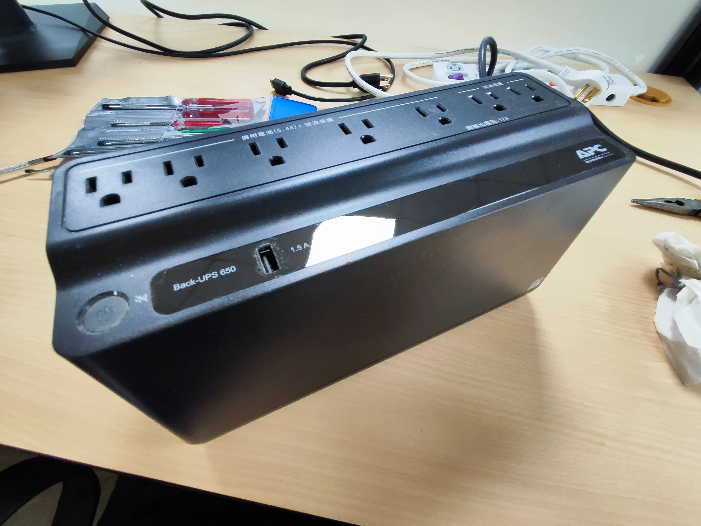
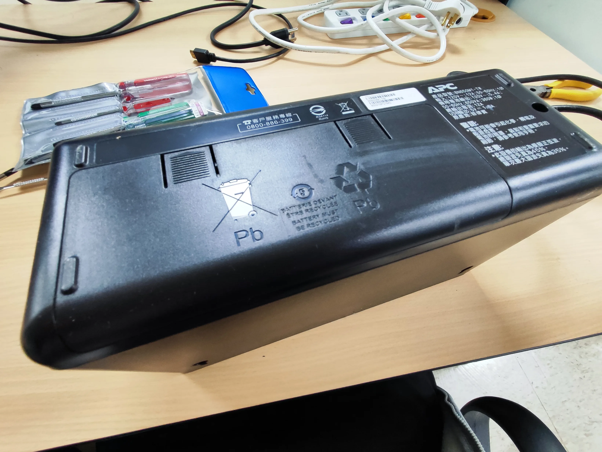
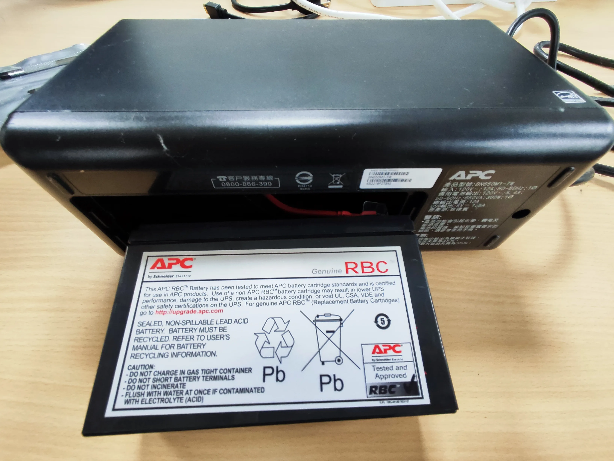
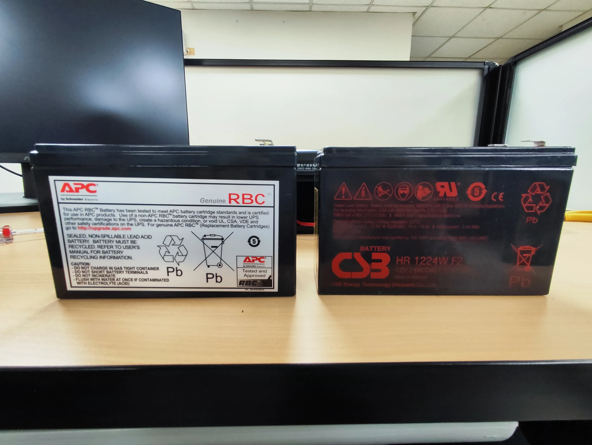
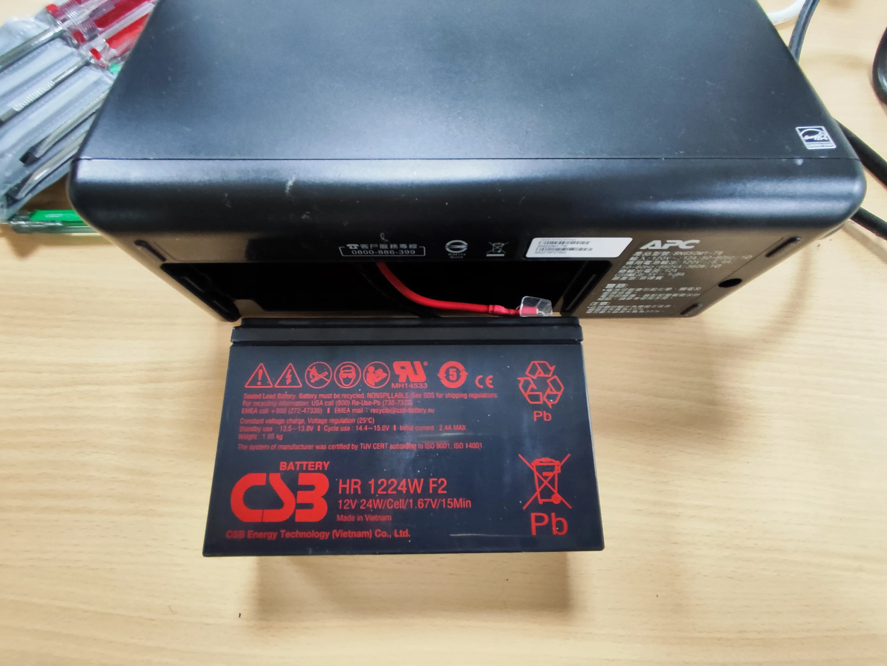
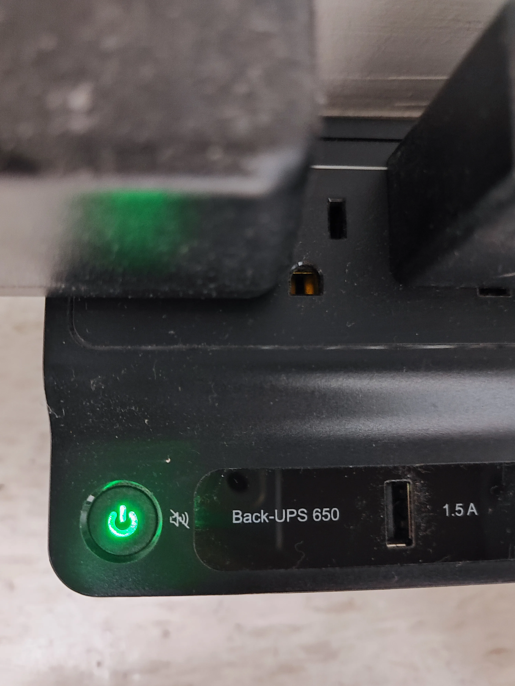

公司有三台 UPS 的電池同時到壽命了，我花了一個傍晚全部換完。這篇先從最簡單的一台開始——APC Back-UPS 650（型號 BN650M1-TW），負責保護公司的 Router。

這台 BN650M1-TW 是三台裡面我最喜歡的設計。不用螺絲起子、不用拆外殼，翻過來打開底蓋就能換電池。如果你是第一次自己換 UPS 電池，從這台開始最沒壓力。

## 事前準備

| 項目 | 說明 |
|------|------|
| 替換電池 | CSB HR 1224W F2（12V, 24W/Cell） |
| 價格 | 蝦皮購入，約 500~600 元 |
| 工具 | 不需要，徒手就能完成 |
| 原廠電池匣 | APC Genuine RBC（RBC154） |

APC 官方建議用原廠 RBC 電池匣，不過原廠一顆要價不少。我在蝦皮搜「BN650M1-TW 電池」，查了幾家的規格和評價後，選了 CSB HR 1224W F2。CSB 是神戶電池，台灣品牌，在 UPS 替換電池這塊算是蠻多人用的。

## APC Back-UPS 650 電池更換步驟

### 確認 UPS 外觀

APC Back-UPS 650 長得像一個扁平的排插，正面有電源鍵跟一個 USB 充電孔，上方一排是電池備援和突波保護的插座。

### 翻面，打開底部電池蓋

把 UPS 翻過來，底部有一個長方形的蓋板。用手指扣住邊緣就能打開，不需要任何工具。

就這麼簡單，我第一次拆的時候還在找螺絲，結果根本沒有。

### 抽出舊電池匣

蓋板打開後，裡面是 APC 原廠的 RBC 電池匣，上面印著「Genuine RBC」的標籤。直接往外拉就能抽出來，電池接頭會自動脫開，不用另外拔線。不用碰電線這點我覺得加很多分，後來換科風那台的時候就沒這麼輕鬆了。

### 新舊電池對比

左邊是 APC 原廠 RBC 電池匣，右邊是 CSB HR 1224W F2。原廠的其實就是一顆標準鉛酸電池加了塑膠外殼，花那個錢買外殼有點不太划算。

CSB 這顆尺寸和端子規格都相容，可以直接替換。

### 新電池推進去就好

新電池推入電池槽，對準接頭推到底就會自動接上。端子那一面朝向接頭的位置，方向對了推進去會有「喀」一聲。

蓋回底蓋、翻正、按電源鍵，綠色指示燈亮起，沒有嗶嗶叫。從翻面到蓋回來大概五分鐘，比泡一碗泡麵還快。

## APC 原廠 RBC154 vs 副廠 CSB：換完心得

三台 UPS 裡面，APC 這台的電池更換體驗最好。不用工具、不用拔線、不用拆殼，翻過來開蓋抽換就好。如果所有 UPS 都做成這樣，換電池就跟換遙控器電池一樣簡單了。

CSB HR 1224W F2 的規格是 12V、24W/Cell、F2 端子，跟原廠 RBC154 裡面那顆電池完全相容。原廠和副廠裝上去都一樣能用，價差就省下來了。電池本身蝦皮大概 500~600 元，自己換的話完全不用花維修費。

> 這是 UPS 電池更換系列的第一篇，也是最輕鬆的一台。另外兩台 CyberPower CP1000PFCLCDa 要拆螺絲和面板，科風 WAR-1000AP 得把整個外殼拆開，我會另外寫，最後再補一篇三台的電池選購整理。
