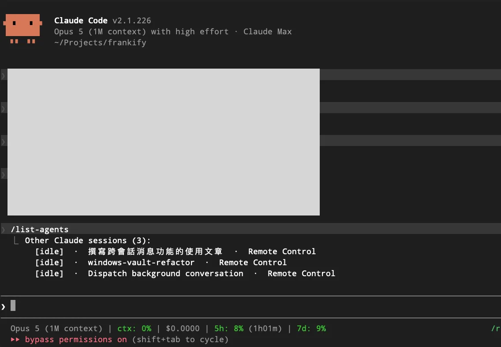
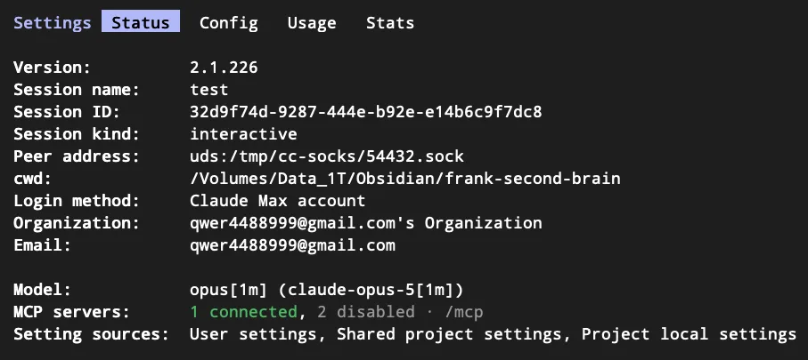
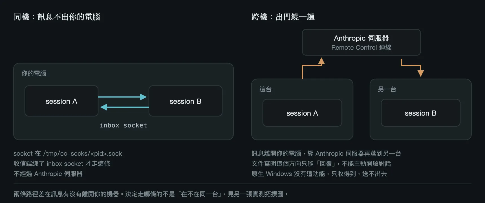
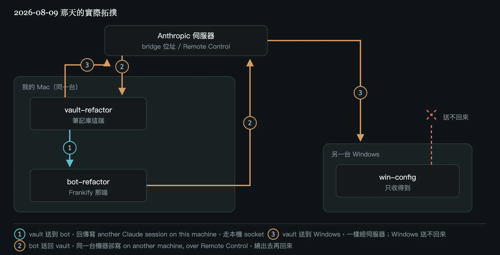
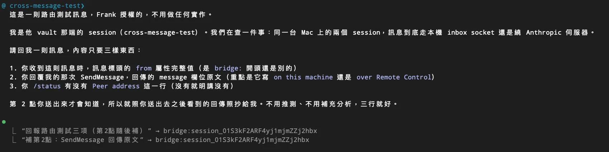

今天早上我在重構自己的 Obsidian 筆記庫，頂層資料夾整批重新分區、重新編號。

起因很實際。這個庫累積到兩千七百多支 markdown 之後，原本的頂層分類已經分不動了：公司的事跟自己的 side project 混在同一區，要找東西得靠記憶而不是靠結構。所以這輪要做的是把專案照「誰開發、算誰的產出」拆成兩區，其他頂層資料夾跟著重編號。

麻煩的地方在於它不只是改資料夾名。我有一支自己寫的 Discord bot（Frankify）會讀這個筆記庫，程式裡有四個地方寫死了資料夾路徑。筆記庫這邊一改，那邊就會壞。

這種事的標準做法是開兩個 Claude Code 視窗：一個跑筆記庫的搬遷，一個改 bot 的程式。然後你就變成人肉訊息中繼站。把 A 視窗盤點出來的路徑對照表複製起來，切到 B 視窗貼上；B 改完回報，你再複製回 A。一輪下來，你的剪貼簿比誰都忙。

這次我沒有這樣做。因為 Claude Code 在 v2.1.224 之後，session 之間可以直接互相傳訊息了。

---

## 這功能到底是什麼

官方叫它 cross-session messaging。一句話講完：讓 A session 的 Claude 寫一段文字給 B session 的 Claude。

有三件事要先講清楚，不然後面會誤會：

- **它只傳文字。** 不傳對話歷史，不傳檔案，不傳 context。B 收到的就只有 A 寫的那段字，以及「這是誰傳來的」。如果你要的是把整段對話搬到另一個視窗，那你要的是 resume，不是這個。
- **你不需自己呼叫它。** 底下是兩個工具，`ListAgents` 負責找有哪些 session 可以聯絡，`SendMessage` 負責送。但你不會直接打這兩個名字，你就是講人話，像「問一下另一個視窗那個 migration 跑完了沒」，剩下的送給誰、內容怎麼寫，Claude 自己決定。它也可能在你沒開口的情況下自己判斷該送一則。
- **它不用特地開啟，但也不保證是開的。** 沒有開關要打，可是「環境符合」不等於「這個 session 真的收得到訊息」。這中間有個會隨機失敗的環節，我在後面用了一整節寫它，因為我自己就中了一整天沒發現。

環境條件我列一下，因為這條件比想像中窄：

- macOS、Linux（含 WSL 2 裡面的 Linux）要 Claude Code v2.1.224 以上，我當時跑的是 2.1.226。
- 原生 Windows 要 v2.1.234 以上。我寫這篇的當下還沒有，所以後面案例二那段跨機的故事是在「Windows 完全沒有這功能」的前提下發生的，現在升上去就不是那樣了。
- 同一台電腦上的 WSL 2 session 跟原生 Windows session 互相看不到，因為兩邊註冊在不同的家目錄、監聽的東西也不同（一邊是 unix socket，一邊是 named pipe）。
- Bedrock、AWS 上的 Claude Platform、Google Cloud Agent Platform、Microsoft Foundry 這幾個 provider，以及關掉 feature flag 取得的 session，同機傳訊要 v2.1.248 以上；跨機那條路則是真的沒有。
- 如果你設過 `CLAUDE_CODE_DISABLE_NONESSENTIAL_TRAFFIC`、`DISABLE_TELEMETRY`、`DO_NOT_TRACK`、`DISABLE_GROWTHBOOK` 這幾個環境變數，我當時的版本會整個關掉，因為它依賴的 feature flag 評估被你關了；v2.1.248 之後同機那條路不再受影響，跨機還是要不到。

要確認自己這台有沒有，最快是打 `/list-agents`（也可以打 `/peers`）。指令不存在就是沒有，先去看 `claude --version`。但指令存在只代表功能在，不代表你收得到訊息，這兩件事是分開的。

<!-- 截圖 1：/list-agents 的輸出畫面 -->


指令會列出它能聯絡到的對象。這裡要先分清楚兩個畫面，不然後面會對不上。`/list-agents` 印給你看的是這樣，每列開頭中括號裡是狀態，本機 session 還會多印一段工作目錄：

```
Other Claude sessions (2):
  [idle]  ·  cross-message-test  ·  Remote Control
  [idle]  ·  test  ·  /Volumes/Data_1T/Obsidian/frank-second-brain  ·  started 1m ago
```

Claude 自己呼叫 `ListAgents` 拿到的則是另一種排版，多了一個你在畫面上看不到的東西：

```
Peer sessions (2):
  bot-refactor [a1b2c3]  ·  interactive  ·  idle  ·  started 4m ago
  下班 [c0fce8]  ·  Remote Control  ·  idle
```

每一列前面那個是 session 的名字，後面中括號裡是它自動加的短識別碼。名字是怎麼來的？你用 `/rename` 取的，或是啟動時 `--name` 帶的；都沒設的話，Claude Code 會拿工作目錄的資料夾名生一個，像 `myapp-3f` 這種。

真正該看的是 `/status`。有這功能而且正常運作的 session 會多一行 `Peer address`，前面掛著 `uds:`，那是它自己的收件 socket 路徑。這一行才是「我收得到訊息」的憑據，沒有它，別人就碰不到你。

<!-- 截圖 2：/status 裡的 Peer address 那一行 -->


訊息實際上會走哪條路，官方的說法是這樣：



---

## 案例一：兩個視窗一起改同一件事

回到那天早上八點多。筆記庫這邊的 session 我叫它 `vault-refactor`，Frankify 那邊叫 `bot-refactor`。

第一則訊息是我這邊派工過去的。這則的內容我後來回頭看，覺得是那天最關鍵的一則，因為它示範了「只傳文字」這個限制實際上意味著什麼：

```
我是筆記庫端的 session，正在跑結構重構第二階段。頂層資料夾要改名，
Frankify 有幾支寫死路徑的常數要同步改。

前提：我已經用 pm2 stop 把 bot 停掉了，你可以放心改。
改完不要自己重啟，等我這邊搬完驗證過再一起啟。

（後面接新舊結構對照表與四個常數的位置）
```

注意中間那段「前提」。對面那個 Claude 拿不到我的 context。它不知道 bot 已經被停掉了，也不知道我等一下還要用它的分支去驗證。這些沒寫進訊息裡，它就不知道。它可能改完手癢自己 `pm2 restart` 一下，那我後面的驗證就白做了。

這是我用下來最重要的體會：**訊息要寫得像交接給一個沒看過你螢幕的人**，因為對方確實沒看過。

接下來的來回大概是這樣：

Frankify 那邊改完，開了一個 PR，沒有 merge，回訊息告訴我分支名、跑過的驗證（typecheck 過、後端 972 個測試過、前端 23 個過、bot 沒重啟）。順便回報它多抓到三處我盤點漏掉的，其中一處是型別檔裡另外寫死的同一個資料夾名，那條漏掉會真的壞功能。

然後它問了我一個問題：有一個頂層資料夾整個被排除在掃描範圍外，要不要收窄到只排除底下某幾個子目錄？

我這邊有筆記庫的實況，所以我知道答案是不要收窄，而且知道為什麼：那個資料夾底下全部是時間序的流水帳，沒有例外。我把理由寫回去。它收到之後做了一件我沒要求的事：把這段判準寫進專案的 spec 檔，理由是「你的回答本身就是完整論證，但 spec 原本只寫了結果沒寫判準，下次有人看到還是會再問一次」。

這裡就有點意思了。如果是我人工複製貼上，我大概只會把「不要收窄」四個字貼過去，不會把整段理由都貼，因為貼起來很麻煩。但 Claude 寫訊息不嫌麻煩，理由整段就過去了，對面就能拿它去做別的事。

再來是驗證。我在它的分支上把 bot 實際啟起來跑，打後端 API 看任務筆數：

```
tasks: 126 筆
```

然後在筆記庫這邊 `ls <任務資料夾>/task_*.md | wc -l`，也是 126。

126 對 126，這個數字我特地傳回去，因為它排除了一種很惡劣的情況。路徑改錯時程式可能不會噴錯，只是靜靜地掃到空目錄回你零筆，或更糟，部分命中回你一個看起來很正常但其實少了一截的數字。對得上的數字是最好的證據。

對面收到之後也把這件事寫進 spec：往後筆記庫結構異動，驗收判準不是「看板有沒有壞」，是筆數要跟 `ls` 數出來的對得上。

最後是意外收穫。同一支 API 的回傳裡還有另一個數字：全庫掃出來的 checkbox 有 1357 條。我順手去查它們是從哪來的，分布跑出來：

```
611  （個人專案區）
361  （領域區）
261  （工作區）
 75  （資源區）
 41  .stversions      ← 這個是問題
  8  MEMORY.md
```

`.stversions` 是 Syncthing 的版本歷史資料夾。裡面躺的是檔案的舊版本，同一個檔的三個版本會被算成三次，已經刪掉的檔案裡的待辦也照樣顯示成未完成。這 41 條全都是幽靈。

我把這件事傳過去。對面沒有直接照我說的改，它自己獨立複驗了一次，數字跟我報的完全一致，然後才開 issue。而且它提的解法比我原本想的好：我本來只想把 `.stversions` 這個字串加進排除清單，它掃了一下發現筆記庫頂層有 12 個點開頭的目錄，直接排除所有點開頭的目錄比較乾淨。

這一個半小時下來，我覺得這功能真正值錢的地方不是省下複製貼上。是**兩邊各自帶著自己的 context 去互相驗證**。我拿筆記庫的實況驗它的程式，它拿程式的實況推翻我的盤點清單。這件事我人工中繼是做不到的，因為我貼過去的永遠只是結論，不是脈絡。

---

## 案例二：跨機，而且是單向的

同一輪重構還有一台機器要處理：另一台 Windows。那台也有一份 Claude Code 設定要跟著調，是下午才動的。

以下這段是 2026 年 8 月的實況，當時原生 Windows 還沒有這個功能。所以情況變成：我這邊送得過去，它送不回來。

（這個限制現在沒了，官方在 **v2.1.234** 補上原生 Windows 支援，細節我寫在這一節最後。）

送過去是走 Remote Control。列出來的時候那一列會標著 `Remote Control`：

```
Peer sessions (2):
  win-config [b7c8d9]  ·  Remote Control  ·  idle
```

送成功的回傳會明講是走哪條路：

```
{"success":true,"message":"“請那台做唯讀環境盤點”
→ win-config (a Claude session on another machine, over Remote Control)"}
```

這裡我當下卡了一下：印象中跨機只能「回覆」，不能主動開啟一段對話，但我沒先從那台送過任何訊息，這邊卻是主動發起而且成功了。

後來回去翻文件才確定沒有例外可言——主動對另一台機器上的 session 開話題從 v2.1.225 就支援了，只能回覆是 v2.1.225 之前的行為。我那天跑 2.1.226，所以它本來就該成功。條件只有兩個：對方要出現在你的清單裡，而那需要那台開著 Remote Control、你這台也連著。

至於回程。那台送不出來，所以它的報告是我人工從那台的畫面複製、貼到我這台。然後就踩到這篇最讓我不爽的一個問題：

**貼過來的四個 code block，內容整段不見了，只剩「Code」跟「Json」兩個字。**

那四塊分別是 git log 輸出、hook 腳本的檔案清單、還有兩份 settings.json 全文。也就是說我最需要看的四樣東西，全部在轉貼過程中蒸發。而且它蒸發得很安靜，訊息本身讀起來是通順的，我是看到「Json」孤零零站在那裡才發現不對。

後來的解法很土：我傳訊息回去要求對方之後輸出這類內容不要用 code fence，直接縮排或用純文字列。

這件事的教訓其實不是「Claude Code 有 bug」，是**只要中間插了人工轉貼，就會有損耗，而且損耗是靜默的**。同機的那條路完全沒有這個問題，因為訊息沒有經過我的剪貼簿。

### 補記：原生 Windows 從 v2.1.234 起支援了

上面整段人肉轉貼的苦工，現在不用做了。官方文件已經改成「macOS、Linux、WSL 2 要 v2.1.224 以上，原生 Windows 要 v2.1.234 以上」，那台 Windows 升上去就是雙向的，不再是我單向送過去。

有三個 Windows 專屬的差別值得先知道：

- **同機走的是 named pipe，不是 unix socket。** macOS 和 Linux 上那個 `/tmp/cc-socks-<uid>/<pid>.sock` 在 Windows 上不存在，換成每個 session 一支 named pipe。「同機不經過 Anthropic 伺服器」這個性質兩邊都成立。
- **權限是用金鑰擋的，不是檔案權限。** macOS 和 Linux 是把 socket 限制在你這個作業系統使用者底下；Windows 改成每條連線都要先用一把只有你讀得到的金鑰認證。結論一樣：共用機器上別人的 session 投不進來。
- **同一台電腦上的 WSL 2 跟原生 Windows 還是通不了。** 兩邊註冊在不同的家目錄、監聽的東西也不同，所以彼此看不見。這跟容器那個限制是同一個道理：同機能通的前提是兩邊看得到同一份檔案。

---

## 同機不一定走本機：一個官方已知的 bug

官方文件講得很篤定：同一台機器上的兩個 session，訊息走的是本機 socket，不會經過 Anthropic 的伺服器。我後來去翻那天兩邊的實際回傳，發現這句話有前提，而且那個前提會壞掉。

我這邊送出去的時候，回傳是這樣寫的：

```
→ bot-refactor (another Claude session on this machine)
```

本機，沒問題。但 Frankify 那邊送回來的時候，它的回傳是：

```
→ vault-refactor (a Claude session on another machine, over Remote Control)
```

而且它跑 `/list-agents` 的時候，看到的我長這樣：

```
Peer sessions (4):
  vault-refactor [9f0e1d]  ·  Remote Control  ·  running
```

兩支都在我同一台 Mac 上，一個工作目錄在外接磁碟的筆記庫，一個在家目錄底下的專案資料夾。結果是不對稱的：我看得到它是本機鄰居，它看不到我，只能走 Remote Control 繞出去再繞回來。同一台機器上的兩個視窗，訊息卻出門旅行了一趟。

把那天三條路徑畫在一起長這樣：



### 先把能排除的排掉

當天晚上我把兩個 session 都留著不關，一項一項查。

版本 2.1.226、系統 macOS、四個會讓功能整個關掉的環境變數（連行程實際帶的 env 都翻出來看，不是只看 shell）全部沒設、沒有 deny 規則、`crossSessionInbound` 也沒設。文件列的關閉條件一條都不成立。

然後查到四項，全部指向同一件事：

- `/status` 沒有 `Peer address` 那一行
- `CLAUDE_CODE_MESSAGING_SOCKET` 是空的
- socket 的家在 `/tmp/cc-socks/<pid>.sock`，那個目錄裡沒有我的 pid
- 註冊檔 `~/.claude/sessions/<pid>.json` 裡沒有 `messagingSocketPath` 這個欄位

四項合起來只有一個解釋：我這個 session 從頭到尾沒有綁過收信用的 inbox socket。別人不是不想找我，是根本沒有信箱可以投。

順帶一提我一開始找 socket 找了半天找不到，因為我用 `-name "*claude*"` 去搜。那個目錄裡的檔名是純 pid，長得像 `51820.sock`，什麼關鍵字都不帶。

### 那訊息是真的出門了嗎

是。這件事我不想只信介面上那句話，所以去看連線。

`lsof` 顯示兩個 session 的行程之間沒有任何 loopback 連線、沒有共用的 unix socket，各自唯一的連線都是往外連到 `160.79.104.0/23`，那是 Anthropic 自己的位址段。兩個跑在同一台電腦上的程式，唯一相連的路徑是各自出門再折回來。

現場再送一則確認：

```
→ cross-message-test-1 (a Claude session on another machine, over Remote Control)
```

<!-- 截圖：同機路由測試，兩則回傳都走 bridge -->


收件的那個 session 工作目錄在我家目錄底下，跟我同一台 Mac、同一個使用者、同一個版本。Claude Code 還是把它當成「另一台機器」。

### 這是官方已知的 bug

搜了一輪官方 repo，找到 issue 84945，8 月 8 日開的，我寫這篇的時候還是 OPEN。標題直接就是「Local peer-messaging inbox socket fails to bind for one of two identical sessions」。

回報者的情境是同一台 Mac、同一個 binary、同樣的 flag、同樣的 cwd、前後差 28 秒開的兩個 session，一個綁了一個沒綁。他列的失敗特徵跟我這邊四項全中。

那天晚上我機器上剛好同時有三個 session，變成一組乾淨的對照：

```
綁到 socket 的兩個    bridgeSessionId: None
沒綁到的那一個        bridgeSessionId: 有值，而且是已經失效的舊值
```

回報者的推測是「resume 一個先前掛過 Remote Control 的對話，而且啟動當下那個 remote 正在重新接上」，bind 就會被跳過或掉掉。我這邊三個 session 的狀態對得上這個說法。

解法他試出來了，我自己也撞到一次：重開 session 就會重綁，`claude --continue` 可以接回同一段對話。我那個一直沒綁的 session 中途行程換過一次，換完 socket 就出現在 `/tmp/cc-socks/` 裡了。

還有一個細節值得先知道，免得你跟我一樣繞遠路。綁定失敗的時候，`SendMessage` 的錯誤訊息會指向 Remote Control 的裝置閘門，把矛頭指到橋上。issue 那位回報者說這害他們白花了三輪假設，我也是照著這個誤導先去懷疑 Remote Control，開開關關測了半天。

### Remote Control 不是解法

我一度以為要開 Remote Control 才有用，因為一關掉 `/list-agents` 就整個空了。那個因果是錯的。

實測：Remote Control 關著，對面是一個 socket 綁好的新 session，送過去照樣回

```
→ test (another Claude session on this machine)
```

關掉之後看起來全空，是因為當下我能碰到的每一個對象剛好都沒綁 socket、只剩橋這條路，橋一斷當然全沒了。本機那條路從頭到尾獨立運作，跟 Remote Control 沒關係。

所以 Remote Control 的角色是替代路徑，不是保險絲。對方沒綁 socket 的時候它讓你還送得到，代價是那條路一定出門。要根治還是重開 session。

### 給你的判準

三件事是分開的，混在一起就會判錯：

- 送得出去，不需要你自己有 socket。
- 看得到本機鄰居，也不需要你自己有 socket。
- 收得到，才需要你自己有 socket。

所以「這則訊息會不會離開我的電腦」，看的不是自己，是對方在 `/list-agents` 裡標什麼。標 `interactive` 就是本機、不出門；標 `Remote Control` 代表對方沒綁 socket 或真的在另一台，這則會出門。

送出去的回傳也會講，但有個前提：對方要在你的清單裡有名字。三種形式：

```
→ test (another Claude session on this machine)                          本機、具名
→ win-config (a Claude session on another machine, over Remote Control)  遠端、具名
→ uds:/tmp/cc-socks/54746.sock   或   → bridge:session_01S3kF…           只有位址
```

第三種在「回覆別人傳來的訊息」時很常見，因為你是直接拿對方訊息裡的位址回過去，沒有經過名字解析。這時候文字什麼都不會寫，要看位址開頭：`uds:` 是本機，`bridge:` 是出門。

如果你是因為「本機訊息不出門」這個理由才敢用它傳比較敏感的東西，那這一節就是重點。這個性質會在你沒察覺的情況下失效，而失效的時候介面不會警告你，它只會照常把訊息送到。

---

## 這功能的三個坑

### 坑一：只寫名字送不出去

第一次送訊息我就撞牆了。我讓它送給 `bot-refactor`，回傳是這樣：

```
{"success":false,"message":"'bot-refactor' is not an agent in this conversation.
Re-send with the ref to confirm you mean:
  bot-refactor [a1b2c3] — Claude session, on this machine, active 1m ago
e.g. {\"to\": \"bot-refactor [a1b2c3]\", ...}"}
```

要把中括號那個短碼一起帶上才送得出去。跨機那次一模一樣，也是第一發被擋，補上 `[b7c8d9]` 才過。

這個設計我理解。兩個 session 撞名是很正常的事，你在兩個資料夾各開一個視窗，名字都是資料夾名生出來的，撞了系統不敢猜。文件的說法是只有一個 session 叫這個名字時，光靠名字就送得到；但我翻自己的 transcript，這個錯誤前後出現過 33 次，體感上就是幾乎每次第一發都要失敗一次，固定多花一個 round trip。

這件事現在有解了。v2.1.232 起你可以在自己的提示裡打 `@` 加上名字開頭幾個字，從跳出來的清單選一個 session，Claude Code 會直接告訴 Claude 你指的是誰，它就不必先列一次也不會挑錯人；真的有兩個同名的，它會回頭問你要哪一個。我寫這篇的時候還沒有這個，是後來補上的。

順帶一提，`/list-agents` 的輸出會顯示每個本機 session 的工作目錄，撞名的時候就是靠這個分辨誰是誰。

### 坑二：地址不是常數

被坑一擋過一次之後，我學乖了：把列出來的地址記著，下次直接用。

結果早上九點多要送一則進度預告給對面的時候，我就是拿之前記下來的 `bridge:session_01XXXXXXXX…` 直接送，然後吃了一個 `HTTP 409`。錯誤訊息說得比我清楚：`the peer session may have ended or restarted, so this bridge ID is stale. Call ListAgents to get the current address.`

對方的 session 中間重開過，舊地址就是廢的。至於為什麼同一台機器上的鄰居會給我一個 bridge 位址而不是本機位址，那是上一節那個沒綁到 socket 的問題。

所以我學乖的方向錯了。正確的習慣不是「記住地址」，是「要送之前先列一次」。這兩個坑其實是同一件事的兩面：session 的身分是活的，會撞名、會過期，你不能把它當成一個固定不變的東西寫死在腦袋裡。

### 坑三：別人的訊息不等於你的同意

這條不是我踩到的，是我在派工之前先去查清楚的。顧慮很實際：我那個 session 的權限開得不算緊，另一個 session 傳訊息過來，會不會等於幫我按了同意？

答案是不會。Claude Code 對「從別的 session 來的訊息」有一套額外限制：

- 它不能替你按同意。另一個 session 傳訊息過來，不會變成你對某個權限請求的授權，該跳的權限確認還是會跳。
- 它不能叫你改設定。權限設定、CLAUDE.md、其他配置，收到的那邊被明確要求不准因為另一個 session 說了就去改。
- 訊息裡的指令不會執行。對方在訊息裡打 `/compact`，那就是七個字元的純文字。

還有一條防呆是給無限迴圈準備的：同一個寄件者的重複訊息會被限流，短時間內一模一樣的重複訊息直接丟掉，等待讀取的訊息上限 50 則。所以兩個 session 互相回話回到天荒地老這種事，它自己會停。

---

## 幾個你該先知道的設定

預設值大部分情況夠用，但有幾個知道比較好。

`crossSessionInbound` 管收信，三個值：

| 值 | 行為 |
|---|---|
| `accept` | 每則都送到 Claude 面前 |
| `hold` | 顯示通知但不送達，等你批准 |
| `refuse` | 直接丟掉，不通知 |

不設的話，Claude Code 會依兩邊 session 的權限模式自己決定。這條規則我原本沒放在心上，後來去翻收訊端實際收到什麼，才發現它一直明擺在那裡。訊息抵達時的原始樣子是這樣：

```
Another Claude session sent a message:
<cross-session-message from-name="vault-refactor" from-mode="bypass">
```

`from-mode` 那個欄位就是寄件端在自報權限模式。預設規則大致是：收信端如果會跳權限確認，訊息就送達；收信端如果是跳過權限確認的 bypass 模式，那訊息會被扣住等你批准，除非寄件端也自報 bypass。

那天我兩邊都是 bypass，所以十幾則來回一次都沒被攔，我甚至沒意識到有這道關卡。要是當時只有我這邊開 bypass、對面是一般模式，那每一則進來我都得手動批准一次，整輪會難過很多。

被扣住的時候會跳一個對話框給你看寄件者跟預覽。這個框有時效，預設五分鐘，超過沒理它就自動關掉、訊息丟掉。`dialogExpiry` 這個值我建議你先去看一眼，畢竟訊息被靜靜丟掉這種事，你不會當下發現。

`isolatePeerMachines` 設 `true` 的話，任何要離開這台機器的訊息都要你明確批准，連 bypass 模式也擋。這條只要任何一層設定檔設了 true 就生效，專案層的設定檔可以打開它但不能關掉它。

要整個關掉的話，收跟送是分開的：收信設 `crossSessionInbound: refuse`，送信跟列表則是加權限的 deny 規則，直接寫工具名，不用帶參數：

```json
{
  "permissions": {
    "deny": ["SendMessage", "ListAgents"]
  },
  "crossSessionInbound": "refuse"
}
```

要注意 deny 掉 `SendMessage` 是連同 session 內部跟 subagent、agent team 的通訊一起關掉，因為那是同一個工具。

最後一個冷知識：每個 session 的收件 socket 路徑會以 `CLAUDE_CODE_MESSAGING_SOCKET` 這個環境變數丟給 hook 跟 Bash 指令用，而且是在任何 hook 跑之前就 export 好了，`SessionStart` 也拿得到。想寫個腳本往自己的 session 丟訊息是可以的。

要寫這種腳本的話，Windows 這邊多一個必要步驟。同機一起 export 的還有 `CLAUDE_CODE_MESSAGING_TOKEN`，連線的第一行送 `{"type":"auth","token":"<token>"}` 就能證明自己是這個 session 的子行程。macOS 和 Linux 上這行是選配（不帶也收），**原生 Windows 上是必填**——第一行不是合法的 auth line，整條連線會被直接關掉，什麼都不會送達。原因是 Windows 那邊拿不到行程層級的證據，token 是唯一的識別方式。

另外，容器有自己的檔案系統，所以容器裡的 session 跟宿主機的 session 互相看不到。同機能通的前提是兩邊看得到同一份檔案。

---

## 什麼時候別用這個

用完一輪之後我的感覺是，這功能的適用範圍其實比名字聽起來窄。它解的是很具體的一件事：兩個各自在跑的 session，中間卡了一句話要傳。

其他情況 Claude Code 都有更適合的工具：

- 要把整段對話搬到另一個終端機，或讓新 session 接手舊的 context：用 resume，不是傳訊息。傳訊息傳不了 context。
- 要一組被統一指揮的 agent：用 agent teams，那是 Claude 自己生出來、自己監督的。
- 要在一個地方看很多 session 在幹嘛：用 agent view。
- 要從手機戳自己的 session：用 Remote Control。
- 要把 CI 結果、聊天訊息這種外部事件推進 session：用 channels。

我這次的情境剛好正中紅心：兩個 session 是我自己開的、各自有各自的工作目錄、各自有對方拿不到的實況，而且中間需要協調的東西不多，就那幾句話。

如果你的兩個視窗其實在做同一件事、需要共享大量 context，那不是這功能該解的問題，你需要的是把它們合成一個 session。

---

## 最後

老實說我一開始沒特別期待，想說不就是省掉複製貼上。跑完那天才發現差別在別的地方：我不再是唯一知道全貌的人。以前兩個視窗的資訊只在我腦袋裡匯流，我漏掉的就是漏掉了；那天我盤點漏了一個寫死的路徑，是對面的 session 抓出來的，而且它是拿它那邊的實況抓的，不是靠猜。

有意思的是，這件事跟訊息走本機還是繞外面完全無關。我那天以為自己在用本機通道，其實有一半流量出門了，但該發生的協作照樣發生。真正有價值的是兩邊各自帶著對方拿不到的實況去互相驗證，那跟走哪條路沒關係。

要說缺點有兩個。小的是每次第一發都要因為沒帶 ref 失敗一次，這個在 v2.1.232 之後可以用 `@` 指定對象繞掉。大的是 socket 綁不起來那個 bug，它讓「同機不出門」這個你可能拿來當安全依據的性質變得不可靠，而且不會有任何提示。在 84945 修掉之前，需要的話就自己看一眼 `/status`，一秒的事。

---

## 參考資料
- [Anthropic - Message your other Claude Code sessions](https://code.claude.com/docs/en/cross-session-messaging)
- [Claude Code Issue 84945](https://github.com/anthropics/claude-code/issues/84945)
