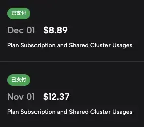
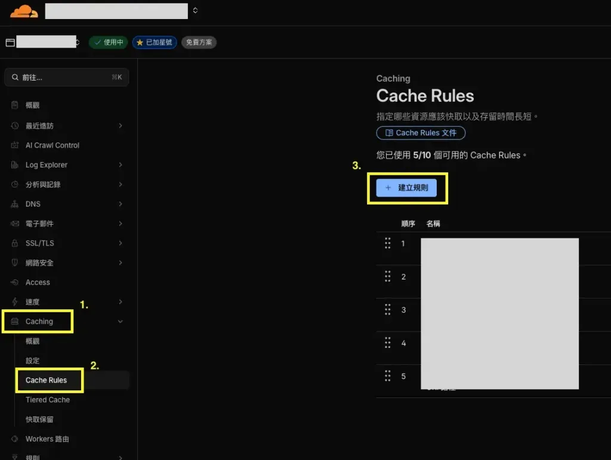

## 前言：為什麼 WordPress 網站需要 Cloudflare Cache Rules？

經營 WordPress 網站一段時間後，你可能會發現網站載入速度越來越慢，尤其是當文章數量增加、圖片變多之後。這時候，除了升級主機規格，還有一個更聰明（也更省錢）的做法：善用 Cloudflare 的 Cache Rules 來建立多層快取架構。

我自己的 WordPress 網站在導入 Cloudflare Cache Rules 後，頁面載入時間從原本的 2-3 秒降到了 1 秒以內，而且伺服器負擔也大幅降低。更直接的證據是主機帳單：從 11 月的 $12.37 美金降到 12 月的 $8.89 美金，省下將近 30% 的費用。



這篇教學會完整分享我的設定方式，讓你也能輕鬆達到同樣的效果。

## 什麼是 Cloudflare Cache Rules？

在開始設定之前，先來了解一下 Cloudflare Cache Rules 是什麼。

簡單來說，**Cloudflare Cache Rules** 是 Cloudflare 提供的快取規則設定功能，讓你可以自訂哪些內容要快取、快取多久、哪些內容不要快取。這比起傳統的 Page Rules 更加靈活，而且免費方案就能使用。

而 Cloudflare 在全球都有節點，所以 Cache 會拓展到全球，讓任何地方的人都可以快速載入你的網站。

### 快取架構概念圖解

想像一下訪客進入你網站的流程：

```text
訪客請求
    ↓
🌐 第一層: 瀏覽器快取 (Browser Cache)
    ↓ (未命中)
☁️ 第二層: CDN 快取 (Cloudflare Cache Rules)
    ↓ (未命中)
💾 第三層: 伺服器快取 (Redis Object Cache)
    ↓ (未命中)
🗄️ 資料庫查詢 (MySQL)
```

這個三層快取架構的邏輯是：訪客的請求會先檢查瀏覽器有沒有快取，沒有的話就去 Cloudflare CDN 找，再沒有才會打到你的伺服器。每多一層快取命中，就能省下一次對後端的請求，網站自然就快了。

## 設定前的準備工作

在開始設定 Cache Rules 之前，請確認以下條件：

-   你有一個 WordPress 網站
-   已經註冊 Cloudflare 帳號（Free 方案就夠用）
-   網站的 DNS 已經由 Cloudflare 管理
-   DNS 記錄的 Proxy 狀態是「已代理」（橘色雲朵）

### 如何確認 DNS 設定正確？

登入 Cloudflare 控制台後，選擇你的網站，進入「DNS」頁面，確認你的主要 DNS 記錄長這樣：


**重點**：Proxy 狀態一定要是橘色雲朵（已代理），灰色雲朵代表流量沒有經過 Cloudflare，快取規則就不會生效。

## Cache Rules 完整設定教學

接下來是重頭戲，我會分享四條核心的 Cache Rules 設定，依照優先順序排列。這些規則會從上到下依序匹配，所以順序很重要。

### 設定路徑

```text
Cloudflare 控制台 → 選擇網域 → 快取 (Caching) → 快取規則 (Cache Rules) → 建立規則
```



### 規則一：後台不快取（最重要）

**為什麼需要這條規則？**

WordPress 的後台、登入頁面、REST API 這些區域絕對不能被快取，否則你的後台畫面可能會被別人看到，或是登入狀態出問題。這是快取設定的第一條鐵則。

**規則設定**

| 項目 | 設定值 |
| --- | --- |
| 規則名稱 | 後台不快取 |
| 快取資格 | 略過快取 |

**運算式**（點選「編輯運算式」後貼上）：

```text
(http.request.uri.path contains "/wp-admin/" or
http.request.uri.path contains "/wp-login.php" or
http.request.uri.path contains "/wp-json/" or
http.cookie contains "wordpress_logged_in")
```

**運算式解析**

| 條件 | 說明 |
| --- | --- |
| `/wp-admin/` | WordPress 後台路徑 |
| `/wp-login.php` | 登入頁面 |
| `/wp-json/` | WordPress REST API |
| `wordpress_logged_in` | 已登入用戶的 Cookie |

這條規則確保管理者登入後看到的永遠是最新內容，不會因為快取而看到過期資料。

### 規則二：靜態資源長期快取

**為什麼需要這條規則？**

圖片、CSS、JavaScript、字型這些靜態檔案幾乎不會變動，讓它們在 CDN 上快取 30 天，可以大幅減少對伺服器的請求，訪客第二次進站時幾乎是秒開。

**規則設定**

| 項目 | 設定值 |
| --- | --- |
| 規則名稱 | 靜態資源快取 |
| 快取資格 | 適用快取 |
| 邊緣快取 TTL | 2592000 秒（30 天） |
| 瀏覽器快取 TTL | 604800 秒（7 天） |

**運算式**：

```text
(http.request.uri.path.extension in {"jpg" "jpeg" "png" "gif" "webp" "svg" "css" "js" "woff" "woff2" "ttf" "ico" "pdf"})
```

**或使用欄位選擇器設定**

如果你不習慣寫表達式，也可以用視覺化介面：

1.  欄位：副檔名 (File extension)
2.  運算子：在…之中 (is in)
3.  值：jpg, jpeg, png, gif, webp, svg, css, js, woff, woff2, ttf, ico, pdf

### 規則三：頁面內容快取

**為什麼需要這條規則？**

這是讓 WordPress 網站速度起飛的關鍵。預設情況下，Cloudflare 不會快取 HTML 頁面，但透過這條規則，我們可以讓首頁、文章頁、分類頁也被快取，訪客不用每次都等伺服器重新產生頁面。

**規則設定**

| 項目 | 設定值 |
| --- | --- |
| 規則名稱 | 頁面快取 |
| 快取資格 | 適用快取 |
| 邊緣快取 TTL | 14400 秒（4 小時） |
| 瀏覽器快取 TTL | 1800 秒（30 分鐘） |

**運算式**：

```text
(http.request.uri.path eq "/" or
http.request.uri.path contains "/blog/" or
http.request.uri.path matches "^/[0-9]{4}/[0-9]{2}/") and
(not http.request.uri.query contains "s=") and
(not http.cookie contains "wordpress_logged_in")
```

**運算式解析**

匹配的頁面：

| 條件 | 說明 |
| --- | --- |
| `eq "/"` | 首頁 |
| `contains "/blog/"` | 部落格分類頁（可以根據子目錄名稱修改） |
| `matches "^/[0-9]{4}/[0-9]{2}/"` | 日期型文章 URL（如 /2024/12/文章） |

排除的條件：

| 條件 | 說明 |
| --- | --- |
| `not ... "s="` | 排除搜尋結果頁（每次搜尋內容不同） |
| `not ... "wordpress_logged_in"` | 排除已登入用戶（確保看到最新內容） |

**注意**：這裡的 URL 匹配規則你可能需要根據自己網站的固定網址結構來調整。

### 規則四：RSS 訂閱短期快取

**為什麼需要這條規則？**

RSS Feed 需要快取以減少伺服器負擔，但又不能快取太久，否則訂閱者收不到最新文章，1 小時是個平衡點。

**規則設定**

| 項目 | 設定值 |
| --- | --- |
| 規則名稱 | RSS 快取 |
| 快取資格 | 適用快取 |
| 邊緣快取 TTL | 3600 秒（1 小時） |
| 瀏覽器快取 TTL | 1800 秒（30 分鐘） |

**運算式**：

```text
(http.request.uri.path contains "/feed/")
```

## Cloudflare 其他推薦設定

設定完 Cache Rules 後，還有一些 Cloudflare 的其他優化選項值得開啟：

### 速度優化 (Speed → Optimization)

| 設定項目 | 建議值 | 說明 |
| --- | --- | --- |
| Early Hints | 啟用 | 提前告知瀏覽器要載入的資源 |
| Rocket Loader | **關閉** | 可能與某些外掛衝突，建議關閉 |

### WordPress Cloudflare 外掛

建議在 WordPress 安裝 [Cloudflare 官方外掛](https://wordpress.org/plugins/cloudflare/)，設定 API Token 後可以啟用「自動清除快取（Auto Purge Content On Update）」功能，這樣每次發布文章時，Cloudflare 會自動清除相關快取，訪客就能看到最新內容。

## 如何驗證快取是否生效？

設定完成後，最重要的就是驗證快取有沒有正常運作。

### 測試步驟

1.  開啟瀏覽器的**無痕視窗**（避免被瀏覽器快取干擾）
2.  訪問你的網站首頁
3.  按 **F12** 開啟開發者工具
4.  切換到 **Network** 標籤
5.  重新整理頁面
6.  點擊第一個請求（通常是你的網域），查看 **Response Headers**

### 找到 cf-cache-status 標頭

在 Response Headers 中找到 `cf-cache-status`，這是 Cloudflare 回傳的快取狀態：

| 狀態 | 說明 |
| --- | --- |
| `HIT` | ✅ 快取命中，內容從 CDN 直接回傳 |
| `MISS` | 第一次訪問，尚未被快取 |
| `DYNAMIC` | 動態內容，不會被快取 |
| `BYPASS` | 被規則設定為略過快取 |
| `EXPIRED` | 快取已過期，需要重新取得 |

### 預期結果

```text
第 1 次訪問: cf-cache-status: MISS ← 正常，第一次還沒快取
第 2 次訪問: cf-cache-status: HIT  ← 成功！從快取取得
```

如果第二次訪問還是 MISS 或 DYNAMIC，就需要回頭檢查 Cache Rules 的設定是否正確。

## 設定完成後清除所有快取

為了確保新規則正確生效，建議清除所有層級的快取：

### 1\. 清除 Cloudflare 快取

```text
Cloudflare 控制台 → 快取 → 設定 → 清除快取 → 清除所有內容
```

### 2\. 清除 Redis 快取（如有使用）

```text
WordPress 後台 → 設定 → Redis Object Cache → 清除快取
```

### 3\. 清除瀏覽器快取

-   Windows: `Ctrl + Shift + R`
-   Mac: `Cmd + Shift + R`

## 常見問題 FAQ

**Q1：更新文章後，前台沒有更新怎麼辦？**

這是最常見的問題。  
到 Cloudflare 控制台手動清除快取，或者安裝 Cloudflare 外掛，設定發布文章時自動清除快取；如果不想每次都手動清除，可以考慮把頁面快取 TTL 調短一些。

**Q2：登入後看到快取的舊內容？**

檢查規則一的表達式，確保 `wordpress_logged_in` cookie 條件有正確設定。這個條件會讓已登入用戶繞過快取。

**Q3：Cloudflare 外掛一定要安裝嗎？**

不是必須的，但建議安裝。主要好處是可以在發布文章時自動清除快取，省去手動操作的麻煩。如果你不常更新文章，不裝也可以。

**Q4：免費方案可以設定幾條 Cache Rules？**

Cloudflare Free 方案可以設定最多 10 條 Cache Rules，對於一般 WordPress 網站來說非常夠用了。

**Q5：設定後網站速度沒有明顯提升？**

幾個可能原因：  
1\. DNS 的 Proxy 狀態沒有開啟（要是橘色雲朵）  
2\. 第一次訪問是 MISS，要等第二次才會 HIT  
3\. 網站本身的問題（例如圖片太大、外掛太多）  
建議用 PageSpeed Insights 測試，看看瓶頸在哪裡。

### 效能測試工具推薦

設定完成後，可以用以下工具來測試網站效能：

-   [Google PageSpeed Insights](https://pagespeed.web.dev/) - Google 官方工具，會給出 Core Web Vitals 分數
-   [WebPageTest](https://www.webpagetest.org/) - 可以測試不同地區的載入速度

## 進階優化：加入 Nginx 作為第二道防線

設定完 Cloudflare Cache Rules 後，如果你想要更完整的快取架構，可以再加入 Nginx Cache 作為第二層防線。

這樣做的好處是：

-   當 Cloudflare 快取過期或被清空時，Nginx 能立刻接手提供快取
-   後端 WordPress 出問題時，Nginx 可以繼續提供過期內容
-   雙層快取讓你的網站更加穩定

詳細設定方式請參考下一篇文章：[Nginx Cache 設定教學：為 WordPress 網站打造第二道快取防線](/nginx-cache-wordpress/)

## 總結

透過 Cloudflare Cache Rules 建立多層快取架構，是 WordPress 網站效能優化最具 CP 值的做法。整個設定過程大約 30-60 分鐘，但換來的是：

-   頁面載入時間大幅縮短
-   伺服器負擔明顯降低
-   訪客體驗顯著提升
-   完全免費（Cloudflare Free 方案）

如果你的 WordPress 網站還沒設定 Cloudflare Cache Rules，建議現在就動手試試。搭配 Nginx Cache 一起使用，效果更佳！有任何問題歡迎在底下留言討論。

## 參考資料與延伸閱讀

### 參考資料

-   [Cloudflare Cache Rules 官方文件](https://developers.cloudflare.com/cache/how-to/cache-rules/) - Cloudflare 官方的 Cache Rules 完整指南
-   [WordPress 效能優化指南](https://developer.wordpress.org/advanced-administration/performance/cache/) - WordPress 官方的效能優化建議

### 延伸閱讀

-   [Nginx Cache 設定教學：為 WordPress 網站打造第二道快取防線](/nginx-cache-wordpress/) - 加入 Nginx 作為第二層快取，讓網站更穩定
-   [Zeabur Nginx 反向代理教學：從子網域到子目錄的完整實戰](/zeabur-nginx-subdomain-to-subdirectory/) - 如果你想進一步優化網站架構，可以參考這篇
-   [網站搬家超簡單：WordPress 無痛轉移 Zeabur 完整教學](/wordpress-migrate-to-zeabur/) - 如果你想把 WordPress 搬到 Zeabur 平台
