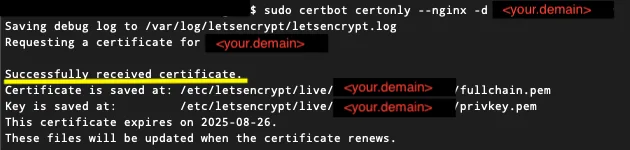

## 前言

現今因安全性問題大多的網路傳輸服務都會要求以 https 方式傳送 (ex: Line Bot Webhook、Google Cloud Redirect URL)，但去申請一個 SSL 憑證 每年需要繳維護費，對於個人使用者來說，這筆維護費可能就吃不消了。

剛好近期把個人網站建置好了，順便記錄一下申請 SSL 憑證 的過程，接下來我將一步步引導你透過 [Certbot](https://certbot.eff.org/) 向 [Let's Encrypt](https://letsencrypt.org/) 申請 免費 SSL 憑證 。

這篇文章將以Ubuntu 搭配 Nginx 為例，教大家如何透過 [Certbot](https://certbot.eff.org/) 申請 免費 SSL 憑證。

## 環境配置

-   作業系統：Ubuntu 22.04 LTS
-   Nginx 版本：1.18
-   Python 版本：3.10 (Certbot 將透過 pip 安裝)

## 什麼是 Certbot ?

Certbot 是一款由電子前哨基金會（Electronic Frontier Foundation, EFF）開發的**開源工具**，它的主要功用是**自動化獲取、安裝和更新 SSL/TLS 憑證**。

簡單來說，如果你想讓你的網站透過 HTTPS 加密連線，Certbot 可以幫你省去許多繁瑣的手動設定步驟。它會與 [Let's Encrypt](https://letsencrypt.org/) 這個免費憑證頒發機構合作，讓你的網站能夠輕鬆地啟用安全連線，提升資料傳輸的安全性。

## 如何安裝 Certbot ?

### 安裝系統依賴項

系統依賴項包含 Python 、Python venv 模組和 Apache 的插件 Augeas。

```bash
sudo apt update
sudo apt install python3 python3-venv libaugeas-dev
```

### 刪除 certbot-auto 相關軟體包

如果您之前有安裝過 certbot 相關的軟體包，請先使用以下的指令移除，避免套件產生衝突。

```bash
sudo apt remove certbot
```

### 建立 Python 虛擬環境

執行以下指令建立全新的 Python 虛擬環境，以避免與系統環境產生衝突。

```bash
sudo python3 -m venv /opt/certbot/
sudo /opt/certbot/bin/pip install --upgrade pip
```

### 安裝 Certbot

```bash
sudo /opt/certbot/bin/pip install certbot certbot-nginx
```

### 準備 Certbot 指令

將安裝在 Python 虛擬環境的 certbot 連結至指定目錄，以便後續的調用。

```bash
sudo ln -s /opt/certbot/bin/certbot /usr/bin/certbot
```

### 使用 Certbot 取得 SSL 憑證

```bash
sudo certbot certonly --nginx -d <your.demain>
```

`<your.demain>` 請替換成您自己的網域。

等待幾秒鐘後，便會出現 ”Successfully received certificate“ 等字眼，代表已經取得 Let's Encrypt 頒發 SSL 憑證了。



certbot 預設產生的路徑為 `/etc/letsencrypt/live/<your.demain>`，該目錄底下會有兩個檔案，分別為 `fullchain.pem` 及 `privkey.pem`，後續將這兩個檔案加入 nginx 設定檔即可。

## 設定自動續期 SSL 憑證

Let's Encrypt 頒發的憑證只有為期 3 個月，所以建議加入自動續期讓系統自動執行 SSL 憑證 renew。

這邊透過系統內建的排程管理神器 corntab 來設定，方法如下：

```bash
sudo crontab -e
```

開啟後在檔案最後一行加入

```bash
0 */12 * * * root test -x /usr/bin/certbot -a \\! -d /run/systemd/system && perl -e 'sleep int(rand(3600))' && certbot -q renew
```

這行表示會在每天的中午12點及午夜12點分別執行一次 renew 指令，而 `”sleep int(rand(3600))”` 是讓指令亂數的延遲，防止同一時間太多請求送至 Let's Encrypt 伺服器。

加入完成後，儲存後退出，該指令並立即生效。

## 小結

以上是針對透過 Certbot 來產生 SSL 憑證，並設定 Let's Encrypt 自動續期。

可以參考這個 [Repository](https://github.com/haunchen/certbot-deploy)，提供你自動化部署的方法。

取得憑證後，可以進一步替 Nginx 設定快取策略，提升網站效能，請參考 [Nginx Cache WordPress 完整教學](/nginx-cache-wordpress/)。如果你是在 Ubuntu 上部署 Node.js 應用並需要啟用 HTTPS，也可以搭配 [Ubuntu 容器化 Node.js 部署教學](/nodejs-docker-ubuntu-containerization-tutorial/) 一起參考。

參考連結：

[Let's Encrypt 官方網站](https://letsencrypt.org/)

[Certbot 官方文件](https://certbot.eff.org/)
