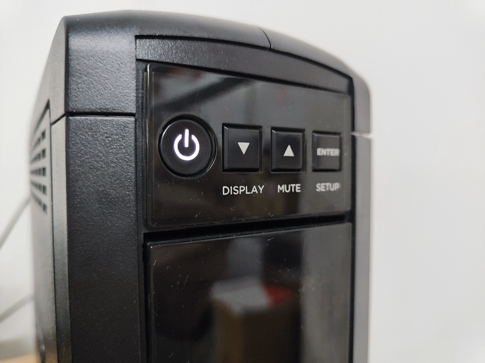
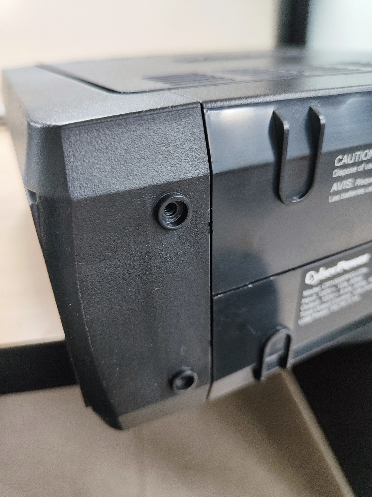
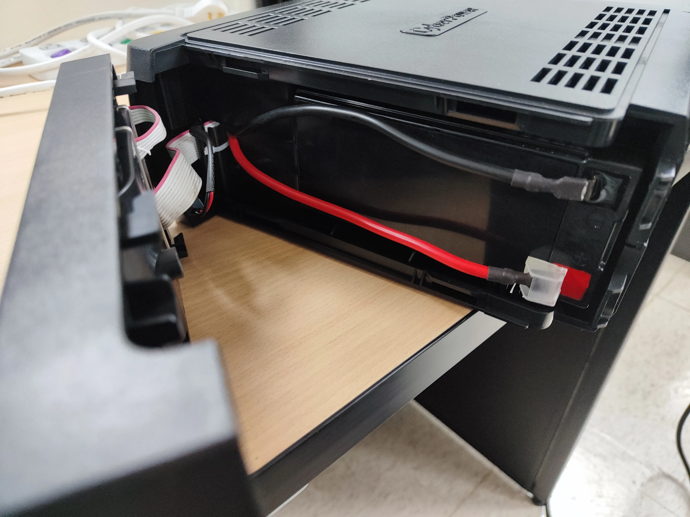
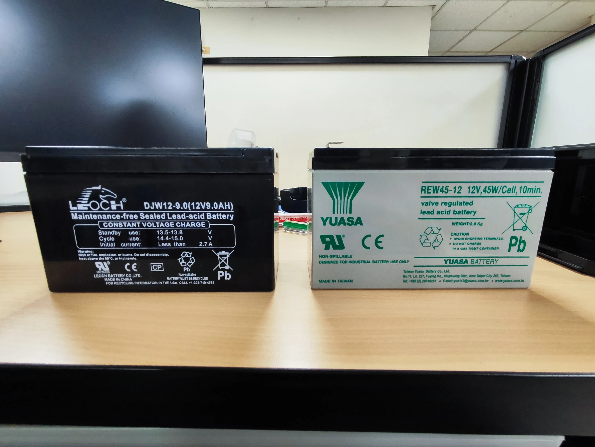
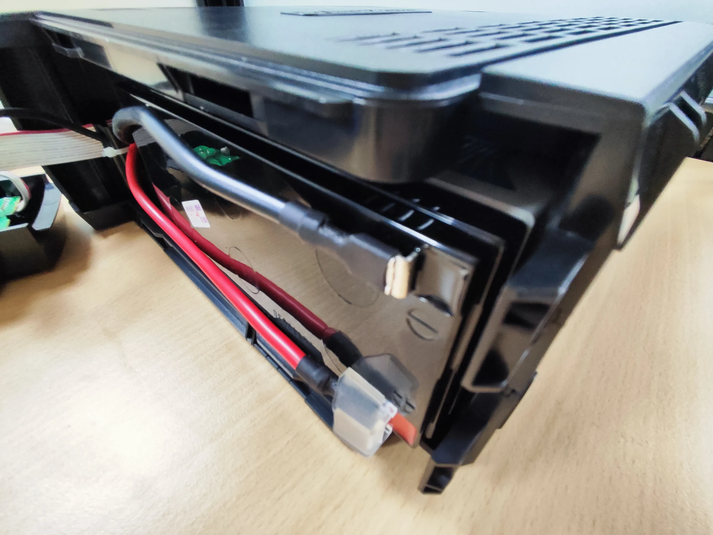
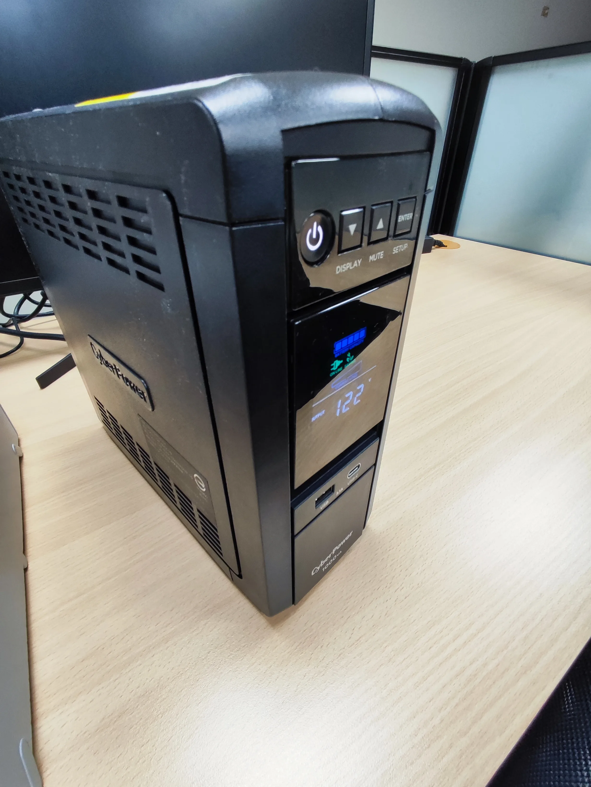

公司 Server 用的 CyberPower CP1000PFCLCDa 是正弦波機種，電池更換比 [APC Back-UPS 650](/apc-back-ups-650-battery-replacement/) 多了一步：要先拆底部螺絲才能打開前面板。不過有 LCD 螢幕的好處是，換完電池馬上就能從螢幕上確認狀態，不用靠猜。

這台也是用了三年，最近 UPS 開始頻繁嗶嗶叫，電池警告的意思很明確：該換了。

## 事前準備

| 項目 | 說明 |
|------|------|
| 替換電池 | YUASA REW45-12（12V, 45W/Cell） |
| 價格 | 蝦皮購入，約 500~600 元 |
| 工具 | 十字螺絲起子 |
| 原廠電池 | LEOCH DJW12-9.0（12V 9AH） |

CyberPower 和科風那台用的原廠電池剛好是同一款 LEOCH DJW12-9.0，所以替換電池我也買了一樣的 YUASA REW45-12，一次買兩顆。

## CyberPower CP1000PFCLCDa 電池更換步驟

### 確認 UPS 外觀與型號

CP1000PFCLCDa 是直立式設計，正面上方有電源鍵和 DISPLAY、MUTE、SETUP 按鈕，中間是 LCD 螢幕，會顯示目前的輸入電壓和電池狀態。側邊印著 CyberPower 1000VA。

### 移除底部螺絲

把 UPS 放倒，找到底部靠近前面板的螺絲。就一兩顆，用十字螺絲起子轉開。螺絲不會掉出來，轉鬆就好。

### 掀開面板，裡面就是電池

螺絲鬆開後，前面板向外一掀就打開了。裡面的電池槽一目了然，紅色和黑色兩條電源線連著電池，接頭是快接端子。

先把接頭拔掉再拉電池。接頭稍微用力就能拔開，不過要捏著接頭拔，不要直接扯電線，扯壞了就麻煩了。

### 取出舊電池，新舊對比

把舊電池從槽裡滑出來。LEOCH DJW12-9.0 外觀看起來還好，沒有像科風那台一樣膨脹（後來拆科風的時候被嚇到了），但充電已經撐不住負載。

右邊是新的 YUASA REW45-12，台灣湯淺製造，同為 12V 規格，尺寸完全相容。

### 新電池滑進去，接回接頭

新電池滑進電池槽，接上紅黑接頭。有防呆設計，紅接紅、黑接黑，插不進去就是方向反了，不用怕接錯。

前面板蓋回去、鎖上螺絲、開機。LCD 螢幕亮起來顯示 122V，電池圖示正常。比起 APC 只有一個綠燈讓你猜，CyberPower 的 LCD 直接把狀態寫在螢幕上，換完馬上就知道有沒有裝好。

## CyberPower 換電池心得：LCD 確認最安心

CyberPower 這台比 [APC](/apc-back-ups-650-battery-replacement/) 多了拆螺絲和拔接頭兩個步驟，但整體來說也不算難。電池槽是抽屜式的設計，滑進滑出很順暢。如果你的 CyberPower UPS 開始嗶嗶叫，不用急著找維修，拿把螺絲起子自己來就行。

YUASA REW45-12 的規格是 12V、45W/Cell，換算容量等同原廠 LEOCH DJW12-9.0 的 12V 9AH，F2 寬端子，尺寸也一樣，直接替換沒問題。這台和科風 WAR-1000AP 用的原廠電池是同一款，所以替換電池也買同一款 YUASA，一次買兩顆比較省運費。

> 這是 UPS 電池更換系列的第二篇。上一台 [APC Back-UPS 650](/apc-back-ups-650-battery-replacement/) 徒手翻個面就換完了，這台多了拆螺絲和拔接頭。最後一台科風 WAR-1000AP 要把整個外殼拆開，而且拆開之後看到的東西比較嚇人。
