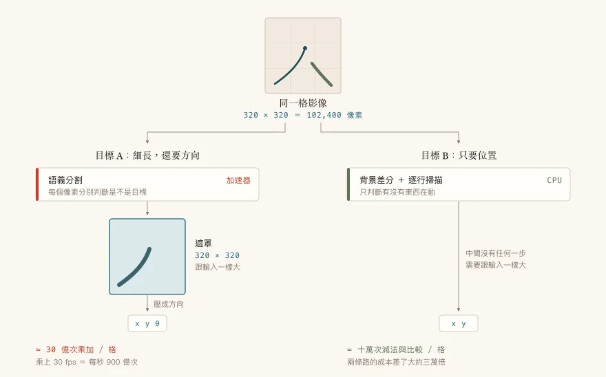
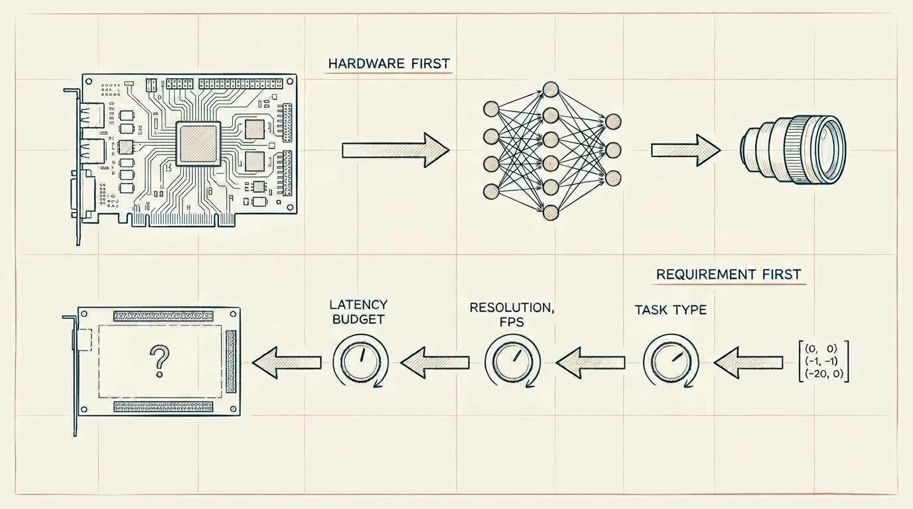

## 前言：一支電動牙刷，讓我回頭重算樹莓派上的 AI 算力

2026 年 9 月 1 日，Dyson 發表了一支叫 CameraJet 的電動牙刷，賣 499 美元，刷柄裡塞了一顆相機。它會一邊刷一邊看你的牙縫在哪，看到就噴一股漱口水過去。

我看到規格表的第一個念頭是：這一定有訂製晶片。

即時影像辨識、要在嘴巴裡、要用電池、還要塞進一支牙刷的握柄——這種條件不弄一顆專用矽是要怎麼做。我甚至開始想像 Dyson 是不是偷偷養了一支 IC 團隊。

然後我把數字拿出來算了一下，發現不用。不但不用，而且差得還不是一點點——那個任務需要的算力，比樹莓派 AI Kit 上那顆 Hailo 少了大約一千倍。

這篇要談的就是這件事：邊緣 AI 到底需要多少算力，該怎麼在買硬體之前先算出來。而真正讓我坐不住的，是算完之後冒出來的下一個念頭：**我自己的專案裡，就有一顆 AI 加速器。**

那是工作上一台即時影像處理設備，主控是樹莓派 5，上面插著一張 Hailo 的 M.2 加速卡，用來即時追蹤畫面上兩個會移動的目標。這東西已經出貨，在客戶那裡跑了一段時間。

我當初參與了那個選型。理由很單純：樹莓派 5 本來就是平台，Hailo 有現成的 M.2 HAT 可以直接插上去，不用多接一塊板子、不用多養一套作業系統、不用多一條工具鏈。

這個決定沒有錯。真的沒有錯，我到現在還會這樣選。

但它有一個副作用，而那個副作用花了我很久才看見：**因為選項只剩「加」跟「不加」兩個，我從來沒有算過我到底需要多少算力。**

二元選擇不需要量化。你不會去問「我需要幾 GMAC/s」，你只會問「加了會不會比較順」。答案顯然是會，於是就加了。

這篇文章是我回頭把那筆帳算清楚的過程，順便整理出一套你可以直接套用的估算方法。

## Dyson 公布了什麼，以及我推了什麼

這一節我要很小心地分成兩半，因為接下來整篇的可信度都建立在這個分界上。

### 官方數字

以下全部出自 Dyson 官方發布與新聞稿，不是我的推測：

| 項目 | 數值 |
|------|------|
| 相機 | 10 萬畫素微距鏡頭，短距離最佳化 |
| 視野 | 1 平方毫米 |
| 照明 | 圓弧鏡面結合 LED 頻閃光源 |
| 影像處理速率 | 每秒 28 張 |
| 反應延遲 | 從看到牙縫到噴出漱口水，100 毫秒內 |
| 訓練資料 | 開發期間收集的 47 萬張牙科影像 |
| 程式碼規模 | 1600 萬行 |
| 資料處理 | 在裝置或手機 App 上處理，不儲存、不上雲 |
| 研發時間 | 六年 |

還有一個很有意思的機構設計：水箱是「抗重力」的，用隔膜泵加壓力腔，避免傾斜的時候吸到空氣噴空砲。搭配的漱口水還特地做成低泡配方，免得泡沫糊住鏡頭讓相機看不見。


截圖出處：[Dyson 台灣 — CameraJet 微鏡噴射電動牙刷產品頁](https://www.dyson.tw/)（擷取於 2026 年 9 月 2 日，規格以官方頁面為準）。繁中版把 100 毫秒寫成「僅 0.1 秒」，是同一個數字。

### 我的推算

以下是我根據上面那些數字做的估算，**不是 Dyson 說的**：

0.1 MP 的輸入、每秒 28 張，這個資料吞吐量是每秒 280 萬個像素。作為對照，一顆遊戲滑鼠的光學感測器處理的像素流量比這個還大。

至於模型有多大，我們可以借一個公開的基準來抓量級。MLPerf Tiny 這套微控制器等級的 AI 效能基準裡有一項叫 Visual Wake Words，任務是在 96×96 的小圖上判斷有沒有人，用的是 MobileNetV1 的縮小版，一次推論大約 750 萬次乘加。

CameraJet 要做的事比「有沒有人」複雜一點，它得知道牙縫在哪，所以要有位置輸出。就算把成本抓成 Visual Wake Words 的三到十倍，一張影像大約是 5000 萬到 1.5 億次乘加。乘上每秒 28 張，需求落在每秒 14 億到 42 億次乘加之間。

用比較常見的單位講，就是個位數的 GMAC/s。

現在來對照一下市面上的東西。樹莓派 5 那張 AI Kit 上面的 Hailo-8L 標稱 13 TOPS。TOPS 是每秒兆次運算，一次乘加算兩次運算，所以 13 TOPS 大約是 6.5 TMAC/s。

**差了大約一千倍。**

拿 Hailo 去跑 CameraJet 那個等級的任務，等於叫貨櫃車去送一封信。

那個 100 毫秒的延遲預算也值得看一眼。每秒 28 張，一張的時間是 36 毫秒，100 毫秒等於允許系統落後將近三倍。這就是為什麼 Dyson 的說法是「偵測、追蹤並預測」牙縫——有了預測，你不必每一格都硬算到底，可以用追蹤外推去補中間那幾格。延遲預算比單格時間寬鬆，本身就是一種可以拿來換算力的資源。

規格表裡那個 1 平方毫米的視野也不是隨便訂的。10 萬畫素攤在 1 平方毫米上，空間解析度高得驚人——它看得清楚不是因為畫素多，是因為視野小。同一顆感測器，你把視野放大到整排牙齒，辨識難度立刻高一個檔次，模型也得跟著變大。

把這幾件事放在一起看就有意思了：縮小視野、LED 頻閃主動照明、低泡漱口水不讓泡沫糊住鏡頭。三個都是在動手把辨識難度壓下來，一個乘加都沒用到。演算法拿到的是一個已經被機構和光學修剪過的問題，所以模型才可以小。

這是這整篇最容易被跳過的一層：你以為在比的是誰的模型強，實際上先分勝負的是誰把問題定義得比較小。

### 我不知道的部分

這段一定要寫，不然上面那些推算會被當成事實引用出去。

我不知道 CameraJet 用的是什麼處理器。Dyson 沒公布，所有評測都沒提，也還沒有人拆機。我不知道模型架構、不知道模型多大、不知道有沒有 NPU。官方措辭是「在裝置或 MyDyson App 上處理」，所以嚴格講起來，連推論到底在刷柄上還是在手機上都不能算確定——不過那個 100 毫秒的閉迴路不可能走藍牙來回，所以觸發噴射那段必定在機身上。

那如果哪天拆機報告出來，證實 Dyson 真的做了一顆自研晶片呢？

那我這篇的論點也不會倒。因為我要講的不是「Dyson 沒用訂製晶片」，我要講的是「這組規格描述的任務不需要訂製晶片等級的算力」。前者是對事實的斷言，我沒有證據；後者是從他們自己公布的數字做的算術，不管他們最後塞了什麼料進去都成立。

而且真要是那樣，反而更有意思：連這種量級的需求都要上訂製矽，那理由就得往功耗、體積、供應鏈那邊找了，或者單純是有錢。

## 那個讓我坐不住的巧合

好，回到我自己的專案。

我那條推論管線的輸入解析度是 320×320。

320 x 320 = 102,400

CameraJet 的相機是 10 萬畫素。

**像素數幾乎一模一樣，算力需求差兩個數量級。**

我第一次把這兩個數字擺在一起的時候，愣了幾秒鐘。同樣是十萬個像素進去，一邊塞得進電動牙刷的握柄用電池跑，一邊需要一張 M.2 加速卡。

差別完全不在硬體。差別在你拿這十萬個像素去做什麼。

## 我的系統長什麼樣

先講清楚這台機器在幹嘛。它要從即時影像裡找出兩個會移動的目標在哪，把座標交給後面的邏輯去判讀。

同一個畫面上兩個目標，追蹤的做法完全不同：

**目標 A** 走的是深度學習，那條路上有兩個模型：一個做語義分割，吐出一張逐像素的遮罩標出目標在哪，再從遮罩算出它指向哪個方向；另一個是輕量的偵測模型，負責定位畫面上的參考位置。兩個都編譯後跑在加速卡上。

**目標 B** 用的是背景差分加逐行掃描。就這樣，沒有模型，純 OpenCV，跑在 CPU 上。

兩個模型合起來，系統實際跑到大約 30 fps。

現在請你看一下上面那兩段。同一台機器、同一個畫面、同樣是「找出目標在哪」這件事，我們用了兩種成本差了好幾個數量級的做法。而便宜的那一種，從上線到現在沒出過什麼問題。

這種分層其實是我在別的地方也用過的招。之前有個 Next.js 專案為了查 IP 的地理位置載入 geoip-lite，光那個套件就吃掉 100MB 記憶體，後來改成以 CDN 的 geolocation header 為主、重量級查詢只當 fallback，記憶體就降下來了（過程寫在[〈Node.js 記憶體優化實戰：用多層降級策略解決 geoip-lite 的 100MB 記憶體問題〉](/nextjs-geoip-memory-optimization/)）。原則是一樣的：先用最輕的方法，重的留給真的需要的那一小部分。

差別在於，那次我是被記憶體爆掉逼著去分層的。這次沒有東西逼我，所以我就沒分。

當初這樣分工是有道理的：目標 A 細、會彎、還要知道它指向哪裡，需要比較強的語義理解；目標 B 只需要判斷「有東西在動」，背景差分綽綽有餘。這個判斷本身沒問題。

有問題的是，我們把目標 A 的需求直接翻譯成了「那就上模型」，然後把「上模型」直接翻譯成了「那就上加速器」。中間那個「所以需要多少算力」的步驟，整段消失了。



這張圖裡最該看的是中間那一塊。左路先產出一張跟輸入一樣大的遮罩，再一口氣壓成三個數字；右路從頭到尾沒有任何一步需要撐到那麼大。圖上那兩個成本數字怎麼算出來的，下一節會拆給你看，但差距的來源就在那個中間產物。

## 任務類型才是那個成本開關

這是整篇文章的重點，如果你只帶走一段，帶這段。

電腦視覺的任務有一道很陡的成本階梯，而大多數人在挑硬體的時候完全沒意識到自己站在哪一階：

| 任務類型 | 輸出形狀 | 相對成本 |
|---------|---------|---------|
| 分類 | 幾個機率值 | 1 |
| 關鍵點回歸 | 幾組座標 | 1～3 |
| 物件偵測 | 一組框加類別 | 3～10 |
| 語義分割 | 每個像素一個類別 | 10～50 |
| 全景分割 | 每像素類別加實例 | 50+ |

差別在輸出的形狀。分類只要吐幾個數字，網路可以一路降採樣，愈往後特徵圖愈小，算得愈快。分割要吐一張跟輸入一樣大的圖，所以你得把降採樣的東西再升回去，UNet 那個 U 型的右半邊就是這麼來的——而右半邊通常跟左半邊一樣貴，甚至更貴。

把常見模型放進 320×320 大概是這個量級（都是估算，不是實測）：

| 模型 | 320×320 的乘加次數 |
|------|-------------------|
| MobileNetV2 分類 | 約 6 億 |
| YOLOv8n 偵測 | 約 11 億 |
| UNet + MobileNetV2 分割 | 約 15～30 億 |

我的系統一格要跑一個分割加一個偵測，大約 30 億次乘加。乘上 30 fps，需求是每秒 900 億次乘加左右。

這個數字終於可以拿來回答那個從來沒人問過的問題了。

## 那顆 Hailo 到底該不該在

先講結論：以現在這個架構，它拿不掉。但理由跟我以為的不一樣。

樹莓派 5 是四顆 Cortex-A76 跑 2.4 GHz，有 NEON 向量單元和 int8 點積指令。紙上算峰值的話，其實跟每秒 900 億次乘加是同一個量級。

問題是峰值就只是峰值。實務上優化過的 int8 矩陣運算能跑到峰值的兩三成就算不錯了，而且那會吃掉四顆核心。而那顆 CPU 上面還有別的事要做：把進來的壓縮影像解開、跑使用者介面、跑目標 B 的背景差分、還要錄影。

所以在現有架構下，Hailo 是必要的。這點我算完之後可以確定。

但接下來這個數字比較尷尬。

Hailo-8 標稱 26 TOPS，也就是 13 TMAC/s。我的需求是 0.09 TMAC/s。

**用到不到百分之一。**

當然，標稱值是理論峰值，真實利用率永遠低得多，卡在記憶體頻寬、運算子支援度、資料搬運的地方比卡在乘加器上常見得多。但就算實際只有峰值的一成好了，那也還有十倍的空。

這個數字指向一件我還沒驗證的事：**那個 30 fps，瓶頸八成不在推論。**

影像是壓縮格式進來的，在 CPU 上解開是實打實的工作量。我還沒做過完整的 profiling，所以這是假設不是結論。但如果成立，那意思就是我加了一張加速卡，卻從來沒確認過它解掉的是不是真正的瓶頸。

我在樹莓派上被瓶頸騙過一次了。之前有個應用會莫名當掉，查了很久才發現卡在 NFS 的版本上，跟應用程式本身一點關係都沒有，那次的過程我寫在[〈NFS 寫入導致應用程式當機？從 NFS4 切換到 NFS3 徹底解決〉](/nfs-version-nfs4-nfs3-io-blocking/)。同一個教訓換個場景又來一次：先量再改，不要憑直覺認定瓶頸在哪。

這才是「不估算」真正的代價。買貴了還算小事，真正麻煩的是你根本不知道自己在解哪個問題。

## 更該問的是：為什麼要輸出一張遮罩

前面說 Hailo 拿不掉，是「以現在這個架構」。那架構本身呢？

我最終要的東西是什麼？目標的座標，加上一個方向向量。

那是幾個浮點數。

但我現在的做法是：算出一張 320×320 的遮罩，十萬個像素每個都給一個分類，然後用 PCA 把這十萬個數字壓成一個方向向量。

換句話說，我花了整篇文章裡最貴的那一階任務，去產生一個中間產物，然後立刻把它扔掉 99.99% 的資訊。

如果改成關鍵點回歸，直接讓網路輸出尖端座標和方向呢？輸出維度從十萬掉到個位數，編碼器後面那一大段升採樣路徑整個不見，模型可以小一到兩個數量級。那個量級就進到 CPU 吃得下的範圍了。

我要強調這是假設，不是結論。目標 A 是細長物體，關鍵點回歸對細長結構未必比分割穩定——分割的好處正是它不預設物體的形狀，而細長、會彎曲、可能部分被遮擋的東西，剛好是關鍵點回歸最容易失手的類型。準確度守不守得住必須實測才知道。

而且就算守得住，現實上我也不會現在動它。機器已經出貨、在客戶那裡跑，改架構要重新標資料、重新訓練、重新驗證，還得再走一輪對外的驗證流程。省下來的是一張加速卡的料錢，代價是幾個月的工。技術可行、商業不划算的典型。

要用也是用在下一代，或者下一個新產品線。

這些都不影響那個教訓成立：**overkill 的不是硬體，是那個架構選擇。而硬體只是在替架構選擇買單。**

## 那套估算法

好，講方法。下次你要決定「這個邊緣 AI 專案需不需要加速器」的時候，照這個順序走。

重點是**往回推，不是往前堆**。從你要的結果推回需要的算力，而不是從手上有的硬體推它能跑什麼。

### 旋鈕一：輸入解析度

要問的是「這個任務最小需要多大」。相機能給你多大，那是另一件事。

這是最多人第一步就搞砸的地方。相機給 1080p，就把 1080p 整張餵進模型。但模型輸入每加倍一次邊長，計算量是四倍。

Dyson 用 10 萬畫素。我用 320×320。你真的需要 640×640 嗎？

做法很簡單：拿你的測試資料，降到不同解析度看人眼還分不分得出來。人眼分不出來的東西，模型多半也分不出來；人眼分得出來的最小尺寸，通常就是模型的甜蜜點。

### 旋鈕二：幀率

30 跟 60 差一倍成本。你的應用真的需要 60 嗎？

CameraJet 用 28。人的手在牙齒上移動的速度，28 張就夠追。

順帶一提，幀率跟解析度的取捨往往不對稱：很多追蹤任務降解析度掉的準確度，比降幀率掉的少。先試降解析度。

### 旋鈕三：延遲預算

這一格最容易被忽略，但它能換到最多算力。

延遲預算跟幀率是兩件事。如果你的預算是 100 毫秒而單格時間是 36 毫秒，你就有將近三格的緩衝，那些格可以用追蹤外推補掉，不必每一格都跑完整推論。

常見的做法是每 N 格跑一次完整偵測，中間用光流或卡爾曼濾波器外插。這一招在追蹤類任務上經常直接把算力需求砍掉一半以上。

反過來說，如果你的延遲預算等於單格時間（每一格都必須即時算完才有意義），那你就沒有這個籌碼，成本會硬很多。先搞清楚自己是哪一種。

### 旋鈕四：任務類型

回去看上面那張成本階梯表。

問自己一個問題：**我最終要的輸出，是什麼形狀？**

如果是「有沒有」，那是分類。如果是「在哪」，那是偵測或關鍵點。如果是「每個像素分別屬於什麼」，那才是分割。

我的教訓是：我要的是「在哪」，但我做的是「每個像素分別屬於什麼」。

### 然後才是算術

四個旋鈕轉完，才開始算數字。

先查你的模型有多少乘加。用 `thop` 最快：

```bash
pip install thop
```

```python
import torch
from thop import profile

model = YourModel()
dummy = torch.randn(1, 3, 320, 320)
macs, params = profile(model, inputs=(dummy,))
print(f"{macs / 1e9:.2f} GMAC, {params / 1e6:.2f} M params")
```

如果你手上只有 ONNX 檔，用 `onnx-tool`：

```bash
pip install onnx-tool
python -c "import onnx_tool; onnx_tool.model_profile('model.onnx')"
```

然後乘上幀率，得到每秒需要多少 GMAC：

```
需求 GMAC/s = 單張 GMAC × 目標 fps
```

最後對照硬體。這裡有兩個陷阱要提醒你：

**第一，標稱 TOPS 是峰值，不能直接拿來比。** 廠商標的是所有乘加器全滿載的理論值，實務上很少摸得到三成。而且不同廠商的計算方式還不一樣，有的算 int8 有的算 int4，數字差一倍。

**第二，真正卡住你的多半在記憶體頻寬和運算子支援度那邊，跟乘加器夠不夠快沒什麼關係。** 你的模型裡有一個加速器不支援的運算子，那一層就會退回 CPU 跑，整條管線在那裡塞住，加速器再快也沒用。編譯的時候一定要看報告裡有沒有 fallback 的層。

實務上我會抓：**需求算出來之後，留一倍餘裕再去對照硬體的實際吞吐（不是標稱值）。**



這張圖唯一要傳達的就是箭頭的方向。上排是大多數人實際的順序：手上有什麼硬體，它能跑什麼模型，那就做什麼任務。下排是這節在講的順序，從最右邊你真正要的那幾個數字出發，一路往左轉那幾個旋鈕，最後才知道該挑什麼硬體——那塊板子在圖上是空的，因為在算完之前它本來就該是空的。

## 那什麼時候真的需要 Hailo

我不希望這篇被讀成「加速器沒用」，所以這節要講清楚反面。

該買的情況是這些：

**多路串流。** 一路 30fps 你可能撐得住，八路監視器同時跑就是另一回事了，這時候加速器的價值不只是快，是它把負載從 CPU 上整個搬走。

**高解析度不能降。** 有些任務就是需要細節，瑕疵檢測要看 0.1mm 的刮痕，你降到 320×320 就什麼都沒了。

**大模型。** Transformer 系的偵測器、分割一切那類基礎模型、多模態的視覺語言模型，那些動輒幾百 GMAC 一張，CPU 完全不用想。

**功耗有硬限制。** 這是最容易被忽略的一條，也是邊緣推論跟雲端推論最不一樣的地方。同樣的工作量，NPU 的每焦耳運算次數比 CPU 好一到兩個數量級。電池供電的裝置上，加速器省的是電不是時間。CameraJet 如果真的在機身上跑推論，我猜這才是它的主要考量。

所以結論不是「不要買加速器」，是**不要在算需求之前買**。

順序錯了，你買到的東西可能對，也可能不對，但你不會知道。

## 常見問題

**我在樹莓派上做電腦視覺，到底該不該買 AI Kit？**

先算。用上面那套方法估出你的 GMAC/s 需求，如果落在個位數，那樹莓派 5 的 CPU 大概吃得下，把錢省下來。如果超過一百，加速器該買。中間那段就看你的 CPU 還有多少事要做。

**標稱 TOPS 可以直接比嗎？Hailo-8 的 26 TOPS 是不是等於兩倍的 13 TOPS？**

不能直接比。標稱值是理論峰值，實際利用率隨模型結構差很多。而且要確認廠商標的是哪種精度，int8 和 int4 的數字差一倍。真的要比就去看 MLPerf 之類的第三方基準，或者自己拿模型編編看讀 profiler 報告。

**不加加速器的話，樹莓派 5 能跑哪些 AI？**

分類任務基本上都沒問題，MobileNet 那一級的模型在 320×320 跑 30fps 是輕鬆的。小模型的偵測（YOLOv8n 在低解析度下）勉強可以但會吃掉不少 CPU。分割就要看你能把解析度壓多低。語音喚醒詞、關鍵字偵測那類更是綽綽有餘。

**我的模型編到加速器上之後反而變慢，怎麼回事？**

先看編譯報告有沒有運算子 fallback 回 CPU。一層退回去，資料就要在 CPU 和加速器之間搬一趟，來回的搬運成本經常比省下來的計算時間還多。另一個常見原因是 batch size 為 1 的時候加速器很難填滿，這在即時應用上沒得選，只能接受。

## 結語

我到現在還是覺得當初選 Hailo 沒有錯。樹莓派已經在那裡，M.2 插槽就在板子上，插上去是整合成本最低的路。換成今天再選一次，在同樣的資訊下我還是會這樣選。

錯的不是那個決定，是那條決策路徑太短了。短到不需要估算就能走完。

而這正是它難察覺的地方——**約束會逼你估算，餘裕會讓你跳過估算。** Dyson 的刷柄裡塞不下樹莓派，電池也撐不起，那些約束逼著他們從需求一路往回推，所以才會生出 10 萬畫素、28 張、100 毫秒這種每一項都被壓到剛好夠用的規格表。我有樹莓派，有 M.2 插槽，有電源，約束消失了，於是估算也跟著消失。

餘裕通常是好事。這就是問題所在。

下次要決定硬體之前，先把那四個旋鈕轉一遍。花不了半小時，而它會告訴你，你到底是在解決問題，還是在買一個讓你不必面對問題的東西。

## 參考資料

Dyson CameraJet（規格數字出處，擷取於 2026 年 9 月 2 日）：

- [Dyson 官方 — Introducing CameraJet](https://www.dyson.com/discover/news/latest/introducing-camerajet)
- [PR Newswire — Dyson CameraJet 發布稿](https://www.prnewswire.com/news-releases/dyson-camerajet-the-first-toothbrush-with-a-camera-and-a-jet-to-target-the-gaps-and-remove-plaque-between-your-teeth-302865389.html)
- [Engadget — Dyson's CameraJet is a $500 three-in-one toothbrush](https://www.engadget.com/2248230/dyson-camerajet-is-a-500-three-in-one-toothbrush-that-scans-your-maw/)

算力對照的基準來源：

- [MLPerf Tiny Benchmark 論文](https://arxiv.org/pdf/2106.07597)：Visual Wake Words 的模型規格與各平台實測延遲
- [MLCommons MLPerf Tiny 結果](https://mlcommons.org/benchmarks/inference-tiny/)
- [Arm Ethos-U55](https://www.arm.com/products/silicon-ip-cpu/ethos/ethos-u55)：微控制器等級 NPU 的規格與能效參考

工具：

- [thop](https://github.com/Lyken17/pytorch-OpCounter)：PyTorch 模型的 MACs 與參數量統計
- [onnx-tool](https://github.com/ThanatosShinji/onnx-tool)：ONNX 模型的逐層 MACs 分析

我自己的相關文章：

- [NFS 寫入導致應用程式當機？從 NFS4 切換到 NFS3 徹底解決](/nfs-version-nfs4-nfs3-io-blocking/)：另一次在樹莓派上把瓶頸找錯地方的紀錄
- [Node.js 記憶體優化實戰：用多層降級策略解決 geoip-lite 的 100MB 記憶體問題](/nextjs-geoip-memory-optimization/)：分層降級的同一套思路，換到後端場景
- [樹莓派 GPIO 雜訊筆記系列：硬體篇，用電路解決干擾問題](/raspberry-pi-gpio-high-frequency-noise/)
- [樹莓派 GPIO 雜訊筆記系列：軟體篇，實作 Debounce 演算法消除惱人抖動訊號](/raspberry-pi-gpio-software-debounce-guide/)
