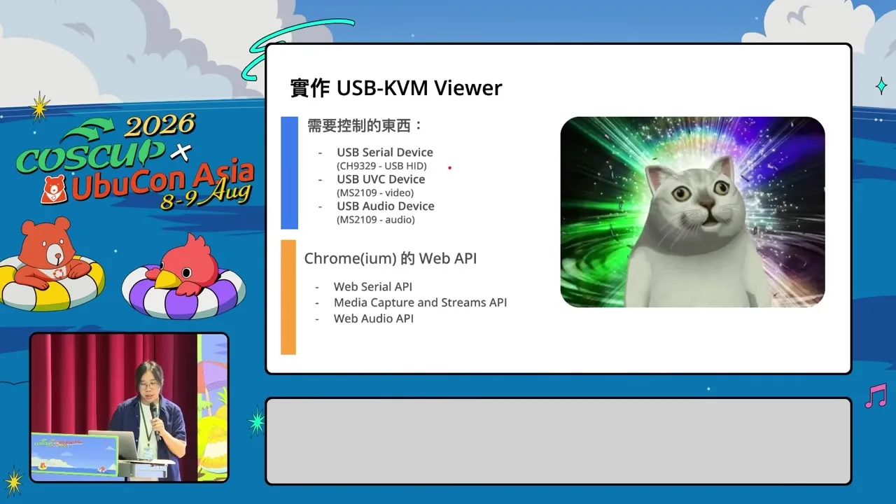
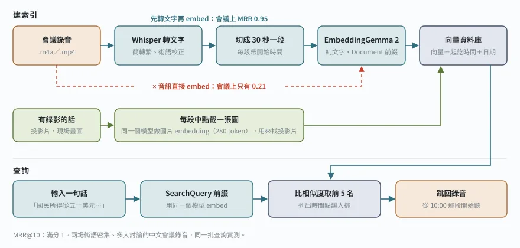

## 前言：音訊也能 embed，那錄音是不是不用轉逐字稿了

Google DeepMind 在 2026 年 10 月 6 日發表 EmbeddingGemma 2。740M 參數、Apache 2.0 授權，宣稱文字、程式碼、圖片、影片、音訊全部放進同一個 768 維的向量空間，還能在手機上跑。

我看到「音訊也能直接 embed」，第一個念頭是：那我手上那一堆會議錄音，是不是不用先轉逐字稿了？

我的需求很單純。錄音越積越多，常常記得「某次開會有人講過某件事」，卻想不起是哪一場、第幾分鐘。如果能打一句話就跳到那個時間點，比翻逐字稿快多了。

所以這篇不寫規格介紹，那種整理網路上已經很多。我把它裝到 Mac mini 上，拿真實的中文素材測了一輪，結論先講：

- 中文文字檢索很強，跟 bge-m3 同級
- 用文字找投影片可以用，而且它讀得到投影片上的字
- 中文會議錄音直接拿音訊去搜，不管用

中間踩到五個官方文件沒寫清楚、或寫了但很容易漏看的坑，每個都附實測數字。

## 測試環境與素材

硬體是 Mac mini M2、16GB 統一記憶體，macOS 14.6，用 MPS 跑 bf16。軟體版本：

- Python 3.12
- torch 2.12.0
- transformers 5.19.0
- sentence-transformers 6.1.0（模型卡要求至少 6.1.0，舊版處理不了多模態輸入的順序）

模型檔 `model.safetensors` 約 1.49GB，Hugging Face 上不用申請授權就能下載。附帶一提，裝 torch 的時候 PyPI 下載慢到每秒剩幾十 KB，原因跟我之前寫的[中華電信連 Fastly 很慢](/hinet-github-slow-cloudflare-warp/)是同一件事，PyPI 的檔案也是 Fastly 送的。

素材分三組：

1. TEDxTaipei 的跨世代對談（簡立峰 × 志祺七七，19 分鐘），單人輪流講、收音乾淨，有人工字幕
2. 兩場術語密集的中文專業會議錄音，下面叫會議 A、會議 B，合計約 4.5 小時，多人討論、台灣口音、中英夾雜，逐字稿是 Whisper 轉的
3. COSCUP 2026 的一場演講（USB／IP KVM 那場，26 分鐘），用來測投影片

全部切成 30 秒一段，我手寫查詢句、標好每題應該命中哪一段，算 MRR@10（滿分 1，越高代表正確答案排得越前面）。會議 A、B 是內部錄音，這篇只放數字，不放內容。

> 查詢是我看逐字稿寫的，對文字檢索有利；每組 14 到 30 題，數字請當量級看，不要拿小數點後第二位做結論。

## 先看資源：它真的很輕

| 載入組合 | 參數量 | 載入後記憶體 | 速度 |
|---|---|---|---|
| 純文字 | 271M | 約 0.5GB | 每秒約 118 句中文 |
| 文字＋音訊 | 577M | 約 1.1GB | 30 秒音訊約 0.86 秒 |
| 全模態 | 744M | 約 1.4GB | 見坑四 |

不用的編碼器可以不載，寫法是：

```python
from sentence_transformers import SentenceTransformer
import torch

model = SentenceTransformer(
    "google/embeddinggemma-2",
    device="mps",
    model_kwargs={"dtype": torch.bfloat16},
    config_kwargs={"vision_config": None, "audio_config": None},  # 純文字
)
```

純文字只要半 GB，16GB 的 Mac 跑起來幾乎沒感覺。多模態就是另一回事了，下面五個坑有三個跟它有關。

## 坑一：官方說音訊吃 327 秒，預設只吃 30 秒

模型卡的上下文表寫著：音訊每秒 25 個 token，8,192 token 的預算大約能放 327 秒。

我照這個數字把 60 秒、120 秒、327 秒、400 秒的音訊丟進去，embedding 都正常產出，沒有任何錯誤或警告。可是去看 processor 實際產生的 token 數：

| 輸入長度 | 音訊 token 數 |
|---|---|
| 5 秒 | 125 |
| 30 秒 | 750 |
| 60 秒 | 750 |
| 327 秒 | 750 |
| 400 秒 | 750 |

30 秒以後全部是 750。原因在音訊的 feature extractor，它的 `max_length` 預設是 480,000 個取樣點，16kHz 換算剛好 30 秒，`truncation` 預設又是開的。超過的部分直接丟掉，不會告訴你。

要吃長音訊，得自己把上限傳進去：

```python
emb = model.encode(
    [{"array": audio, "sampling_rate": 16000}],
    processing_kwargs={"audio": {"max_length": len(audio)}},
)
```

傳了之後確實吃得到，但成本漲得很快：

| 長度 | 耗時 | MPS 記憶體 |
|---|---|---|
| 30 秒 | 0.9 秒 | 約 2.2GB |
| 120 秒 | 4.4 秒 | 約 2.7GB |
| 240 秒 | 11.2 秒 | 約 5.9GB |
| 327 秒 | 17.9 秒 | 約 8.3GB |
| 400 秒 | 23.6 秒 | 約 11.8GB |

在 16GB 的機器上，實用範圍大概是 2 到 4 分鐘。而且坑五會講到，就算吃得下，也不建議一次塞這麼長。

## 坑二：fp16 不會壞在文字，會壞在音訊和影片

模型卡寫了「不要用 float16，會出現 NaN 或靜默劣化」。我原本以為文字也會中，實測結果不是這樣。

以 CPU fp32 為基準，比較 MPS 上三種精度：

| 精度 | 文字 64 句 | 音訊 6 段 | 影片 3 段 |
|---|---|---|---|
| fp32 | 全部正常 | 全部正常 | 全部正常 |
| bf16 | 正常（cosine ≥ 0.9998） | 正常（≥ 0.9997） | 正常（≥ 0.9998） |
| fp16 | 全部正常 | 3 段 NaN | 3 段全部 NaN |

文字在 fp16 下完全沒事，這反而危險：你用純文字測一下覺得沒問題，換成音訊或影片才開始出 NaN，而且一樣不報錯。NaN 進了向量資料庫，相似度算出來全是 NaN，排序會亂掉。

固定用 bf16 就好，M2 的 MPS 支援。保險一點可以在寫入資料庫前檢查一次：

```python
import numpy as np
assert not np.isnan(emb).any(), "embedding 有 NaN，檢查是不是用了 fp16"
```

## 坑三：任務前綴不是「略降」，會議逐字稿上差 0.23

EmbeddingGemma 2 的文字輸入要加任務前綴。查詢用 `task: search result | query: `，文件用 `title: none | text: `。模型卡的說法是不加「仍然可用，但精準度會下降」。

sentence-transformers 已經內建這些前綴，用 `prompt_name` 帶就好：

```python
q = model.encode(queries, prompt_name="SearchQuery")
d = model.encode(docs, prompt_name="Document")
```

實測加與不加的差別（MRR@10）：

| 素材 | 加前綴 | 不加 |
|---|---|---|
| TEDxTaipei 人工字幕 | 0.98 | 0.98 |
| 會議 A 逐字稿 | 0.95 | 0.72 |
| 會議 B 逐字稿 | 0.56 | 0.52 |

乾淨的字幕上加不加沒差，雜亂的會議逐字稿上差了 0.23。我的推測是：逐字稿裡贅字多、句子破碎，查詢和文件長得很不像，前綴幫模型分清楚「哪邊是問題、哪邊是答案」，這時候才顯出差別。

這個坑最容易中的地方是：你用乾淨的範例測，會得到「加不加都一樣」的結論。

## 坑四：影片吃得下，但預設會偷抽幀，16GB 也有天花板

影片是這次最容易被寫成「吃資源，別用」的部分，但它的能力其實不小，要分三層看。

### 官方說能吃多少

所有模態共用 8,192 token。影片預設每秒取 1 幀、每幀 140 token，換算大約 58 幀，也就是一個 embedding 能塞進約一分鐘的畫面。把每幀降到 70 token，可以塞到約 114 幀。影片還能跟文字、音訊混在同一個輸入裡，產出一個代表全部內容的向量。

### 預設值會在哪裡偷偷截斷

跟音訊一樣，processor 有自己的預設：`max_frames: 32`，超過就均勻抽樣，不報錯。如果你餵 58 幀，實際只會看到其中 32 幀。這個值可以透過 `processing_kwargs={"video": {"max_frames": N}}` 調整，不過我的測試都在 32 幀以內，超過 32 的情況沒有實測。

### 在 M2 16GB 上實際跑得到哪

一段 30 秒的影片（每秒取 1 張以內），不同設定的耗時和 MPS 記憶體：

| 幀數 × 每幀 token | 耗時 | MPS 記憶體 |
|---|---|---|
| 8 × 70 | 2.5 秒 | 約 3.0GB |
| 8 × 140 | 5.9 秒 | 約 4.3GB |
| 16 × 140 | 10.5 秒 | 約 6.8GB |
| 30 × 70 | 8.5 秒 | 約 4.3GB |
| 30 × 140 | 19.7 秒 | 約 9.6GB |
| 30 × 280 | 記憶體不足 | - |

最後一組直接噴錯：

```
RuntimeError: MPS backend out of memory (MPS allocated: 3.44 GiB,
other allocations: 17.04 GiB, max allowed: 20.13 GiB).
Tried to allocate 110.74 MiB on shared pool.
```

### 品質：影片和單張截圖各有長處

記憶體確認過，接著看搜不搜得到。我拿 COSCUP 那場演講，每 30 秒做一個影片 embedding，再跟同一段中點的單張截圖比。查詢分兩種：描述畫面（「一隻貓的迷因圖」「綠色勾叉的比較表」），以及用投影片上的字（「ATX 電源控制」「串流 HDMI video 到 Web UI」）。

| 設定 | 描述畫面 | 投影片上的字（照抄） | 投影片上的字（改寫成口語） |
|---|---|---|---|
| 影片 8 × 70 | 0.45 | 0.58 | 0.58 |
| 影片 8 × 140 | 0.48 | 0.58 | 0.53 |
| 影片 16 × 140 | 0.57 | 0.58 | 0.52 |
| 影片 30 × 70 | 0.43 | 0.49 | 0.51 |
| 單張截圖 280 token | 0.45 | 0.75 | 0.67 |
| 單張截圖 560 token | 0.37 | 0.78 | 0.63 |

結果分成兩邊：

- 找畫面，影片給越多資訊越好，16 幀 × 140 token 拿到最高的 0.57。30 秒裡換了好幾張投影片，影片都看得到，截圖只看到中間那一刻
- 找字，單張截圖明顯贏。每張 280 token 的解析度比影片每幀的 70 或 140 高，字比較看得清楚

它是真的讀得懂字，不只是比對字形。「怎麼遠端按主機的電源鍵」這種跟投影片標題用字完全不同的問法，也能找到標題寫著「ATX 電源控制」的那頁。



搜「一隻貓的迷因圖」，第一名就是 7:00 這一段。畫面出自 [COSCUP 2026 演講錄影](https://www.youtube.com/watch?v=blxZI2KbgzI)，CC BY 授權。

另一場投影片占滿整個畫面的內部錄影，單張截圖可以到 0.70，用逐字稿去搜同一批問題只有 0.10。投影片裡的圖表和照片，逐字稿本來就沒有。

所以我的用法是：每段先存一張截圖 embedding，便宜又能找字；真的需要「這段影片在演什麼」，再用 16 幀 × 140 token 補一個影片 embedding。

### 截圖的解析度：560 夠了，1120 在 Mac 上會靜默壞掉

模型卡說每張圖可以用 70 到 1,120 個 token，越高越細。我把截圖從預設的 280 往上拉：560 找字略好（0.78），找畫面反而低一點（0.37）；1,120 的分數直接掉到 0.04 到 0.2，跟亂猜差不多。

查下去發現是 MPS 的問題。同一張圖用 1,120 token，在 CPU 上跟 280 版本的相似度有 0.93 到 0.96，正常；在 MPS 上不論 fp32 或 bf16 都只剩 0.6，所有截圖的向量擠成一團。沒有錯誤、沒有 NaN，向量長度也正常。原因出在 transformers 預設的 SDPA attention 處理上萬個影像 patch 的長序列，載入時改成 eager 就正常了：

```python
model = SentenceTransformer(
    "google/embeddinggemma-2",
    device="mps",
    model_kwargs={"dtype": torch.bfloat16, "attn_implementation": "eager"},
)
```

但 eager 在這個長度上很貴，一張圖要 124 到 136 秒，MPS 記憶體衝到 14.2GB，Mac 開始大量 swap。在 16GB 的機器上，截圖就停在 280 或 560。同一個疑慮我也回頭驗了長音訊：327 秒在 MPS 上跟 CPU 的結果一致，沒有中。

## 坑五：切太長會被稀釋，30 秒最穩

坑一講到可以傳 `max_length` 吃長音訊，那是不是切大段一點比較好？我把同樣的素材切成 15、30、60、120 秒，文字檢索結果（MRR@10）：

| 窗長 | TEDxTaipei | 會議 A | 會議 B |
|---|---|---|---|
| 15 秒 | 0.98 | 0.80 | 0.60 |
| 30 秒 | 0.98 | 0.95 | 0.56 |
| 60 秒 | 0.96 | 0.86 | 0.56 |
| 120 秒 | 0.84 | 0.69 | 0.42 |

120 秒窗三組都明顯下滑。照理說窗變長、總數變少，猜中的機會應該更高，結果反而掉分。一個向量裝了兩分鐘、好幾個話題，跟哪個問題都只有一點像。15 秒則太短，一句話會被切斷。

我也試了 30 秒窗、每 15 秒起一段的重疊切法，窗數多一倍，分數沒有一致變好，不值得。

> 題目是照 30 秒窗寫的，這張表對 30 秒有利。能下的結論是「別切長」，30 秒不一定是最佳值。不過 30 秒剛好是音訊的預設上限，實務上就用它。

## 中文文字檢索：跟 bge-m3 同級

五個坑講完，回到最常用的文字檢索。我拿兩個常見的開源 embedding 一起比，都用同一組 30 秒窗和查詢：

| 模型 | TEDxTaipei | 會議 A | 會議 B |
|---|---|---|---|
| EmbeddingGemma 2 | 0.98 | 0.95 | 0.56 |
| bge-m3 | 1.00 | 0.93 | 0.56 |
| Qwen3-Embedding-0.6B | 1.00 | 0.79 | 0.48 |

乾淨字幕上三個都接近滿分，看不出差別；雜亂的會議逐字稿才拉得開，EmbeddingGemma 2 跟 bge-m3 並列前面。速度上，會議 A 的 305 段，EmbeddingGemma 2 跑 14.9 秒，bge-m3 是 11.3 秒，Qwen3 是 28.0 秒（bge-m3 和 Qwen3 用 fp32，EmbeddingGemma 2 用 bf16）。

### 逐字稿錯字的影響，看的是密度

會議 B 三個模型都只有 0.5 左右，原因不在模型。那場的逐字稿錯得很兇，關鍵術語幾乎都被聽成同音的別字，整段語意都糊了，換哪個模型都救不回來。

零星錯字倒是沒什麼影響。我用 Whisper large-v3-turbo 重轉 TEDxTaipei，跟人工字幕比，字元錯誤率約 22%（含「台／臺」字形和贅字），像「Eric Schmidt」被轉成「Ever Shmi」。文字檢索卻只從 0.98 掉到 0.97，一個 30 秒窗裡還有很多沒錯的字可以對上。

會議 B 還有另一個原因：那場兩小時都在討論同一件事，同一個話題被講了好多次。我每題只標一個正確段落，模型搜到另一段也在講同件事的地方，就被算成失敗。我逐題看了失敗的 10 題，約有 3 題的第一名其實是對的，另外 3 題算部分相關。所以單一主題的長會議，搜尋介面最好列出前 5 個時間點讓人挑，不要直接跳第一名。

## 為什麼語音直接搜在會議上不管用

這是整個測試最讓我意外的地方。

用文字查詢直接搜音訊 embedding，TEDxTaipei 有 0.78，算可以用。像「國民所得從五十美元成長到快三萬美元」，音訊直接命中 10:00 那段，跟用字幕搜的結果一樣。

同樣的做法放到會議 A、B，都只有 0.21。

第一個懷疑是口音和收音：會議是台灣口音、多人插話、會議室遠距收音，TED 是舞台麥克風。可是 TED 的講者也是台灣口音，這說不通。

為了拆開這幾個因素，我做了一個控制實驗：把每段的逐字稿用 macOS 內建的 `say` 指令念出來，變成乾淨的單人語音，再做音訊 embedding。台灣腔用美佳（Meijia），大陸腔用婷婷（Tingting）：

```bash
say -v Meijia -o seg.aiff "這段的逐字稿內容"
```

內容完全一樣，只換掉聲音：

| 素材 | 直接用文字 | 原始錄音 | TTS 台灣腔 | TTS 大陸腔 |
|---|---|---|---|---|
| TEDxTaipei | 0.98 | 0.78 | 0.79 | 0.77 |
| 會議 A | 0.95 | 0.21 | 0.33 | 0.41 |
| 會議 B | 0.56 | 0.21 | 0.31 | 0.23 |

對照下來：

- TED 換成 TTS，分數跟原錄音一樣，講者的口音和現場收音沒有拖累
- 會議內容就算念成乾淨的標準語音，也只升到 0.3 到 0.4，同一段文字直接 embed 卻有 0.95。收音只占一小部分，主要是內容本身
- 台灣腔和大陸腔各贏一場，看不出口音有一致的影響

我的解讀是：音訊編碼器對一般話題的口語抓得到語意，但抓不住專業術語和破碎的討論。同一段話寫成文字它看得懂，念出來它就聽不懂了。

我原本還想過，Whisper 聽錯的術語，能不能靠音訊 embedding 補回來。實測不行：專挑逐字稿有錯字的題目，文字仍有 0.95，音訊只有 0.25。把文字和音訊的分數加起來，會議 B 從 0.56 升到 0.64，會議 A 反而從 0.95 掉到 0.89，沒有穩定的好處。

## 實際怎麼用

以會議錄音為例，我會這樣接：

```
錄音 → Whisper → 簡轉繁、術語校正 → 逐字稿
     → 切 30 秒一段 → EmbeddingGemma 2 純文字版（Document 前綴）
     → 向量資料庫，每筆帶開始時間、結束時間、日期
查詢 → SearchQuery 前綴 → 取前 5 名 → 用開始時間跳過去
有錄影的話，每段再存一張截圖 embedding，專門找投影片
```



這張圖最想讓你看的是那條紅色虛線。音訊直接 embed 在流程上省一步，但在會議錄音上分數只剩 0.21，那一步省不得。

最小可跑的版本：

```python
import numpy as np
import torch
from sentence_transformers import SentenceTransformer

model = SentenceTransformer(
    "google/embeddinggemma-2",
    device="mps",
    model_kwargs={"dtype": torch.bfloat16},
    config_kwargs={"vision_config": None, "audio_config": None},
)

# segments：[{"start": 0.0, "text": "..."}, ...]，每段 30 秒
docs = [s["text"] for s in segments]
doc_emb = model.encode(docs, prompt_name="Document", normalize_embeddings=True)
assert not np.isnan(doc_emb).any()

def search(query, k=5):
    q = model.encode([query], prompt_name="SearchQuery", normalize_embeddings=True)
    scores = (q @ doc_emb.T)[0]
    top = np.argsort(-scores)[:k]
    return [(segments[i]["start"], float(scores[i])) for i in top]

for start, score in search("國民所得從五十美元成長到快三萬美元"):
    print(f"{int(start // 60)}:{int(start % 60):02d}  {score:.3f}")
```

幾千段以內用 numpy 直接算就夠快，不用一開始就架向量資料庫。

如果想省空間，MRL 可以把向量截短。文字截到 256 維掉 0.02 到 0.07，截到 128 維在會議 A 從 0.95 掉到 0.77，掉得比較明顯。截短後要重新 normalize，`encode` 加 `truncate_dim=256, normalize_embeddings=True` 就會幫你做。

## 常見問題

### EmbeddingGemma 2 可以直接搜中文會議錄音嗎？

不建議。術語多、多人討論的會議實測只有 0.21，先用 Whisper 轉逐字稿再做文字 embedding，可以到 0.95。

### 音訊最長可以放多久？

預設只吃前 30 秒且不報錯，傳 `max_length` 可以吃到約 327 秒，但在 16GB 的 Mac 上建議切成 30 秒一段。

### 可以用 float16 省記憶體嗎？

文字沒問題，音訊和影片會出現 NaN 且不報錯，固定用 bfloat16 最保險。

### 影片要用影片 embedding 還是截圖？

找投影片上的字用單張截圖比較準，找畫面內容用 16 幀以上的影片 embedding 比較好，16GB 的 Mac 上兩種都跑得動。

## 結語

測完之後，我對 EmbeddingGemma 2 的定位很清楚：把它當成一個中文表現很好的文字 embedding，外加「用文字找圖」的能力。它的多模態是真的能用，只是用法跟我一開始想的不一樣。

一開始我以為多模態可以讓我省掉轉逐字稿那一步，結果繞了一圈，最有用的建議反而是：語音先轉文字。這一步省不掉，要投資就投資在 ASR 和術語校正上，檢索品質會跟著上來。

五個坑裡面，我覺得最該記住的是共通點：音訊的 30 秒、影片的 32 幀、fp16 的 NaN、高解析度截圖在 MPS 上算歪，全部都不報錯。用之前，自己量一次 processor 實際產出了什麼。

## 參考資料

- [Hugging Face：google/embeddinggemma-2 模型卡](https://huggingface.co/google/embeddinggemma-2)
- [Google Developers Blog：EmbeddingGemma 2 開發者指南](https://developers.googleblog.com/embeddinggemma-2-the-developer-guide/)
- [Google 官方發表](https://blog.google/innovation-and-ai/technology/developers-tools/embeddinggemma-2/)
- 測試素材：[TEDxTaipei 簡立峰 X 志祺七七｜跨世代對談 第 1 集](https://www.youtube.com/watch?v=ef9qpOcw5MI)（CC BY-NC-ND 4.0）
- 測試素材：[COSCUP 2026〈明明只是想遠端控制我的主機，結果一不小心就做出一套開源 USB / IP KVM 的這件事〉](https://www.youtube.com/watch?v=blxZI2KbgzI)（CC BY）
- [中華電信下載 GitHub 速度超慢？實測開 Cloudflare WARP 快了上百倍](/hinet-github-slow-cloudflare-warp/)
