## 前言

在學習 Flutter 串接 [Firebase Authentication](https://firebase.google.com/docs/auth?hl=zh-tw) 服務，記錄一下操作過程。

原始碼：[https://github.com/haunchen/google\_signin\_example](https://github.com/haunchen/google_signin_example)

## 創建 Firebase 專案

前往 [Firebase](https://console.firebase.google.com/) 透過 Google 登入後，創建一個專案。

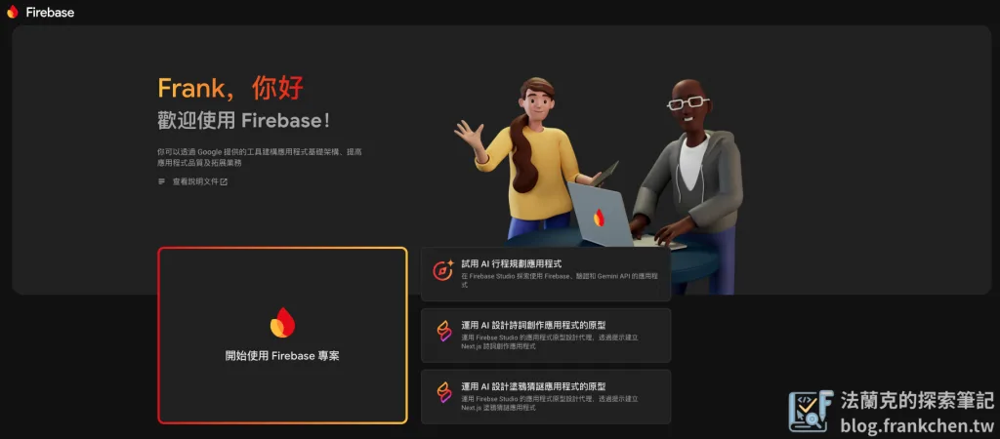

專案名稱可以隨意取，好辨別的都可以，這邊以「flutter-firebase-test」為專案名稱。取好名稱後，勾選接受條款，即可點擊”繼續”。

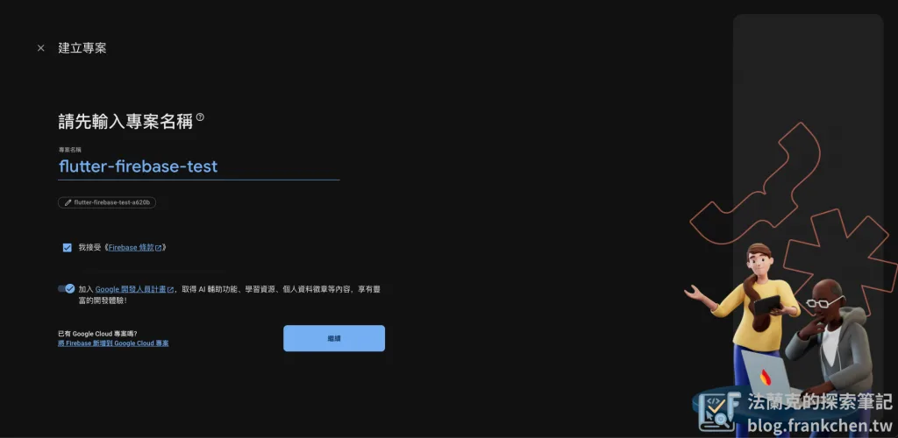

近期剛好 Google 在 [Google I/O](https://io.google/2025/explore?focus_areas=AI) 上推出一系列的 AI 工具，所以會詢問你是否啟用 Genimi 輔助。

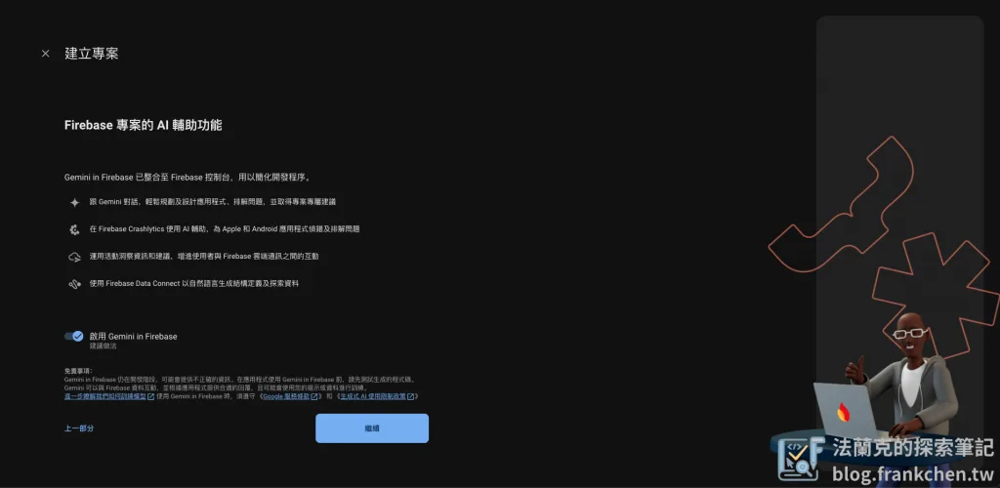

接著會詢問你是否開啟 Google Analytics，這裡可以依照 Google 的建議執行。

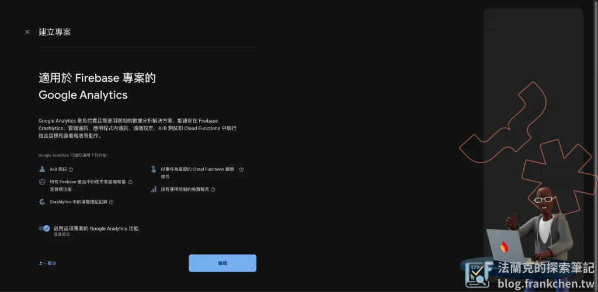

依照指示設定後，便會開始佈建專案，等待大約1~2分鐘後，建立完成。

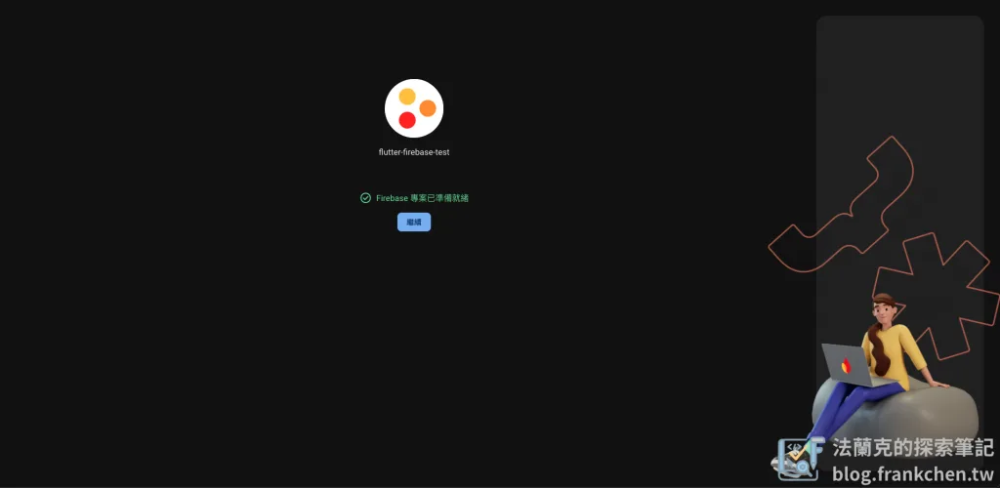

點擊”繼續“後，即會進到專案主畫面。

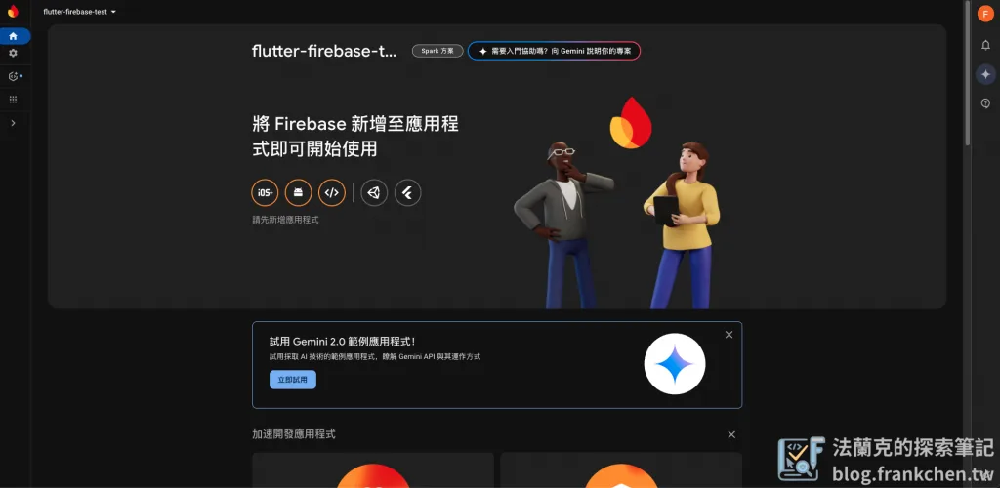

## 新增 Firebase 到應用程式中

根據你的應用程式選擇，這篇以 Flutter 為例，選擇 Flutter 應用程式。

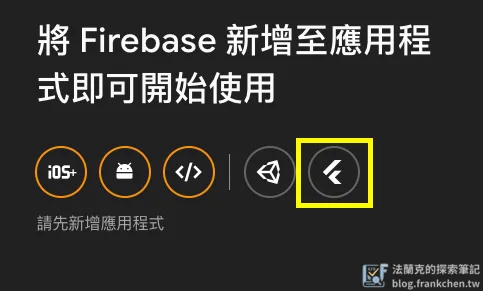

## 安裝 Firebase CLI

首先，需要在電腦上先安裝 [Firebase CLI](https://firebase.google.com/docs/cli?hl=zh-TW&authuser=2&_gl=1*1luvg5c*_ga*MTgzNDMxMzY0My4xNzQ5MDA1NzE4*_ga_CW55HF8NVT*czE3NDkwMTY0MTMkbzIkZzEkdDE3NDkwMjAxNzQkajYwJGwwJGgw#install_the_firebase_cli)、[Flutter SDK](https://docs.flutter.dev/get-started/install)，跟著官方提供的安裝步驟即可安裝成功。

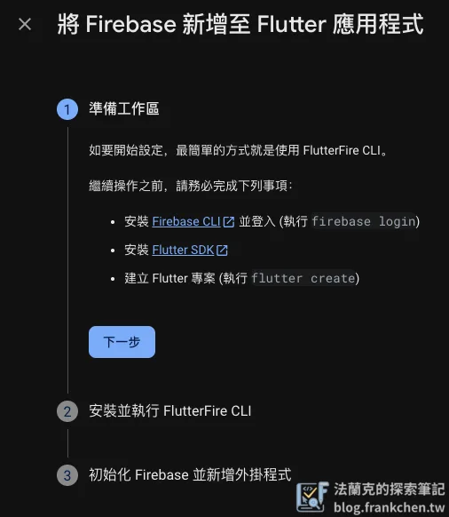

安裝完成後，請在終端機執行以下指令，登入 Firebase。

```bash
firebase login
```

## 執行 Firebase CLI

接著根據官方步驟來到第二步，執行 Firebase CLI。

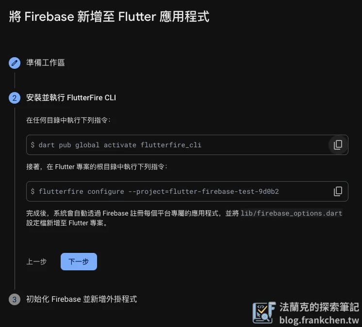

這裡為確保指令執行成功，建議這兩個指令都在Ｆlutter 專案的根目錄下執行，首先先將 Firebase CLI 在 Flutter 環境中啟動。

```bash
dart pub global activate flutterfire_cli
```

有看到以下畫面代表啟用成功。

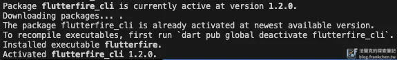

再來，在你的Flutter 專案中註冊 Firebase。

```bash
flutterfire configure --project=flutter-firebase-test-9d0b2
```

這邊使用上下鍵移動，使用空白鍵選擇你這個專案預計使用的平台，這裡選擇 Android 及 iOS 兩平台，按下 Enter，就會開始將指令平台需要的檔案及設定安裝到你的 Flutter 專案中。

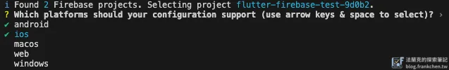

安裝完成後就會看到以下畫面，其中 Firebase Id 屬於敏感資料，請小心不要外流。

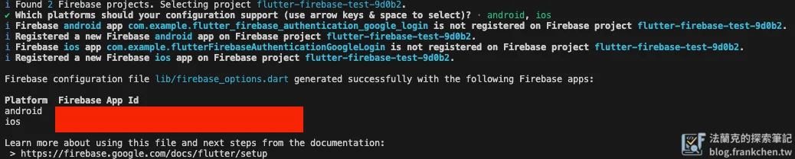

## 開啟 Firebase Authentication 服務

接著回到 Firebase 專案，找到 Authentication 並開啟該服務。


開啟後，會有多種登入方式供你選擇，這邊就以 “Google” 作為範例。勾選開啟 Google 後，需要提供應用程式的指紋，供 Firebase 驗證使用。（如果你也有在 n8n 串接 Google 服務的需求，可以參考 [n8n 串接 Google Cloud 憑證設定教學](/n8n-google-credentials-setup-guide/)，OAuth 2.0 的設定概念相通。）

在終端機輸入以下指令產生指紋 (Fingerprints)，密碼輸入”android”即可。

```bash
keytool -list -v -alias androiddebugkey -keystore ~/.android/debug.keystore
```

產生指紋 (Fingerprints) 如下：

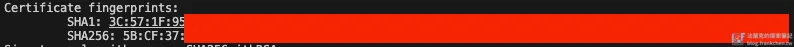

前往專案設定，找到 Android 應用程式，就會看到新增指紋的選項，，將這兩組指紋新增到 Firebase 專案中。

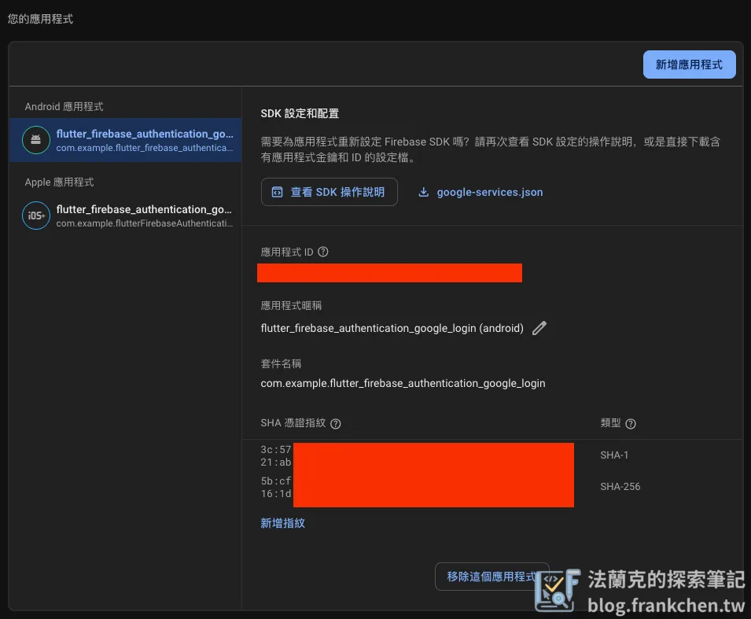

## 實作 Google 登入

以下為 main.dart 的程式碼。本範例核心使用了 `StatefulWidget`，它負責管理登入狀態與使用者資訊的動態更新，若你對 `StatefulWidget` 與 `StatelessWidget` 的選擇不熟悉，可以先看[這篇 StatefulWidget vs StatelessWidget 學習筆記](/flutter-study-writing-statefulwidget-vs-statelesswidget/)。

```dart
import 'package:flutter/material.dart';
import 'package:firebase_core/firebase_core.dart';
import 'package:firebase_auth/firebase_auth.dart';
import 'package:google_sign_in/google_sign_in.dart';
import 'firebase_options.dart';

/// 應用程式進入點
void main() async {
  // 確保 Flutter 綁定已初始化，這是使用任何 Flutter 功能前的必要步驟
  WidgetsFlutterBinding.ensureInitialized();

  // 初始化 Firebase，使用當前平台的配置選項
  await Firebase.initializeApp(
      options: DefaultFirebaseOptions.currentPlatform,
  );

  // 啟動 Flutter 應用程式
  runApp(const MainApp());
}

/// 主要應用程式類別
class MainApp extends StatelessWidget {
  const MainApp({super.key});

  @override
  Widget build(BuildContext context) {
    return MaterialApp(
      title: 'Google 登入範例',
      theme: ThemeData(
        primarySwatch: Colors.blue,
      ),
      home: const AuthScreen(), // 設定首頁為認證畫面
    );
  }
}

/// 認證畫面 - 處理 Google 登入/登出功能
class AuthScreen extends StatefulWidget {
  const AuthScreen({super.key});

  @override
  State<AuthScreen> createState() => _AuthScreenState();
}

class _AuthScreenState extends State<AuthScreen> {
  // Firebase 認證實例
  final FirebaseAuth _auth = FirebaseAuth.instance;
  // Google 登入實例
  final GoogleSignIn _googleSignIn = GoogleSignIn();
  // 當前登入的使用者
  User? _user;
  // 載入狀態標記
  bool _isLoading = false;

  @override
  void initState() {
    super.initState();
    // 監聽認證狀態變化，當使用者登入/登出時自動更新 UI
    _auth.authStateChanges().listen((User? user) {
      setState(() {
        _user = user;
      });
    });
  }

  /// Google 登入功能
  Future<void> _signInWithGoogle() async {
    // 設定載入狀態為 true，顯示載入指示器
    setState(() {
      _isLoading = true;
    });

    try {
      // 觸發 Google 登入選擇帳號流程
      final GoogleSignInAccount? googleUser = await _googleSignIn.signIn();

      // 如果使用者取消登入，結束函數執行
      if (googleUser == null) {
        setState(() {
          _isLoading = false;
        });
        return ;
      }

      // 從 Google 帳號取得認證資料（access token 和 id token）
      final GoogleSignInAuthentication googleAuth = await googleUser.authentication;

      // 建立 Firebase 認證憑證
      final credential = GoogleAuthProvider.credential(
        accessToken: googleAuth.accessToken,
        idToken: googleAuth.idToken,
      );

      // 使用 Google 憑證登入 Firebase
      await _auth.signInWithCredential(credential);
    } catch (e) {
      // 如果登入過程發生錯誤，顯示錯誤訊息
      ScaffoldMessenger.of(context).showSnackBar(
        SnackBar(content: Text('登入失敗：$e')),
      );
    } finally {
      // 無論成功或失敗，都要關閉載入狀態
      setState(() {
        _isLoading = false;
      });
    }
  }

  /// 登出功能 - 同時從 Firebase 和 Google 登出
  Future<void> _signOut() async {
    await _auth.signOut();
    await _googleSignIn.signOut();
  }

  @override
  Widget build(BuildContext context) {
    return Scaffold(
      appBar: AppBar(
        title: const Text('Google 登入範例'),
        backgroundColor: Colors.blue,
      ),
      body: Center(
        // 根據使用者登入狀態顯示不同內容
        child: _user == null ? _buildSignInButton() : _buildUserProfile(),
      ),
    );
  }

  /// 建立登入按鈕 Widget（當使用者未登入時顯示）
  Widget _buildSignInButton() {
    return Column(
      mainAxisAlignment: MainAxisAlignment.center,
      children: [
        const Text(
          '請登入 Google 帳號',
          style: TextStyle(fontSize: 18, fontWeight: FontWeight.bold),
        ),
        const SizedBox(height: 30),
        // 根據載入狀態顯示不同內容
        _isLoading
          ? const CircularProgressIndicator() // 載入中顯示圓形進度指示器
          : ElevatedButton.icon(
            onPressed: _signInWithGoogle, // 點擊時執行 Google 登入
            icon: Image.asset(
              'assets/google_logo.png', // Google 標誌圖片
              height: 24,
              width: 24,
              // 如果圖片載入失敗，顯示預設圖示
              errorBuilder: (context, error, stackTrace) {
                return const Icon(Icons.login, color: Colors.white);
              },
            ),
            label: const Text(
              '使用 Google 登入',
              style: TextStyle(fontSize: 16),
            ),
            style: ElevatedButton.styleFrom(
              backgroundColor: Colors.red, // Google 品牌色
              foregroundColor: Colors.white,
              padding: const EdgeInsets.symmetric(
                horizontal: 24,
                vertical: 12,
              ),
              shape: RoundedRectangleBorder(
                borderRadius: BorderRadius.circular(8),
              ),
            ),
          ),
      ],
    );
  }

  /// 建立使用者資料 Widget（當使用者已登入時顯示）
  Widget _buildUserProfile() {
    return Column(
      mainAxisAlignment: MainAxisAlignment.center,
      children: [
        // 使用者大頭照 - 圓形頭像
        CircleAvatar(
          radius: 50,
          // 如果使用者有大頭照則顯示，否則顯示預設圖示
          backgroundImage: _user?.photoURL != null
              ? NetworkImage(_user!.photoURL!)
              : null,
          child: _user?.photoURL == null
              ? const Icon(Icons.person, size: 50)
              : null,
        ),
        const SizedBox(height: 20),
        // 歡迎訊息
        const Text(
          '歡迎',
          style: TextStyle(fontSize: 24, fontWeight: FontWeight.bold),
        ),
        const SizedBox(height: 10),
        // 使用者顯示名稱
        Text(
          _user?.displayName ?? '未知使用者',
          style: const TextStyle(fontSize: 20, fontWeight: FontWeight.w500),
        ),
        const SizedBox(height: 10),
        // 使用者 Email 地址
        Text(
          _user?.email ?? '',
          style: const TextStyle(fontSize: 16, color: Colors.grey),
        ),
        const SizedBox(height: 30),
        // 登出按鈕
        ElevatedButton.icon(
          onPressed: _signOut,
          icon: const Icon(Icons.logout),
          label: const Text('登出'),
          style: ElevatedButton.styleFrom(
            backgroundColor: Colors.grey,
            foregroundColor: Colors.white,
            padding: const EdgeInsets.symmetric(
              horizontal: 24,
              vertical: 12,
            ),
          ),
        ),
      ],
    );
  }
}
```

## 實際操作介面

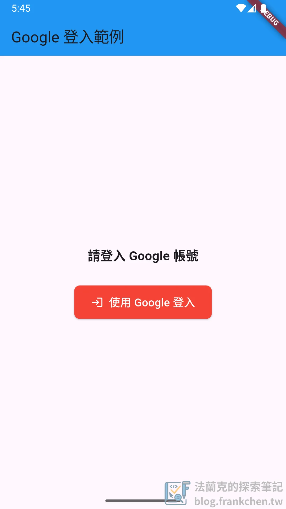

## 小結

以上是針對Flutter 串接 Firebase Authentication 方法，也歡迎大家直接下載[原始碼](https://github.com/haunchen/google_signin_example)自行編譯。如果你在部署到 Google Play 時遇到 `flutter_secure_storage` 相關的啟動問題，可以參考這篇 [Flutter App Android 啟動卡死除錯指南](/flutter-secure-storage-android-key-problem/)。
