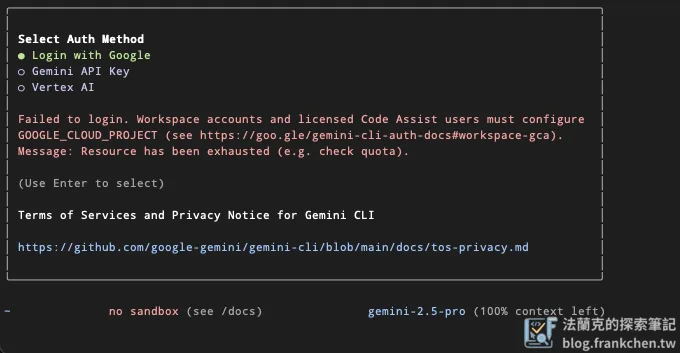
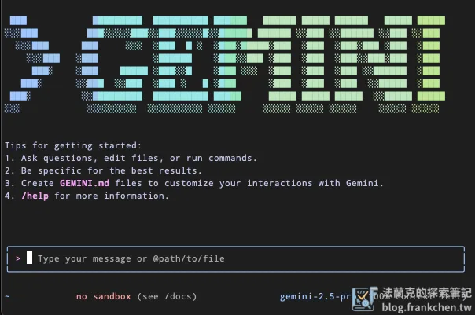
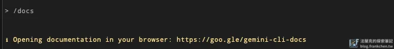
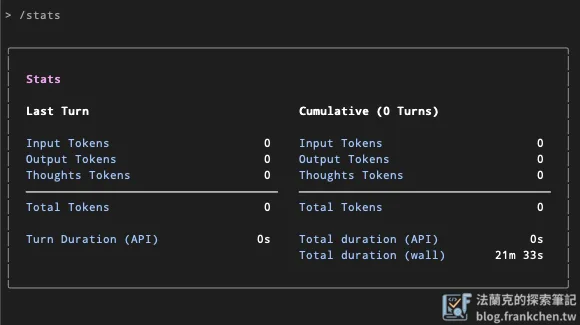
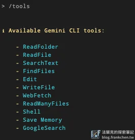
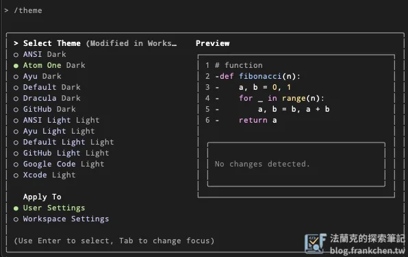
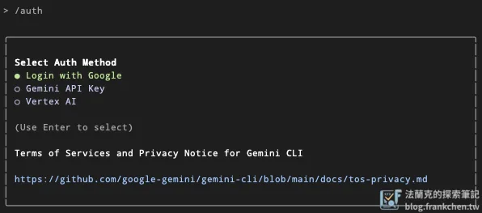
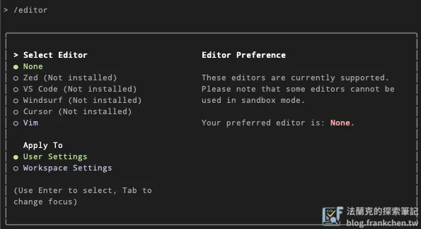
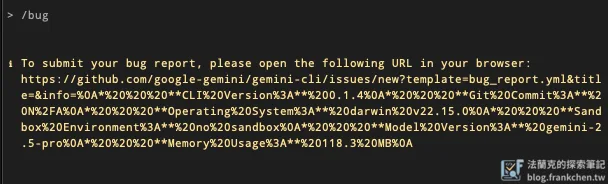
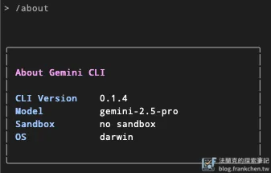

> **2026-07-23 更新**：本文發表於 2025-06，當時 Gemini CLI 提供相當寬鬆的免費額度。
> 之後 Google 調整了額度政策，一般訂閱方案已不再適用文中所述的免費用量，
> 下方「使用額度」一節的數字僅代表發文當時的狀況。實際可用額度請以
> [官方 Github](https://github.com/google-gemini/gemini-cli) 的最新說明為準。
> 本文的安裝步驟與指令用法仍然適用。

Google 推出了免費的 Gemini CLI 工具，看來 Claude Code 遇到對手了。安裝教學，指令列表。

## 安裝

[官方 Github](https://github.com/google-gemini/gemini-cli)

### 先決條件

確保電腦已安裝 [Node.js 18](https://nodejs.org/en/download) 或是更高版本。

### 執行 CLI 安裝

-   於隔離環淨執行 (意味著不會安裝在電腦上)

```bash
npx https://github.com/google-gemini/gemini-cli
```

-   直接安裝在電腦上，爾後只要在 terminal 視窗輸入 `gemini` 即可啟動 Gemini CLI

```bash
npm install -g @google/gemini-cli
gemini
```

### 登入驗證

這邊有三個選項可以選擇：

-   Login with Google: 透過你的 Google 帳戶直接登入

-   Gemini API Key: 需前往 [Google AI Studio](https://aistudio.google.com) 申請 API Key

-   Vertex AI: 如果你有開通 Google Cloud 上的 [Vertex AI](https://cloud.google.com/vertex-ai) 服務的話也可以使用



登入後，即可看到操作畫面



## Gemini CLI 指令

### /help

列出所有指令表

### /docs

透過瀏覽器開啟操作說明文件



### /chat

管理對話歷史記錄

用法：

```bash
/chat <list|save|resume> [tag]
```

-   list：列出已儲存的對話紀錄

-   save：儲存當前對話紀錄

-   resume：透過 tag 調用歷史對話紀錄

### /stats

檢查 Gemini CLI 會話統計資料



### /compress

壓縮 Gemini CLI 對話的上下文，減少 token 使用量


### /mcp

列出已設定的 MCP 伺服器和工具

官方提供的設定方法：[Github](https://github.com/google-gemini/gemini-cli/blob/main/docs/tools/mcp-server.md)

### /tools

列出可用的 Gemini CLI 工具



### /theme

更改 Gemini CLI 的主題



### /auth

更改 Gemini CLI 身份驗證方法



### /editor

設定外部編輯器預設選項



### /bug

使用 Gemini CLI 若有遇到任何Bug，可以透過此命令進行回報



### /about

顯示 Gemini CLI 版本資訊



### /clear

清除 Gemini CLI 畫面和對話歷史記錄

### /quit

退出 Gemini CLI

## Gemini CLI 使用額度

> 這一節的數字是 2025-06 發文當時的狀況，Google 之後已調整額度政策，
> 一般訂閱方案不再適用。保留原文供對照，實際額度請查閱官方最新說明。

根據官方文件，一分鐘可調用 60 次模型，一天可調用 1000 次模型

這對於一般使用者來說額度絕對夠用，而且還是使用最新的 `gemini-2.5-pro` 模型

當時就在想免費使用不知道會持續多久——結果一年多後政策果然收緊了。

---

對 AI CLI 工具有興趣的話，也可以看看這幾篇：

-   [從 0 到 1 打造 n8n AI 技能包：讓 Claude 掌握 500+ 個自動化節點的開源專案實戰](/n8n-skills-claude-ai-skill-pack-tutorial/)
-   [n8n-skills 技術解密 (1)：打造可擴展的四層式資料處理 Pipeline](/n8n-skills-four-layer-pipeline-architecture/)
