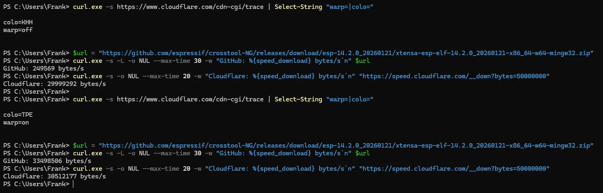

## 前言：裝個 ESP32 開發套件，卡了半小時

最近在做一個 ESP32 小專案，要用 Arduino 的工具鏈編譯。ESP32 的開發套件（esp32 core 3.3.12）連同所有工具大約 2 GB，其中光是 Xtensa 編譯器就有 414 MB。照理說公司網路下載這點東西，幾分鐘的事。

結果卡了半小時，還沒裝完。

這篇記錄我從「以為是 Arduino 壞了」「以為是公司網路限速」，一路查到真正原因是中華電信 HiNet 連 Fastly 的路徑出問題。如果你也是中華電信用戶，下載 GitHub 上的東西慢得莫名其妙，看完你會知道：

- 怎麼用三個指令確認你是不是也中了
- 開 Cloudflare WARP 前後，同一個檔案的實測速度差多少
- 公司電腦不能開 WARP 時，有什麼應急方法

測試環境：Windows 11、中華電信 HiNet、arduino-cli 1.5.1、Arduino IDE 2，測試日期 2026-10-07。

## 症狀：錯誤訊息很會誤導人

我先用 arduino-cli 裝，指令是這行：

```powershell
arduino-cli core install esp32:esp32
```

第一次跑，Xtensa 編譯器那個檔案停在 0 MB 十幾分鐘，arduino-cli 自己也不報錯，就這樣掛著。

重跑一次，這次有動了，跑到一半噴出這個：

```
安裝時出錯: 刪除損壞的存檔 remove C:\Users\...\Arduino15\staging\packages\xtensa-esp-elf-14.2.0_20260121-x86_64-w64-mingw32.zip:
The process cannot access the file because it is being used by another process.
```

log 裡還有一行：

```
抓取的存檔大小跟索引內指明的大小不同: 148758912 != 413859845
```

414 MB 的檔案只抓到 149 MB 就斷了，arduino-cli 想刪掉殘檔重來，殘檔又被鎖住刪不掉，於是卡死在那裡。

看到「存檔損壞」「檔案被別的程序佔用」，第一個念頭會往防毒軟體、Arduino 本身的 bug 去查。這兩個方向都是錯的。

## AI 幫我排查，結果判斷錯了

這次排查我是交給 Claude Code 做的。它先看到 arduino-cli 第二次重跑時，20 秒內抓了 149 MB 就停住；接著改用 curl 單獨下載同一個檔案，速度只剩每秒 0.1 到 0.14 MB，有時候乾脆斷掉。

它再試了開 8 條連線、每條各抓檔案的一段，總速度變成每秒約 1 MB，快了 7 倍。

於是它下了結論：公司網路對單一連線限速。還把這條結論寫進了我的踩坑筆記。

這個結論聽起來很對。單一連線慢、多開幾條就變快，不就是典型的逐條限速嗎？

直到我自己拿症狀去 Google，搜到 [electrify 這篇文章](https://electrify.tw/hinet-fastly-twitter-github-slow-cloudflare-warp/)，才知道從 9 月中開始，就有不少中華電信用戶遇到同樣的事：Twitter 的圖片影片、raw.githubusercontent.com 這些走 Fastly CDN 的東西都很慢，原因集中在 HiNet 往 Fastly 的海外連線。

回頭看，判斷錯的關鍵是少了對照組。「多開連線會變快」只說明了瓶頸在每一條連線上，並沒有說明瓶頸是誰造成的。如果當時同時測一個不走 Fastly 的大檔，馬上就會發現線路本身好得很，問題只出在特定目的地。

> 排查結論裡如果沒有對照組，先當成假設，不要寫進筆記。AI 下的結論也一樣。

## 三個指令確認你是不是也中了

以下指令都在 Windows 的 PowerShell 跑。macOS 或 Linux 把 `curl.exe` 改成 `curl`、`NUL` 改成 `/dev/null`、`tracert` 改成 `traceroute` 即可。

### 一、確認你現在走哪條路

```powershell
curl.exe -s https://www.cloudflare.com/cdn-cgi/trace
```

看輸出裡的兩行：

- `warp=off` 或 `warp=on`：有沒有開 WARP
- `colo=`：你連到 Cloudflare 哪個機房，我沒開 WARP 時是 `KHH`（高雄），開了是 `TPE`（台北）

### 二、確認檔案是不是 Fastly 送的

GitHub release 的檔案會先轉址到 `release-assets.githubusercontent.com`，再由 CDN 送出。看回應標頭的 `X-Served-By`：

```powershell
$url = "https://github.com/espressif/crosstool-NG/releases/download/esp-14.2.0_20260121/xtensa-esp-elf-14.2.0_20260121-x86_64-w64-mingw32.zip"
curl.exe -sIL $url | Select-String "X-Served-By|X-Cache"
```

我沒開 WARP 時看到的是：

```
X-Served-By: cache-iad-kjyo7100175-IAD, cache-sin-wsat1880030-SIN
```

`cache-xxx` 是 Fastly 的快取節點命名方式，最後一段是實際送檔給你的節點。`SIN` 是新加坡。

### 三、同時測兩個目的地（對照組）

這一步最重要。一個測 GitHub，一個測 Cloudflare 自己的測速檔：

```powershell
# GitHub release 檔（走 Fastly），單一連線測 30 秒
curl.exe -s -L -o NUL --max-time 30 -w "GitHub: %{speed_download} bytes/s`n" $url

# 對照組：Cloudflare 測速檔 50 MB
curl.exe -s -o NUL --max-time 20 -w "Cloudflare: %{speed_download} bytes/s`n" "https://speed.cloudflare.com/__down?bytes=50000000"
```

`speed_download` 的單位是 bytes/s，除以 1048576 就是 MB/s。

如果 Cloudflare 那行很快、GitHub 那行很慢，問題就不在你的線路，而是往 Fastly 的那段路。

### 補充：看延遲在哪一跳變大

```powershell
tracert -d release-assets.githubusercontent.com
```

我的結果，前 7 跳都是中華電信的位址（168.95.x、220.128.x），延遲 1 到 7 ms；到第 8 跳 `220.128.6.165` 延遲突然跳到 52 ms，下一跳就是 Fastly 的位址 `199.27.78.234`，終點約 63 ms。也就是說，出了中華電信的網路之後，封包就繞到國外去了。

electrify 那篇查到的路徑是經香港 PCCW，我這次看到的送檔節點是新加坡。測試的時間和地點不同，路徑本來就可能不一樣，重點在「出國」這件事，不在走哪個國家。

## 實測數據：同一個檔案，快了上百倍

測試檔案：上面那個 Xtensa 編譯器 zip，413,859,845 bytes，Windows 檔案總管會顯示成 394.7 MB，以下速度也照這個算法（1 MB＝1,048,576 bytes）。全部用 curl 單一連線、同一台電腦、同一條 HiNet 線路，只切換 WARP 開關。

| 條件 | 送檔節點 | 平均速度 | 備註 |
|------|---------|---------|------|
| 關 WARP，第 1 輪 | Fastly 新加坡 | 0.28 MB/s | 30 秒只抓到 8.3 MB |
| 關 WARP，第 2 輪 | Fastly 新加坡 | 0.04 MB/s | 30 秒只抓到 1.3 MB |
| 關 WARP，對照組 Cloudflare | - | 31.25 MB/s | 線路本身沒問題 |
| 開 WARP，3 輪 | Fastly 東京 | 32.5 MB/s | 394.7 MB 約 12 秒抓完 |

關 WARP 時的逐秒速度（MB/s），第 1 輪：

```
0.3 0.8 0.5 0.3 0.2 0.2 0.4 0.2 0.2 0.2 0.2 0.2 0.2 0.2 0.2 0.3 0.2 0.4 0.4 0.3 0.2 0.2 0.1 0.2 0.1 0.3 0.3 0.3 0.4 0.3
```

第 2 輪更慘，30 秒裡有 22 秒是 0.0。

開 WARP 之後，三輪都穩定在每秒 32.5 MB，連到第一個位元組的時間 0.37 到 0.45 秒。跟關 WARP 比，快了 116 倍（對 0.28）到 800 多倍（對 0.04）。

同一個檔案、同一條線路，送檔的 Fastly 節點從新加坡換成東京，速度就回來了。這也呼應了 electrify 的判斷：線路沒壞，壞的是 HiNet 往 Fastly 的那段路由。

寫這篇時我又在同一個 PowerShell 視窗重測了一次，上半關 WARP、下半開 WARP。關 WARP 時 GitHub 每秒 249,569 bytes（約 0.24 MB/s），Cloudflare 對照組約 28.6 MB/s；開 WARP 後 GitHub 變成約 31.9 MB/s，差了 134 倍：



## 解法一：開 Cloudflare WARP

WARP 會把你的流量先送進 Cloudflare 的網路，再從 Cloudflare 那邊出去，等於繞開了 HiNet 往 Fastly 的那段路。

1. 到 [one.one.one.one](https://one.one.one.one/) 下載 Windows 版的 Cloudflare WARP（1.1.1.1 App）並安裝
2. 打開後把開關切到連線，模式選 WARP
3. 跑一次第一個指令，確認看到 `warp=on`

electrify 那篇測的是免費版，就已經有效，不需要付費的 WARP+。

> 公司電腦裝 VPN 類的軟體前，先確認公司的資安政策。有些公司明文禁止，被抓到比下載慢麻煩多了。

如果你已經在用 Cloudflare Zero Trust 的 One Agent，它底層就是同一套 WARP。

## 解法二：不能開 WARP 時，分段平行下載

在 WARP 開起來之前，我是靠這招把 414 MB 抓完的。原理是 HTTP 的 Range 請求：每條連線只抓檔案的一段，8 條同時跑，最後拼回去。

單一連線每秒 0.14 MB，8 條加起來大約每秒 1 MB，雖然還是很慢，至少看得到盡頭。

```powershell
$url  = "https://github.com/espressif/crosstool-NG/releases/download/esp-14.2.0_20260121/xtensa-esp-elf-14.2.0_20260121-x86_64-w64-mingw32.zip"
$size = 413859845   # 檔案大小，可從 curl.exe -sIL $url 最後一段的 Content-Length 取得
$n    = 8
$chunk = [math]::Ceiling($size / $n)

# 8 條連線各抓一段
$procs = foreach ($i in 0..($n - 1)) {
    $s = $i * $chunk
    $e = [math]::Min($s + $chunk - 1, $size - 1)
    Start-Process curl.exe -ArgumentList "-L -s --retry 10 -r $s-$e -o part$i $url" -PassThru -NoNewWindow
}
$procs | Wait-Process

# 依序合併
$fs = [IO.File]::Create("$PWD\full.zip")
foreach ($i in 0..($n - 1)) {
    $b = [IO.File]::ReadAllBytes("$PWD\part$i")
    $fs.Write($b, 0, $b.Length)
}
$fs.Close()

# 驗證
(Get-Item full.zip).Length
(Get-FileHash full.zip -Algorithm SHA256).Hash
```

實際跑的時候，8 段的速度不會一樣。我遇到的是 6 段幾分鐘就抓完，剩 2 段卡在一半以下。這時候可以把卡住的那段剩下的範圍再切成 4 小段，重開連線去抓，合併時按位元組順序插回去。

### 一定要驗證雜湊值

拼出來的檔案大小對了，不代表內容是對的。Arduino 的套件索引裡有每個檔案的 SHA-256，位置在：

```
%LOCALAPPDATA%\Arduino15\package_esp32_index.json
```

在裡面搜尋檔名，找到 `checksum` 欄位，跟 `Get-FileHash` 算出來的比對，一致才算數。

這一步我真的踩到了。我第一次合併出來的檔案是 536 MB，比應該的 414 MB 多了 120 MB，雜湊當然對不上。查了才發現，之前在背景跑的一個續傳迴圈（`curl -C -`）沒停掉，它在我改用分段下載的同時，還繼續往原本的主檔後面寫資料，主檔就這樣被寫長了。分段的起點是照「舊的主檔長度」算的，合併時應該只取主檔前面那一截。

> 換方法之前，先把舊的下載程序停乾淨。兩個程序同時寫一個檔案時不會有任何錯誤訊息，要到比對雜湊才會發現。

### 讓 Arduino 沿用你抓好的檔案

驗證過的檔案，用安裝時那個檔名，放進：

```
%LOCALAPPDATA%\Arduino15\staging\packages\
```

再重跑一次安裝。arduino-cli 和 Arduino IDE 2 共用這個暫存資料夾。從前面那段錯誤訊息看得出來，arduino-cli 安裝前會先檢查暫存區裡的檔案，壞的會刪掉重抓，大小和雜湊都對的就直接拿來用，不必再下載一次。

這招只救得了你手動抓的那幾個大檔。ESP32 core 還有 RISC-V 編譯器 666 MB、9 份晶片函式庫各 44 到 96 MB，全部手動抓一遍很累，能開 WARP 還是開 WARP。

## 繞道：ESP32 先改燒 MicroPython

如果你跟我一樣，只是急著讓 ESP32 先跑起來，還有一條路：不用 Arduino，改燒 MicroPython。

MicroPython 的 ESP32 韌體只有 1.7 MB，從 micropython.org 下載；燒錄工具 `esptool` 和傳檔工具 `mpremote` 都用 pip 裝，走的是 PyPI，不經過 Fastly 那段慢路。我從下載到燒好、程式跑起來，前後不到十分鐘。

```powershell
pip install esptool mpremote
esptool --port COM6 erase-flash
esptool --port COM6 --baud 460800 write-flash 0x1000 ESP32_GENERIC-20260824-v1.29.0.bin
```

`COM6` 換成你板子的序列埠。這是應急用的，程式要改寫成 Python，適不適合看你的專案。

## 常見問題 FAQ

### 只有 GitHub 慢嗎？

走 Fastly CDN 的服務都可能受影響，包括 Twitter 的圖片影片、raw.githubusercontent.com，以及這篇測到的 GitHub release 下載。

### Cloudflare WARP 要付費嗎？

不用，免費版就能繞開這段路，electrify 的測試用的就是免費版，付費的 WARP+ 不是必要的。

### 公司電腦可以裝 WARP 嗎？

先問 IT。不能裝的話，用分段平行下載加 SHA-256 驗證應急，或改用不經 Fastly 的下載來源。

## 結語

這次的原因是中華電信往 Fastly 的路由，開 WARP 就解決了。

我自己會記住的是排查那段。單一連線慢、多開幾條就變快，看起來像被限速，AI 這樣判斷，還寫進了筆記。缺的就是一個對照組：同一時間測一個不走 Fastly 的大檔，跑一次就能排除「線路被限速」這個解釋。

下次下載東西又慢得莫名其妙，先跑一次 `cdn-cgi/trace` 和對照組測速，再決定要往哪個方向查。

參考資料：

- [electrify：HiNet 連 Fastly 緩慢與 Cloudflare WARP 解法](https://electrify.tw/hinet-fastly-twitter-github-slow-cloudflare-warp/)
- [Cloudflare WARP 下載](https://one.one.one.one/)
