本篇教學將帶你一步步完成 n8n Canva 整合的 OAuth 2.0 憑證設定。想要透過 n8n 自動化處理 Canva 設計稿嗎？從開啟 Canva 多重要素驗證 (MFA)、建立 Canva integration、設定 API 權限、到完成憑證測試，只需 20-25 分鐘就能完成 n8n Canva 整合，開始打造你的設計自動化工作流。

> 本文是「n8n x Canva 自動化系列」的基礎設定教學。完成本文設定後，可接續閱讀實際應用教學。

## 系列文章

-   【你正在閱讀】OAuth 2.0 憑證設定步驟
-   [LINE 觸發自動匯出到 WordPress](https://www.frankchen.tw/n8n-template-line-bot-upload-system/)（手動設計 → LINE 指令 → 自動發布）
-   【規劃中】定期自動匯出社群媒體貼文

本系列聚焦在一般用戶可使用的 **Export API**，強調「**手動設計 + 自動匯出發布**」的實用模式。

若你希望達成**自動設計與批次輸出**，則必須使用 **[Autofill API](https://www.canva.dev/docs/connect/api-reference/autofills/create-design-autofill-job/)**，不過這個功能僅限 **Canva Enterprise（企業版）帳戶** 使用。

如果你擁有企業版帳號，可以試著自行串接看看；或者也可以聯繫我，我很樂意幫你一起研究最佳整合方式。

## 開始之前的準備工作

在開始設定 n8n Canva OAuth 2.0 憑證之前，請確認你已經準備好以下項目：

### 必備條件

-   Canva 帳號 (免費或付費方案皆可)
-   n8n 帳號，且已完成部署
-   n8n 的完整網址 (例如: `https://n8n-test.zeabur.app/`)
-   智慧型手機及 [Google Authenticator](https://support.google.com/accounts/answer/1066447?hl=zh-Hant) App (iOS / Android 皆可)
-   穩定的網路連線環境
-   一顆快樂學習的心

### 預估完成時間

完成整個設定流程約需 20-25 分鐘 (包含 MFA 設定)

### 技術難度

初學者友善 - 只需要按照步驟操作，不需要程式設計經驗

## 步驟 0：開啟 Canva 多重要素驗證 (MFA)

本步驟目的：為 Canva 帳號啟用多重要素驗證，符合使用 Canva Integrations 的必要安全要求。

預期完成時間：5-8 分鐘

根據 [Canva 官方要求](https://www.canva.dev/docs/connect/quickstart/#prerequisites)，要使用 Canva Integrations 功能前，帳號必須開啟多重要素驗證 (MFA)。這是確保 API 授權安全性的重要措施。

### 什麼是多重要素驗證

多重要素驗證 (Multi-Factor Authentication，MFA) 簡單來說就是為你的帳號多加一道防護，就像是你家大門有兩道鎖，需要兩把不同的鑰匙才能進出。

傳統的登入方式：

-   只需要帳號和密碼 (第一道鎖)
-   如果密碼外洩，其他人就能直接登入你的帳號

開啟 MFA 後的登入流程：

-   第一關：輸入帳號密碼
-   第二關：輸入手機 App 顯示的 6 位數驗證碼 (每 30 秒自動更換)

安全性優勢：這組驗證碼只會出現在你的手機上，所以即使密碼外洩，沒有你的手機就無法取得驗證碼，大幅提升帳號安全性。

### 設定 MFA 的操作步驟

開始設定前，請先在手機下載並安裝 [Google Authenticator](https://support.google.com/accounts/answer/1066447?hl=zh-Hant&co=GENIE.Platform%3DAndroid&oco=0) App，並使用 Google 帳號登入。

#### 1\. 進入 Canva 帳號設定頁面

1.  前往 [Canva](https://www.canva.com/) 並登入你的帳號
2.  點擊右上角的帳號圖示，選擇「設定」
3.  在左側選單中點擊「登入與安全性」
4.  找到「多重要素驗證 (MFA)」區塊

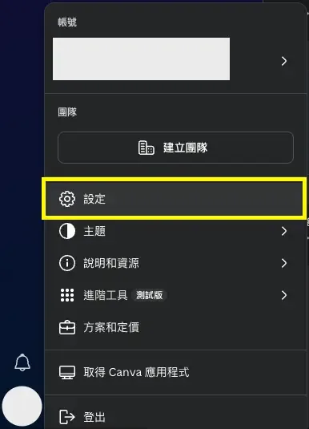

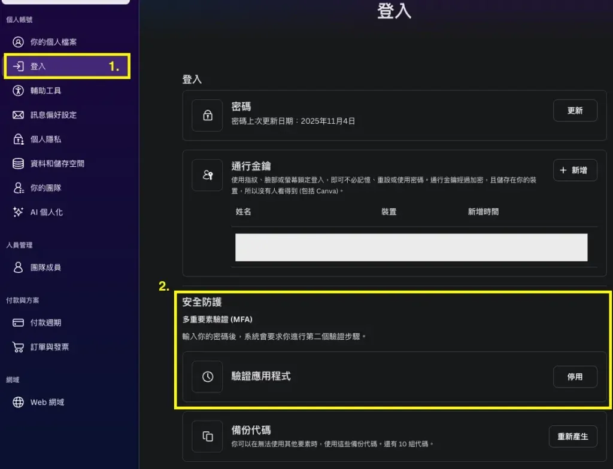

#### 2\. 啟用 MFA 多重要素驗證

1.  在多重要素驗證區塊中，點擊「啟用」按鈕

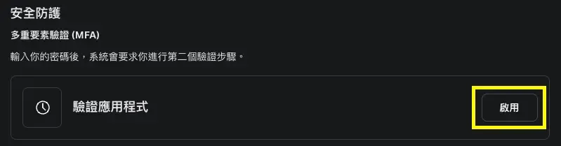

2.  Canva 會顯示一個 QR Code
3.  開啟手機上的 Google Authenticator App
4.  點擊右下角的「+」按鈕
5.  選擇「掃描 QR Code」
6.  對準螢幕上的 QR Code 進行掃描
7.  掃描成功後，App 會新增一組以「`Canva: xxx@xxx`」命名的項目 (xxx@xxx 為你的 Canva 帳號)
8.  App 會顯示一組 6 位數驗證碼
9.  在 Canva 網頁的輸入欄位中填入這組 6 位數驗證碼
10.  點擊「啟用驗證應用程式」按鈕

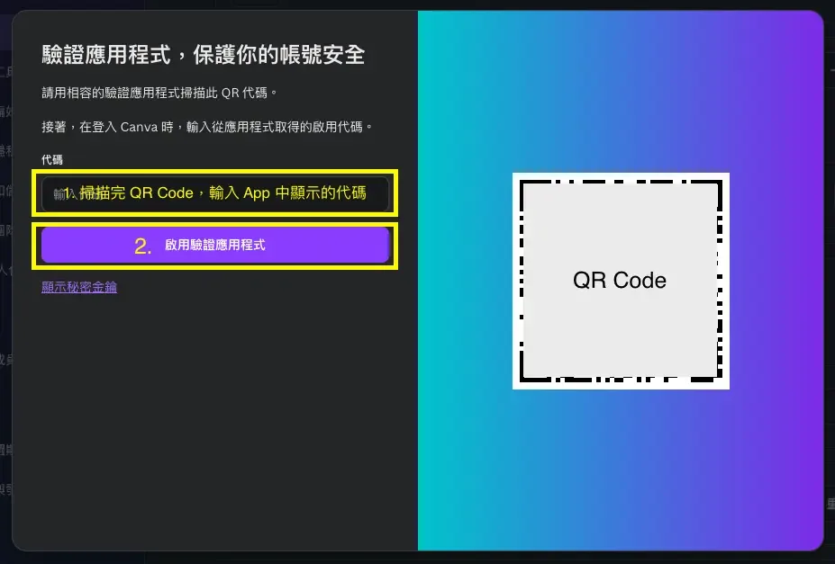

#### 3\. 備份救援代碼

啟用成功後，Canva 會提供一組救援代碼 (Recovery Codes)。

**重要提醒**：

-   請妥善保存這組救援代碼
-   當你無法使用 Google Authenticator 時 (例如手機遺失)，可以使用救援代碼登入
-   這組代碼等同於你的驗證碼，請勿外流或分享給他人
-   建議將救援代碼儲存在密碼管理器中

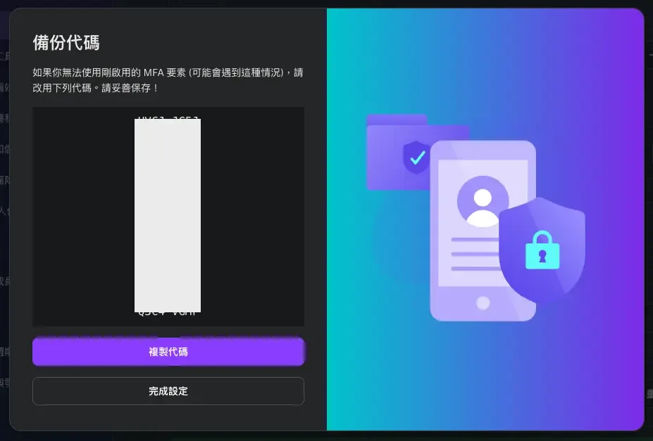

#### 4\. 確認 MFA 已成功啟用

設定完成後，你會看到多重要素驗證狀態顯示為「已啟用」。

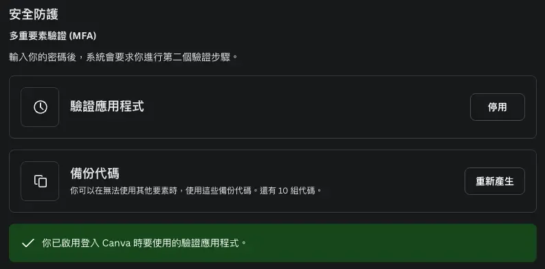

之後每次登入 Canva 時，除了輸入帳號密碼外，還需要開啟 Google Authenticator 取得當下的 6 位數驗證碼。

雖然登入步驟變得稍微麻煩，但為了確保後續 API 授權不會被濫用，這是必要的安全措施。

完成 MFA 設定後，就可以繼續進行 Canva Integration 的建立了！

## 步驟一：建立 Canva Integration

本步驟目的：在 Canva 開發者平台建立 integration 應用程式，取得後續設定所需的 Client ID 和 Secret。

預期完成時間：3-5 分鐘

首先，我們需要在 Canva 開發者平台建立一個 integration 應用程式。

### 操作步驟

1.  前往 [Canva Developers](https://www.canva.com/developers/) 並登入你的 Canva 帳號
2.  登入後，點擊上方導航列的「Your Integrations」選項
3.  點擊「Create an integration」按鈕開始建立新的整合應用

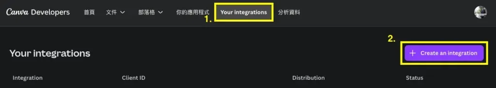

4.  在 Integration type 選擇畫面：
    -   一般用戶只能選擇「Public」選項 (企業用戶可選擇 Private 選項)
    -   勾選「I agree」同意服務條款
    -   點擊「Create integration」完成建立

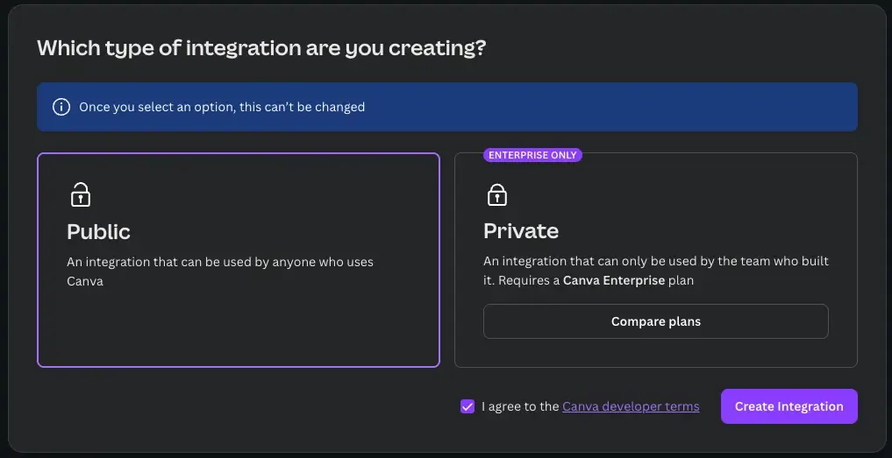

完成後系統會自動導向到你的 integration 設定頁面，接下來進行詳細設定。

## 步驟二：設定 Canva Integration 參數

本步驟目的：設定 integration 的 API 權限範圍、取得 Client ID 和 Secret、配置 OAuth 重定向網址。

預期完成時間：8-10 分鐘

Integration 建立完成後，需要進行三個重要設定：**取得憑證資訊**、**設定 API 權限**、以及**配置重定向網址**。

### 取得 Client ID 和 Secret

1.  在 integration 設定頁面，首先為你的 integration 命名 (建議使用有意義的名稱,例如「n8n Automation」)
2.  向下捲動頁面，你會看到「Authentication」區塊
3.  在這個區塊中會顯示「Client ID」，請先記錄下來
4.  點擊「Generate secret」按鈕產生密鑰，請先記錄下來

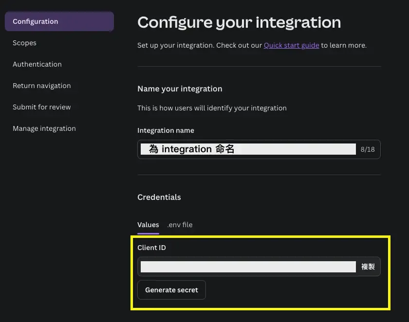

重要提醒：

-   Secret 只會顯示一次，請立即複製並妥善保存
-   如果不小心關閉視窗沒記錄到，可以重新產生新的 secret
-   Secret 是敏感資訊，請勿外流或上傳到公開的程式碼儲存庫

### 設定 API 權限 (Scope)

Scope 決定了你的 integration 能夠存取哪些 Canva 資料和功能。

1.  在設定頁面找到「Scopes」區塊
2.  根據你的需求勾選對應的權限，常見的權限包括：
    -   `design:content:read` - 讀取設計稿內容
    -   `design:content:write` - 修改設計稿內容
    -   `design:meta:read` - 讀取設計稿基本資訊
    -   `design:meta:write` - 修改設計稿基本資訊
3.  以本教學為例，我們開啟：
    -   `design:content:read`
    -   `design:meta:read`

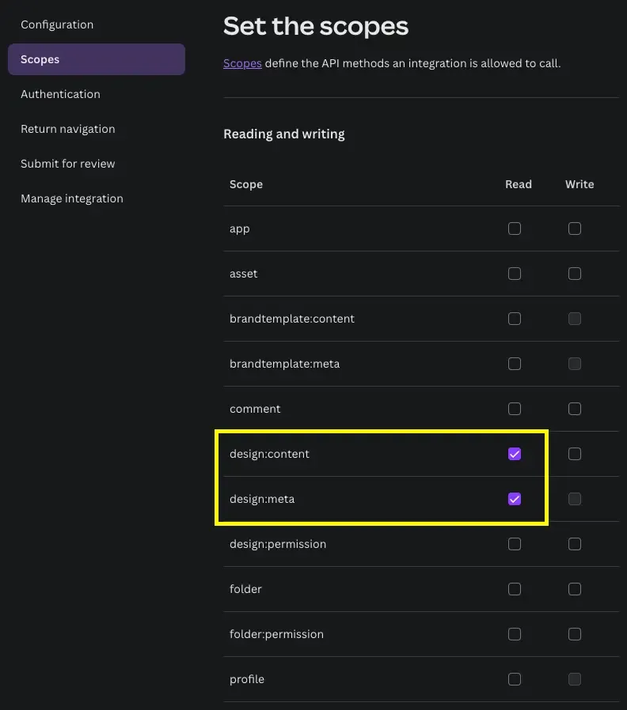

**如何確認需要哪些權限？**

前往 [Canva API Documentation](https://www.canva.dev/docs/connect/api-reference/designs/)，查看你要使用的 API 端點需要什麼權限。

以「List Designs」API 為例：

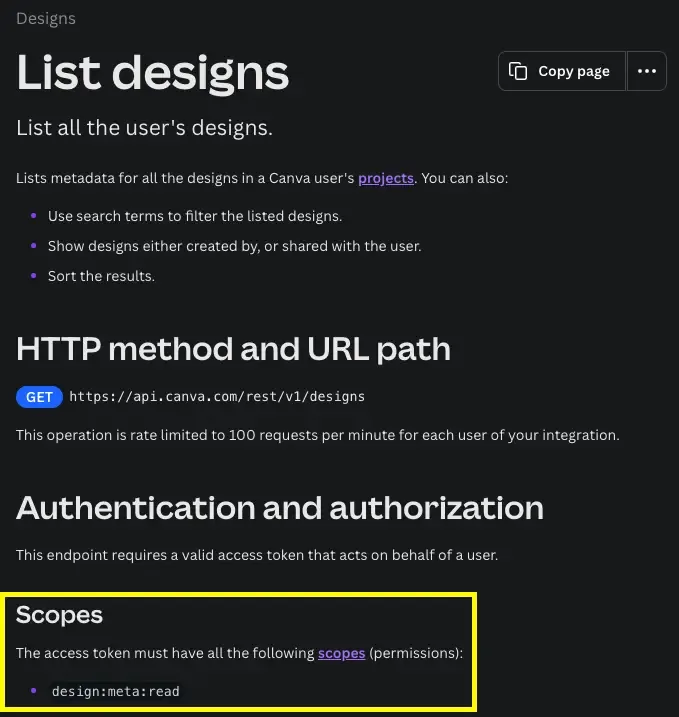

文件會清楚標示該 API 需要的 scope 權限。

### 配置重定向網址

重定向網址 (Redirect URI) 是 OAuth 2.0 授權流程中的關鍵設定，用於授權完成後將使用者導回到你的應用程式。

1.  在設定頁面找到「Redirect URIs」區塊
2.  填入你的 n8n OAuth 回調網址，格式為：`https:///rest/oauth2-credential/callback`

3.  實際範例：
    -   如果你的 n8n 網址是 `https://n8n-test.zeabur.app/`
    -   則填入 `https://n8n-test.zeabur.app/rest/oauth2-credential/callback`

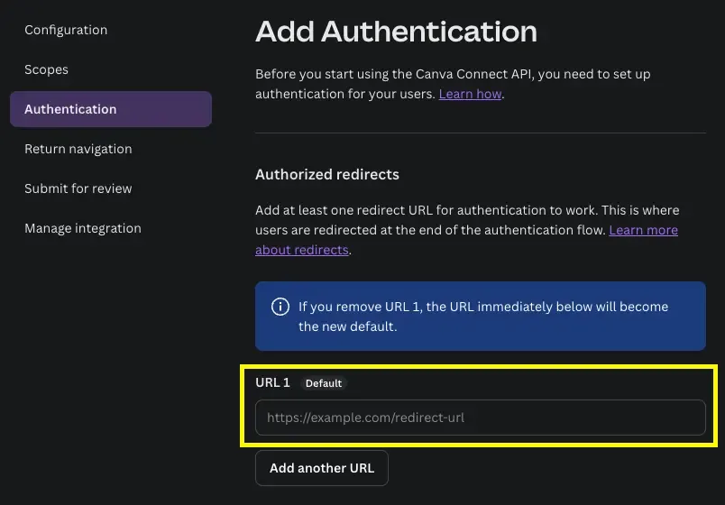

4.  填入重定向網址後，右側會出現「Authorization URL generator」工具
5.  在下拉選單中選擇你剛剛填入的重定向網址
6.  複製下方產生的完整 URL

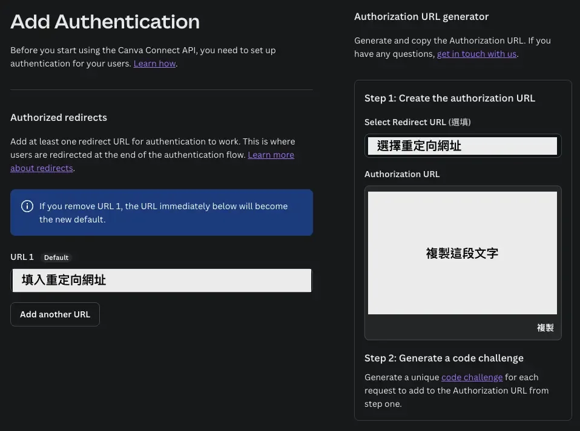

7.  複製的內容應該類似這樣：

```bash
https://www.canva.com/api/oauth/authorize?code_challenge_method=s256&response_type=code&client_id=&redirect_uri=https%3A%2F%2F%2Frest%2Foauth2-credential%2Fcallback&scope=design:content:read%20design:meta:read&code_challenge=
```

8.  從這段 URL 中擷取 scope 資訊：
    -   找到 `scope=design:content:read%20design:meta:read` 這段
    -   將 `%20` 替換成空白字元
    -   移除 `scope=` 前綴
    -   最終得到： `design:content:read design:meta:read`

實測心得：在設定 n8n 連線 Canva 時，若重定向網址少一個 `/` 或多一個空格，都會出現「URI mismatch」錯誤。建議直接複製 n8n 顯示的完整網址，避免手動輸入造成的錯誤。

### 檢查清單

完成步驟二後，你應該已經取得以下三組資料：

-   **Client ID**：`<your-client-id>`
-   **Secret**：`<your-secret>` (請妥善保存)
-   **Scope**`：<your-scope>` (例如：`design:content:read design:meta:read`)

確認都已記錄後，就可以繼續進行下一步。

## 步驟三：在 n8n 建立 OAuth 2.0 憑證

本步驟目的：將 Canva integration 的憑證資訊設定到 n8n，建立 OAuth 2.0 授權連線。

預期完成時間：5-7 分鐘

現在我們要將剛才取得的 Canva 憑證資訊設定到 n8n 中。

### 建立新憑證

1.  登入你的 n8n 平台
2.  點擊左側選單的「Credentials」(憑證) 頁面
3.  點擊右上角的「Create Credential」按鈕
4.  在搜尋框輸入「OAuth2」,找到「OAuth2 API」選項
5.  點擊「Continue」繼續

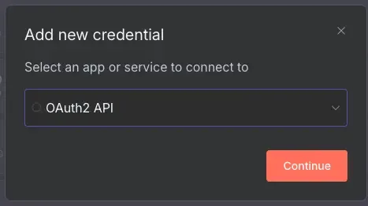

### 填入憑證資訊

在憑證設定頁面依序填入以下資訊：

-   **Grant Type**：`PKCE`
-   **Authorization URL**：`https://www.canva.com/api/oauth/authorize`
-   **Access Token URL**：`https://api.canva.com/rest/v1/oauth/token`
-   **Client ID**：`<your-client-id>`

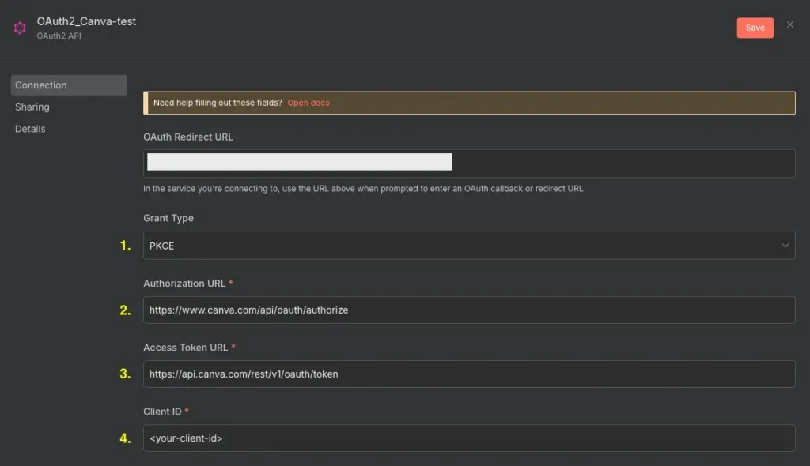

重要提醒：

-   確認「OAuth Redirect URL」欄位顯示的網址，與你在 Canva 設定的重定向網址一致

繼續向下捲動填入剩下的欄位：

-   Client Secret：`<your-secret>`
-   Scope：`<your-scope>`

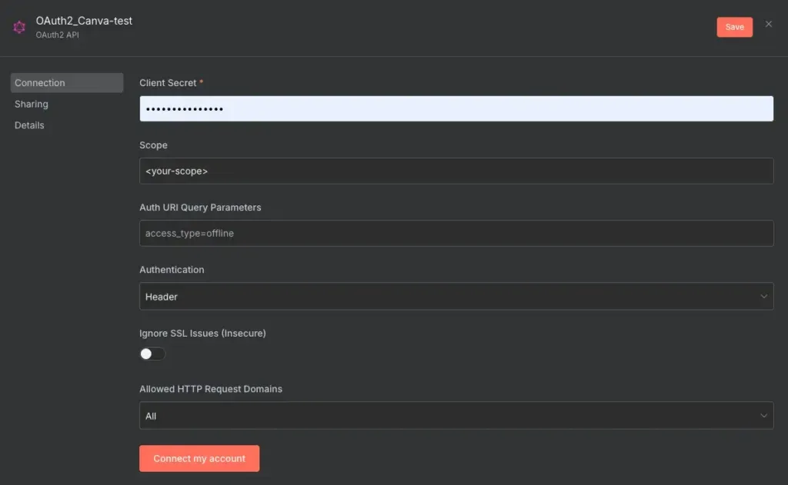

### 授權連接

1.  確認所有資訊都正確填入後，點擊「Connect my account」按鈕
2.  系統會彈出 Canva 授權視窗
3.  在授權視窗中：
    -   確認顯示的權限範圍正確
    -   選擇要授權的 Canva 帳號
    -   點擊「允許」(Allow) 按鈕

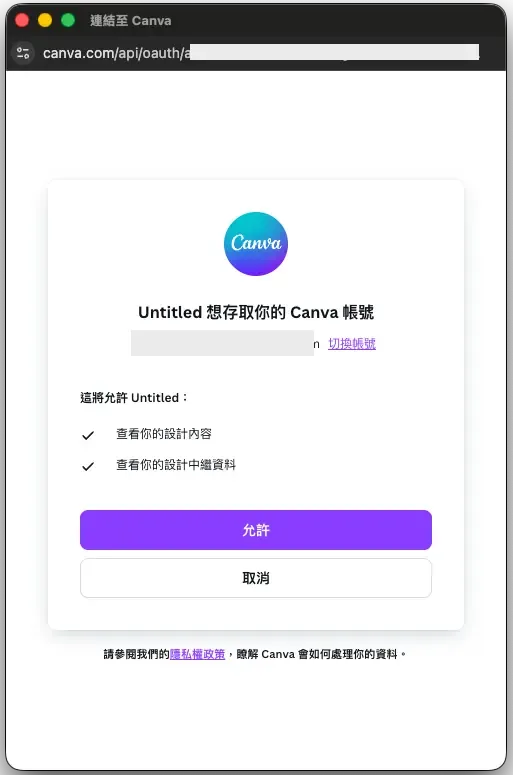

4.  授權成功後，視窗會顯示授權成功
5.  你會看到憑證狀態顯示為「已連接」(Connected)

恭喜你已經成功建立 n8n 的 Canva OAuth 2.0 憑證。

重要提醒：  
如果日後在 Canva integration 修改了 Scope 權限，需要回到這個憑證頁面：

1.  更新 Scope 欄位內容
2.  重新點擊「Connect my account」進行授權
3.  否則 API 呼叫可能會因權限不足而失敗

## 步驟四：測試整合是否成功

本步驟目的：使用 n8n HTTP Request 節點測試 Canva API 連線，確認 OAuth 憑證設定正確且可正常呼叫 API。

預期完成時間：3-5 分鐘

建立憑證後，我們需要測試是否能正常呼叫 Canva API。本節將使用「List Designs」API 作為測試範例。

### 建立測試工作流

1.  在 n8n 中建立一個新的 Workflow (工作流)
2.  新增一個「HTTP Request」節點
3.  在 **HTTP Request** 節點中填入以下設定：
    -   Method：`GET`
    -   URL：`https://api.canva.com/rest/v1/designs`
    -   Authentication：`Generic Credential Type`
    -   Generic Auth Type：`OAuth2 API`
    -   OAuth2 API：`你剛剛建立的 Credential`
    -   Send Query Parameters：`開啟`
    -   Query Parameters：
        -   Name：`query`
        -   Value：`你想要搜尋的設計稿`

完整設定畫面：

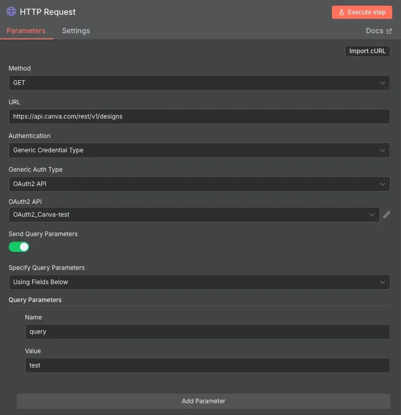

### 執行測試

1.  確認所有設定都正確
2.  點擊節點上的「Execute node」或「Test step」按鈕
3.  等待 API 回應

### 檢查測試結果

如果設定正確你會看到：

成功回應範例：

```json
{
  "items": [
    {
      "id": "DAFxxxxxx",
      "title": "我的海報設計",
      "created_at": "2025-11-06T10:30:00Z",
      "updated_at": "2025-11-06T12:45:00Z",
      "thumbnail": {
        "url": "https://..."
      }
    }
  ],
  "continuation": null
}
```

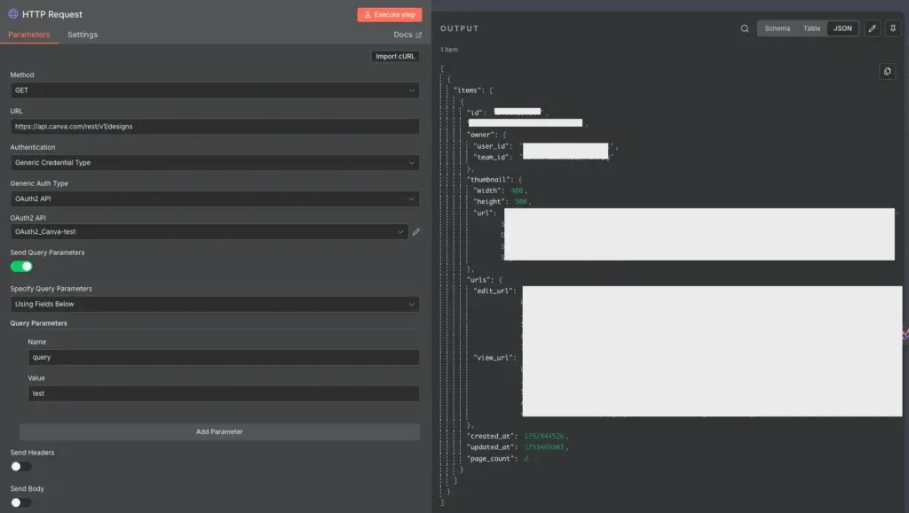

如果看到設計稿清單代表整合成功！

失敗可能的錯誤訊息：

-   `401 Unauthorized` - 憑證未正確授權
-   `403 Forbidden` - Scope 權限不足
-   `404 Not Found` - API 端點網址錯誤

如果遇到錯誤，請參考下方的**故障排除指南**。

## 常見問題 FAQ

**Q1：為什麼 Canva 要求必須開啟 MFA？**

這是 Canva 的安全政策要求。因為 Canva Integrations 可以透過 API 存取和修改你的設計稿，如果沒有 MFA 保護，帳號被盜用時可能會造成資料外洩或遭到惡意修改。開啟 MFA 可以確保只有你本人能夠授權 API 存取。

**Q2：如果手機遺失或無法使用 Google Authenticator 怎麼辦？**

備份救援代碼的原因：  
\- 使用之前備份的救援代碼登入 Canva  
\- 登入後先停用現有的 MFA  
\- 在新手機上重新設定 MFA  
\- 備份新的救援代碼  
  
如果救援代碼也遺失，需要聯絡 Canva 客服協助恢復帳號存取權限。

**Q3：如果忘記記錄 Secret 怎麼辦？**

不用擔心，你可以重新產生新的 secret：  
1\. 回到 Canva Developers 的 integration 設定頁面  
2\. 點擊「Generate secret」產生新的密鑰  
3\. 舊的 secret 會立即失效  
4\. 記得同步更新 n8n 憑證設定中的 Client Secret

**Q4：Scope 該如何選擇？**

Scope 應該根據你的實際需求選擇：  
\- 只需要讀取設計稿**資訊**：選擇 `design:meta:read`  
\- 需要讀取設計稿**內容**：選擇 `design:content:read`  
\- 需要**建立**或**修改設計稿**：選擇對應的 `write` 權限  
  
原則：選擇最小必要權限，提高安全性。

**Q5：授權失敗該如何處理？**

常見原因和解決方法：  
1\. **重定向網址設定錯誤**：檢查 Canva 和 n8n 兩邊的重定向網址是否完全一致；注意不要多加或少加斜線 `/`  
2\. **Client ID 或 Secret 複製錯誤**：重新複製貼上，確保沒有多餘的空白字元  
3\. **Scope 格式錯誤**：確認 scope 之間用空白字元分隔不是 `%20`

**Q6：能否在多個 n8n 專案使用同一組憑證？**

可以，但需要注意：  
\- 同一個 n8n 實例內的不同工作流可以共用憑證  
\- 不同的 n8n 實例需要分別設定憑證  
\- **建議為不同用途建立不同的 Canva integration，方便管理和追蹤使用情況**

**Q7：Canva 免費帳號可以使用 API 嗎？**

可以！Canva 免費帳號一樣能建立 integration 和使用 API。但需注意**某些進階功能可能需要付費方案才能使用**

**Q8：為什麼我的 API 請求回傳空陣列？**

可能原因：  
\- 搜尋條件過於嚴格，沒有符合的設計稿  
\- 授權的 Canva 帳號中沒有設計稿  
\- Scope 權限不足，無法讀取設計稿資訊  
  
建議移除 query 參數測試，看是否能列出所有設計稿。

## 故障排除指南

### 問題：點擊「Connect my account」沒有反應

可能原因及解決方法：

1.  瀏覽器阻擋彈出視窗
    -   檢查瀏覽器的彈出視窗設定
    -   允許 n8n 網站顯示彈出視窗
2.  網路連線問題
    -   確認網路連線正常
    -   嘗試重新整理頁面

### 問題：授權後顯示「Redirect URI mismatch」錯誤

這表示重定向網址不匹配，解決步驟：

1.  檢查 n8n 憑證頁面顯示的「OAuth Redirect URL」
2.  確認這個網址有完整新增到 Canva integration 的 Redirect URIs 中
3.  兩邊的網址必須完全一致 (包括 http/https、網域、路徑)
4.  修改後重新授權

### 問題：API 請求回傳 401 Unauthorized

可能原因：

1.  **憑證授權已過期**：重新點擊「Connect my account」授權
2.  **Client ID 或 Secret 錯誤**：重新檢查並更新憑證資訊
3.  **使用了錯誤的憑證**：確認 HTTP Request 節點選擇的是正確的憑證

### 問題：API 請求回傳 403 Forbidden

這表示權限不足，解決步驟：

1.  檢查 API 文件，確認需要哪些 scope
2.  回到 Canva integration 設定，開啟對應的 scope
3.  更新 n8n 憑證的 Scope 欄位
4.  重新授權 (點擊「`Connect my account`」)

### 問題：n8n 無法連接到 Canva

可能原因：

1.  n8n 實例的網路無法連接到 Canva API
    -   檢查防火牆設定
    -   確認 n8n 可以對外連線
2.  Authorization URL 或 Access Token URL 填寫錯誤
    -   重新檢查網址是否正確

## 下一步：實際應用教學

本文為「n8n x Canva 自動化系列」第一篇，後續文章將陸續推出：

-   ✅ 【本篇】OAuth 2.0 憑證設定步驟
-   🔜 LINE 指令匯出到 WordPress
-   🔜 定期社群貼文自動化

完成憑證設定後，你就可以開始打造各種自動化工作流了！

### 重要提醒：Canva API 功能範圍

本教學系列聚焦在一般用戶（免費/Pro）可使用的 API 功能，主要是 Export API（匯出設計稿）。

**可行**的自動化模式：

-   手動在 Canva 建立/編輯設計 → API 自動匯出 → 發布到其他平台
-   定期自動匯出特定設計稿
-   批次匯出多個設計到雲端儲存

**不可行**的操作（需要 `Enterprise` 方案）：

-   從資料自動生成設計內容（需要 `Autofill API`）
-   自動填充模板內容

### 進階 Canva API 功能

想深入了解 Canva API？推薦閱讀：

-   [Canva Export API 文件](https://www.canva.dev/docs/connect/api-reference/exports/) - 了解匯出選項和限制
-   [Canva List Designs API](https://www.canva.dev/docs/connect/api-reference/designs/) - 學習如何列出和管理設計稿

### Enterprise 用戶專屬功能

如果你是 Canva Enterprise 用戶，可以使用更強大的 Autofill API：

-   從資料自動填充品牌模板
-   批次生成證書、邀請函等客製化文件
-   整合 CRM、資料庫自動產生行銷素材

如果你有企業帳號、或想探索更高階的自動設計整合，可以試著自己串接 Autofill API。

若你希望我幫你一起研究更完整的 n8n Canva 自動化流程，也非常歡迎聯絡我，我可以幫你規劃最適合的實作方式。

### 想看其他應用？

如果你有特定的自動化需求，或想看到其他應用教學，歡迎在留言區告訴我！你的建議可能會成為下一篇教學文章。

## 總結

本文完整介紹了如何在 n8n 中設定 Canva OAuth 2.0 憑證，從開啟 MFA 多重要素驗證、建立 Canva integration、設定 API 權限、配置重定向網址、到在 n8n 中建立並測試憑證。只要按照步驟操作，大約 20-25 分鐘就能完成設定。

重點回顧：

1.  開啟 Canva 帳號的多重要素驗證 (MFA)，並備份救援代碼
2.  在 Canva Developers 建立 Public integration
3.  取得 Client ID、Secret，並設定正確的 Scope
4.  設定重定向網址為 `https://<your.n8n.url>/rest/oauth2-credential/callback`
5.  在 n8n 建立 OAuth2 API 憑證，選擇 PKCE grant type
6.  使用 HTTP Request 節點測試 API 連接

現在你已經準備好開始建立 n8n x Canva 的自動化工作流了！如果在設定過程中遇到任何問題，歡迎參考上方的**常見問題**和**故障排除指南**。

恭喜你完成 n8n Canva OAuth 整合！

接下來別錯過《LINE 指令自動匯出 Canva 設計稿到 WordPress》實戰篇！

在 LINE 傳送指令，n8n 自動將你在 Canva 編輯好的設計匯出並發布到 WordPress 網站。

你想要看到哪些 n8n x Canva 自動化應用？歡迎在留言區告訴我！

## 參考資料

### 官方文件

-   [Canva Developers 官方網站](https://www.canva.com/developers/)
-   [Canva 設定多重要素驗證 (MFA)](https://www.canva.com/help/login-verification/)
-   [Canva Integration Prerequisites](https://www.canva.dev/docs/connect/quickstart/#prerequisites)
-   [n8n OAuth2 憑證說明文件](https://docs.n8n.io/integrations/builtin/credentials/httprequest/#using-oauth2)

### 安全工具

-   [Google Authenticator](https://support.google.com/accounts/answer/1066447?hl=zh-Hant) - 多重要素驗證 App

### 影片教學

-   [Set Up Canva in N8N (Easy Guide)](https://www.youtube.com/watch?v=jPZuhfMssWM) - 6 分鐘快速設定教學

### 測試工具

-   [Postman](https://www.postman.com/) - 測試 API 的好工具
-   [JWT.io](https://jwt.io/) - 解析 OAuth token 內容
