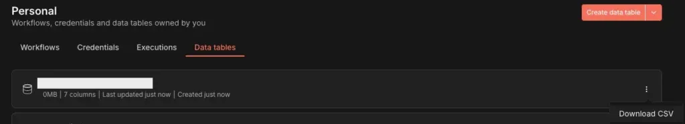
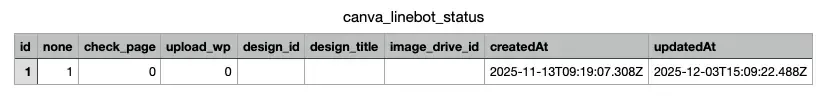
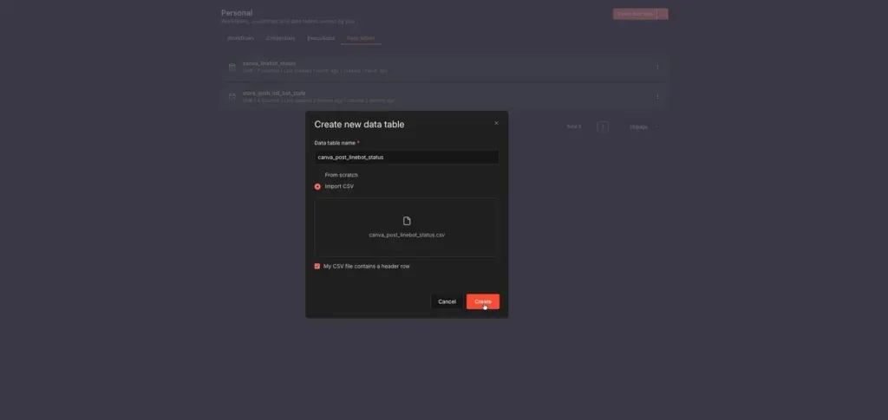
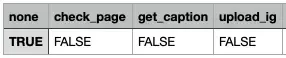

## 前言

今天在建立新的 n8n 工作流程時，我發現了一個讓我興奮的更新：Data Table 終於支援 CSV 匯出與匯入功能了！

身為長期使用 n8n 並分享模板的開發者，我深知過去在分享包含 Data Table 的模板時有多麻煩。接收模板的人需要手動建立相同結構的資料表，不僅耗時也容易出錯。這次的更新直接解決了這個痛點。

## 版本需求

要使用 Data Table 的 CSV 匯出匯入功能，請確保你的 n8n 版本至少為 [1.122.2](https://github.com/n8n-io/n8n/releases/tag/n8n%401.122.2) 或更新版本。

如果你是自架 n8n，可以透過以下方式更新：

-   Docker：更新 image tag 至 `n8nio/n8n:1.122.2` 或 `n8nio/n8n:latest`
-   npm：執行 `npm update -g n8n`

## 我的實測結果

發現這個功能後，我馬上進行了測試。以下是我實際操作後整理出的心得與注意事項。

### 匯出功能

在 Data Table 介面中，現在可以直接將整個資料表匯出成 CSV 檔案。點擊資料表右側的選單，就能看到「Download CSV」選項。

匯出的 CSV 檔案會包含所有欄位定義和資料內容，包括系統自動產生的 `id`、`createdAt`、`updatedAt` 欄位。

### 匯入功能

點擊右上角的「Create data table」按鈕，在彈出的視窗中選擇「Import CSV」，就能上傳 CSV 檔案來建立新的 Data Table。

這個功能對於需要批次建立資料或是從其他來源遷移資料的情境特別實用。

## 使用方式與注意事項

### 最快的建立方式

經過多次測試，我發現最有效率的建立流程如下：

1.  先匯出一個現有的 Data Table 作為範本
2.  用 Excel 或 Google Sheets 開啟 CSV 檔案
3.  根據你需要的欄位結構進行修改
4.  刪除系統預設欄位後儲存並匯入

### 必須刪除的系統欄位（實測踩雷經驗）

在我第一次嘗試匯入時就遇到了問題。經過排查後發現，有三個欄位是 Data Table 的系統預設欄位，匯入時必須刪除，否則會導致匯入失敗：

欄位名稱

說明

處理方式

`id`

資料列的唯一識別碼

刪除整欄

`createdAt`

資料建立時間

刪除整欄

`updatedAt`

資料更新時間

刪除整欄

這些欄位會在匯入後由系統自動產生，不需要手動填寫。如果你匯入失敗，第一步就是檢查是否有遺漏刪除這些欄位。

### 資料型態自動辨識機制

n8n 會根據 CSV 檔案中第一行資料的內容來自動判斷欄位的資料型態。以下是我測試後整理的各種型態觸發方式：

資料型態

觸發方式

範例值

Boolean

輸入 `TRUE` 或 `FALSE`（大寫）

TRUE

Number

輸入任意數字

123

String

輸入任意文字

Hello

DateTime

輸入日期時間格式

2025-12-09 10:30:00

下圖是準備匯入的 CSV 範例，可以看到第一行資料使用 `TRUE` 和 `FALSE` 來觸發 Boolean 型態：

## 對模板分享的實際影響

這個功能更新對於 n8n 社群的模板分享生態有很大的幫助：

-   模板製作者可以將工作流程 JSON 檔案搭配 Data Table 的 CSV 檔案一起提供
-   使用者只需要匯入 CSV 檔案就能快速建立相同結構的資料表
-   大幅降低使用門檻，讓更多人能順利使用包含 Data Table 的模板

以我之前分享的「探店心願助手」模板為例，原本需要附上 Excel 範本讓使用者手動建立 Google Sheet。現在如果有使用 Data Table 的模板，直接附上 CSV 檔案就能讓對方一鍵匯入，方便程度大大提升。

## 常見問題排解

根據我的測試經驗，整理出以下常見問題：

**Q1：匯入後資料型態不正確怎麼辦？**

檢查 CSV 第一行資料的格式是否正確觸發對應的資料型態。

**Q2：匯入失敗但沒有明確錯誤訊息？**

優先檢查是否有刪除 `id`、`createdAt`、`updatedAt` 這三個系統欄位。

**Q3：可以匯入空的 CSV 只建立欄位結構嗎？**

可以，但至少需要一行資料來讓系統辨識欄位型態，匯入後再手動刪除該行即可。

## 結語

Data Table 的 CSV 匯出匯入功能雖然看似是個小更新，但對於經常分享或使用 n8n 模板的人來說，絕對是一個實用的改進。以後分享模板時，記得把 Data Table 的 CSV 檔案也附上，讓其他人能更輕鬆地開始使用你的工作流程！

如果你在使用上有任何問題，歡迎到 [Threads](https://www.threads.com/@frankchen.tw) 或是 [IG](https://www.instagram.com/frankchen.tw/) 私訊我討論。

## 參考資源

-   [n8n 官方文件](https://docs.n8n.io/)
-   [n8n Community](https://community.n8n.io/)

## 延伸閱讀

-   [n8n 整合 Line 完整教學：Line Bot 設定、憑證設定、節點介紹](https://www.frankchen.tw/n8n-line-api-integration-tutorial/)
-   [n8n 整合 Canva 完整教學：OAuth 2.0 憑證設定與測試指南](https://www.frankchen.tw/n8n-canva-oauth-setup/)
-   [【2025 最新】n8n 自動化 上傳 Instagram 完全指南：從取得 Token 到排程發文](https://www.frankchen.tw/n8n-instagram-access-token/)
