## 前言：用 n8n 打造 Discord Bot，不用寫半行程式碼

Discord Bot 是社群經營的利器。自動歡迎新成員、定時發送公告、監控系統狀態即時通知，這些功能過去需要用 Python 或 JavaScript 開發，對非工程師來說門檻太高。

n8n 改變了這件事。透過這個開源的低代碼自動化工具，你可以用拖拉點選的方式建立 Discord Bot，不需要寫任何程式碼。相較於 Zapier、Make 等付費工具，n8n 可以自架、完全免費，功能也更彈性。

這篇教學會帶你從零開始，完成 n8n Discord Bot 的完整設定。從 Discord Developer Portal 建立應用程式、OAuth 2.0 授權、權限配置，到發送第一則訊息，每個步驟都有截圖說明。

Discord Bot 的設定確實比 Telegram 複雜一些，但只要照著步驟走，30 分鐘內就能完成。

## Discord Bot 是什麼？n8n 如何實現自動化整合

### 什麼是 Discord Bot？

Discord Bot 是 Discord 平台上的自動化帳號，可以執行各種任務：發送訊息、管理成員、回應指令、播放音樂等。Discord Bot 功能非常豐富，是社群管理和自動化的利器。

**Discord Bot 的特點：**

-   **權限精細控制**：可以設定 Bot 能做什麼、不能做什麼
-   **Slash Commands**：支援 `/` 開頭的指令（例如：`/help`、`/status`）
-   **Embed 訊息**：可以發送美觀的嵌入式訊息（包含圖片、連結、欄位等）
-   **Reaction 互動**：可以新增和監聽表情符號反應
-   **支援語音**：進階 Bot 可以加入語音頻道（需要額外設定）

### Discord Bot 在 n8n 中的應用場景

透過 n8n 整合 Discord Bot，你可以實現：

-   **通知類應用：**
    -   工作流程執行狀態推播到 Discord 頻道
    -   系統監控警報（伺服器負載、錯誤日誌）
    -   定時推播資訊（每日摘要、專案進度）
-   **社群管理類應用：**
    -   自動歡迎新成員加入
    -   定期發布公告或活動通知
    -   自動整理頻道（刪除舊訊息、歸檔討論串）
-   **資訊查詢類應用：**
    -   查詢專案狀態或資料庫資訊
    -   與 AI 整合，打造智慧型問答機器人

### Discord Bot vs Webhook：該選哪一個？

Discord 提供兩種方式讓外部工具發送訊息：

| 特性 | Discord Bot | Discord Webhook |
| --- | --- | --- |
| 設定難度 | ⭐⭐⭐⭐（需要 OAuth 設定） | ⭐（超簡單） |
| 訊息發送 | ✅ 可以 | ✅ 可以 |
| 讀取訊息 | ✅ 可以 | ❌ 不行 |
| 管理伺服器 | ✅ 可以 | ❌ 不行 |
| 互動功能 | ✅ 完整支援 | ⚠️ 有限 |
| 適合場景 | 需要雙向互動、管理功能 | 單純發送通知 |

**建議：**

-   如果只是要發送通知，Webhook 就夠了
-   如果需要讀取訊息、管理成員、互動功能，就需要 Bot

這篇教學專注在 Discord Bot 的設定，Webhook 的設定較簡單，會在文章最後簡單說明。

## 步驟一：在 Discord Developer Portal 建立應用程式

Discord Bot 的設定分為三個主要階段，讓我們一步步完成。

### 1.1 前往 Discord Developer Portal

1.  開啟瀏覽器，前往 [Discord Developer Portal](https://discord.com/developers/applications)
2.  使用你的 Discord 帳號登入
3.  點擊右上角的「New Application」（新增應用程式）
4.  輸入應用程式名稱（例如：`n8n 自動化 Bot`）
5.  勾選同意服務條款
6.  點擊「Create」

應用程式建立成功後，你會進入設定頁面。

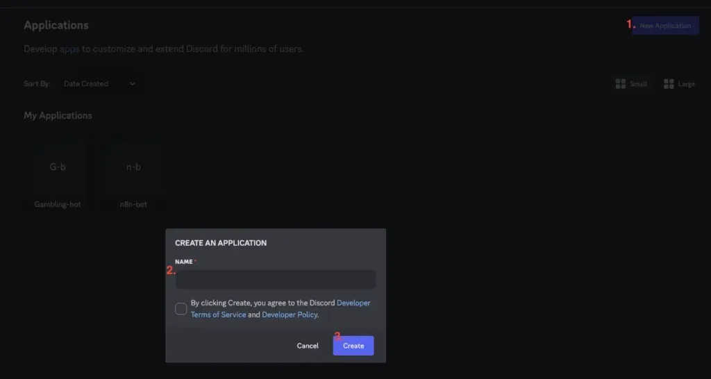

### 1.2 設定 Installation 參數

點擊左側的「Installation」分頁，進行以下設定：

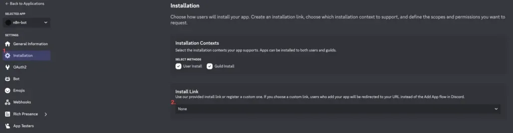

**重要設定：**

1.  找到「Install Link」欄位
2.  將下拉選單改為「None」
3.  點擊下方的「Save Changes」儲存設定

這個設定是為了避免讓其他人可以安裝你的 Bot。

### 1.3 設定 Bot 參數

點擊左側的「Bot」分頁，進行以下設定：

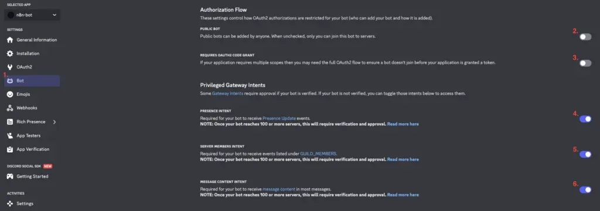

**重要設定：**

1.  **Authorization Flow（授權流程）**：
    -   找到這個區塊
    -   將兩個選項都「關閉」（PUBLIC BOT、REQUIRES OAUTH2 CODE GRANT）
2.  **Privileged Gateway Intents（特權閘道意圖）**：
    -   找到這個區塊
    -   將三個選項都「開啟」：
        -   PRESENCE INTENT
        -   SERVER MEMBERS INTENT
        -   MESSAGE CONTENT INTENT

設定完成後，記得點擊下方的「Save Changes」儲存設定。

**為什麼需要開啟這些權限？**

-   這些權限讓 Bot 能夠讀取訊息內容、成員資訊等
-   如果不開啟，Bot 可能無法正常運作

## 步驟二：設定 OAuth 2.0 授權與 Bot 權限

這是最關鍵也最複雜的一步，請仔細跟著操作。

### 2.1 在 n8n 取得 OAuth Redirect URL

在設定 Discord 之前，我們需要先從 n8n 取得 Redirect URL。

1.  回到 n8n 平台
2.  點擊「Credentials」→「Add Credential」
3.  搜尋並選擇「Discord」
4.  在憑證設定頁面中，你會看到「OAuth Redirect URL」欄位
5.  複製這個 URL

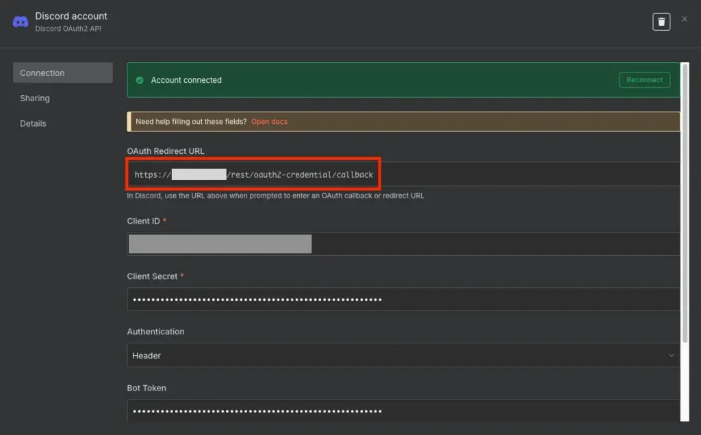

**OAuth Redirect URL 範例：**

```
https://your-n8n-domain.com/rest/oauth2-credential/callback
```

### 2.2 設定 OAuth Redirects 與 Scopes

回到 Discord Developer Portal，點擊左側的「OAuth2」→「General」分頁：

1.  找到「Redirects」區塊
2.  點擊「Add Redirect」
3.  將剛剛複製的 n8n Redirect URL 貼上
4.  點擊「Save Changes」儲存

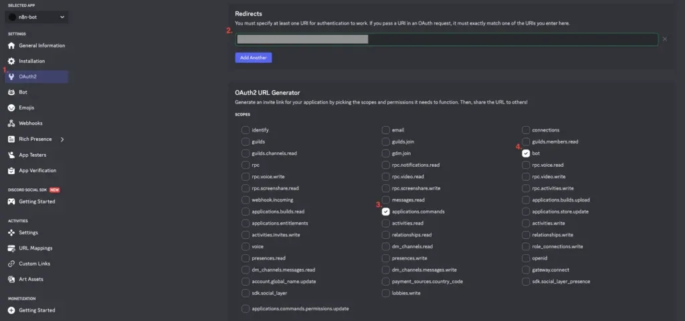

接著向下捲動到「Default Authorization Link」區塊，在「Scopes」中勾選：

-   `applications.commands`（應用程式指令）
-   `bot`（機器人）

### 2.3 設定 Bot 權限

勾選「bot」後，下方會出現「Bot Permissions」區塊。

**簡單方式：勾選「Administrator」**

-   這會給予 Bot 完整的伺服器管理權限
-   適合個人測試或小型社群

**進階方式：只勾選需要的權限（最小權限原則）**

-   Send Messages（發送訊息）
-   Embed Links（嵌入連結）
-   Attach Files（附加檔案）
-   Read Message History（讀取訊息歷史）
-   Add Reactions（新增表情符號反應）

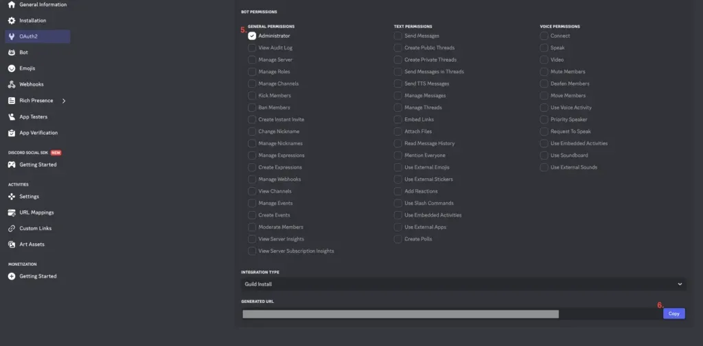

設定完成後，最底下會產生一個「Generated URL」。

### 2.4 使用 Generated URL 將 Bot 加入伺服器

1.  複製頁面最底下的「Generated URL」
2.  在瀏覽器開啟這個網址
3.  選擇你要加入 Bot 的 Discord 伺服器
4.  確認權限後，點擊「授權」
5.  完成人機驗證

Bot 現在已經加入你的 Discord 伺服器了！你可以在成員列表中看到它（通常會顯示為離線狀態，因為還沒有啟動）。

## 步驟三：取得 Client ID、Secret 與 Bot Token

n8n 需要三組金鑰才能操作 Discord Bot，讓我們依序取得。

### 3.1 取得 Client ID

1.  回到 Discord Developer Portal
2.  點擊左側的「OAuth2」→「General」
3.  在頁面頂部找到「Client ID」
4.  點擊「Copy」複製

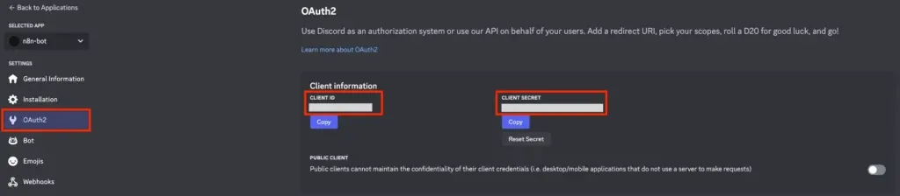

### 3.2 取得 Client Secret

在同一個頁面：

1.  找到「Client Secret」區塊
2.  如果沒有顯示，點擊「Reset Secret」重新產生
3.  點擊「Copy」複製
4.  **重要：這組密鑰只會顯示一次，請立即儲存**

### 3.3 取得 Bot Token

1.  點擊左側的「Bot」分頁
2.  找到「Token」區塊
3.  如果沒有顯示，點擊「Reset Token」重新產生
4.  點擊「Copy」複製
5.  **重要：這組 Token 只會顯示一次，請立即儲存**

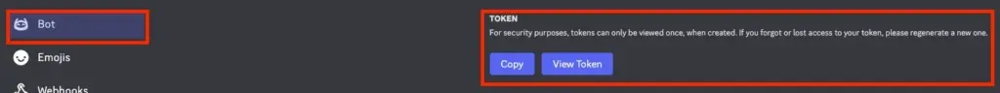

**安全提醒：**

-   這三組金鑰都非常重要，千萬不可公開或分享
-   如果不小心外洩，請立即回到 Discord Developer Portal 重新產生

## 步驟四：在 n8n 完成 Discord 憑證設定

現在我們已經取得所有必要的金鑰，回到 n8n 的 Discord 憑證設定頁面完成設定。

1.  填入三個欄位：

-   **Client ID**：貼上剛剛複製的 Client ID
-   **Client Secret**：貼上剛剛複製的 Client Secret
-   **Bot Token**：貼上剛剛複製的 Bot Token

1.  點擊「Connect my account」按鈕
2.  系統會開啟 Discord 授權頁面，選擇你的伺服器並點擊「授權」
3.  完成授權後，系統會自動跳回 n8n，看到「Connected」或綠色勾勾表示連接成功
4.  點擊右上角的「Save」儲存憑證


建議為憑證命名，方便日後管理：

-   `Discord - 個人伺服器`
-   `Discord - 團隊社群 Bot`

## 步驟五：測試發送第一則訊息

設定完憑證後，讓我們測試一下是否能成功發送訊息。

1.  建立新的 Workflow
2.  加入「Manual Trigger」節點
3.  加入 Discord 的「Send a message」節點

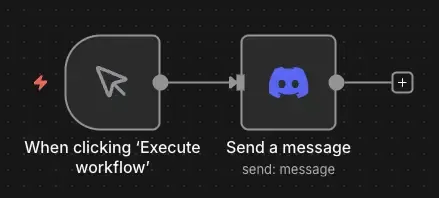

在 Discord 節點中設定：

1.  **Connection Type**：選擇「OAuth2」
2.  **Credential**：選擇剛剛建立的 Discord 憑證
3.  **Resource**：Message
4.  **Operation**：Send
5.  **Server**：From list，選擇你的伺服器
6.  **Send To**：Channel
7.  **Channel**：From list，選擇目標頻道
8.  **Message**：輸入測試訊息，例如「這是一則測試訊息」

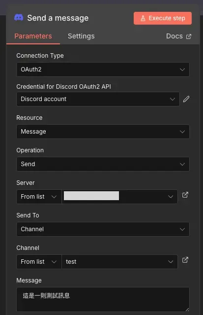

點擊「Execute step」執行。如果設定正確，右側會顯示 OUTPUT 回應，Discord 頻道也會收到訊息。

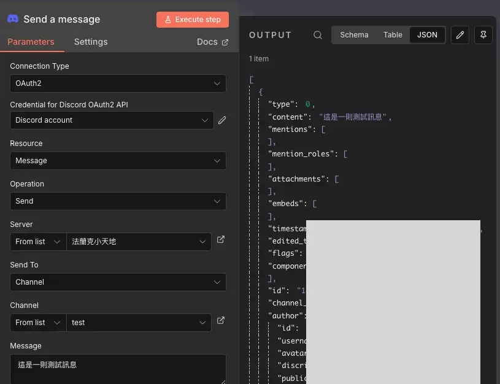

**如果出現錯誤，請檢查：**

-   Bot 是否已經加入伺服器
-   Bot 是否有發送訊息的權限

## 進階功能：Embed 訊息與 Webhook

了解 Discord 的特色功能，能讓你打造更豐富的自動化應用。

### Embed 訊息：讓通知更美觀

純文字訊息有時太單調，Discord 的 Embed 訊息可以包含標題、描述、顏色、時間戳記等，讓通知更專業。

n8n 的 Discord 節點內建 Embeds 設定，在節點下方找到「Embeds」區塊，選擇「Enter Fields」就能直接填寫欄位，不需要手動寫 JSON。

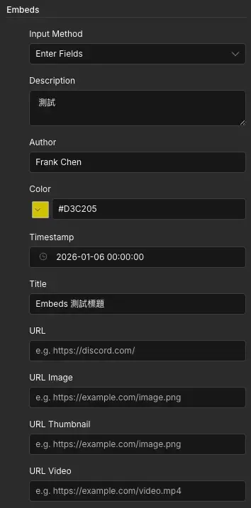

常用欄位說明：

-   **Title**：Embed 標題
-   **Description**：訊息內容
-   **Author**：顯示在標題上方的作者名稱
-   **Color**：左側色條顏色（支援 HEX 色碼）
-   **Timestamp**：訊息時間戳記

發送後，Discord 會顯示格式化的 Embed 訊息：

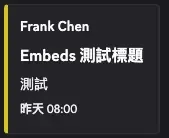

### Reaction 反應：新增表情符號

Bot 可以對訊息新增表情符號反應（例如：✅、❌、👍），常用於投票、確認通知已讀、或標記訊息狀態。

這裡用一個簡單的範例示範。當「Send Message」節點執行成功後，Discord 會回傳該訊息的 Message ID，我們可以把這組 ID 傳給下一個「Reaction」節點，對剛發送的訊息加上反應：

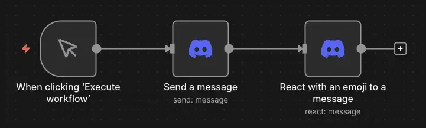

在 Reaction 節點中設定：

1.  **Resource**：選擇「Reaction」
2.  **Operation**：選擇「Add」
3.  **Channel**：選擇目標頻道
4.  **Message ID**：從前一個 Send Message 節點拖曳取得
5.  **Emoji**：輸入表情符號（例如：✅、👍、🎉）

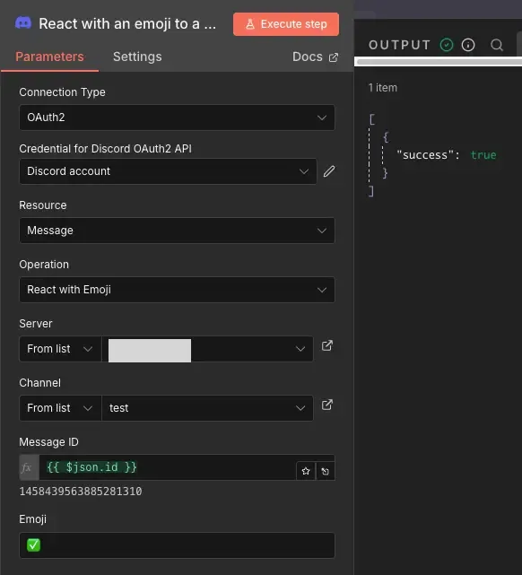

執行後，Discord 頻道中的訊息就會自動帶上 Bot 的表情符號反應：

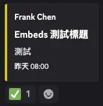

### Webhook vs Bot 的快速比較

如果你只是想發送通知，Discord Webhook 設定更簡單：

**Webhook 設定步驟：**

1.  在 Discord 頻道設定中，找到「整合」→「Webhook」
2.  建立新的 Webhook
3.  複製 Webhook URL
4.  在 n8n 中使用「HTTP Request」節點發送訊息

Webhook 的限制：

-   只能發送訊息，無法讀取
-   無法管理伺服器或成員
-   互動功能有限

## 實戰應用案例

設定好 Discord 憑證後，可以實現哪些自動化應用呢？以下分享兩個簡單的實用案例。

### 案例 1：n8n 工作流程狀態推播

**應用場景：**  
你有多個定期執行的 n8n 工作流程，希望每次執行結果都推播到 Discord 頻道，方便團隊追蹤。

**工作流程設計（簡化版）：**

1.  你的主要工作流程
2.  使用「IF」節點判斷執行結果
3.  成功：發送綠色 Embed 訊息到 Discord
4.  失敗：發送紅色 Embed 訊息，並標註 @管理員

**適用情境：**  
團隊協作、專案監控、系統運維

### 案例 2：定期發布社群公告

**應用場景：**  
你管理一個 Discord 遊戲社群，每週五晚上 8 點要發布週末活動公告。

**工作流程設計（簡化版）：**

1.  使用「Schedule Trigger」（每週五 20:00 執行）
2.  從 Notion 或 Google Sheet 讀取活動資訊
3.  使用「Code」節點生成 Embed 訊息格式
4.  發送到 Discord 公告頻道

**適用情境：**  
社群管理、活動通知、定期推播

## Discord Bot 常見問題

**Q1: Bot 無法發送訊息到頻道怎麼辦？**

通常是權限問題。請確認 Bot 已加入伺服器、擁有發送訊息權限、頻道允許發言，以及頻道 ID 正確。

**Q2: 如何讓 Bot 在多個伺服器運作？**

使用 Generated URL 為每個伺服器執行授權流程，並在 n8n 中使用對應的頻道 ID 即可。

**Q3: OAuth 授權失敗怎麼辦？**

常見原因包括 Redirect URL 設定錯誤、憑證複製錯誤、權限不正確等。建議重新檢查設定並重新產生金鑰。

**Q4: 如何讓 Bot 回應用戶的訊息？**

需使用 Webhook Trigger 或 Polling 方式監聽訊息，屬於進階功能。

**Q5: Discord Bot 有速率限制嗎？**

有，每個頻道每秒最多 5 則訊息。超過會收到 429 錯誤，建議在工作流中加入延遲節點。

### 總結與下一步

恭喜你完成 n8n x Discord Bot 的憑證設定！現在你已經可以：

-   建立自己的 Discord Bot
-   透過 n8n 發送訊息到 Discord 頻道
-   設定 Bot 的權限和 OAuth 授權
-   實現工作流程通知和社群管理自動化

### 建議的學習路徑

1.  **先從簡單開始**：試著用 n8n 發送測試訊息，熟悉 Discord 節點
2.  **實作通知流程**：為重要的工作流程加入 Discord 通知
3.  **探索 Embed 訊息**：嘗試建立美觀的嵌入式訊息
4.  **挑戰進階功能**：學習 Reaction、Slash Commands、雙向互動

## 延伸閱讀

想了解更多 n8n 自動化應用嗎？推薦你閱讀以下文章：

-   [LINE、Discord、Telegram 通知機器人怎麼選？n8n 完整比較與實戰建議](/n8n-line-discord-telegram-bot-comparison/)
-   [n8n x Telegram Bot 打造專屬通知機器人：從 BotFather 到互動指令完全教學](/n8n-telegram-bot-notification-tutorial/)
-   [n8n x Notion 完整攻略：從憑證設定到 Database 操作實戰](/n8n-notion-api-integration-tutorial/)
-   [n8n x WordPress 整合指南：API 設定、媒體上傳、自動發文全攻略](/n8n-wordpress-api-integration-guide/)

如果這篇文章對你有幫助，歡迎分享給更多需要的人！
