個人認為 n8n 裡面憑證設定最複雜的就屬於 Google 了，尤其是在 Google Cloud 裡面很容易迷路，這篇教學將帶你一步步的設定 Google 憑證，這個設定第一次設定完，後續就輕鬆啦，讓我們開始吧！

這篇教學以最新版本的 Google Cloud 畫面為主，所以照個教學步驟走，一定可以完成連動。

## n8n 上有哪些 Google 服務？

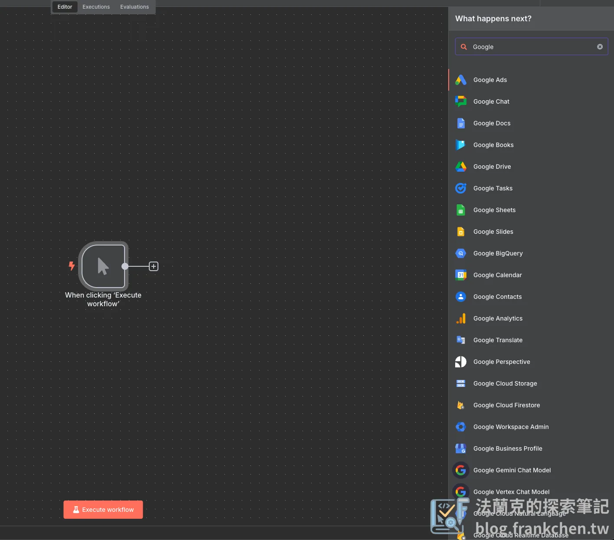

常用的有：

-   **Gamil**：批次寄送郵件、設定郵件標籤、撰寫草稿

-   **Google** **Sheet**：創建工作表、更新工作表等等

-   **Google Docs**：建立文件、更新文件

-   **Google Drive**：上傳檔案、檔案自動分類

-   **Google Calendar**：新增、修改、刪除行程

## 設定 Google 憑證詳細步驟

這裡將帶你一步一步取得 Google 的憑證，每個步驟都很重要喔！

### 第一步：前往 [Google Cloud](https://console.cloud.google.com/) 創建專案

-   左上角「**篩選專案**」—> 「**新增專案**」，或是你有**已經創建好的專案**也可以使用。

-   專案名稱命名一個你好辨識的名稱，此名稱後續**無法修改**。

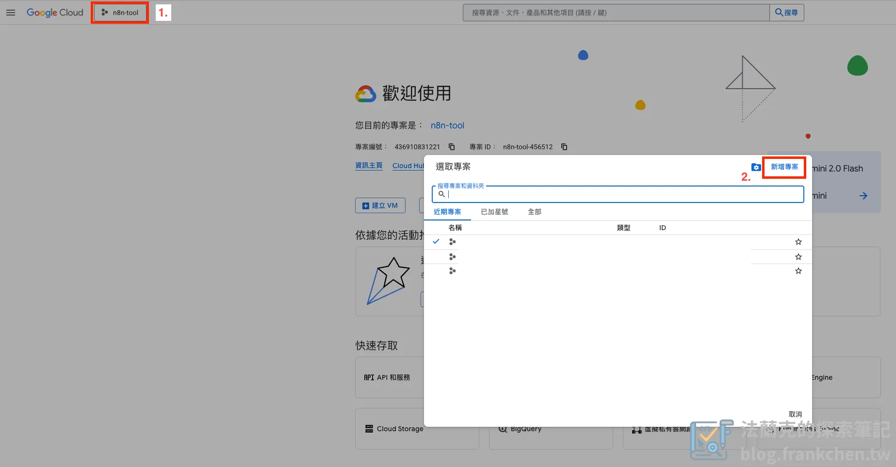

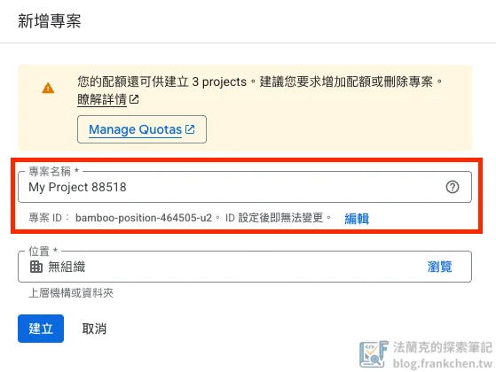

### 第二步：開啟 Google Cloud 上 API 服務

-   直接在最上放的搜尋列搜尋你要開啟的 API 服務，這裡以「**Google Docs**」為例。

-   建議直接把**所有會用到的 API 服務一次開啟**，省得後面需要再進來設定。

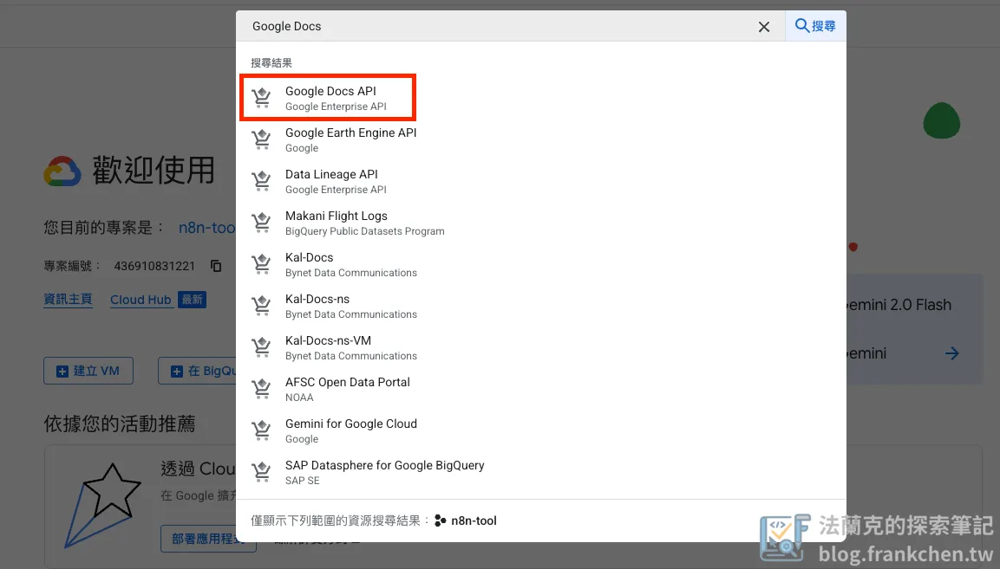

進入到「Google Docs API」設定頁面後，點擊「啟用」即可。

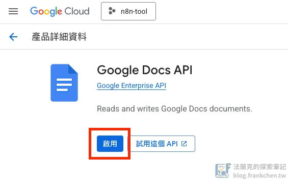

**其餘的 API 服務 (Google Sheet、Google Drive、Gmail … ) 也是像這樣操作開啟**。

### 第三步：設定 OAuth 同意畫面

OAuth 畫面是在你使用 Google 帳號登入某個服務時，會出現的一個授權畫面。

左手邊的「OAuth 同意畫面」開始設定你的授權畫面。

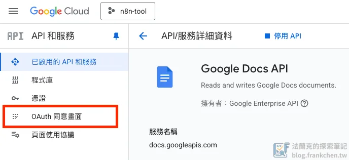

如果沒有設定過，畫面中央會出現開始設定的引導頁面，點擊「**開始**」開始設定 OAuth。

**應用程式資訊需輸入**：

-   **應用程式名稱**：命名一個你可以辨識的名稱

-   **使用者支援電子郵件**：填寫你的 Gmail 即可

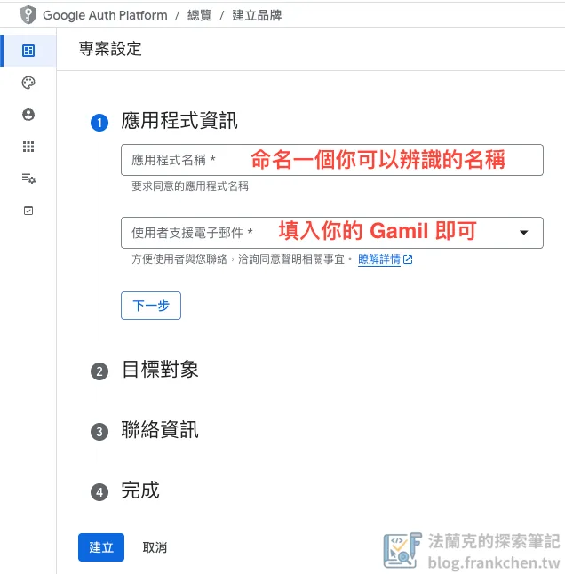

目標對象選擇「**外部**」。

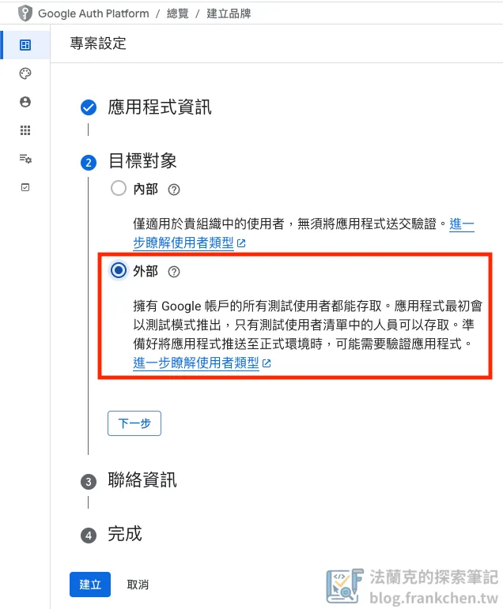

聯絡資訊填入**你的 Gmail** 即可。

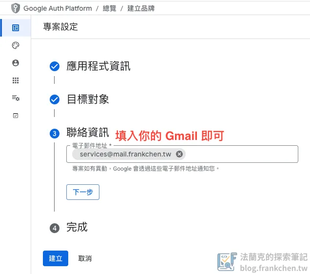

最後，**勾選同意後即可建立 OAuth**。

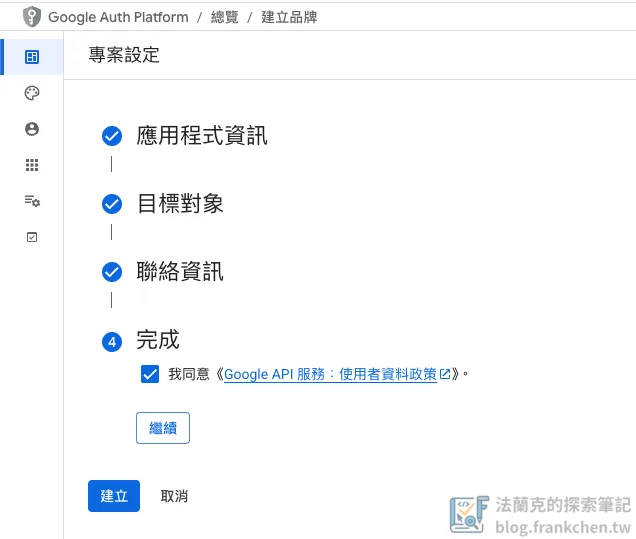

再來，左側側邊欄選擇「**品牌**」，畫面底下有一個「**授權網域**」，這裡需要輸入**你部署 n8n 的網域**。

-   這裡的網域不支援子網域，所以請輸入「**頂層網域**」，像我的網域就是 `frankchen.tw`。

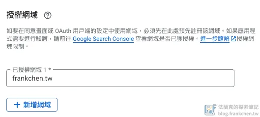

### 第四步：建立 OAuth 2.0 客戶端

OAuth 2.0 是你在按下同意時，背後 Google 執行的授權協議。

左側側邊欄「**用戶端**」，點擊上方的「**建立用戶端**」

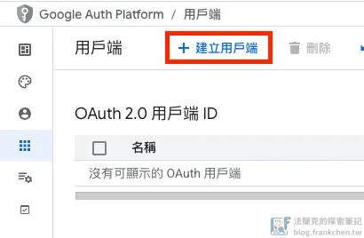

接著，輸入建立「**OAuth 用戶端**」需要的資料

-   **應用程式類型**：選擇「**網頁應用程式**」

-   **名稱**：填入你可以辨認的名稱

-   **已授權的重新導向 URL**：填寫 n8n 的 Google 憑證設定畫面提供的重新導向 URL

重新導向 URL 怎麼取得呢？

-   前往 n8n 打開 Google 服務的憑證設定畫面

-   複製「OAuth Redirect URL」欄位的網址，這個網址就是重新導向 URL

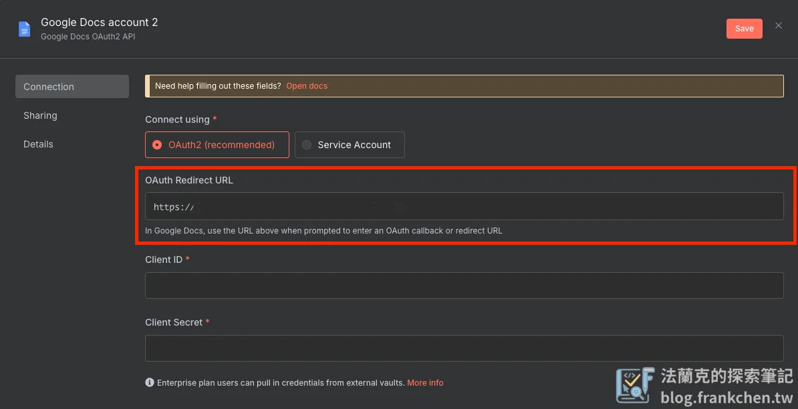

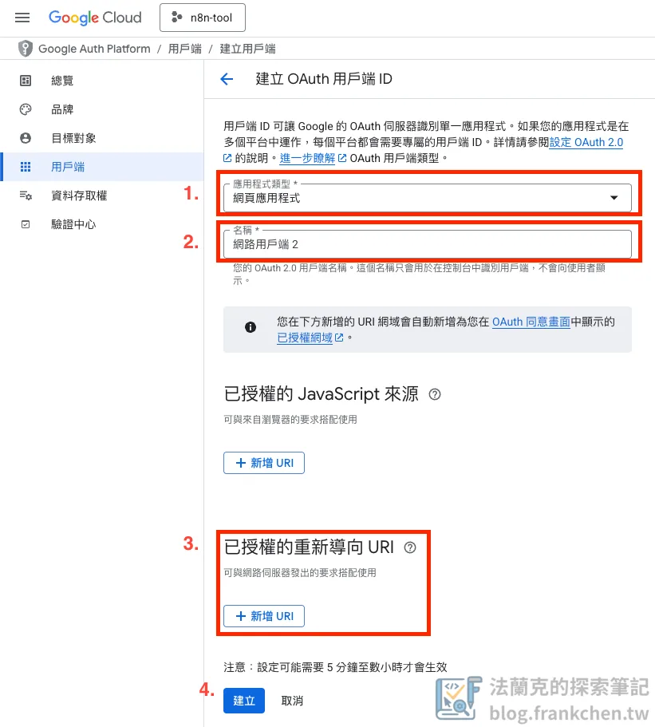

建立完成後，會跳出以下畫面，並包含以下資訊：

-   **用戶端編號**：對應到 n8n 的 Client ID

-   **用戶端密碼**：對應到 n8n 的 Client Secret

注意：這裡的**用戶端編號及密碼**千萬不可外流。

### 第五步：設定資料存取權

這步驟很重要！！！

在第二步開啟的所有 API 服務，在這裡需要把存取權打開，n8n 才有辦法訪問。

**全開或是選擇你要用到的開啟即可，注意這裡如果有很多權限的話需要一頁一頁去勾選。**

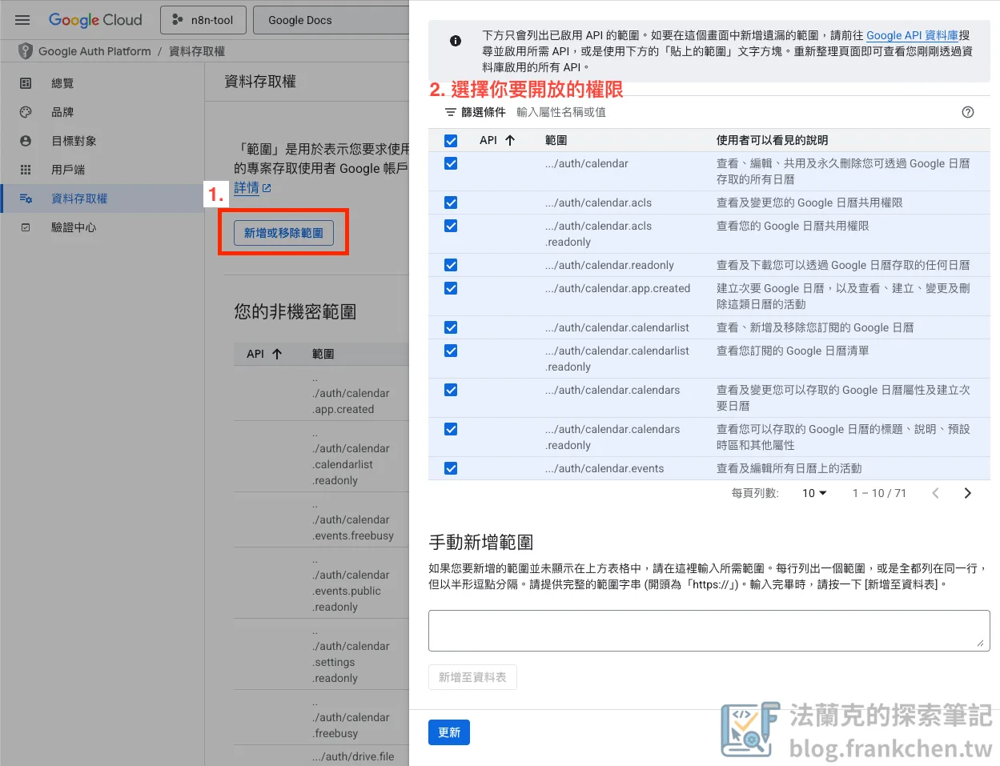

### 第六步：設定 n8n 的 Google 憑證

終於來到最後幾步了，加油，你快完成 Google 憑證的設定了。

這裡填入在第四步取得的**用戶端編號 (Client ID) 及用戶端密碼 (Client Secret)** 。

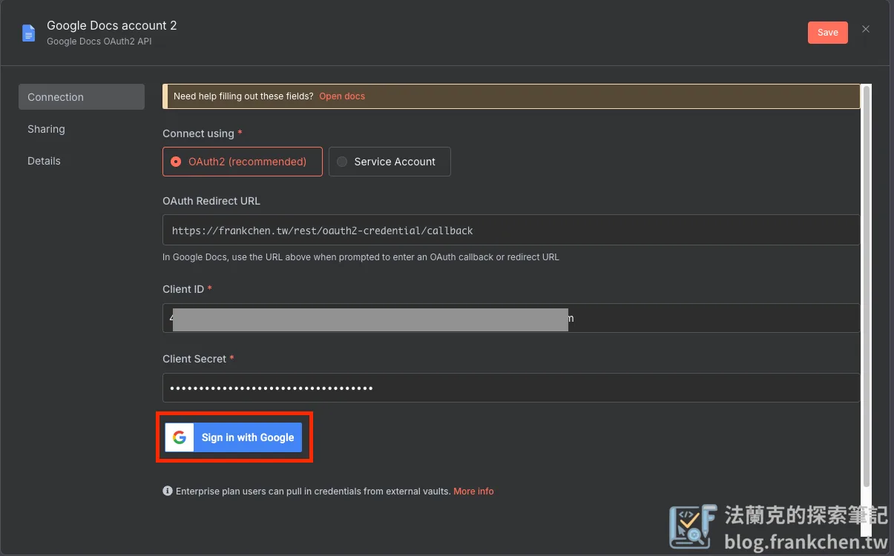

點擊「Sign in with Google」，並選擇你剛剛設定的 Google 帳號，這裡會出現警示畫面，點擊「繼續」完成授權，就完成了 n8n 與 Google 的連動。

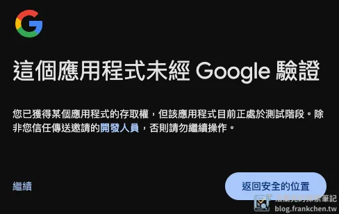

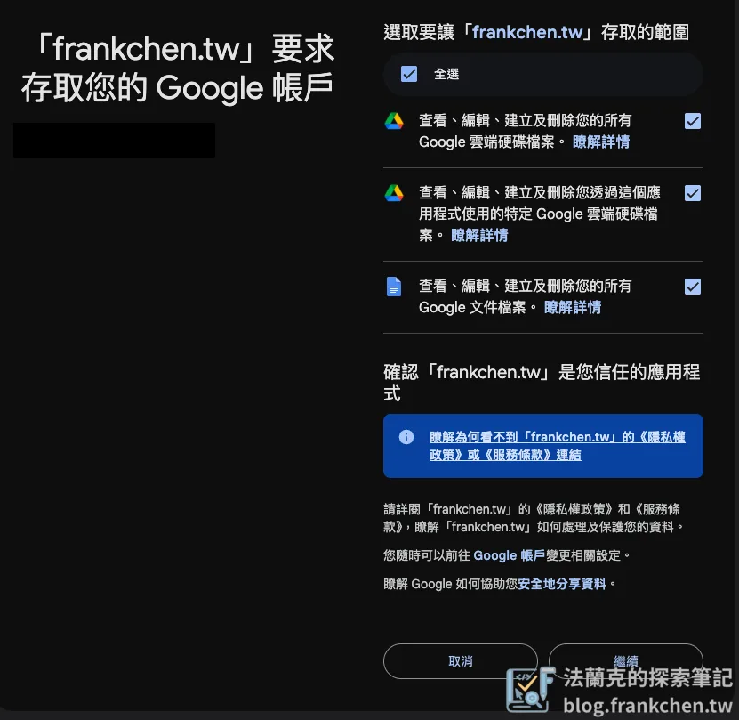

**n8n 中的所有 Google 服務 (Gamil、Google Sheet … ) 的憑證設定方法皆相同。**

### 第七步：測試憑證是否設定成功

設定成功的話，使用 Google 服務的節點就可以選擇相關的設定了。

如果無法選擇，那可以把節點的設定視窗關閉再重開；再不行，那就需要回頭檢查哪個步驟沒有做到。

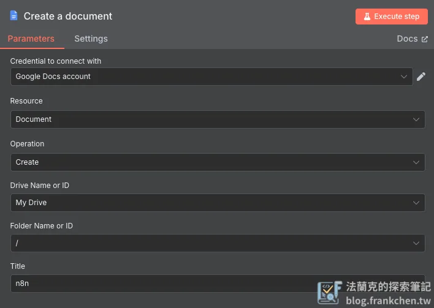

### 第八步：發布 Google Cloud 應用程式

終於來到最後一步驟了～～

回到 Google Cloud，這裡需要把你剛剛創建的應用程式發佈出去，不然 Google 的安全性原則一週後會將你的應用程式憑證刪除，n8n 端需要再重新手動驗證，這樣就不是真正的自動化了。

左側側邊欄「**目標對象**」—> 「**發布應用程式**」

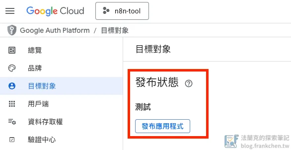

完成這步驟，前面的測試也順利，那就恭喜你完成 Google 與 n8n 的連動了，可以開始建立屬於你的自動化流程。
