## 前言：用 n8n 提升你的 Instagram 經營效率

近期有些新的 n8n 自動化 應用想要嘗試，但參考許多取得 Instagram Access Token 教學文章及影片，發現每個人的步驟都不太一樣，有些人很快就能完成，但有些人步驟就比較繁雜。後來才知道，原來 Meta 把設定後台介面也改版了，所以有些設定會找不到。

於是這篇教學文章就誕生了，依照文章步驟，你就能成功取得 Instagram Access Token，並透過 n8n 串接 Instagram 達到 自動化 發文。

本篇教學適用的 Instagram API 版本為 `v23`，以及新介面的 [Meta for Developers](https://business.facebook.com/business/loginpage/?next=https%3A%2F%2Fdevelopers.facebook.com%2Fapps%2F%3Fshow_reminder%3Dtrue#)。

## 事前準備

-   建立一個 Facebook 粉絲專頁：可參考「[在 Facebook 建立粉絲專頁](https://hackmd.io/@flagmaker/B1cQjzlSkl)」

-   Instagram 帳號：
    -   必須是「專業」帳號或是「創作者」帳號
    -   必須綁定 Facebook 粉絲專頁
-   一個 n8n 伺服器：部署在 n8n、Zeabur 或是 Self-hosting 都可以

如何綁定粉絲專頁：

-   登入你的 Facebook 帳號
-   點擊右上角頭像 → 「隱私和設定」→ 「設定」
-   左邊欄位找到「已連結帳號」→ 連結你的 Instagram
-   連結完成，會看到下圖的畫面

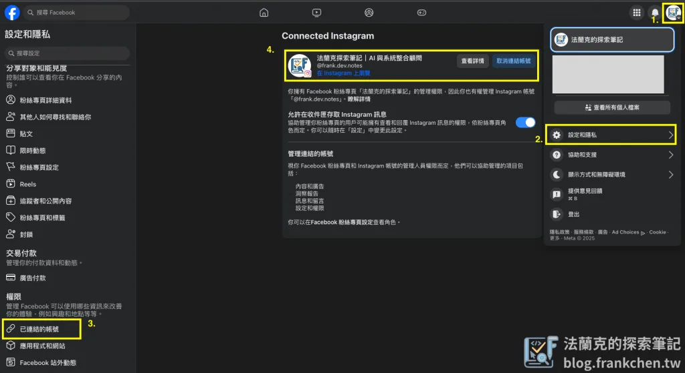

## 手把手教學：取得 Instagram Access Token (2025 最新版)

### 第一步：建立 Meta 應用程式

-   前往 [Meta for Developers](https://business.facebook.com/business/loginpage/?next=https%3A%2F%2Fdevelopers.facebook.com%2Fapps%2F%3Fshow_reminder%3Dtrue#)，使用你的 Facebook 登入

-   點擊右上角「建立應用程式」

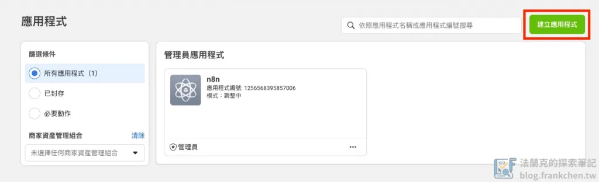

-   輸入應用程式名稱，這裡注意要避開「facebook」、「instagram」等字眼，輸入後點擊「繼續」

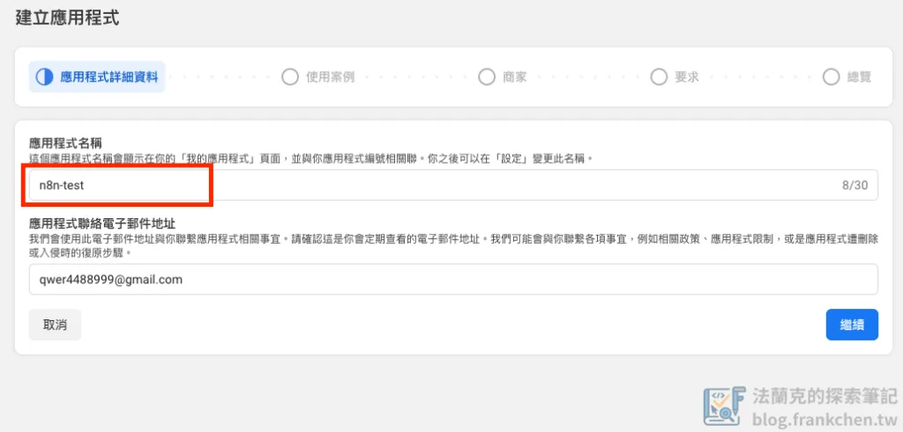

-   左側欄位「內容管理」，將`管理 Instagram 的訊息和內容`勾選。 如果之後也有 Threads 內容自動化的話，你也可以一併把「存取 Threads API」打勾

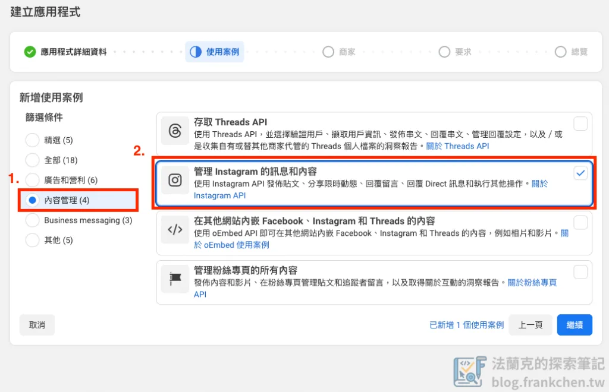

-   選擇`我還不想連結商家資產管理組合`，但如果你要統一管理的話，也可以選擇你常用的商家資產

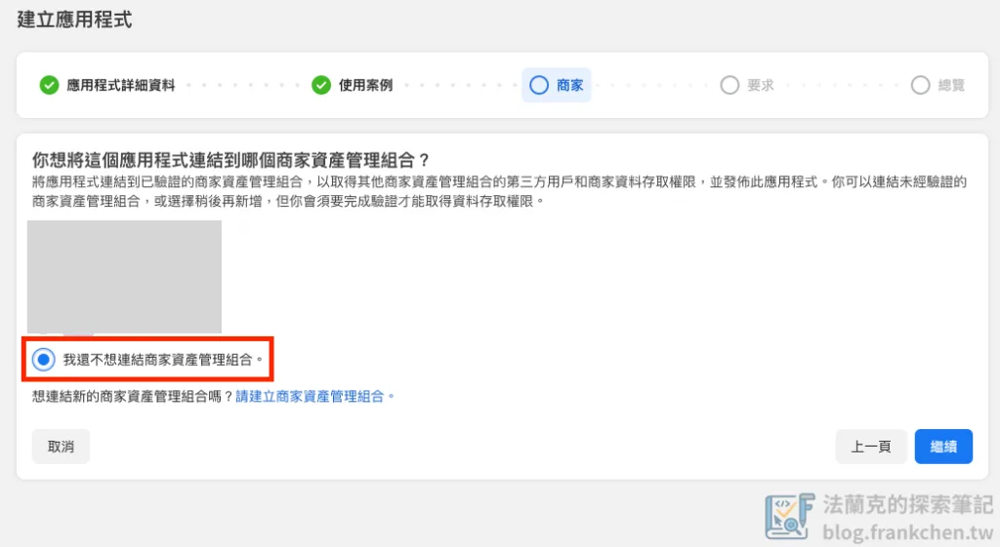

-   如果你只有選擇`管理 Instagram 的訊息和內容`或是`存取 Threads API`，那這邊可以直接點擊「下一步」

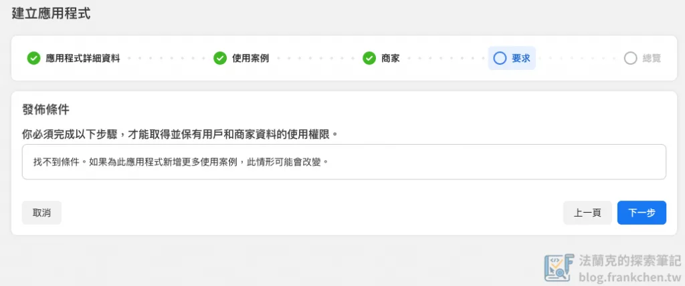

-   最後，確認「應用程式名稱」及「使用案例」是否正確，沒問題就點擊「前往主控台」。建立過程中系統可能會跟你索取密碼，這裡輸入你當初用來登入 Facebook 的密碼

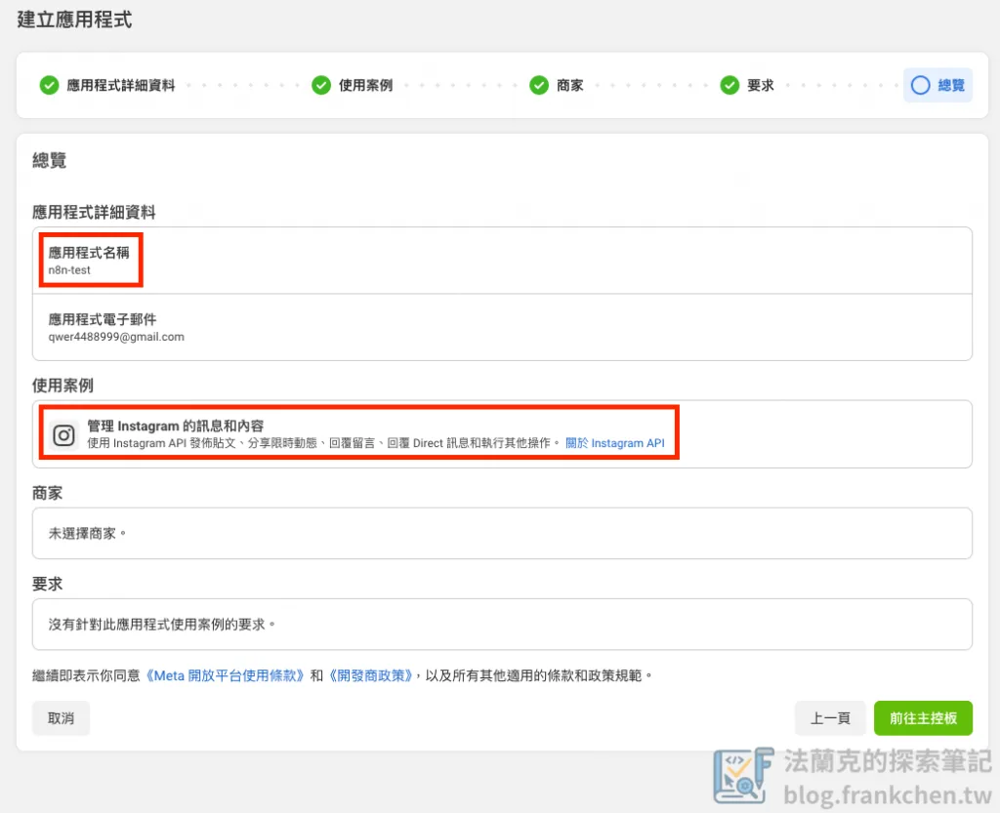

### 第二步：設定應用程式權限

-   點擊『自訂「管理 Instagram 的訊息和內容」的使用案例』

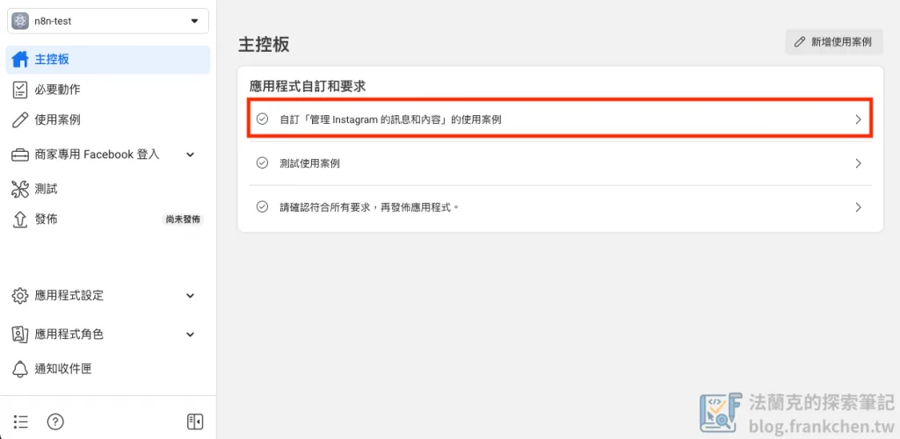

-   確認左側邊欄是「權限和功能」，先新增 `Instagram Public Content Access`，再來這個頁面往下捲，找到有包含 `instagram` 的案例，全部點擊新增，這樣以後就不需再回來這邊開權限。

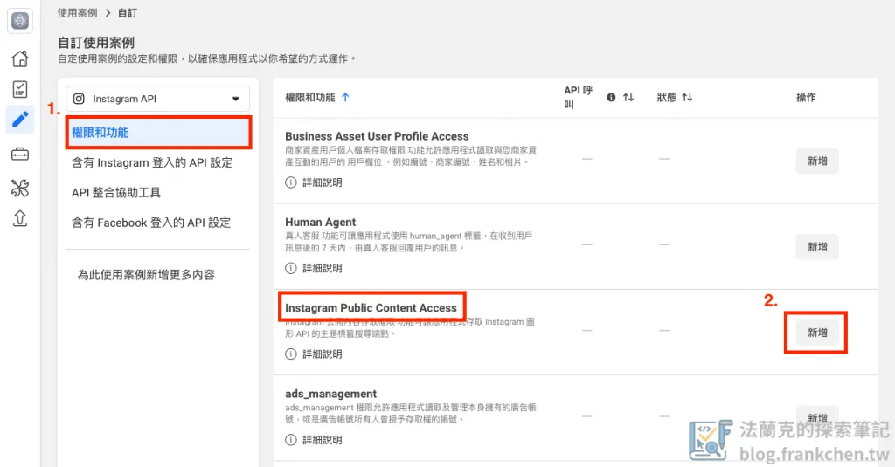

### 第三步：建立 Instagram 測試用戶

-   接著點開左側邊欄，畫面下方找到「應用程式角色」→「角色」，點擊左上角「新增用戶」

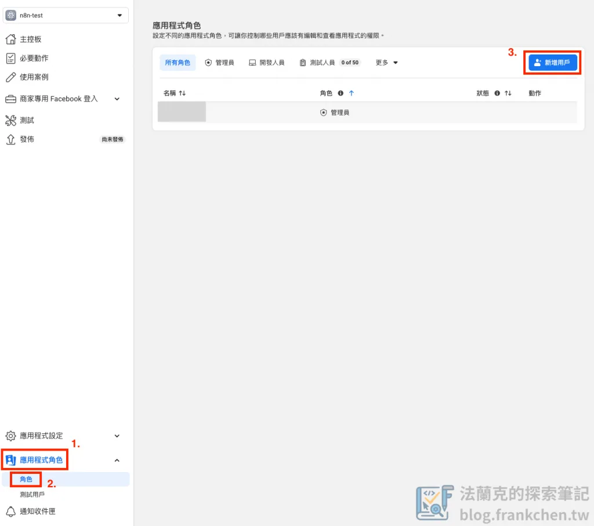

-   選擇「Instagram 測試人員」，並在下方輸入你的 Instagram 帳號，找到你的帳號後，點擊「新增」。

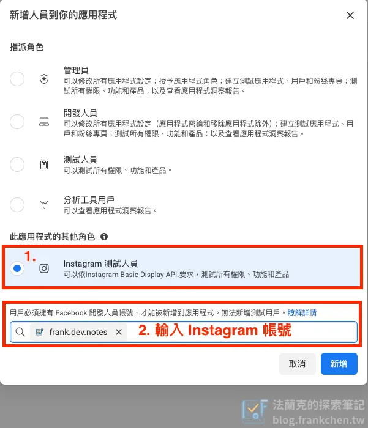

### 第四步：Instagram 帳號端確認：接受測試邀請

-   前往 [instagram.com/accounts/manage\_access](http://instagram.com/accounts/manage_access) 接受來自 Meta App 的邀請
-   進入頁面後，首先最左邊的個人檔案 Icon 先確認是否是你邀請的測試人員：若不是，請先到個人檔案頁面登入你上一步驟邀請的測試人員帳號，再重新點擊上一步的連結進入
-   確認沒問題後，再確認右手邊是否是在「應用程式和網路」的畫面
    -   如果是，那請點擊「測試員邀請」，就會看到接受的按鈕，點擊下去即可完成邀請。
    -   如果不是，請在中間的清單找到「網站權限」→「應用程式和網路」→「測試員邀請」→「接受」。

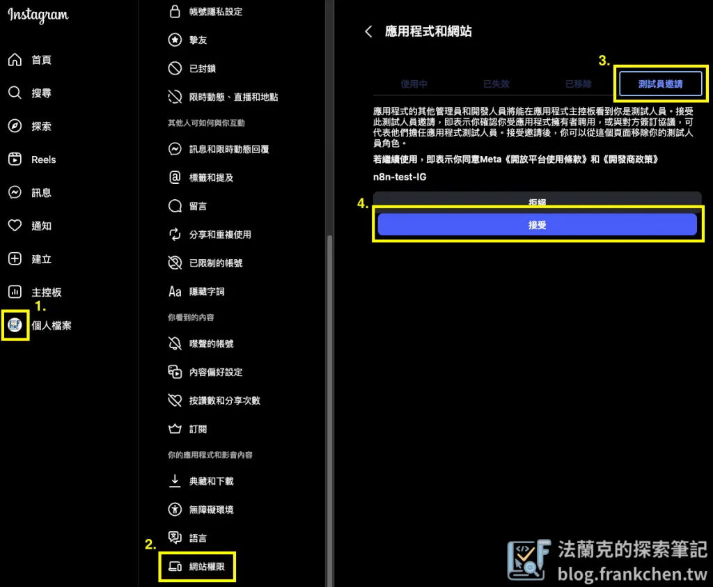

### 第五步：產生存取權杖 (Access Token)

-   左側欄找到「測試」→「開始圖形 API 測試工具」，點下去會開啟新的視窗

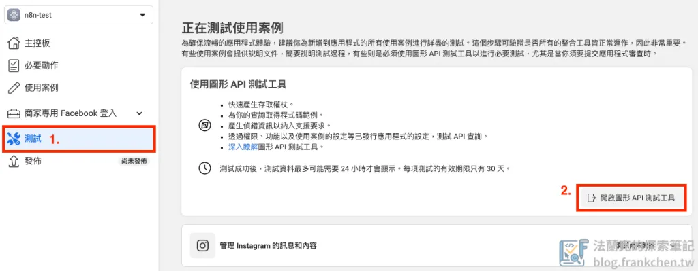

-   開啟後，最右邊欄的「用戶或粉絲專頁」選擇「取得權杖」，底下權限把「新增權限」點開，選擇「Other」

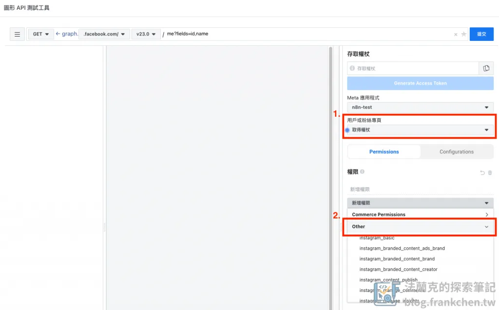

-   「Other」底下的有包含 `instagram` 的都勾選，如果都勾選會有 9 個選項

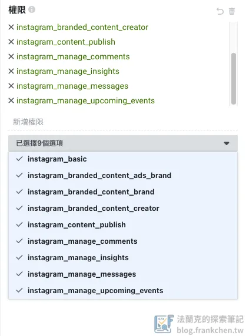

-   接著，點擊上方的「Generate Access Token」，系統會跳出 Facebook 登入驗證

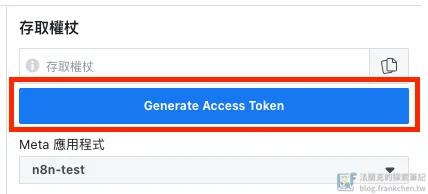

-   選擇你第三步新增的 Instagram 測試人員帳號，點擊「繼續」，會看到有哪些帳號操作權限會授權給這個 API，確認沒問題後，按下「儲存」

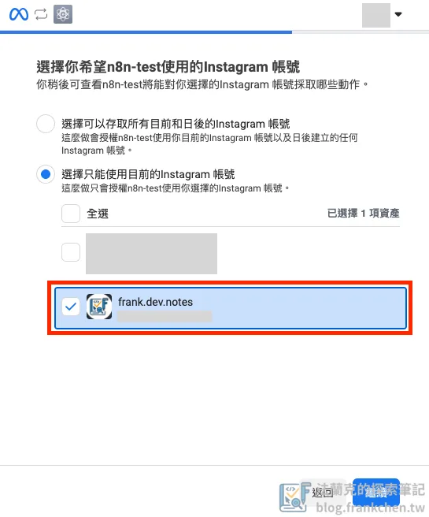

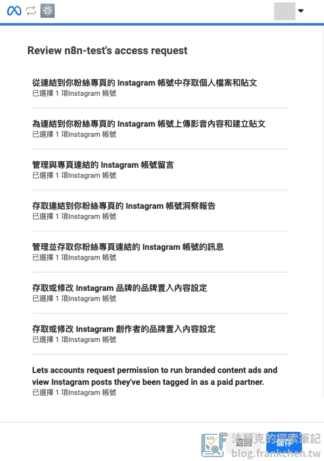

-   回到原本的頁面，就可以看到「存取權杖」已經產生出來了，點擊右邊按鈕可以複製 Token

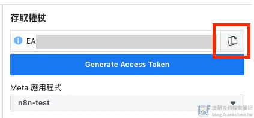

這裡取得的 Token 已經可以使用了，但 … 期限很短，很快就過期了，下一章節，將帶你**延長 Token 的有效期**。

## Token 長效續命術：延長 Instagram Access Token 有效期

### 為何要延長 Token 有效期？

在測試工具取得的 Token 有效期大約 **1 小時後就會過期**，這要拿來整合自動化不太理想，過期之後就要重新授權。所以需要把這組短期的 Token 換成**有效期為 60 天的長期 Token**。之後可以再透過 /access\_token 來持續延長 Token 有效期。

### 使用 Access Token Debugger 延長權杖

-   圖形 API 測試工具畫面最上方的「工具」→「存取權杖偵錯工具」

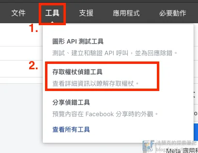

-   先確認版本為「v23.0」，之後把短期的 Access Token 填入欄位中，按下「偵錯」

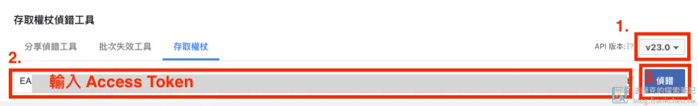

-   會出現存取權杖的相關資料，其中，精細範圍裡的數字組就是你的「Instagram ID」，這組 ID 之後上傳貼文時會用到。接著按下最底下的「延伸存取權杖」

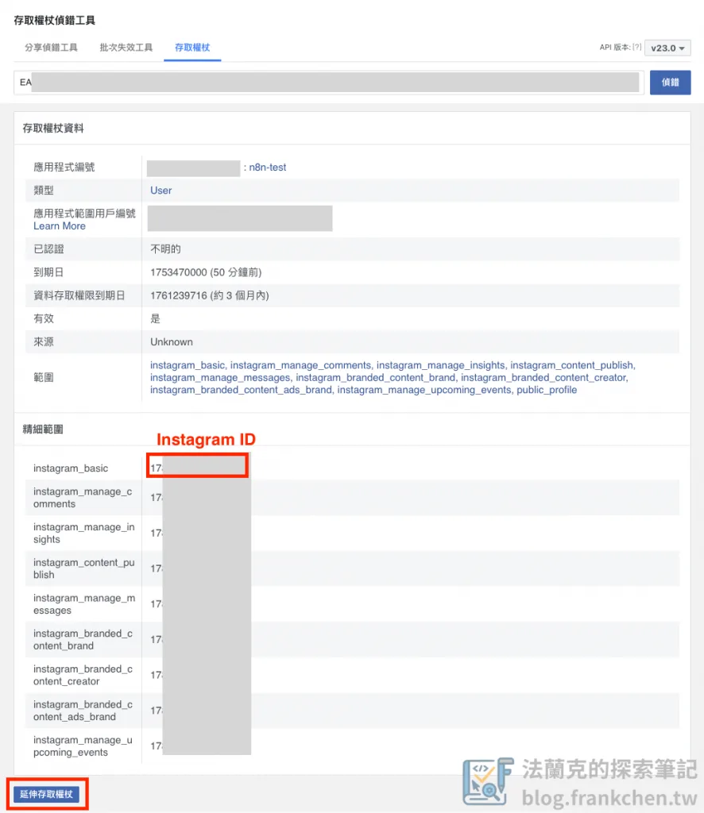

-   按下「延伸存取權杖」後，就會出現效期 60 天的長效權杖了，這組權杖就能拿到自動化流程中使用

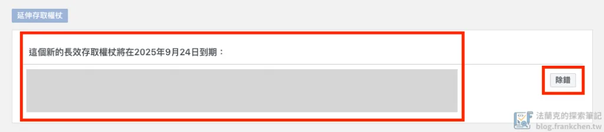

## 打造你的自動化引擎：n8n 工作流程建立

這裡用簡單的範例來建立 n8n 工作流，這裡如果打通的話，就可以結合到你的其他工作流程，實現自動化發文的流程。

### 第一步：事前確認

首先，先確認你是否拿到以下資料：

-   **Instagram ID**

-   **Instagram Access Token**

-   **Image 的公開 URL**：
    -   這裡很重要，因為 Instagram API 是透過 curl 來下載圖片，並不是直接將圖片上傳，所以需要有一個可以讓 Meta 訪問的下載連結。
    -   以 WordPress 連結 (`https://www.frankchen.tw/wp-content/uploads/2025/07/n8nAutoPostTest_dev.jpeg`) 來示範，也提供給大家做練習使用。
    -   Instagram API 支援的圖片格式請參考[官方說明](https://developers.facebook.com/docs/instagram-platform/instagram-graph-api/reference/ig-user/media#creating)。

### 第二步：建立工作流

開啟一個新的工作流工作區域，按照順序拉出以下四個節點，「手動觸發」→「Edit Fields」→「Facebook Graph API」→「Facebook Graph API」。

需要兩個「Facebook Graph API」是因為要先把圖片上傳 (建立容器)，之後再把這個建立好的容器發佈出去 (發佈內容)。

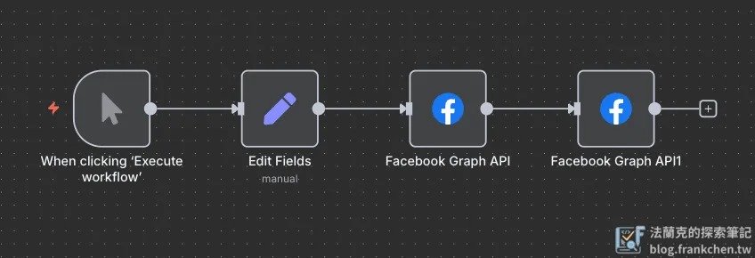

### 第三步：設定 Facebook Graph API 憑證

隨機點開其中一個「Facebook Graph API」節點，最上方新增憑證，並把在上一個章節拿到的 Instagram Access Token 貼上「Access Token」欄位，按下「Save」，畫面會出現成功的提示。代表此憑證可以在 n8n 上使用了，如果顯示失敗，請回到上一個章節重新取得 Instagram Access Token。

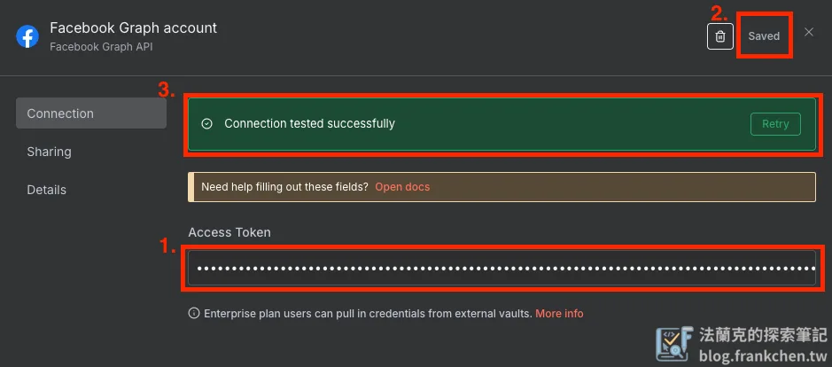

### 第四步：節點設定

-   「Edit Fields」節點主要是讓大家更好輸入並統一管理圖片 URL、圖片說明和 Instagram ID。
    -   **圖片 URL (imageUrl)**：輸入你的圖片下載網址，或是先用練習範例 `https://www.frankchen.tw/wp-content/uploads/2025/07/n8nAutoPostTest_dev.jpeg`。
    -   **圖片說明 (caption)**：圖片說明就是在 Instagram 上看到的文字內容，中英文皆可，也可以加入 hashtag。例如：`n8n Auto Post Test n8n 排程發文測試 #n8n #autopost`。如果要多行編輯，可以在輸入欄位的右下角找到一個小箭頭，打開編輯視窗，就可以依照你的需求排版。
    -   **Instagram ID (nodeID)**：輸入 `Instagram ID`。

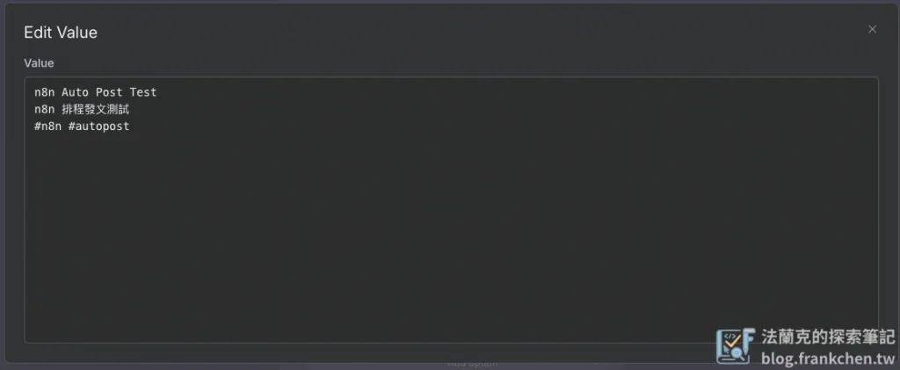

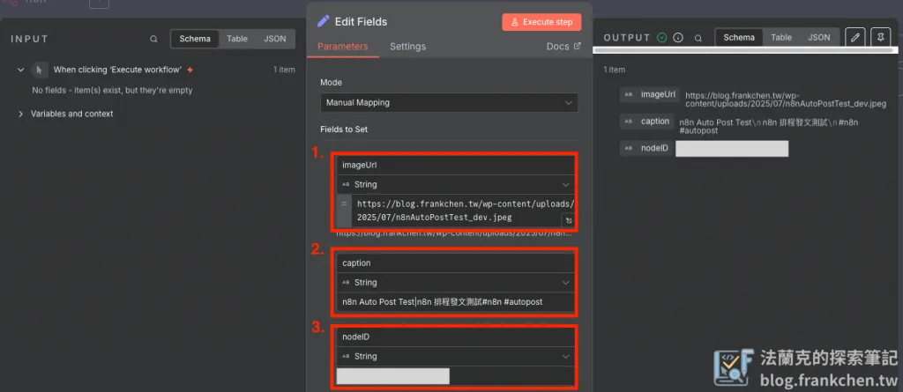

-   第一個「Facebook Graph API」節點要先在 Meta 伺服器上建立一個容器，並把圖片及文字內容一併放在容器中。
    -   **HTTP Request Method**：選擇 `POST`。
    -   **Graph API Version**：選擇 `v22.0` 或 `v23.0`。
    -   **Node**：將前一個節點的 `nodeID` 拖入即可。
    -   **Edge**：填入 `media`。
    -   「Options」→「Query Parameters」
        -   **image\_url**：將前一個節點的 `imageUrl` 拖入即可。
        -   **caption**：將前一個節點的 `caption` 拖入即可。

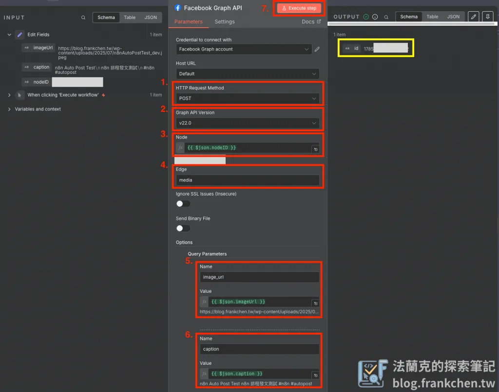

按下「Execute step」，如果沒有報錯，代表容器已建立成功，而黃框回傳的就是已經建立好的容器 ID，等一下就是透過這組 ID 將容器發佈出去。

通常會遇到的錯誤是 Meta 伺服器端無法下載你的圖片，這時就要去檢查圖片的網址是否可以讓 Meta 訪問。

-   第二個「Facebook Graph API」節點就是將建立好的容器發佈到你的動態牆上，讓大家都可以瀏覽。
    -   **HTTP Request Method**：選擇 `POST`。
    -   **Graph API Version**：選擇 `v22.0` 或 `v23.0`。
    -   **Node**：將「Edit Fields」節點的 `nodeID` 拖入即可。
    -   **Edge**：填入 `media_publish`。
    -   「Options」→「Query Parameters」
        -   **creation\_id**：就是容器 ID，將前一個節點的 `id` 拖入即可。

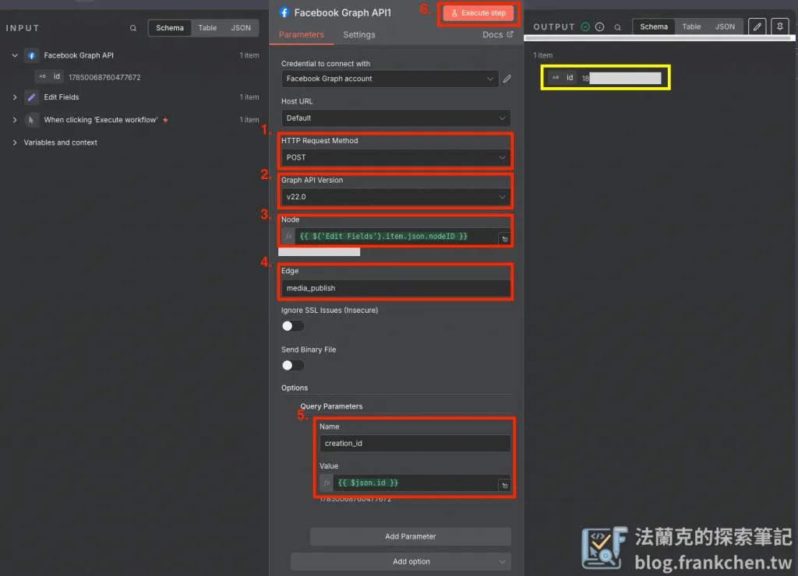

按下「Execute step」，如果沒有報錯，代表已經成功發文了，可以前往你的 Instagram 上看看有沒有出現貼文。而黃框回傳的 ID 就是該貼文的 ID，後續可以使用這組 ID 持續追蹤貼文成效或管理貼文。

## 常見問題與故障排除

-   我的 Instagram 帳號不是專業帳號怎麼辦？

前往「設定」，找到「帳號」→「切換為專業帳號」，詳細請參考[官網步驟](https://www.facebook.com/business/help/347556992775908?id=419087378825961)。

-   為什麼我的 Access Token 會失效？

Access Token 分為`短期`及`長期`，短期的 1 小時內就會過期，要再重新申請；而長期的可以使用 60 天，60 天後需要再重新申請。

-   n8n 憑證測試失敗怎麼辦？

請重新檢查設定步驟是否有錯誤，若還是有遇到問題，**可以到 Threads 、 Instagram 或 Mail 找我，我幫你檢查問題**。

-   Facebook Graph API 無法下載圖片怎麼辦？

請先確認 Mate 伺服器是不是可以訪問你提供的圖片 URL，可以透過官方提供的[測試工具](https://developers.facebook.com/tools/debug/)測試看看。

如果是從 WordPress 下載，或是有綁定 [Cloudflare](https://www.cloudflare.com/zh-tw/application-services/products/cdn/) 的 CND，請先檢查 `robots.txt` 有沒有阻擋 Meta 的爬蟲機器人，有的話請加入以下這段：

```xml
User-agent: facebookexternalhit
Allow: /wp-content/uploads/
```

其中 Allow 的路徑根據你的需求修改，如果是 WordPress 那可以直接使用這個路徑。

更多的 Meta 爬蟲機器人設定請見[官方文件](https://developers.facebook.com/docs/sharing/webmasters/web-crawlers?locale=zh_TW)。

加入完後，需等待 Meta 的爬蟲機器人重新刷新 `robots.txt` 紀錄，才能再次嘗試讓 Meta 伺服器下載圖片。

-   如何發佈多張圖片或影片？

發布影片與發布圖片的步驟相同，但如果要一次發佈多張的話，需要**先分別將照片或影片在 Meta 伺服器上建立容器**，取得所有的容器 ID 後，**再把所有的容器 ID 用另外一個新的容器包起來**，詳細步驟請參考[官網資料](https://developers.facebook.com/docs/instagram-platform/content-publishing#create-a-carousel-container)。

-   如何排程發佈？

把 Trigger 節點改完「**Schedule Trigger**」節點，設定好時間，就可以達成排程發布文章了。

## 總結

以上就是從取得 Instagram Access Token 到排程發文的全過程，透過 n8n 結合其他的服務，讓你不再忘記要設定排程發文。可以持續整合 AI 、Google Sheet、RSS Feed 等資源，提升你的發文效率。

**參考資料：**

-   [How to Post to Instagram with n8n (Updated 2025)](https://www.youtube.com/watch?v=AGSyWdjN5A4)
-   [如何取得 Instagram API Token 並自動更新：完整教學指南](https://charlsondou.com/get-instagram-api-token-auto-update/#Token_yan_zhang_yu_zi_dong_shua_xin)

延伸閱讀：[不用再當搬運工！ n8n 助你實現 Notion 無縫轉移 WordPress 的完美攻略](/n8n-notion-wordpress-publish-automation/)

延伸閱讀：[n8n 憑證設定懶人包：常用服務快速導覽（持續更新）](/n8n-credentials-setup-complete-guide/)

延伸閱讀：[n8n 憑證設定指南：串接 Google Cloud 服務 新手也能輕鬆上手](/n8n-google-credentials-setup-guide/)

延伸閱讀：[n8n x WordPress 整合指南：API 設定、媒體上傳、自動發文全攻略](/n8n-wordpress-api-integration-guide/)
