## 前言：為什麼需要整合 Line？

Line 在台灣市場廣大，從個人生活、公司內部溝通到自媒體的私領域，都脫離不了 Line。如果你正在尋找 n8n Line 整合方案，想要建立自動化的 Line Bot 來處理客服回覆、發送通知或建立個人助理，這篇文章將完整解決你的需求。

透過 n8n Line bot 整合，你可以輕鬆實現自動回覆客戶訊息、定時發送通知、整合 CRM 系統等功能，大幅提升工作效率。無論是電商客服自動化、會員通知系統，還是個人生活助理，n8n 搭配 Line Messaging API 都能幫你解放雙手。

這篇文章將帶你從零開始建立 Line Bot，完成 n8n 的 Line 憑證設定，並深入介紹 n8n 社群節點的使用方式與最佳實務。

## 快速導覽

-   第一次串接 n8n 及 Line 的你：可以從[步驟一：建立 Line Bot](#步驟一：建立_Line_Bot) 開始跟著操作。
-   有 Line Bot 但需要 n8n 端設定教學的你：從[步驟二：n8n 安裝社群節點 Line Messaging](#步驟二：如何在_n8n_安裝_Line_Messaging_社群節點) 開始跟著操作。
-   Line Bot 及 n8n 社群節點都準備好的你：直接跳到[步驟三：n8n Line 憑證設定](#步驟三：n8n_Line_憑證設定完整教學)。

## 步驟一：建立 Line Bot

首先進入 [Line Developers](https://developers.line.biz/) 頁面，點擊右上角「Log in to Console」。

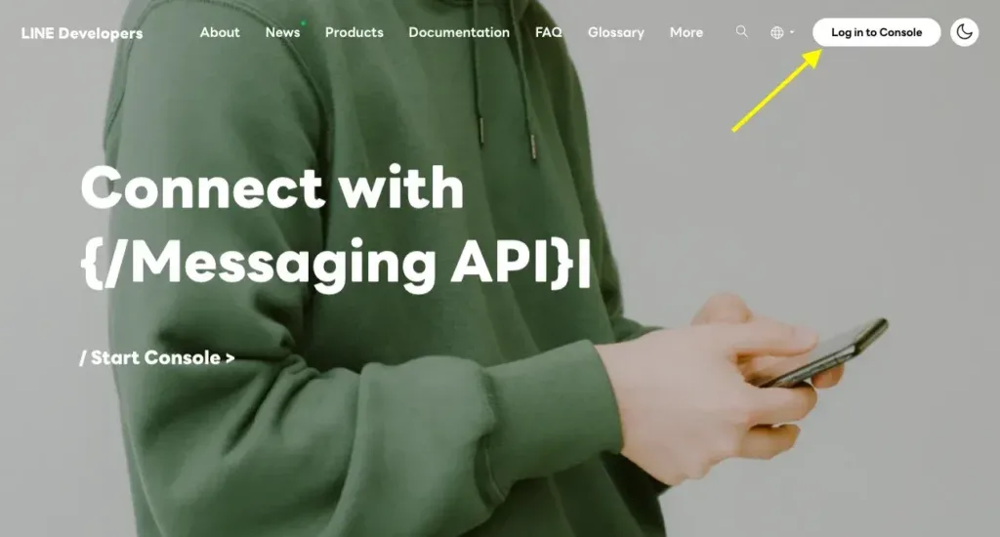

可以使用你的 Line 帳號登入，透過掃描 QR Code 根據 Line 指示快速登入。

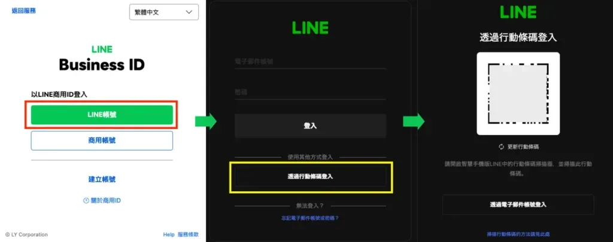

登入後就會看到這樣的畫面，如果你沒建立過 Line Bot，那麼你只會看到 Providers 的清單是空白的。

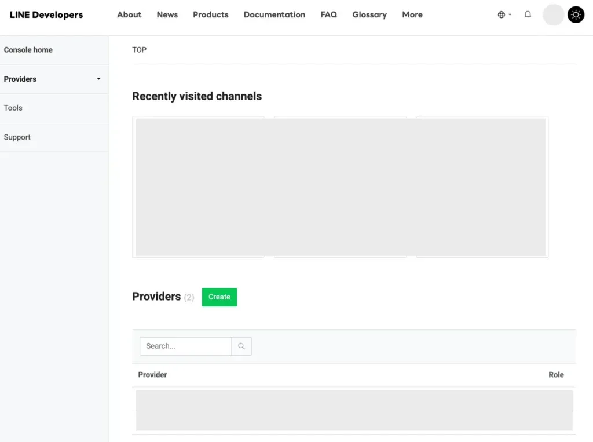

### 1.1 建立 Provider：權限管理的第一步

這時候點擊「Create」建立一個 Provider，就取一個你知道的名字。

Provider 是什麼？簡單來說，Provider 就像是一個「組織單位」，用來管理和分類你的所有 Line Bot。如果你未來會建立多個 Line Bot（例如：客服機器人、通知系統、行銷機器人），透過 Provider 可以有效地分類管理這些 Bot 的權限和資源。

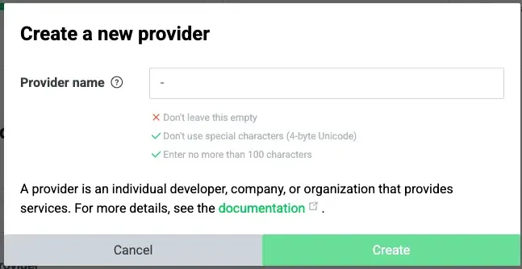

建立好 Provider 後，你會看到以下畫面，代表建立成功，可以開始建立你的第一個 Line Bot。

### 1.2 建立 Messaging API Channel

接著，點擊「Create a Messaging API channel」，這一個就是所謂的 Line Bot。

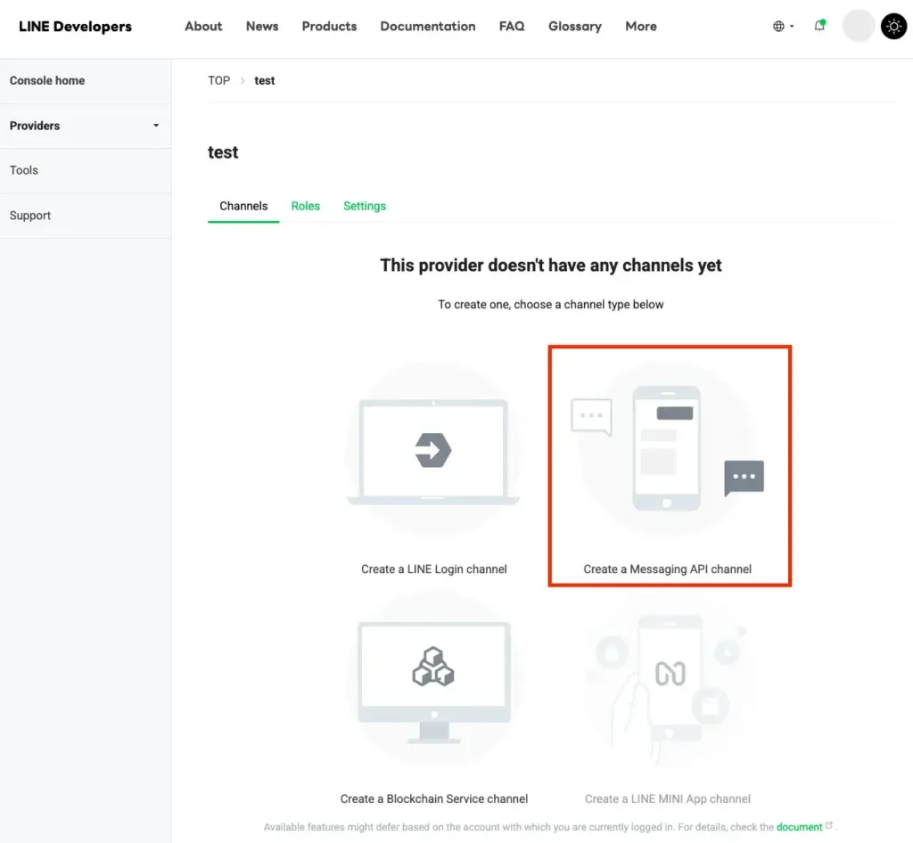

這邊會引導你到另一個網頁先建立 LINE 官方帳號，點擊「Create a LINE Official Account」。

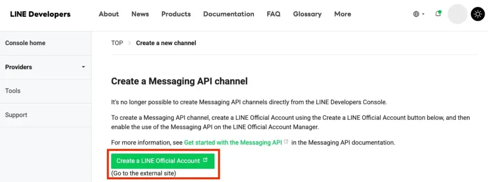

再來根據 Line 官方指引建立官方帳號，最後可以按「稍後進行認證」，跳過認證帳號程序。

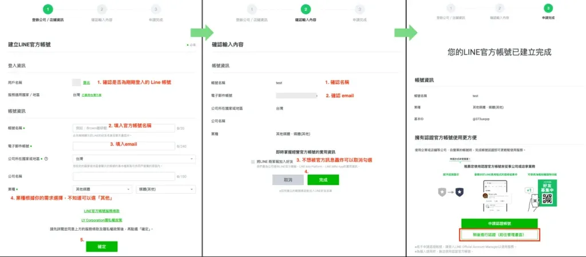

同意官方的使用條款後，就會進入到 Line 的官方帳號管理頁面。

這時候你的 Line 應該也會出現你剛剛建立的 Line 官方帳號。

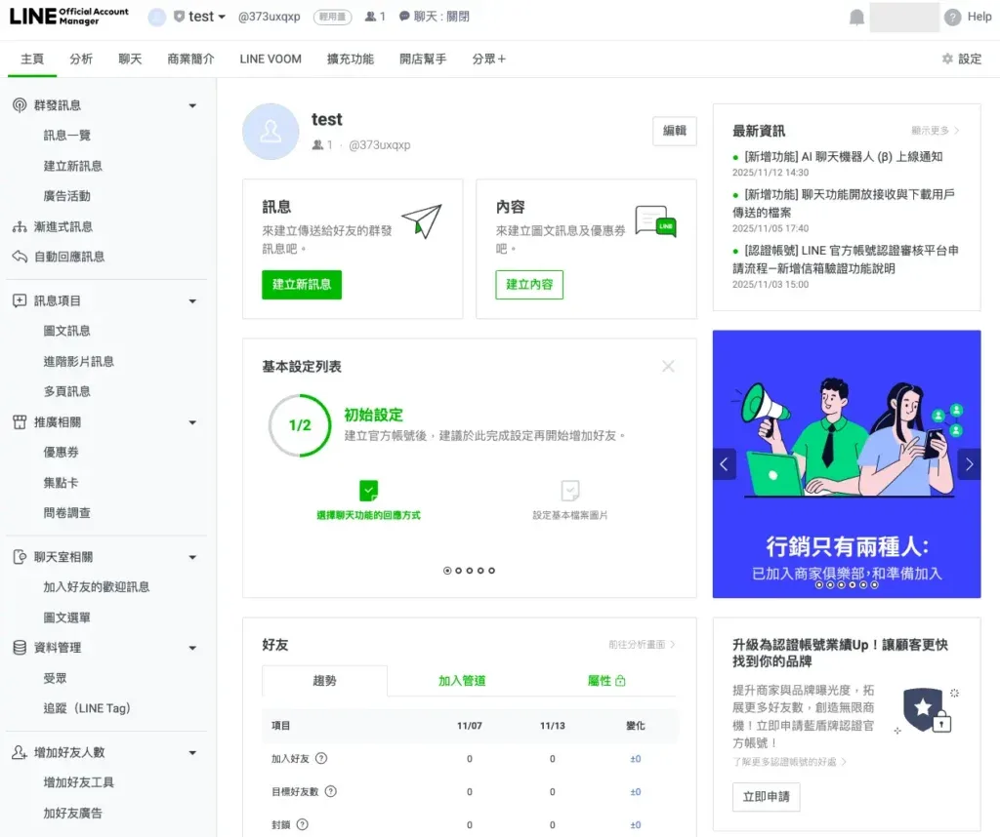

### 1.3 啟用 Messaging API：開啟自動化整合的關鍵

建立好 LINE 官方帳號之後，我們需要先將官方帳號的 Messaging API 開啟，才能進行之後的 n8n 或其他自動化服務的串接。

為什麼要啟用 Messaging API？因為預設的 LINE 官方帳號只能手動回覆訊息，啟用 Messaging API 後，才能透過程式化的方式（如 n8n、Webhook）來自動處理訊息，實現真正的自動化。

點擊畫面右上角的「設定」，左邊欄位的「Messaging API」，然後點擊畫面中的「啟用 Messaging API」。

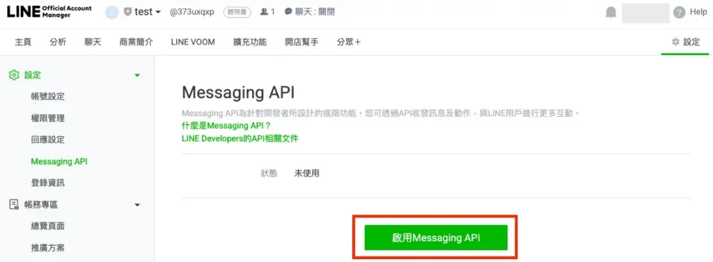

選擇你剛剛建立的 Provider，選完後就按下同意;隱私權政策及服務條款可以不用填，直接按「確定」。

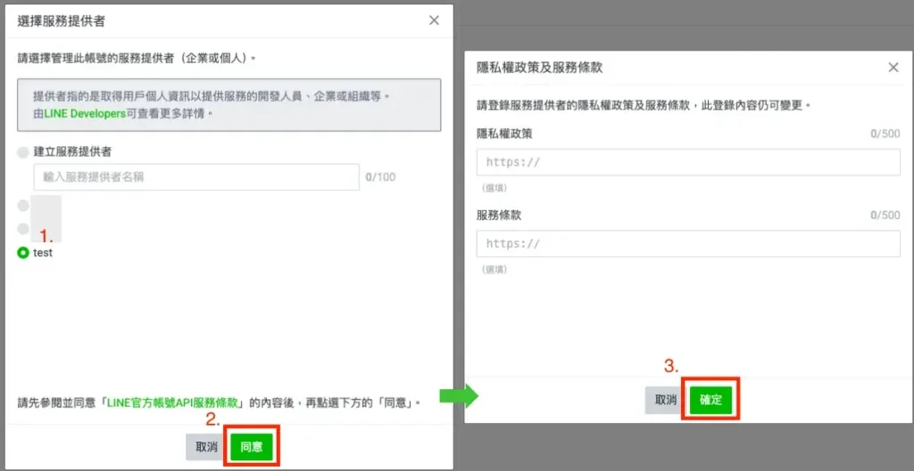

### 1.4 取得重要憑證資訊

確認完後，就會看到狀態變成`使用中`，以及會看到 Channel ID 及 Channel secret，這兩組訊息注意不要外流囉!

Channel ID 和 Channel Secret 的用途：

-   Channel ID：用來識別你的 Line Bot，是公開資訊
-   Channel Secret：用來驗證請求的真實性，屬於機密資訊，絕對不可外洩

安全提醒：如果 Channel Secret 不小心外洩，駭客可能會冒用你的 Bot 身份發送訊息或竊取使用者資料。一旦發現外洩，請立即到 Basic settings 頁面重新產生新的 Secret。

Channel secret 可以先存起來，在\[\[#步驟三：n8n Line 憑證設定\]\]會用到。

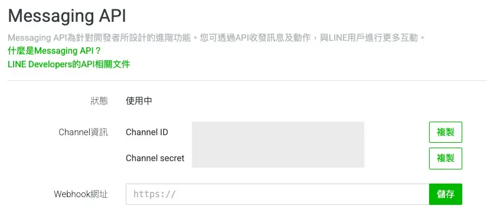

### 1.5 關閉自動回應：避免 Webhook 衝突

接著在左側邊欄點擊「回應設定」，將`自動回應訊息`關閉。

為什麼必須關閉自動回應？因為當你使用 n8n 透過 Webhook 來處理訊息時，如果同時開啟自動回應，Line 系統會同時發送兩則訊息給使用者：一則是 Line 官方帳號的自動回應，另一則是 n8n 工作流的回應。這不僅會造成使用者困惑，也可能干擾你的自動化邏輯。

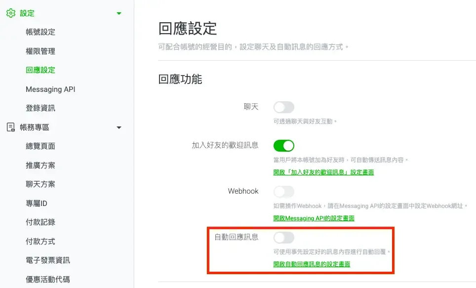

以上步驟都設定好之後，初步的 Line Bot 建立就算是完成一半了，接下來就是要搭配 n8n 的社群節點 `Line Messaging` 實作。

## 步驟二：如何在 n8n 安裝 Line Messaging 社群節點

在 2025 的 10 月，社群節點推出整合 Line Messaging API 的 `Line Messaging` 節點，不需要再使用 `HTTP Request` 節點串接 API 了，工作流在建立上也更加的方便!

### 2.1 為什麼選擇 n8n Line Messaging 節點？

在 2025 年 10 月之前，要在 n8n 中整合 Line，必須使用 `HTTP Request` 節點手動呼叫 Line Messaging API，需要自己處理 API 請求格式、錯誤處理、認證等細節，對初學者來說門檻較高。

#### 社群節點 vs HTTP Request 比較

Line Messaging 社群節點

HTTP Request 節點

設定難度

簡單，視覺化介面

複雜，需要了解 API 文件

錯誤處理

內建錯誤提示

需要自行解析錯誤訊息

憑證管理

統一管理，可重複使用

每次都要手動填入 Token

功能完整性

涵蓋常用功能

完全客製化，但需要自己實作

維護成本

低，社群持續更新

高，API 變更需要自行調整

#### 什麼時候該使用 HTTP Request？

雖然 Line Messaging 社群節點已經很方便，但以下情況你可能還是需要使用 HTTP Request：

-   需要整合 Line 的其他 API（如 LIFF、LINE Login）
-   需要高度客製化的錯誤處理邏輯

對於大部分的使用情境（如基本的訊息收發、自動回覆、通知推送），Line Messaging 社群節點已經足夠使用，且能大幅降低開發時間。

### 2.2 社群節點安裝

進入 n8n 的操作介面，點擊右上角的「+」，並在搜尋欄搜尋「Line Messaging」，選擇 `Line Messaging` 然後點擊「Install Node」，等待安裝完成後就可以開始使用啦！

如果你只想看怎麼設定 n8n 憑證，那麼可以直接跳到[步驟三：n8n Line 憑證設定](#步驟三：n8n_Line_憑證設定)。

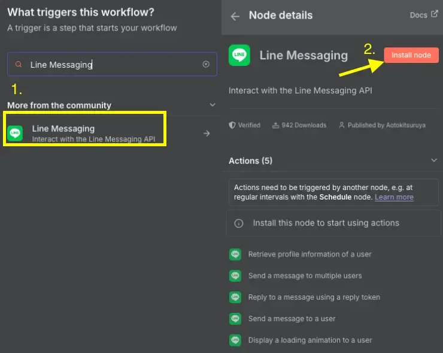

### 2.3 社群節點功能介紹

Line Messaging 社群節點常用的功能有 Messaging Trigger、顯示載入中動畫、回應訊息及推送訊息等四個常用節點。

免費方案限制提醒：推送訊息（Push Message）功能要特別注意，Line 免費方案一個月每個 Line Bot 只能推送 200 次。如果你的應用需要大量推播（例如：每日通知給 100 位使用者），建議評估是否需要升級付費方案，或改用回應訊息（Reply Message）來節省額度。

#### Messaging Trigger

節點名稱：`On Message`

這個節點會監聽 Line Bot 的所有事件，包含 Message、Unsend、Follow、Unfollow 等等各種事件。如果是要做成個人的 Line Bot 助理，那麼可以選擇只監聽 Message，這時候就會只有在傳送訊息時觸發工作流。

Trigger 節點的運作原理：當使用者在 Line 上與你的 Bot 互動時，Line 伺服器會將事件資料透過 Webhook 傳送到 n8n。Trigger 節點就像是一個「監聽器」，持續等待並接收這些事件，然後啟動你設定好的工作流程。

實際應用場景：

-   Message 事件：適合做聊天機器人、客服自動回覆
-   Follow 事件：當使用者加入好友時，自動發送歡迎訊息並記錄到 CRM
-   Unfollow 事件：當使用者封鎖 Bot 時，更新資料庫狀態
-   Postback 事件：處理按鈕點擊等互動行為

Webhook URLs 需要提供給 Line 官方，讓它知道有事件觸發時要傳送到哪個位置，細節設定可以參考\[\[#步驟三：n8n Line 憑證設定\]\]。

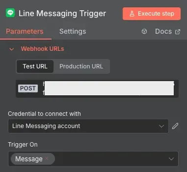

#### 顯示載入中動畫

節點名稱：`Display a loading animation to a user`

載入中動畫可以增加互動性，當使用者傳送訊息時，可以先顯示載入中動畫，再執行後面的工作流，這樣可以讓使用者感覺到有在處理，而不是乾等結果。

UX 最佳適合使用時機：當你的工作流需要呼叫外部 API（如 ChatGPT、資料庫查詢）或處理時間超過 3 秒時，建議加入載入動畫，避免使用者以為 Bot 沒有反應。

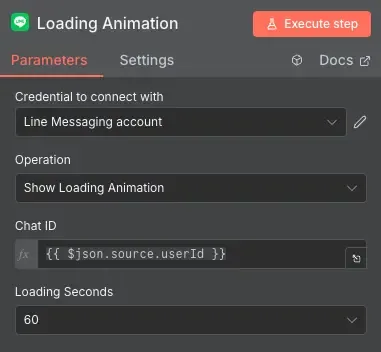

#### 回應訊息

節點名稱：`Reply to a message using a reply token`

這個節點需要搭配 Message Trigger 節點使用，當 Trigger 節點收到訊息時，會帶有 `reply token`，回應訊息的節點就是透過 reply token 回應使用者。

Reply Message 的技術限制與優勢：

-   一次性使用：每個 reply token 只能使用一次，且有效期限為 60 秒，過期或重複使用都會失效
-   不計入額度：Reply Message 不會計入每月 200 次的免費額度，可以無限制使用
-   必須搭配事件：只能在收到 Webhook 事件後才能使用，無法主動發起
-   適用情境：適合做即時回應，如聊天機器人、客服自動回覆、表單驗證回饋

Quote Token：回覆使用者傳送的訊息（就是我們在聊天時使用的回覆功能，Trigger 節點會提供）

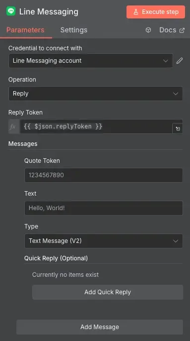

#### 推送訊息

節點名稱：`Send a message to a user`

推送訊息跟回應訊息很像，唯一差別是回應訊息是被動（有觸發才能回應），而推送訊息是主動的，你必須要有使用者的 ID 才能傳送訊息。

Reply vs Push 技術差異與使用時機：

Reply Message

Push Message

觸發方式

被動回應使用者訊息

主動推送訊息給使用者

需要資料

Reply Token

User ID

免費額度

不計入額度，無限制

計入每月 200 次額度

時效性

Reply Token 60 秒內有效

隨時可用

使用情境

聊天互動、即時回應

定時通知、行銷推播

實際應用建議：

-   優先使用 Reply：當使用者主動傳訊息時，盡量使用 Reply Message 來回應，節省免費額度
-   Push 的最佳實務：適合用於定時通知（如每日天氣、提醒事項）、系統告警、訂單狀態更新等主動推播情境
-   混合使用策略：可以在工作流中先檢查是否有 reply token，有的話用 Reply，沒有才用 Push

這裡傳送出去的訊息會計入每月 200 次的額度，所以使用前評估一下，如果該月滿額度就無法使用了，除非就是付費升級方案。

## 步驟三：n8n Line 憑證設定完整教學

介紹完 Line Messaging 節點後，我們可以開始來設定 n8n Line 憑證了。

### 3.1 設定 Line Webhook

n8n 的 Webhook 分為 Test URL、Production URL 兩種，Test 顧名思義就是測試用，只有在手動執行 Trigger 節點時有效，而 Production 就是在工作流啟動（Active）時有效，不用手動執行，啟動後就會自動等待接收 Webhook 的訊息。

Test URL vs Production URL 使用時機：

Test URL

Production URL

使用情境

開發階段、測試新功能、除錯工作流程

正式上線、24 小時接收訊息、穩定運作的工作流

如何啟動

手動點擊 Trigger 節點的「Execute」按鈕

將工作流程切換到「Active」狀態

有效期限

通常只在執行當下有效，關閉執行視窗後就失效

只要工作流維持 Active 狀態就持續有效

適合對象

正在開發或調整工作流的時候使用

開發完成，準備正式使用的工作流

我們目前是要測試，所以先複製 Test URL，然後到剛剛在 [Line Developers](https://developers.line.biz/) 設定好的 Line Bot，找到「Messaging API」頁面，往下拉找到「Webhook settings」，把 Test URL 填入 Webhook URL，然後將「Use webhook」開啟。

Webhook 生效條件與驗證機制：

-   開啟「Use webhook」：這是必要步驟，關閉的話 Line 不會傳送任何事件到 n8n
-   URL 格式驗證：URL 必須是 HTTPS 開頭，HTTP 會被 Line 拒絕
-   連線測試：設定完成後可以點擊「Verify」按鈕測試連線，如果失敗請檢查 n8n 工作流是否正在執行中

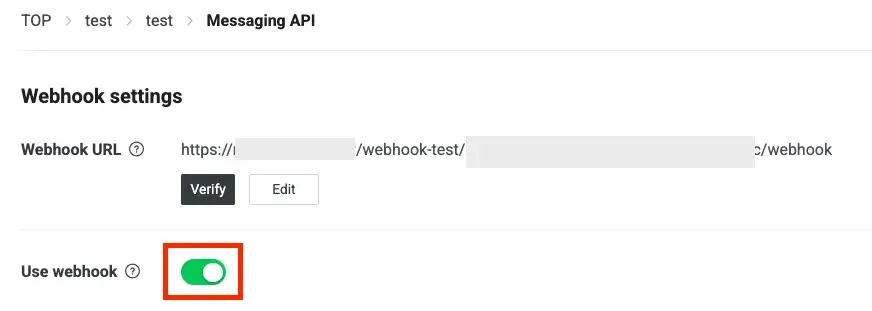

### 3.2 設定 Line 憑證

設定完 Webhook 後，同一個頁面最下方找到「Channel access token」後，點擊「Issue」產生一組 `long-lived` 的 `Channel access token`。

Token 安全性注意事項：

-   這組 token 千萬不能外流，任何擁有此 token 的人都可以用你的 Bot 身份發送訊息給使用者
-   如果不小心外流了（例如：上傳到 GitHub、分享給他人），請立即點擊「Reissue」重新產生一組新的 token
-   重新產生 token 後，舊的 token 會立即失效，需要同步更新 n8n 中的憑證設定

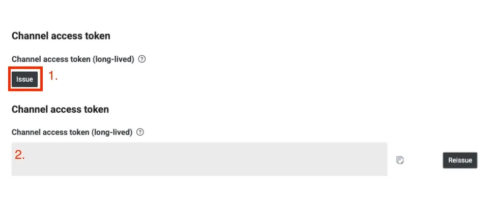

接著回到 n8n，在 Trigger 節點操作面板中新增 Credential，依序填入：

-   Channel Access Token
-   Channel Secret：如果在[步驟一：建立 Line Bot](#步驟一：建立_Line_Bot) 沒有記錄到，可以在 Basic settings 頁面中找到。

填完之後，按下右上角的「Save」，如果資料都正確，會顯示「Connection tested successfully」。

憑證驗證失敗的常見原因：

-   Channel Secret 或 Access Token 複製錯誤（多複製空格或少複製字元）
-   使用了過期或已重新產生的 Token
-   Line Bot 的 Messaging API 尚未啟用
-   網路連線問題，n8n 無法連接到 Line API 伺服器

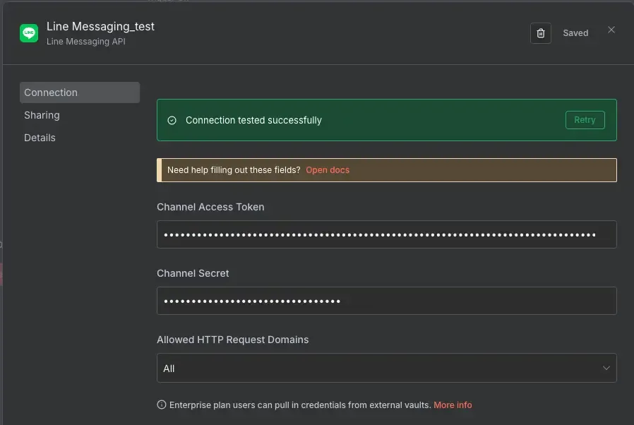

## 步驟四：測試 n8n 與 Line 的互動

使用三個節點簡單測試 n8n 與 Line 之間的互動功能及憑證設定。

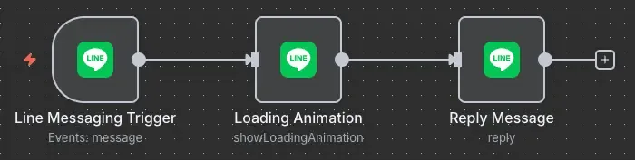

### 4.1 Line Messaging Trigger 節點接收訊息

接下來，Trigger 節點的「Credential to connect with」選擇剛剛設定好的憑證，按下「Execute step」，節點會開始等待發送訊息，這時候就到 Line Bot 的聊天視窗，隨意送出一則訊息。

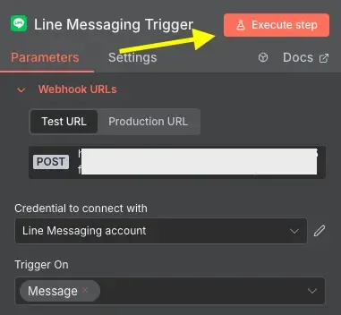

如果 Webhook 設定成功，且憑證也設定正確，那麼 Trigger 節點就會收到你剛剛傳送的訊息。

其中，

-   **text**：傳送出去的訊息
-   **userId**：顯示載入中動畫時需要
-   **replyToken**：回應訊息時需要使用

Trigger 節點收到的物件包含哪些資訊？

-   **message 物件**：包含訊息類型（文字、圖片、影片等）、訊息內容、訊息 ID
-   **source 物件**：包含 userId（傳送者 ID）、類型（user/group/room）
-   **replyToken**：用於回應訊息的一次性 token
-   **timestamp**：事件發生的時間戳記
-   **webhookEventId**：事件的唯一識別碼

小技巧：測試過程中，可以在接收到訊息後，按下節點設定畫面右上角的大頭針，把資料先留著，這樣在串後面服務過程中不用一直重新傳送訊息。

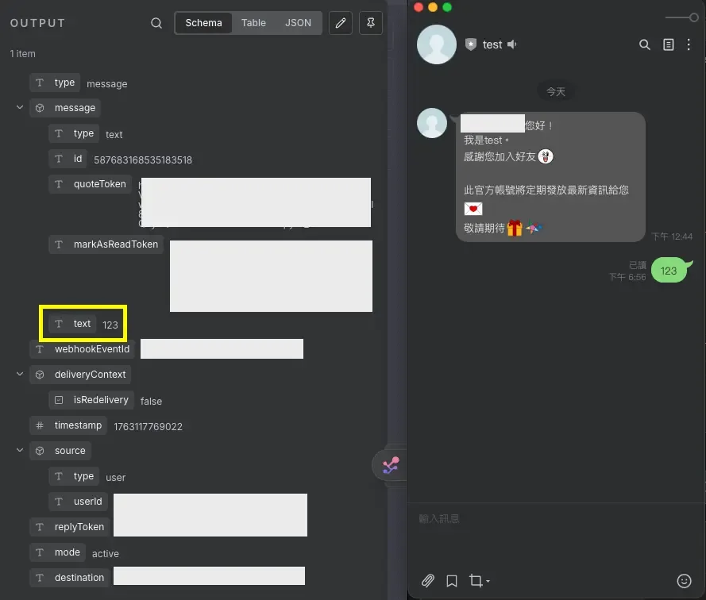

### 4.2 Loading Animation 節點顯示載入中動畫

-   **Credential to connect with**：選擇剛剛設定的憑證
-   **Chat ID**：使用 Trigger 節點收到訊息中的 `userId`
-   **Loading Seconds**：動畫持續顯示的時間（5~60 秒）

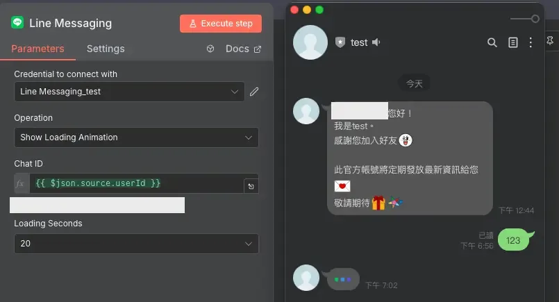

### 4.3 Reply Message 節點回應訊息

-   **Credential to connect with**：選擇剛剛設定的憑證
-   **Reply Token**：使用 Trigger 節點收到訊息中的 `replyToken`
-   **Messages**：
    -   **Text**：你要回覆的訊息
    -   **Type**：`Text Message （V2）`

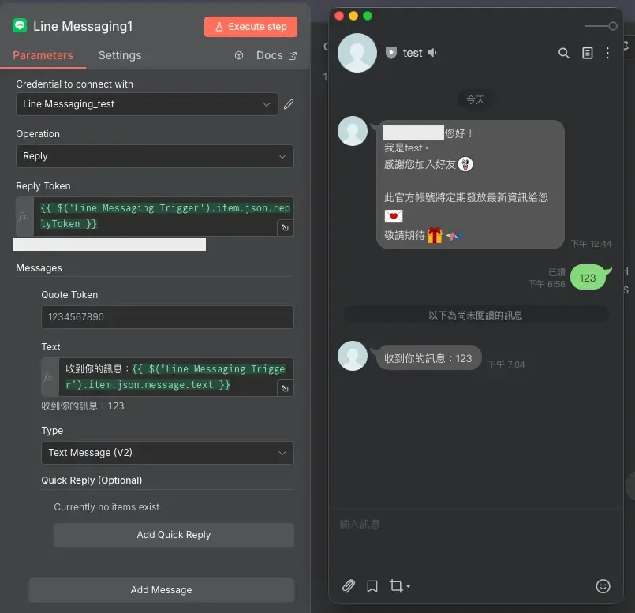

## 常見問題與錯誤排查

在串接 n8n line 的過程中，可能會遇到一些常見問題，以下整理了解決方案。

**Q1：Webhook 無反應，Trigger 節點沒有收到訊息**

請檢查 Line Developers 的「Use webhook」是否開啟，確認 URL 複製正確並點擊「Verify」測試連線。若使用 Test URL 需手動執行節點，Production URL 則需啟動工作流。另外，確認 n8n 伺服器可被外部存取，不能使用 localhost。

**Q2：憑證驗證失敗（401 或 403 錯誤）**

401 錯誤通常是 Channel Access Token 錯誤或過期，請重新複製 token 並更新 n8n 憑證。403 錯誤則檢查 Channel Secret 是否完整複製，以及 Messaging API 是否已啟用。

**Q3：訊息沒收到或收到兩則訊息**

收到兩則訊息請關閉「回應設定」中的自動回應功能。沒收到訊息則檢查 Reply Token 是否過期(60 秒限制)、是否重複使用(只能用一次)，或訊息格式設定是否正確。

**Q4：Reply Token 過期或已使用錯誤**

Reply Token 有效期限只有 60 秒且只能使用一次。建議優化工作流減少處理時間，或先用 Reply Message 回應「處理中」，完成後再用 Push Message 推送結果。

**Q5：Push Message 額度用完**

Line 免費方案每月只有 200 次 Push Message 額度。建議優先使用 Reply Message（不計額度），或將多則訊息整合成一則發送。若需求超過額度，可考慮升級付費方案。

## 使用情境與最佳實務

n8n Line 整合適合哪些應用場景？以下是幾個常見的實際應用情境。

### 個人助理應用

透過 Line Bot 建立你的個人助理，處理日常瑣事：

-   記帳機器人：傳送「午餐 120」自動記錄到 Google Sheets
-   待辦事項管理：傳送「提醒我明天下午開會」自動建立 Google Calendar 事件
-   天氣查詢：每天早上 7 點自動推送當日天氣預報
-   股票追蹤：設定關注的股票代號，價格變動時即時通知

### 客服自動化

減少人工客服負擔，提供 24 小時自動回應：

-   FAQ 自動回答：使用者詢問常見問題時，自動回覆預設答案
-   訂單查詢：輸入訂單編號，自動從資料庫查詢訂單狀態
-   預約系統：透過對話引導完成預約，並同步到後台系統
-   客訴分流：自動判斷問題類型，轉接給對應的客服人員

### 通知系統整合

主動推送重要訊息給使用者：

-   系統告警：伺服器異常、網站 down 機時立即通知
-   訂單狀態更新：出貨、到貨時主動推送通知
-   內容更新提醒：部落格新文章發布時通知訂閱者
-   行銷活動推播：特價活動、優惠券發送

### CRM 系統串接

將 Line 整合到客戶關係管理流程：

-   自動記錄客戶互動：使用者傳送訊息時，自動記錄到 CRM 系統
-   客戶分類管理：根據互動行為（Follow/Unfollow）更新客戶狀態
-   個人化行銷：根據 CRM 資料分眾推播客製化訊息
-   銷售漏斗追蹤：追蹤客戶從詢問到成交的完整旅程

### 最佳實務建議

1.  錯誤處理：在工作流中加入 Error Trigger 節點，捕捉執行失敗的情況並記錄
2.  訊息驗證：檢查使用者輸入格式，避免無效資料導致工作流中斷
3.  速率限制：避免在短時間內發送大量訊息，可能被 Line 系統限制
4.  資料隱私：妥善保管使用者資料，特別是 User ID 和對話紀錄
5.  測試環境：使用 Test URL 完整測試工作流後，再切換到 Production URL 正式上線

## 推薦應用

以下是兩個實際的 n8n Line 整合應用範例,你可以直接下載工作流程來使用或參考。

### 探店心願助手

透過 Line Bot 輕鬆管理你的探店清單，無論是想去的餐廳、咖啡廳還是美食景點，都能快速收集並隨時查詢。

功能特色：

-   支援多種輸入方式：上傳店家截圖、Instagram 連結、Facebook 連結
-   AI 自動分析圖片和連結，取得店家名稱等資訊
-   透過 Google Map 取得店家詳細資料（評分、營業時間、地址）
-   自動儲存到 Google Sheets 方便管理
-   提供多種查詢方式：全部清單、依縣市查詢、依位置查詢
-   可標記已踩點的店家和刪除不需要的店家

文章連結：探店心願助手

### LINE 觸發自動匯出到 WordPress

在 Canva 設計完封面圖後，只要透過 Line Bot 貼上設計連結，就能自動匯出並上傳到 WordPress 媒體庫，省去手動下載、轉檔、上傳的繁瑣步驟。

功能特色：

-   貼上 Canva 編輯網址即可自動處理
-   系統自動解析設計 ID 並取得設計檔
-   匯出前提供預覽圖確認
-   自動備份到 Google Drive
-   一鍵上傳到 WordPress 媒體庫
-   支援 PNG、JPG、PDF 等多種格式

使用限制：目前僅支援單頁設計，如果設計檔有多頁，只會記錄最後一頁。

下載連結：**文章撰寫中，敬請期待**

適用對象：

-   部落格作者：需要快速上傳封面圖
-   社群媒體經營者：批次處理圖片素材
-   內容創作者：整合設計與發布流程

## 總結

本文完整示範了 n8n 整合 Line 的完整流程，從建立 Line Bot、設定憑證、到實際測試互動功能。只要按照步驟操作，大約 30-40 分鐘就能完成基礎設定，開始打造你的第一個 Line 自動化工作流。

重點回顧:

1.  在 Line Developers 建立 Provider 和 Messaging API Channel
2.  啟用 Messaging API 並取得 Channel ID、Channel Secret、Access Token
3.  安裝 n8n Line Messaging 社群節點
4.  設定 Webhook URL 和 Line 憑證
5.  測試 Trigger、Loading Animation、Reply Message 三個核心節點
6.  了解 Reply vs Push 的差異與使用時機

恭喜你完成 n8n Line 整合!現在你已經具備建立自動化 Line 應用的基礎能力,可以開始實作個人助理、客服機器人或通知系統等各種應用。

如果你也有以下需求，建議你立即試試：

-   想要自動化處理 Line 訊息減少重複性工作
-   需要建立 24 小時客服系統提升客戶滿意度
-   希望整合多個服務（Google Sheets、Notion、AI 等）打造智慧助理
-   想要主動推送通知即時傳遞重要訊息

你想要用 n8n Line 打造什麼樣的自動化應用？是個人助理、客服機器人還是通知系統？歡迎在留言區分享你的想法和遇到的問題！

## 參考資料與延伸閱讀

### 官方文件

-   [Line Developers 官方網站](https://developers.line.biz/) - Line Bot 管理後台
-   [Line Messaging API 官方文件](https://developers.line.biz/en/docs/messaging-api/) - 完整 API 說明
-   [n8n 官方文件](https://docs.n8n.io/) - n8n 節點與工作流說明
-   [n8n Line Messaging 社群節點](https://github.com/elct9620/n8n-nodes-line-messaging?tab=readme-ov-file) - 節點 GitHub 頁面

### 延伸閱讀

-   [n8n 通知機器人怎麼選？LINE、Discord、Telegram 完整比較與實戰建議](/n8n-line-discord-telegram-bot-comparison/)
-   [n8n x Telegram Bot 打造專屬通知機器人：從 BotFather 到互動指令完全教學](/n8n-telegram-bot-notification-tutorial/)
-   [【n8n 模板分享】Line Bot × Canva 封面圖一鍵上傳 WordPress 系統](/n8n-template-line-bot-upload-system/)
-   [n8n 整合 Canva 完整教學：OAuth 2.0 憑證設定與測試指南](/n8n-canva-oauth-setup/)
