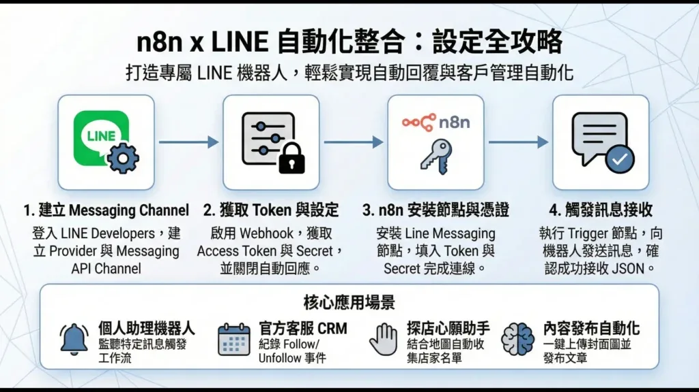
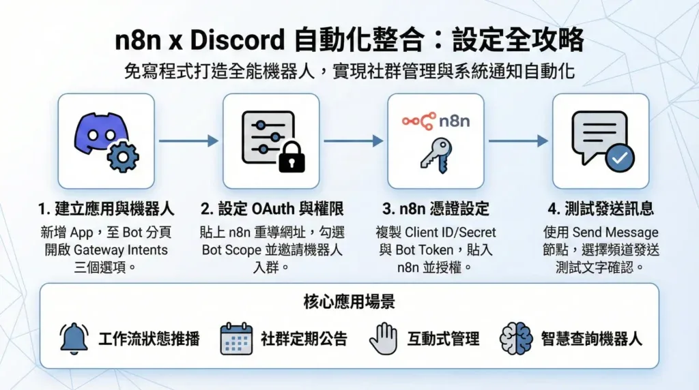
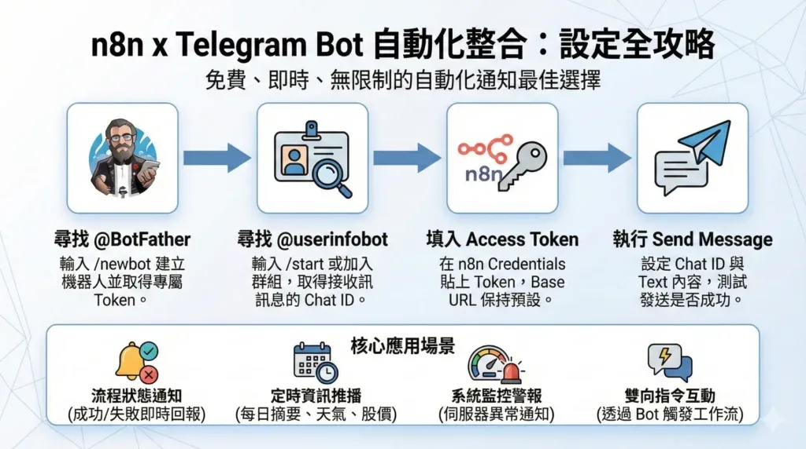
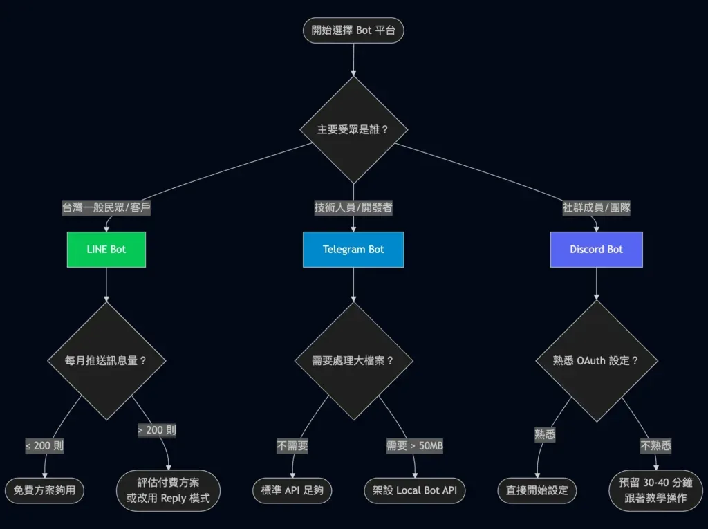
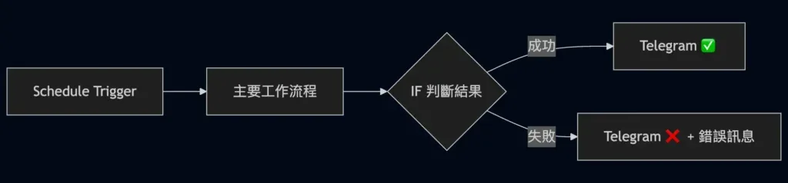
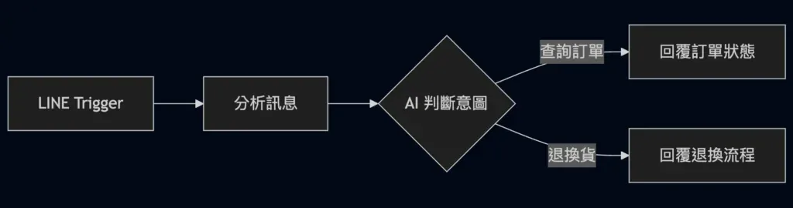
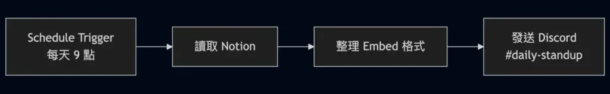
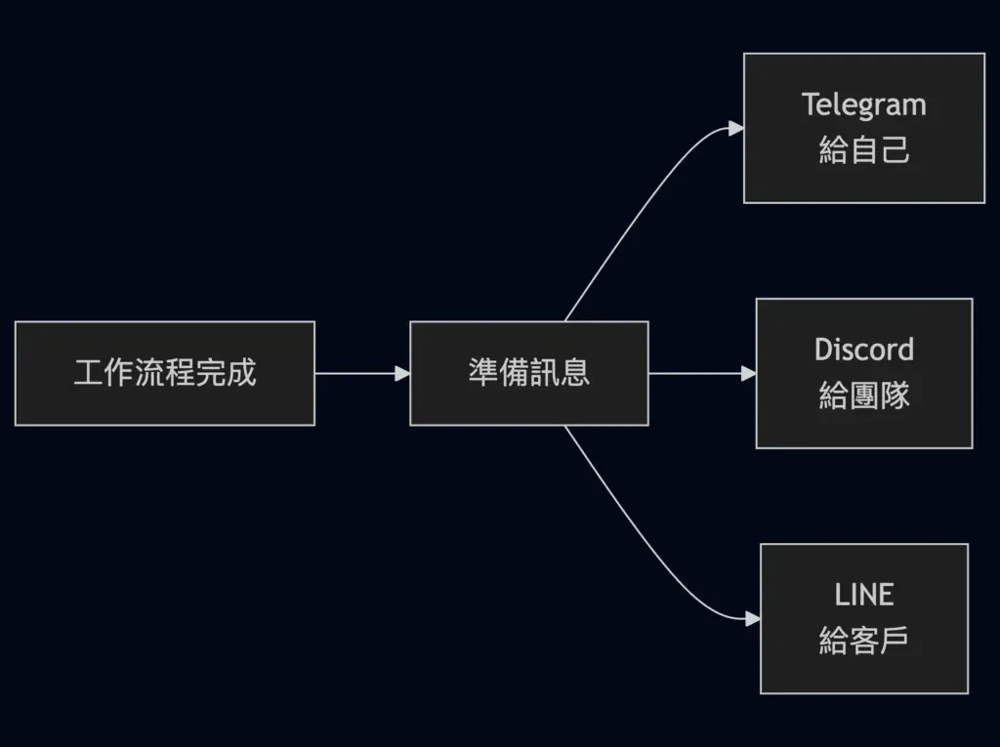

## 前言：n8n 自動化通知，該選哪個平台？

n8n 工作流程跑完了，結果你不知道成功還是失敗，除非自己去後台查看。這種盲目等待的感覺很糟糕。

如果有個機器人能即時通知你執行結果，甚至每天定時推播待辦事項、系統監控警報，工作效率會提升不少。問題是：LINE Bot、Discord Bot、Telegram Bot，到底該選哪一個？

我自己三個平台都設定過，也都寫了完整的教學文章。說實話，設定體驗差很多。Telegram 大概 5 分鐘就搞定，LINE 要建立官方帳號、啟用 Messaging API、安裝社群節點，流程比較繁雜；Discord 的 OAuth 設定最讓我頭痛，Bot 權限那一堆勾選項目，第一次設定真的會搞不清楚要勾哪些。

目前我自己日常最常用 Discord 接收 n8n 通知，主要是因為頻道分類方便，不同專案的通知可以分開管理，不會全部擠在一起。

這篇文章從 n8n 整合的角度，完整比較這三個平台的設定難度、費用限制、功能差異，幫你在 10 分鐘內做出最適合的選擇。

## 三大平台快速比較

先來一張總覽表，讓你快速掌握重點：

比較項目

LINE Bot

Discord Bot

Telegram Bot

設定難度

中等

較高

簡單

設定時間

20-30 分鐘

30-40 分鐘

5-10 分鐘

n8n 節點

社群節點

官方節點

官方節點

免費訊息

200 則/月

無限制

無限制

適合情境

台灣 B2C、客服

社群管理、團隊協作

個人通知、技術監控

台灣普及率

極高（99%）

中等

較低

如果你趕時間，這裡是結論：

-   想要最快上手 → 選 Telegram
-   需要觸及台灣大眾 → 選 LINE
-   經營社群或團隊 → 選 Discord

接下來，讓我們深入分析每個平台。

## LINE Bot：台灣市場首選

### 為什麼選擇 LINE Bot？

LINE 在台灣的使用率達到 99.4%，月活躍用戶超過 2200 萬。如果你的目標受眾是台灣一般民眾，LINE Bot 幾乎是唯一選擇。

LINE Bot 的優勢：

-   台灣用戶基數龐大，觸及率最高
-   Flex Message 支援客製化卡片訊息，視覺效果專業
-   官方帳號功能完整，適合企業行銷
-   LIFF（LINE Front-end Framework）可嵌入網頁應用

### n8n 整合方式

LINE 官方的 LINE Notify 服務已於 2025 年 4 月 1 日終止，原本的 n8n LINE 節點無法使用。現在要整合 LINE，需要安裝社群節點 `@aotoki/n8n-nodes-line-messaging`。

社群節點提供的功能：

-   On Message（Trigger）：接收用戶訊息
-   Reply Message：回覆訊息（不計入免費額度）
-   Send Message：主動推送訊息
-   Multicast：群發訊息
-   Loading Animation：顯示載入動畫
-   Flex Message：發送客製化卡片

### 設定步驟概覽

LINE Bot 的設定流程是三個平台中最繁雜的，需要在 LINE Developers、LINE 官方帳號管理後台、n8n 三個地方來回切換。第一次設定大概需要 20-30 分鐘，主要時間花在建立官方帳號和啟用 Messaging API 的流程上。

1.  前往 LINE Developers 建立 Provider
2.  建立 LINE 官方帳號並啟用 Messaging API
3.  取得 Channel Access Token 和 Channel Secret
4.  在 n8n 安裝 Line Messaging 社群節點
5.  設定 Webhook URL
6.  建立 n8n 憑證並測試

步驟看起來不多，但每一步都有細節要注意。像是啟用 Messaging API 後要記得關閉自動回應，不然會跟 n8n 的回覆打架，使用者會同時收到兩則訊息。

詳細步驟請參考：[n8n 整合 Line 完整教學：Line Bot 設定、憑證設定、節點介紹](/n8n-line-api-integration-tutorial/)

### 費用與限制

[LINE 官方帳號](https://tw.linebiz.com/service/account-solutions/line-official-account/)提供三種方案，免費訊息額度與費用如下：

方案

固定月費

免費訊息則數

加購訊息

輕用量

0 元

200 則

不可加購

中用量

800 元

3,000 則

不可加購

高用量

1,200 元

6,000 則

0.2 元/則起

重點提醒：Reply Message（回覆訊息）不計入免費額度，只有 Send Message（主動推送）才會計算。如果你的 Bot 主要是被動回應用戶詢問，免費方案其實夠用。

### 適合情境

-   電商客服自動回覆
-   官方帳號行銷推播
-   O2O 實體店面整合
-   台灣 B2C 服務通知

## Discord Bot：社群經營利器

### 為什麼選擇 Discord Bot？

Discord 不只是遊戲玩家的聊天工具，現在已經是社群經營的主流平台之一。頻道分類清晰、權限管理細緻、Embed 訊息格式專業，非常適合團隊協作和社群管理。

Discord Bot 的優勢：

-   API 完全免費，無訊息數量限制
-   頻道和角色權限管理細緻
-   Embed 訊息格式美觀專業
-   Reaction（表情符號反應）互動功能豐富
-   適合開源專案、學習社群、遊戲伺服器

### n8n 整合方式

Discord 是 n8n 官方支援的節點，功能完整且持續維護。不過設定流程是三個平台中最複雜的，需要處理 OAuth 2.0 授權，第一次設定大概需要 30-40 分鐘。

官方節點提供的功能：

-   Send Message：發送訊息到頻道
-   Get Channel / Get All Channels：取得頻道資訊
-   Get All Members：取得成員列表
-   Add Reaction：新增表情符號反應
-   Embed 訊息：發送豐富格式訊息

### 設定步驟概覽

1.  前往 Discord Developer Portal 建立 Application
2.  設定 Installation 和 Bot 參數
3.  在 n8n 取得 OAuth Redirect URL
4.  設定 OAuth2 Redirects 和 Scopes
5.  設定 Bot 權限並取得 Generated URL
6.  使用 Generated URL 將 Bot 加入伺服器
7.  取得 Client ID、Client Secret、Bot Token
8.  在 n8n 完成憑證設定並 OAuth 授權

老實說，Discord 的設定流程讓我踩了不少坑。最頭痛的是 Bot 權限設定，Discord Developer Portal 裡面有一大堆權限選項，第一次看到會不知道要勾哪些。如果權限沒設定對，Bot 加入伺服器後會無法發送訊息或讀取頻道。

建議跟著教學一步一步操作，不要跳過任何步驟。設定完成後，記得用 Generated URL 把 Bot 加入伺服器，這步很容易漏掉。

詳細步驟請參考：[用 n8n 打造 Discord Bot：不用寫程式的完整設定教學](/n8n-discord-bot-setup-tutorial/)

### 費用與限制

Discord Bot API 完全免費，但為了防止濫用，[API 請求有頻率限制](https://discord.com/developers/docs/topics/rate-limits)：

限制類型

數值

全域請求

50 次/秒

單一頻道訊息

5 則/秒

無效請求限制

10,000 次/10 分鐘

一般自動化通知不太會超過這些限制，但批次發送時建議加入延遲節點。

### 適合情境

-   開源專案社群管理
-   線上課程學習社群
-   遊戲伺服器通知
-   團隊內部工作流程通知
-   Web3 / NFT 社群經營

## Telegram Bot：技術圈最愛

### 為什麼選擇 Telegram Bot？

如果你追求最快速、最簡單的設定體驗，Telegram Bot 是首選。只要跟 BotFather 聊天就能建立 Bot，5 分鐘內完成 n8n 串接，而且完全免費、無訊息限制。

Telegram Bot 的優勢：

-   設定門檻最低，跟 BotFather 聊天就能建立
-   完全免費，無訊息數量限制
-   API 開放且文件完整
-   支援 Long Polling 和 Webhook 兩種模式
-   Local Bot API 可突破檔案限制（最大 2GB）
-   技術族群接受度高

### n8n 整合方式

Telegram 是 n8n 官方支援的節點，整合方式是三個平台中最簡單的。只需要 Bot Token 就能完成設定。

官方節點提供的功能：

-   Send Message：發送文字訊息
-   Send Photo / Document / Video：發送多媒體
-   Telegram Trigger：接收訊息事件
-   Edit / Delete Message：編輯或刪除訊息
-   Get Chat：取得聊天資訊
-   Pin / Unpin Message：置頂訊息

### 設定步驟概覽

1.  在 Telegram 搜尋 @BotFather 並開始對話
2.  輸入 `/newbot` 建立新 Bot
3.  設定 Bot 名稱和 Username
4.  取得 Bot Token
5.  在 n8n 建立 Telegram 憑證
6.  測試發送訊息

跟 LINE 和 Discord 比起來，Telegram 的設定體驗簡直是天堂。不用進什麼 Developer Portal，不用設定 OAuth，就只是跟 BotFather 聊天、回答幾個問題，5 分鐘內就能拿到 Bot Token，貼到 n8n 就完成了。

如果你是第一次嘗試 n8n 自動化通知，強烈建議從 Telegram 開始，先體驗一下「原來這麼簡單」的感覺，之後再根據需求決定要不要換到其他平台。

詳細步驟請參考：[n8n x Telegram Bot 打造專屬通知機器人：從 BotFather 到互動指令完全教學](/n8n-telegram-bot-notification-tutorial/)

### 費用與限制

Telegram Bot API 完全免費，根據官方文件 [Rate Limit](https://core.telegram.org/bots/faq) 如下：

限制類型

限制數值

說明

私聊訊息

1 則/秒

單一聊天室的限制

群組訊息

20 則/分鐘

同一群組內的限制

廣播訊息

30 則/秒

對不同用戶發送，付費可達 1000 則/秒

檔案上傳

50 MB

架設 Local Bot API 可達 2 GB

檔案下載

20 MB

架設 Local Bot API 可達 2 GB

對於一般自動化通知，這些限制綽綽有餘。私聊 1 則/秒聽起來很少，但你想想，n8n 工作流執行完發一則通知給自己，根本不會碰到這個限制。

### 適合情境

-   CI/CD 建置通知
-   伺服器監控警報
-   定時推播提醒（待辦事項、天氣、股價）
-   工作流程執行結果通知
-   個人自動化助理

## n8n 節點功能詳細比較

從 n8n 開發者的角度，這三個平台的節點功能有明顯差異：

### 節點來源與維護

平台

節點類型

維護方

穩定性

LINE

社群節點

社群開發者

中等

Discord

官方節點

n8n 團隊

高

Telegram

官方節點

n8n 團隊

高

LINE 使用社群節點，更新速度取決於社群開發者。Discord 和 Telegram 的發送訊息功能是官方維護，Bug 修復較有保障。

### Trigger 節點比較

三個平台中，只有 Telegram 有官方 Trigger 節點，而且支援 Long Polling 模式，沒有固定 IP 或 SSL 憑證也能接收訊息。LINE 和 Discord 都需要社群節點，且必須透過 Webhook 接收訊息。

功能

LINE

Discord

Telegram

接收文字訊息

✅

✅\*

✅

接收圖片/檔案

✅

✅\*

✅

Webhook 模式

✅ 必須

✅\*

✅ 可選

Long Polling

❌

❌

✅

\*Discord 需安裝社群節點 [n8n-nodes-discord-trigger](https://github.com/katerlol/n8n-discord-trigger)

### 發送訊息功能比較

功能

LINE

Discord

Telegram

純文字訊息

✅

✅

✅

格式化文字

⚠️ 有限

✅ HTML

✅ Markdown/HTML

圖片訊息

✅

✅

✅

檔案訊息

✅

✅

✅

嵌入式訊息

✅ Flex Message

✅ Embed

❌

按鈕互動

✅

✅

✅ Inline Keyboard

表情符號反應

❌

✅

✅

Discord 的 Embed 訊息和 LINE 的 Flex Message 都能呈現專業的卡片式訊息，適合系統通知和狀態報告。Telegram 雖然沒有原生 Embed，但 Inline Keyboard 按鈕功能很實用。

## 如何選擇：決策流程圖

還是不確定該選哪個？決策核心在於「受眾在哪裡」。台灣一般民眾選 LINE、技術人員選 Telegram、社群團隊選 Discord。選定平台後，再根據訊息量（LINE）、檔案大小（Telegram）、設定熟悉度（Discord）做細部評估。

## 實戰應用案例

### 案例 1：工作流程執行通知（推薦 Telegram）

情境：你有多個定期執行的 n8n 工作流程，想要即時知道執行結果。

工作流程設計：

為什麼選 Telegram：設定最快、完全免費、個人使用不需要其他人配合安裝 App。

### 案例 2：電商客服自動回覆（推薦 LINE）

情境：你經營電商，想要自動回覆常見問題。

工作流程設計：

為什麼選 LINE：台灣客戶幾乎都有 LINE，不需要額外下載 App，觸及率最高。

### 案例 3：團隊專案進度更新（推薦 Discord）

情境：你管理一個開發團隊，想要自動推播專案進度到團隊頻道。

工作流程設計：

為什麼選 Discord：頻道分類清晰、Embed 訊息專業、團隊成員可能已經在用 Discord。

### 案例 4：多平台同步通知（組合使用）

情境：你想要同時通知多個平台的不同受眾。

工作流程設計：

n8n 可以輕鬆實現多平台同步通知，讓不同受眾在自己習慣的平台收到訊息。

## 常見問題 FAQ

**Q1：三個平台可以同時使用嗎？**

可以，n8n 支援同時串接多個平台，根據情境發送到不同通道。

**Q2：LINE 免費額度用完怎麼辦？**

升級付費方案，或改用 Reply Message 回覆訊息（不計入額度）。

**Q3：Discord 的 OAuth 設定一直失敗怎麼辦？**

確認 n8n 的 OAuth Redirect URL 已正確填入 Discord Developer Portal，無多餘空格或斜線。

**Q4：Telegram Bot 可以發送訊息給沒有先跟 Bot 對話的人嗎？**

不行，用戶必須先點擊 Start 與 Bot 開始對話，這是 Telegram 的隱私機制。

**Q5：哪個平台的訊息送達速度最快？**

三者都在 1-2 秒內送達，Telegram 通常最快，Discord 偶有 Rate Limit 延遲。

**Q6：可以用 Bot 做雙向互動嗎？**

都支援。Telegram 最簡單（Trigger 直接支援），LINE 需設定 Webhook，Discord 較複雜。

## 總結：根據需求選擇最適合的平台

選擇 Bot 平台沒有標準答案，取決於你的具體需求：

需求

推薦平台

原因

最快上手

Telegram

5 分鐘完成設定

台灣市場

LINE

99% 使用率

社群經營

Discord

頻道管理強大

完全免費

Telegram / Discord

無訊息限制

企業行銷

LINE

官方帳號功能完整

技術通知

Telegram

開發者首選

我自己目前最常用 Discord 接收 n8n 通知。雖然設定比較麻煩，但頻道分類的功能讓我可以把不同專案、不同類型的通知分開管理。工作流執行結果、系統監控、排程任務，各有各的頻道，不會全部擠在一起。

如果你還是猶豫不決，建議從 Telegram 開始。設定最簡單、完全免費，可以快速體驗 n8n 自動化通知的威力。等到通知變多、需要分類管理時，再考慮搬到 Discord。如果你的受眾是台灣一般民眾，那就直接選 LINE，雖然設定繁雜一點，但觸及率是其他平台比不上的。

## 延伸閱讀

-   [n8n x WordPress 整合指南：API 設定、媒體上傳、自動發文全攻略](/n8n-wordpress-api-integration-guide/)

如果這篇文章對你有幫助，歡迎分享給更多需要的人！

## 參考資料

-   [LINE Developers 官方文件](https://developers.line.biz/)
-   [Discord Developer Portal](https://discord.com/developers/docs)
-   [Telegram Bot API](https://core.telegram.org/bots/api)
-   [n8n Telegram 整合文件](https://docs.n8n.io/integrations/builtin/app-nodes/n8n-nodes-base.telegram/)
-   [n8n Discord 整合文件](https://docs.n8n.io/integrations/builtin/app-nodes/n8n-nodes-base.discord/)
-   [n8n Line Messaging 社群節點](https://github.com/elct9620/n8n-nodes-line-messaging)
