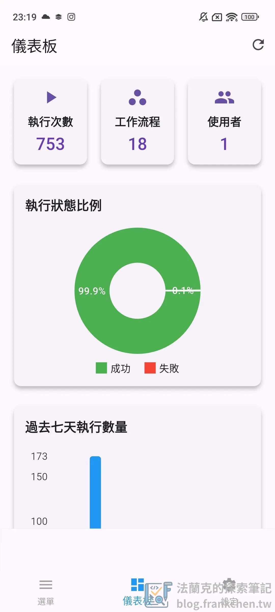

「n8nManager」Landing page: [https://www.frankchen.tw/n8nmanager/](https://www.frankchen.tw/n8nmanager/)

## 前言：告別電腦束縛，自動化盡在掌握！

身處數位時代，n8n 自動化工作流程已成為許多企業和個人提升效率的利器。然而，您是否曾因為不在電腦前，因沒有管理工具App，而錯過即時監控工作流程或處理緊急狀況的時機呢？

好消息來了！法蘭克開發的「n8n 管理工具」App，即將在 Google Play 上線！這款 App 旨在打破空間限制，讓您隨時隨地、輕鬆直覺地監控與管理您的 n8n 工作流程和執行紀錄。

## 為什麼您需要「n8nManager」App？

這款 App 不僅僅是一個簡單的監控工具，更是您掌上的 n8n 行動指揮中心。它將 n8n 的核心管理功能濃縮於您的手機，讓您無論身處何地，都能對您的自動化流程瞭若指掌。

n8nManager App 功能亮點解析：

1.  安全且便捷的伺服器連線管理
    -   **快速設定：** 輕鬆輸入您的 n8n 伺服器 URL 和 API 金鑰，App 會智慧儲存您的設定，省去每次重新輸入的麻煩。
    -   **安全優先：** 您的 API 金鑰將透過 `flutter_secure_storage` 進行高強度加密儲存, 確保敏感資訊安全無虞。
    -   **即時連線測試：** 內建「測試連接」功能，即時驗證 URL 和 API 金鑰的有效性，並強制所有通訊使用 HTTPS 加密, 提供銀行級的傳輸安全。
    -   **智能引導：** 首次啟動或連線失敗時，App 會自動引導至設定頁面，確保您能順利開始使用。
2.  一目瞭然的儀表板概覽
    -   **關鍵數據：** 儀表板會呈現您 n8n 實例的總執行次數、總工作流程數量以及總使用者數量，讓您對整體概況了如指掌。
    -   **執行狀態分析：** 透過直觀的圓餅圖，清晰顯示所有工作流程執行成功與失敗的比例。
    -   **趨勢洞察：** 條形圖則能視覺化呈現過去七天的工作流程執行數量，幫助您快速分析自動化效率趨勢。
3.  彈性高效的工作流程管理
    -   **列表總覽：** 清晰呈現所有工作流程的名稱和啟用狀態。
    -   **多重篩選：** 不僅支援依名稱、ID、標籤進行即時搜尋，更加入了「全部」、「啟用」、「停用」三種狀態篩選。
    -   **詳情與操作：** 點擊進入工作流程詳情頁面，可查看創建/更新日期、專案 ID 等詳細資訊，並直接執行啟用、停用或刪除等操作，所有變更即時同步。
    -   **新增：** 工作流程詳情頁面現已包含「查看執行歷史」按鈕，讓您能快速跳轉至該工作流程專屬的執行記錄列表。
4.  精準掌握執行記錄
    -   **全面追蹤：** 專屬頁面顯示所有工作流程的執行記錄，包含執行 ID、工作流程名稱、狀態、開始/結束時間。
    -   **狀態篩選：** 可按「全部」、「成功」、「錯誤」、「等待中」篩選，快速定位您想查看的執行狀態。
    -   **錯誤詳情：** 對於執行失敗的記錄，可點擊進入詳細頁面，查看由 n8n API 提供的詳細錯誤訊息，便於問題診斷。

## Google Play 免費下載

下載連結：[https://play.google.com/store/apps/details?id=tw.frankchen.n8n\_management\_tool](https://play.google.com/store/apps/details?id=tw.frankchen.n8n_management_tool)

如果你尚未設定 n8n 憑證，可以先參考 [n8n 憑證設定懶人包](/n8n-credentials-setup-complete-guide/)，快速完成 API 金鑰等前置作業。想進一步延伸 n8n 自動化的應用，可以參考 [n8n 整合 Notion 自動發布 WordPress 文章](/n8n-notion-wordpress-publish-automation/) 或 [n8n × WordPress API 整合指南](/n8n-wordpress-api-integration-guide/)。另外，如果你希望在手機收到 n8n 執行通知，搭配 [Telegram Bot 通知機器人](/n8n-telegram-bot-notification-tutorial/) 是個實用的組合。
