## 前言：讓 Notion 成為你的自動化中樞

你是否有以下需求：

-   在 Notion 管理專案任務，希望狀態更新時自動通知到 Telegram 或 Discord
-   在 Notion 撰寫文章，完成後自動發布到 WordPress 部落格
-   定期備份 Notion Database 的資料到 Google Sheet，避免資料遺失
-   收集表單或郵件資訊，自動寫入 Notion Database 方便統一管理

好消息是，透過 n8n 串接 Notion API，以上這些自動化場景都能輕鬆實現！

Notion 的 API 功能強大，可以讀取、建立、更新 Database 和 Page，搭配 n8n 的工作流程設計，能打造出高效的個人或團隊自動化系統。

這篇教學將帶你從零開始設定 n8n x Notion 整合，包含憑證申請、權限設定、以及實用的自動化案例分享。

## 認識 Notion Integration 與 API

### 什麼是 Notion Integration？

Notion Integration 是 Notion 提供給開發者和第三方工具的連接方式。透過建立 Integration，你可以取得一組「密鑰」(Internal Integration Secret)，讓 n8n 能夠存取你的 Notion 工作區。

**Notion Integration 的特點：**

-   **安全性高**：密鑰獨立於登入密碼，可以隨時刪除或重建
-   **權限可控**：可以精準控制 Integration 能存取哪些頁面
-   **支援多種操作**：讀取、建立、更新 Database 和 Page
-   **免費使用**：Notion 免費版即可使用 API 功能

### Notion API 能做什麼？

透過 Notion API，你可以：

-   **Database 操作**：
-   讀取 Database 中的所有記錄
-   新增記錄到 Database
-   更新現有記錄的內容
-   查詢符合條件的記錄（例如：狀態為「進行中」的任務）
-   **Page 操作**：
-   讀取 Page 的內容和 Block
-   建立新的 Page
-   在 Page 中新增內容（文字、標題、清單等）
-   **Block 操作**：
-   讀取 Page 中的所有 Block（段落、標題、圖片、程式碼等）
-   新增 Block 到 Page

注意：Notion API 目前不支援刪除操作，但可以透過更新狀態來標記為「已刪除」或「封存」。

## 第一步：申請 Notion Integration 密鑰

設定 Notion 憑證分為三個主要步驟，跟著做就對了！

### 1.1 前往 Notion 整合頁面

1.  開啟瀏覽器，前往 [Notion Integrations](https://www.notion.so/profile/integrations)
2.  使用你的 Notion 帳號登入
3.  進入後會看到你目前已建立的所有 Integration

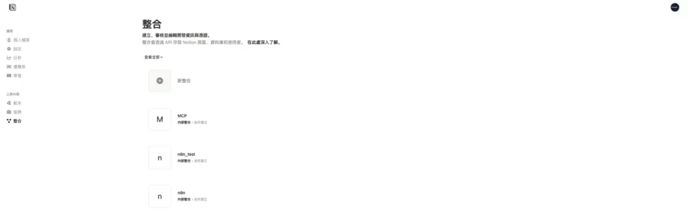

### 1.2 建立新的 Integration

點擊頁面右上角的「新增整合」或「New integration」按鈕。

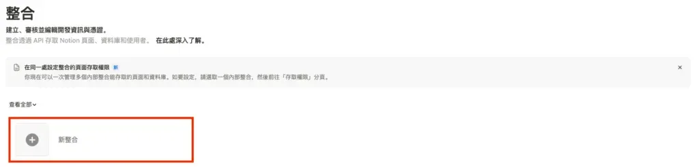

### 1.3 填寫 Integration 資訊

在建立頁面中，你需要填寫以下資訊：

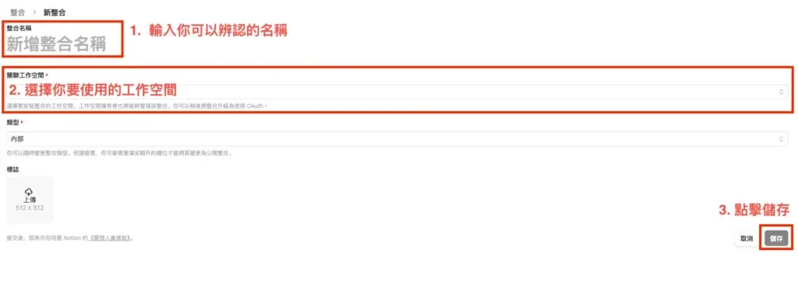

**必填欄位說明：**

1.  **整合名稱**
    -   填入一個你可以辨識的名稱
    -   建議命名：`n8n 自動化工具` 或 `n8n Integration`
    -   這個名稱只有你自己看得到
2.  **關聯的工作區**
    -   選擇你要讓這個 Integration 存取的 Notion 工作區
3.  **類型**
    -   選擇「內部」(Internal)
    -   內部 Integration 只有你自己使用，不會公開給其他人

填寫完成後，點擊「儲存」按鈕。

### 1.4 複製 Integration Secret

建立成功後，你會看到 Integration 的設定頁面。最重要的是「內部整合密鑰」。

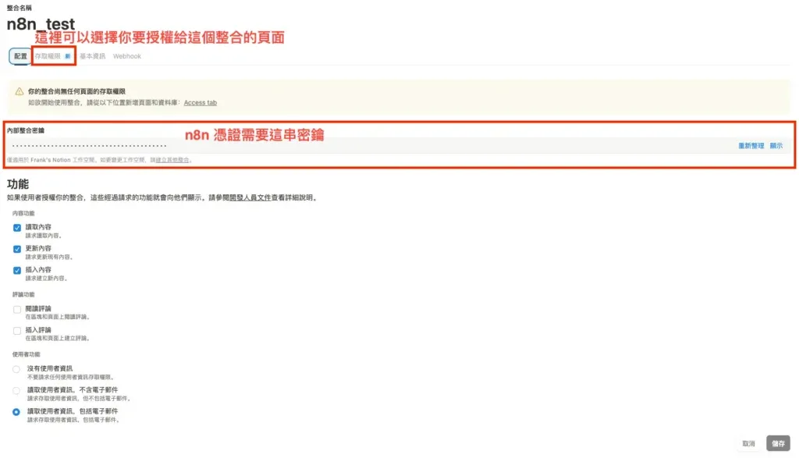

**重要操作：**

1.  找到「內部整合密鑰」區塊
2.  點擊「顯示」按鈕，將密鑰複製到剪貼簿
3.  妥善保存這組密鑰，等一下在 n8n 會用到

**安全提醒：**

-   這組密鑰等同於你的 Notion 帳號密碼，請勿分享或公開
-   如果不小心洩漏，可以隨時到這個頁面「重新產生」新的密鑰

## 第二步：授權 Integration 存取 Notion 頁面

這一步非常重要！很多人設定後無法正常使用，就是因為漏了這個步驟。

### 2.1 為什麼需要授權頁面？

即使你已經建立了 Integration 並取得密鑰，預設情況下它「無法存取任何頁面」。你必須明確告訴 Notion：「我允許這個 Integration 存取哪些頁面」。

這是 Notion 的安全機制，確保你的資料不會被未授權的工具存取。

### 2.2 從 Integration 設定頁面授權

建立 Integration 後，可以直接在設定頁面中管理存取權限：

1.  在 Integration 設定頁面中，點擊「存取權限」分頁
2.  你會看到「頁面和資料庫的存取權限」區塊
3.  點擊右側的「編輯權限」按鈕
4.  在搜尋框中輸入你要授權的頁面或 Database 名稱
5.  選擇要授權的頁面後，點擊「儲存」完成新增

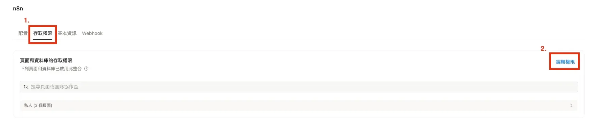

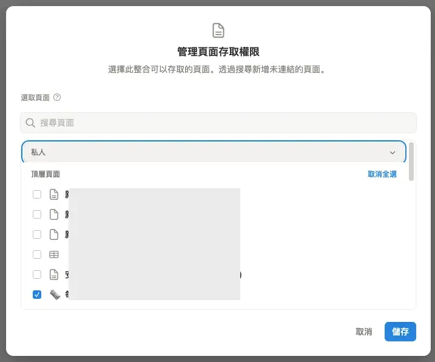

完成後，已授權的頁面會顯示在列表中，你可以看到「私人」分類下有多少個頁面已啟用此整合。

### 2.3 另一種授權方式：從 Notion 頁面端操作

除了從 Integration 設定頁面授權，你也可以直接在 Notion 頁面中操作：

1.  開啟 Notion，找到你要授權的頁面或 Database
2.  點擊頁面右上角的「⋯」按鈕
3.  向下捲動，找到「連接」選項
4.  點擊「新增連接」，輸入你的 Integration 名稱（例如：`n8n 自動化工具`）
5.  點擊該 Integration，完成授權

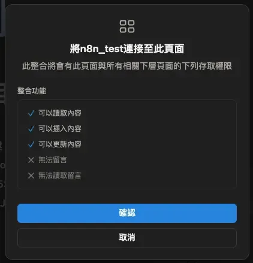

這個方法適合後續新增的頁面或 Database，不用再重新進入 Integration 頁面設定。

### 2.4 權限管理提醒

-   父頁面授權後，其下的子頁面也會自動獲得授權
-   可以隨時從 Integration 設定頁面或 Notion 頁面端取消授權
-   建議使用 Integration 設定頁面統一管理權限，方便檢視所有已授權的頁面；而新增頁面時則可直接從 Notion 頁面端快速授權

## 第三步：在 n8n 設定 Notion 憑證

現在我們已經取得 Notion 的 Integration Secret，接下來就是在 n8n 中建立憑證。如果你還不熟悉 n8n 憑證的統一管理方式，可以先看 [n8n 憑證設定懶人包：常用服務快速導覽](/n8n-credentials-setup-complete-guide/)。

### 3.1 開啟 n8n 憑證設定

1.  登入你的 n8n 平台
2.  點擊「Credentials」分頁
3.  點擊右上角的「Add Credential」
4.  在搜尋框中輸入「Notion」，選擇「Notion API」

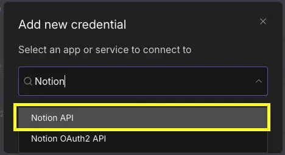

### 3.2 填寫 Notion 憑證

在憑證設定頁面中，只需要填入一個欄位：

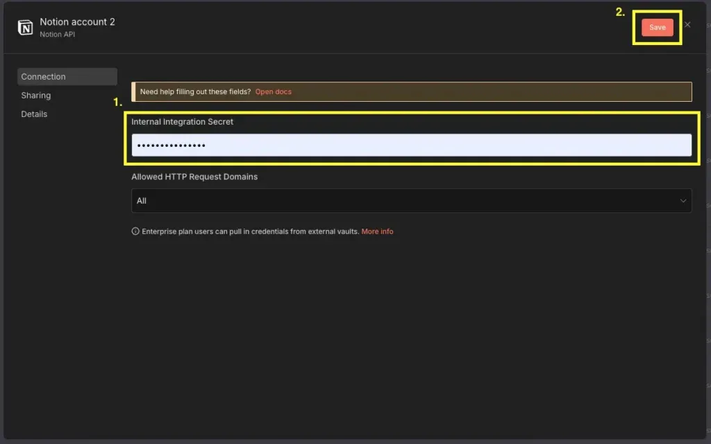

**欄位說明：**

1.  **Internal Integration Secret**

-   貼上剛剛在 Notion 複製的密鑰
-   密鑰格式通常是：`ntn_xxxxxxxxxxxxxxxxxxxxxxxxxxxxxxxxx`
-   確保沒有多餘的空格或換行

填寫完成後，點擊右上角的「Save」按鈕。

### 3.3 憑證命名建議

n8n 會要求你為這個憑證命名，建議使用有意義的名稱，例如：

-   `Notion - 個人工作區`
-   `Notion - 文章管理`
-   `Notion API - Production`

如果你有多個 Notion 工作區或不同用途的 Integration，清楚的命名能幫助你快速識別。

## 第四步：測試 Notion 憑證是否成功

設定完憑證後，讓我們測試一下是否能正常連線。

### 4.1 建立測試工作流

1.  回到 n8n 主頁面
2.  建立一個新的 Workflow（工作流程）
3.  加入一個「Manual Trigger」節點（手動觸發）
4.  加入一個「Notion」節點

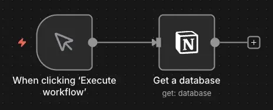

### 4.2 使用 Get a Database 測試

在 Notion 節點中進行以下設定：

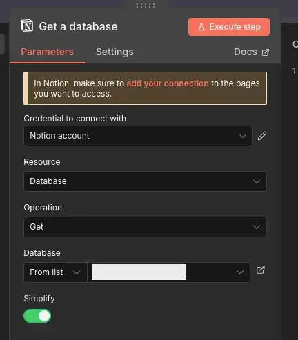

1.  **Credential**：選擇剛剛建立的 Notion 憑證
2.  **Resource**：選擇「Database」
3.  **Operation**：選擇「Get」
4.  **Database**：挑選一個 Database

設定完成後，點擊「Execute Node」（執行節點）按鈕。

### 4.3 驗證結果

如果設定正確，你應該會看到：

-   節點執行成功
-   返回 Database 的資訊（ID、名稱、URL）

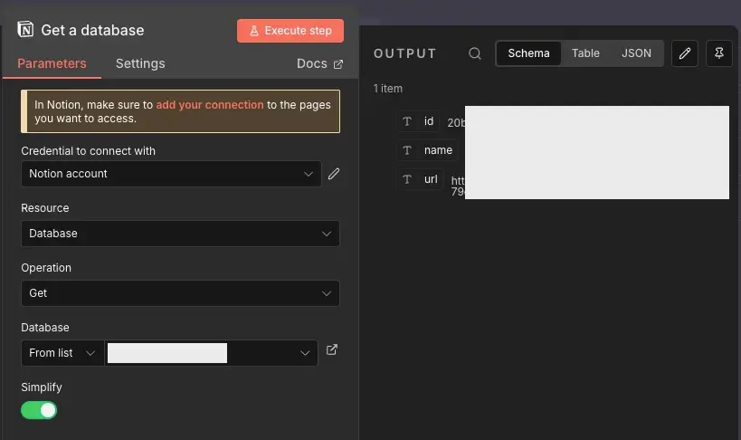

**如果出現錯誤，請檢查：**

-   Integration Secret 是否正確
-   該 Database 是否已授權給 Integration（這是最常見的錯誤！）
-   Database ID 是否正確（確認沒有包含多餘的字元或空格）
-   網路連線是否正常

設定完成！你現在可以開始使用 n8n 操作 Notion 了。

## Notion API 核心概念

了解 Notion 的資料結構，能幫助你更靈活地運用 n8n 自動化。

### Notion 的三層資料結構

Notion 的內容分為三個層級：

1.  **Workspace（工作區）**
    -   最上層，包含所有的 Page 和 Database
    -   一個帳號可以有多個工作區（個人、團隊等）
2.  **Page（頁面）/ Database（資料庫）**
    -   Page：單一頁面，包含文字、圖片、表格等內容
    -   Database：結構化的資料集合，類似於試算表或資料表
    -   Database 本身也是一種特殊的 Page
3.  **Block（區塊）**
    -   Page 的組成單位
    -   每個段落、標題、圖片、清單都是一個 Block
    -   Block 可以巢狀（例如：有縮排的清單）

### Database 的屬性類型

Notion Database 的每筆記錄都有多個屬性（欄位），常見的屬性類型有：

-   標題：每個 Database 必須有一個標題欄位
-   文字：純文字內容
-   數字：數值
-   單選：從預設選項中選一個
-   多選：可以選擇多個選項
-   日期：日期或日期範圍
-   核取方塊：布林值（是/否）
-   網址：連結
-   電子郵件：電子郵件地址
-   關聯：連結到另一個 Database 的記錄
-   彙總：從關聯的記錄中計算值
-   公式：根據其他欄位計算結果

### Notion API 的權限類型

當你建立 Integration 時，可以設定三種權限：

1.  讀取內容
    -   讀取 Page 和 Database 的內容
    -   查詢 Database 記錄
2.  更新內容
    -   更新現有的 Page 或 Database 記錄
    -   修改屬性值
3.  插入內容
    -   建立新的 Page
    -   新增記錄到 Database
    -   在 Page 中新增 Block

建議：除非有特殊安全需求，否則建議開啟所有權限，讓 n8n 有完整的操作能力。

### n8n 中的 Notion 節點操作

在 n8n 的 Notion 節點中，你可以進行以下操作：

-   **Database 操作：**
    -   **Get a database**：取得單一 Database 的資訊
    -   **Get many databases**：取得所有已授權的 Database
    -   **Get a database page**：取得單一 Database Page 中的所有 Block
    -   **Get many database pages**：取得 Database 中的所有記錄
    -   **Create a database page**：新增記錄到 Database
    -   **Update database page**：更新現有記錄
-   **Page 操作：**
    -   **Archive**：封存 Page
    -   **Create**：建立新的 Page
    -   **Search**：搜尋 Page
-   **Block 操作：**
    -   **Append a Blocks**：在 Page 中新增 Block
    -   **Get many child blocks**：取得 Block 中的所有子 Block

## 實戰應用案例

設定好 Notion 憑證後，可以實現哪些自動化應用呢？以下分享兩個簡單的實用案例。

### 案例 1：Notion 內容自動發布到 WordPress

**應用場景：**  
你習慣在 Notion 撰寫部落格文章，寫完後希望自動發布到 WordPress，省去手動複製貼上的麻煩。

**工作流程設計（簡化版）：**

1.  在 Notion Database 中設定文章狀態欄位（撰寫中、撰寫完成、已發布）
2.  n8n 每小時檢查 Notion Database，找出「撰寫完成」狀態的文章
3.  讀取文章的 Block 內容
4.  將 Notion Block 轉換成 WordPress HTML 格式
5.  使用 WordPress API 發布文章
6.  發布成功後，將 Notion 文章狀態更新為「已發布」

**適用情境：**  
內容創作自動化、部落格管理、團隊內容協作

完整的工作流程設定，請參考 [n8n 助你實現 Notion 無縫轉移 WordPress 的完美攻略](/n8n-notion-wordpress-publish-automation/)。

### 案例 2：定期備份 Notion Database 到 Google Sheet

**應用場景：**  
你在 Notion 管理重要的專案資料或客戶資訊，想要定期備份到 Google Sheet，確保資料安全。

**工作流程設計（簡化版）：**

1.  使用「Schedule Trigger」節點（每天或每週自動執行）
2.  使用「Notion」節點取得 Database 的所有記錄
3.  使用「Code」節點整理資料格式（提取需要的欄位）
4.  使用「Google Sheets」節點清空試算表（或新增到最後一行）
5.  將資料寫入 Google Sheet

**適用情境：**  
資料備份、跨平台資料同步、報表生成

如果你的工作流需要進一步自動發布到 WordPress，可以參考 [n8n x WordPress 整合指南：API 設定、媒體上傳、自動發文全攻略](/n8n-wordpress-api-integration-guide/)。

### 其他應用方向

-   **任務狀態通知**：Notion 任務狀態更新時，自動發送 Telegram 或 Discord 通知
-   **表單收集**：Google Form 提交後，自動寫入 Notion Database
-   **行事曆同步**：Notion Database 的日期欄位自動同步到 Google Calendar
-   **AI 內容生成**：使用 ChatGPT 生成內容，自動寫入 Notion Page

## 常見問題 FAQ

**Q1: 為什麼我的 n8n 無法讀取 Notion Database？**

最常見的原因是「沒有授權頁面給 Integration」。請確認你已經在 Notion Database 的「連結」設定中連結了你的 Integration、Integration Secret 正確無誤，以及 Database ID 正確（從 URL 複製的 32 個字元）。

**Q2: 如何處理 Notion 的 Relation 欄位？**

Relation 欄位會返回關聯記錄的 ID 陣列。處理方式是先取得包含 Relation 的記錄，接著提取 Relation 欄位中的 ID，最後使用這些 ID 再次查詢關聯的 Database 來取得詳細資訊。

**Q3: Notion API 有呼叫次數限制嗎？**

是的，Notion API 有速率限制（Rate Limit），每個 Integration 每秒最多 3 個請求，超過限制會收到 429 錯誤。建議在 n8n 工作流中加入「延遲」節點，避免頻繁呼叫。

**Q4: 如何在 n8n 中建立包含多個屬性的 Notion 記錄？**

使用「Create Database Page」操作時，在「Properties」欄位中點擊「Add Field」，依序新增你要設定的屬性（標題、狀態、日期等）。每個屬性需要符合其類型的格式，例如日期要用 ISO 8601 格式。

**Q5: Notion Block 的內容如何轉換成 HTML？**

這是比較進階的應用。基本流程是使用「Get Blocks」取得 Page 的所有 Block，接著用「Code」節點判斷 Block 類型（paragraph、heading\_1、image 等），根據類型轉換成對應的 HTML 標籤，最後將所有 HTML 合併成完整內容。詳細的轉換邏輯，請參考「Notion 轉 WordPress」文章的範例。

**Q6: 可以用 n8n 刪除 Notion 記錄嗎？**

Notion API 目前不支援直接刪除 Page 或 Database 記錄。變通方法是在 Database 中加入「狀態」或「已刪除」欄位，使用「Update」操作將記錄標記為「已刪除」，之後定期手動清理或使用 Notion 的篩選功能隱藏這些記錄。

## 總結與下一步

恭喜你完成 n8n x Notion 的憑證設定！現在你已經可以：

-   ✅ 讀取 Notion Database 的記錄
-   ✅ 新增記錄到 Notion Database
-   ✅ 更新現有記錄的內容
-   ✅ 讀取 Page 的 Block 內容

### 建議的學習路徑

1.  **先從簡單開始**：試著用 n8n 讀取 Database，熟悉 Notion 節點的操作
2.  **實作備份流程**：定期備份 Notion Database 到 Google Sheet
3.  **挑戰進階應用**：實作 Notion 到 WordPress 的內容自動發布
4.  **優化工作流程**：加入錯誤處理、通知機制、條件判斷

### 需要更多幫助嗎？

如果你在設定過程中遇到問題，或是有任何建議，歡迎：

-   在文章底下留言
-   到我的 [Threads](https://www.threads.com/@frank.dev.notes) 或 [Instagram](https://www.instagram.com/frank.dev.notes/) 私訊我

## 參考資料與延伸閱讀

### 參考資料

-   [n8n Notion node 文件](https://docs.n8n.io/integrations/builtin/app-nodes/n8n-nodes-base.notion/) - n8n 官方 Notion 節點文件
-   [Notion API 文件](https://developers.notion.com/) - 查詢所有有關 Notion API 的端點資料

### 延伸閱讀

-   [n8n 整合 Canva 完整教學：OAuth 2.0 憑證設定與測試指南](/n8n-canva-oauth-setup/)

如果這篇文章對你有幫助，歡迎分享給更多需要的人！
