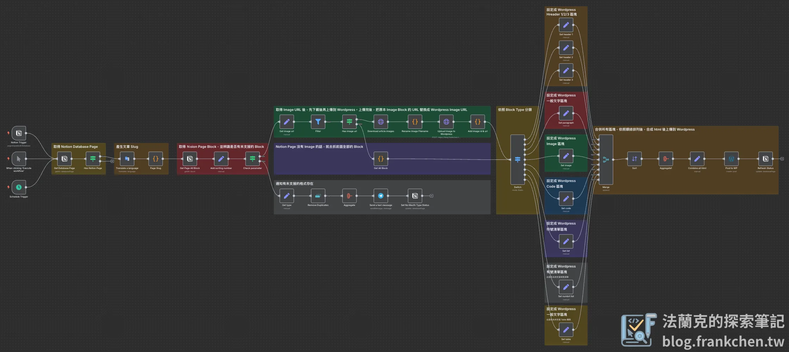
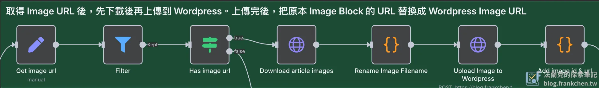
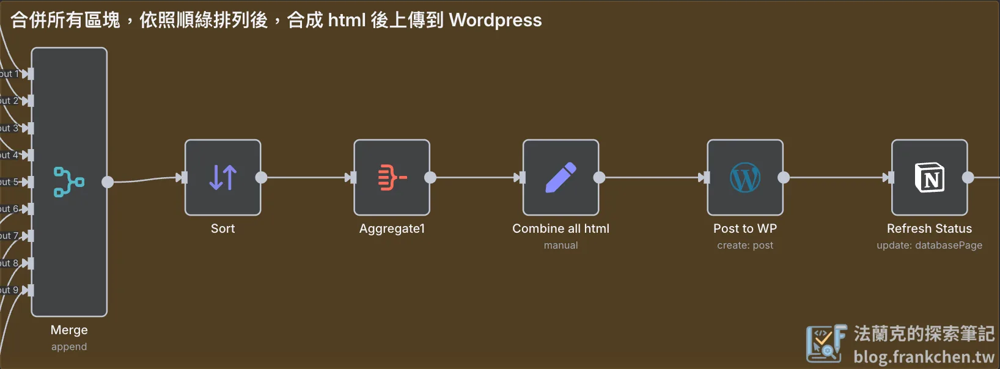
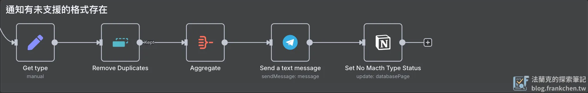
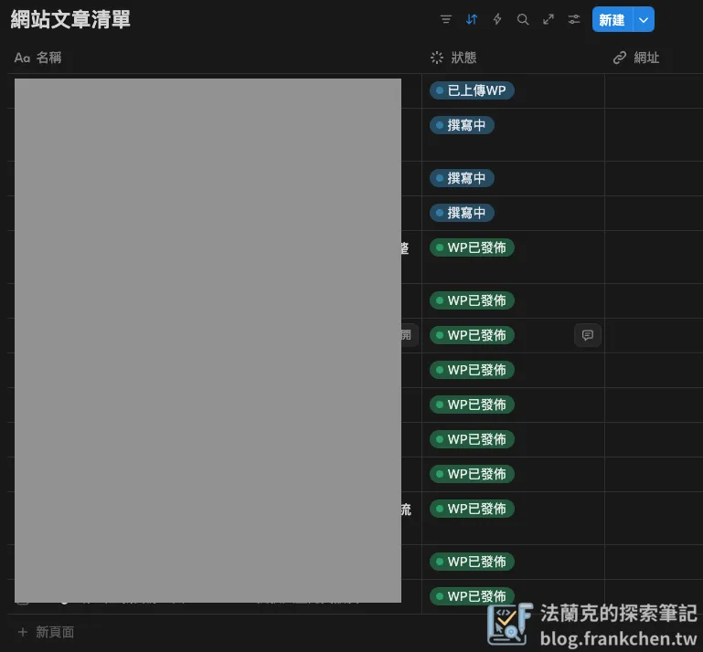
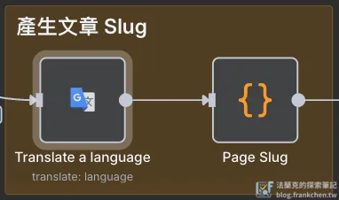

## 你還在 Notion 和 WordPress 之間當「搬運工」嗎？

現在習慣在 Notion 上整理所有的資料，所以一樣會在 Notion 把要發的文章內容先編輯好後，再轉發到 WordPress 上。但是，搬了幾次內容之後發現，文字內容搬運簡單，但是圖片要「先下載，再上傳」，如果文章圖片一多，這實在是一個麻煩事。

剛好有在玩 [n8n](https://n8n.io/) 這個自動化工作流程，一個無程式碼/低程式碼 (No-Code / Low-Code) 的工作流程，提供上百種的節點，讓你自行客製化你自己的工作流程。

今天，我將分享一個完整的 n8n Workflow 教學，引導你如何完美串接 Notion 和 WordPress。

## n8n 工作流程設計思路：如何讓 Notion 與 Wordpress 自動化 協作？



這個 Workflow 的設計靈感來自於內容發佈的實際需求：從內容生成、格式轉換、到最終發佈，每一步都應該盡可能自動化。

這套 n8n Workflow 的設計目標，就是要像一個高效的數位編輯，為你處理所有繁瑣的技術細節。以下是整個流程的運作核心與設計精髓：

### 流程觸發：精準啟動，不略過任何文章

工作流程提供多種觸發條件，確保每篇撰寫城城的文章都能被轉換。

-   **手動執行 (Manual Trigger)**：適合測試或要節省自動觸發時間可以選擇手動觸發，更快的讓你的 Notion Page 轉換成 Wordpress 文章。
-   **排程觸發 (Schedule Trigger)**：可以設定每小時或每天自動檢查 Notion。
-   **Notion 狀態偵測 (Notion Trigger)**：定期檢查 Notion 的 Database 是否有更動，與排程觸發類似效果。

### 智慧處理文章區塊：將 Notion 語言翻譯成 Wordpress 語言

Notion 的內容是由不同的 Block 組成，例如標題、清單、圖片、程式碼等。但 Wordpress 有自己專屬的格式（HTML 區塊）。這個工作流最核心的設計，就是建立一個強大的翻譯引擎。

流程會逐一讀取 Notion Page 中的每一個 `Block`，並透過 Switch 節點進行判斷：

-   如果是 `heading_1`，就轉換成 `<h1>` 標籤。
-   如果是 `paragraph`，就轉換成 `<p>` 段落標籤。
-   如果是 `code`，則轉換成 `<pre>` 程式碼區塊。

這種模組化的設計，讓你能夠精準地將 Notion 格式對應到 Wordpress 格式，確保文章排版的一致性。

### 克服圖片難題：自動化上傳與連結替換

圖片處理是手動搬運中最令人頭痛的一環。這個的 n8n 工作流完美解決了這個問題：

-   **自動偵測**：流程會自動偵測 Notion 內容中的所有圖片 Block。

-   **下載並重新命名**：它會先透過 `HTTP Request` 下載圖片，並使用文章標題產生的 slug 作為檔名，讓圖片上傳 Wordpress 後更好管理。

-   **上傳到 WordPress 媒體庫**：接著，它會將圖片直接上傳到 Wordpress 媒體庫，獲得一個專屬的 WordPress 網址及圖片 ID。

-   **替換連結**：流程會自動將原始 Notion 圖片連結替換成 Wordpress 的新連結，確保所有圖片都能正常顯示，不再依賴 Notion 伺服器。



### 合併與發佈：從零碎的區塊到完整的文章

當所有區塊都轉換成 HTML 格式後，流程會按照原始順序將它們合併在一起，確保你的文章結構完整不變。最終，這篇完整的 HTML 文章會透過 Wordpress API 自動發佈到你的網站後台，並設定為草稿狀態，讓你在發佈前仍有最終檢查的機會。



### 錯誤處理與通知：讓你隨時掌握狀況

流程中特別設計了錯誤偵測機制。如果遇到不支援的 `Block` 類型（例如表格 Table），流程會立即停止，並透過 Telegram 向你發送通知。這能確保文章不會因為轉換失敗而發佈不完整，讓你能夠及時手動處理或優化工作流。



如果之後在使用過程中遇到不支援的 Block 也歡迎底下留言或透過 Mail ( [qwer4488999@gmail.com](mailto:qwer4488999@gmail.com) ) 聯絡我，我會更新工作流。或是對於工作流有什麼修改上的建議，讓整體變得更好的想法，也歡迎留言交流。

## 一步步打造你的 n8n Notion 轉 WordPress 自動化 工作流程

### 工作流會使用的憑證

-   Notion：取得 Page 及 Block 內容，教學文章參考 [n8n 整合 Notion 完整教學：API 設定、Database 操作、實戰案例](/n8n-notion-api-integration-tutorial/)

-   Wordpress：上傳圖片、文章，憑證設定教學請參考 [n8n x WordPress 整合指南](/n8n-wordpress-api-integration-guide/)

-   Google Translate：翻譯文章標題作為 Slug (未來可串 AI 進行 SEO 優化)

-   Telegram：發送錯誤訊息

其他的憑證設定看這邊 👉 [點擊前往](/n8n-credentials-setup-complete-guide/)。

### Notion Page Database 資料結構

-   使用 Database 的表格瀏覽模式，設定兩個欄位「**名稱**」、「**狀態**」。

-   狀態欄位是用標籤模式，標籤包含『**撰寫中**』、『**撰寫完成**』、『**有未支援的格式**』、『**已上傳WP**』、『**WP 已發佈**』。

-   這個工作流程會篩選『**撰寫完成**』狀態的文章，上傳到 WordPress，上傳完成後會把狀態切換為『**已上傳WP**』。

-   如果偵測到沒辦法轉換的 Block ，會把狀態設定為『**有未支援的格式**』。



### 產生文章 Slug

文章的 Slug 很重要，但是如果是用中文作為 Slug，在網址呈現上會看起來像是亂碼，所以會先將文章標題轉成英文後，再透過 Code 節點把所有特殊符號及空白去除後，就可以得到全英文的 Slug，這樣在之後的文章連結看起來就會比較整齊。



記得，這裡使用的 Google Translate 功能，要將 Google Cloud 上面的「**Google Translate API**」啟用。

### 圖片處理

-   Notion 會提供圖片的下載連結，所以要先將圖片下載到 n8n，根據前面產生的 Slug 重新命名檔案名稱後，再上傳到 Wordpress。

-   這裡要先上傳到 Wordpress 的原因是因為上傳完成後，WordPress 會回傳圖片的 ID 及連結，這在後面轉換格式時需要使用。

-   Upload Image to Wordpress 節點裡的 URL 請輸入你自己的 WordPress 網址，並在後面加上 `/wp-json/wp/v2/media`（如：`https://your.wordpress.url/wp-json/wp/v2/media`）。WordPress API 設定方法請見[「n8n x WordPress 整合指南：API 設定、媒體上傳、自動發文全攻略」](/n8n-wordpress-api-integration-guide/)。


### 格式轉換

Notion 是以 Block 概念堆砌整篇文章，而 WordPress 是用 HTML 語法堆砌出文章，一段 HTML 就可以視為一個 Block，所以這裡的功用就是要找出 Notion 對應到 WordPress 的 HTML 語法，然後填入對應的內容。

以 H2 為例，在 Notion 的 Type 會是 heading\_2，而在 Wordpress 的語法如下：

```html
<!-- wp:heading {"level":2} -->
<h2 class="wp-block-heading">H2</h2>
<!-- /wp:heading -->
```

目前還有尚未解決的問題：

-   如果文字段落裡面有任何被格式化 (粗體、連結、程式碼等) 的文字，沒有辦法複製到 WordPress，只能手動調整。

## 發佈到 Wordpress，一切就緒！

## 這只是自動化內容發佈的起點

有了這套工作流程後，文章的轉換效率變高了，現在只要一鍵就能完成轉換，在發布前快速校對看哪邊有錯誤重新調整後，就能發布文章了。

後續會持續發布更新版本，請大家隨時關注，或是訂閱我的電子報，有更新我會以電子報形式傳送。

Notion Page 轉 Wordpress Article (基本版) 工作流 👉 [點擊下載](https://portaly.cc/frankchentw/product/PTyYxYSr0JE32Ca9j2WV)
