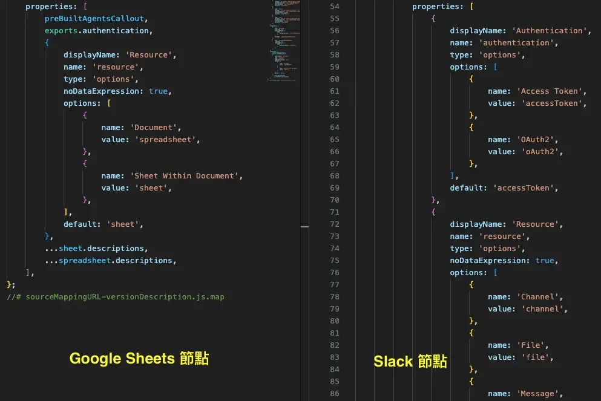
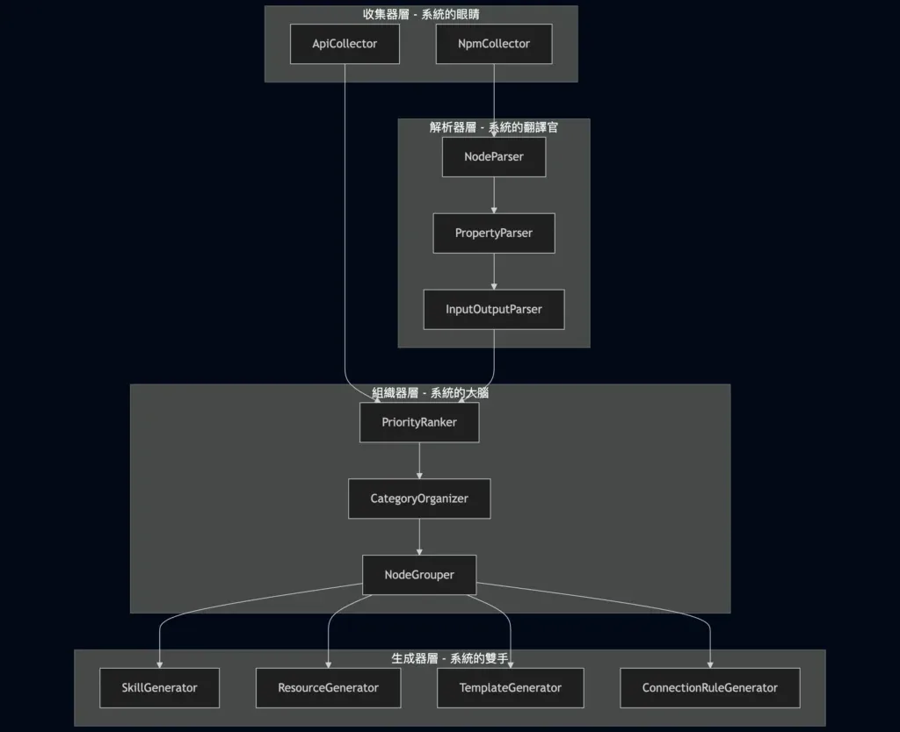
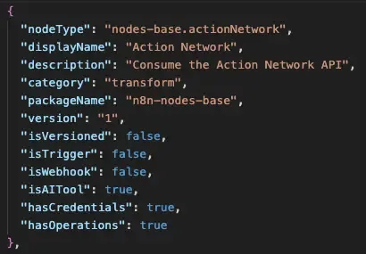
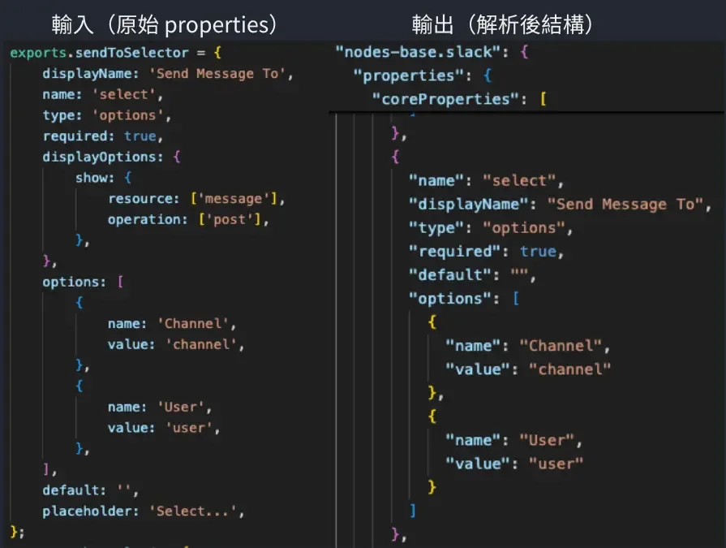
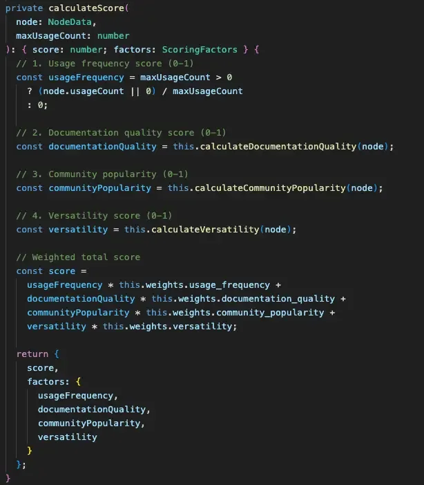
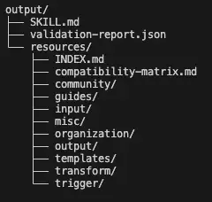

## 前言：為什麼我要寫這篇

在開發 n8n-skills 專案的過程中，我踩了不少坑。最讓我印象深刻的是：n8n 有超過 500 個節點，每個節點的結構都不太一樣。

一開始我天真地以為「不就是解析 JSON 嗎？應該很簡單吧」。結果實際動手才發現，光是節點的 `properties` 欄位就有各種奇怪的變體——有的節點用巢狀結構、有的用 `loadOptions` 動態載入、有的甚至同一個節點有多個版本，每個版本的欄位定義都不同。

這讓我意識到，如果沒有一個好的架構來處理這些複雜度，程式碼很快就會變成一團亂麻。

這篇文章會分享我在設計 n8n-skills 時採用的四層式 Pipeline 架構。如果你也在做類似的資料處理專案，或是對軟體架構設計有興趣，這篇應該會對你有幫助。

> 本文是 n8n-skills 技術解密系列的第一篇，主要聚焦在架構設計。如果你還不清楚這個專案在做什麼，建議先看[從 0 到 1 打造 n8n AI 技能包](/n8n-skills-claude-ai-skill-pack-tutorial/)。

## 為什麼需要 Pipeline 架構？

在談架構之前，先讓你了解一下我們要處理的問題有多複雜。

### n8n 節點結構的挑戰

n8n 的節點定義是用 TypeScript 類別來描述的，每個節點都有自己的 `description` 物件，裡面包含了節點的名稱、輸入輸出、以及最重要的 `properties` 陣列。

問題來了：這 500 多個節點的 `properties` 結構差異很大。

舉例來說：

-   一般節點的 `properties` 就是一個扁平的陣列
-   但有些節點（像是 Google Sheets）會用 `loadOptions` 來動態載入選項
-   AI 相關的節點（LangChain 系列）又有完全不同的結構，它們的輸入輸出是用 `ai_agent`、`ai_tool` 這種特殊類型
-   更麻煩的是，同一個節點可能有多個版本（`nodeVersions`），每個版本的 properties 都不一樣



如果你把所有邏輯都寫在同一個地方，很快就會遇到這種情況：

```ts
// 這種程式碼你一定看過（或寫過）
if (node.type === 'trigger') {
  // 處理 trigger
} else if (node.properties?.loadOptions) {
  // 處理動態載入
} else if (node.name.includes('langchain')) {
  // 處理 AI 節點
} else if (node.nodeVersions) {
  // 處理版本化節點
  if (version === 1) {
    // ...
  } else if (version === 2) {
    // ...
  }
}
// 無限 if-else 地獄
```

這種程式碼不只難維護，更難測試。每次新增一種節點類型，你都得擔心會不會影響到其他邏輯。

### 從 n8n-mcp 專案學到的經驗

在設計架構之前，我 Google 了一下有沒有人做過類似的事情，找到了 n8n-mcp 這個開源專案。它也是在處理 n8n 節點的解析問題，採用了分層的設計概念。

我沿用了它的大部分設計思路，但針對 n8n-skills 的需求做了擴充。主要的差異是：

-   n8n-mcp 專注在「讓 LLM 能呼叫 n8n 節點」
-   n8n-skills 則是要「產生 AI 可讀的技能文件」

這兩個目標雖然相關，但需要的處理流程不太一樣。n8n-skills 需要更複雜的分類、排序和文件生成邏輯，所以我在原有的基礎上加了 Organizers 和 Generators 兩層。

## 四層架構總覽

好，讓我們正式進入架構設計。

n8n-skills 採用四層式的 Pipeline 架構，每一層只負責一件事，然後把處理結果往下傳。你可以把它想像成工廠的生產線：原料進來，經過不同工站的加工，最後產出成品。



用一句話來描述每層的角色：

| 層級 | 比喻 | 職責 |
| --- | --- | --- |
| Collectors | 系統的眼睛 | 從各種來源收集原始資料 |
| Parsers | 系統的翻譯官 | 把雜亂的原始資料轉成結構化格式 |
| Organizers | 系統的大腦 | 分類、排序、決定優先級 |
| Generators | 系統的雙手 | 產出最終的檔案 |

資料就像水流一樣，從 Collectors 流入，經過 Parsers 翻譯、Organizers 整理，最後由 Generators 輸出成檔案。每一層都只專注在自己的工作，不用管上游是怎麼取得資料的，也不用管下游要怎麼使用。

## 各層詳細說明

接下來讓我一層一層帶你看，每層實際上在做什麼。

### Collectors：收集器層

收集器層是整個系統的入口，負責從不同的資料來源把原始資料抓回來。

目前有兩個 Collector：

NpmCollector 負責從 NPM 套件載入 n8n 節點的類別定義。這裡要處理的問題包括：

-   動態載入 TypeScript 類別
-   處理版本化節點（同一個節點可能有 v1、v2 不同版本）
-   處理原生模組的載入問題

ApiCollector 則是從 n8n.io 的公開 API 抓取工作流程範本和節點使用統計。這些數據會在後面的 PriorityRanker 用到，幫助我們判斷哪些節點比較重要。



這層的設計重點是：不做任何資料轉換，只負責把原始資料原封不動地取回來。這樣做的好處是，如果未來有新的資料來源（比如從資料庫讀取），只要新增一個 Collector 就好，不用改動其他層的程式碼。

### Parsers：解析器層

解析器層是整個系統中邏輯最複雜的一層。它的工作是把 Collectors 收回來的原始資料，轉換成結構化的格式。

三個 Parser 各司其職：

NodeParser 負責解析節點的基本資訊：

-   displayName（顯示名稱）
-   description（描述）
-   version（版本號）
-   節點類型判斷（是 trigger 還是一般節點？是 AI 節點嗎？）

PropertyParser 是最複雜的部分，也是我花最多時間的地方。它要處理節點的 `properties` 陣列，提取出：

-   核心屬性（必填欄位）
-   操作列表（這個節點能做什麼事）
-   憑證需求（需要哪些 API Key）

前面提到的「不同節點格式差異大」問題，主要就是在這個 Parser 處理。我大概花了兩三天在研究各種節點的 properties 結構，一個一個節點去看它的 JSON 長什麼樣子，歸納出共通的模式，然後寫出能涵蓋大部分情況的解析邏輯。



InputOutputParser 負責分析節點的連接類型。n8n 的節點可以有不同類型的輸入輸出：

-   `main`：一般的資料流
-   `ai_agent`：AI Agent 連接
-   `ai_tool`：AI 工具連接

這個資訊對於後面建立「節點相容性矩陣」很重要——我們需要知道哪些節點可以互相連接。

### Organizers：組織器層

解析完資料之後，接下來要做的是分類和排序。這就是 Organizers 的工作。

PriorityRanker 採用多維度評分系統，計算每個節點的重要程度。評分的依據包括：

-   在官方範本中的出現頻率
-   節點的使用統計數據
-   節點的功能類型（核心功能節點通常比較重要）

根據分數，節點會被分成三個等級：

| 等級 | 說明 | 數量 |
| --- | --- | --- |
| Essential | 核心節點，幾乎每個工作流都會用到 | 約 10 個 |
| Common | 常用節點，特定場景會用到 | 約 50 個 |
| Specialized | 專門用途節點，較少使用 | 其餘節點 |



CategoryOrganizer 負責把節點分配到 6 大類別：

-   Transform：資料轉換
-   Input：資料輸入
-   Output：資料輸出
-   Trigger：觸發器
-   Organization：流程控制
-   Misc：其他

NodeGrouper 則是根據功能關係把相關的節點群組在一起，方便後續生成文件時做分類。

### Generators：生成器層

最後一層是 Generators，負責把整理好的資料輸出成實際的檔案。

SkillGenerator 生成主要的 `Skill.md` 檔案。這個檔案會放在 AI 的 context 中，讓 AI 知道有哪些節點可以用。因為 context window 有限，這個檔案只會包含前 10 個最重要的節點（Essential 等級）。

ResourceGenerator 生成詳細的節點文件。這些文件會用 `@` 語法讓 AI 在需要時載入。這裡實作了一個關鍵的「分層合併策略」，讓 AI 可以先看摘要，有需要再載入完整內容。

TemplateGenerator 生成工作流程範本文件，提供常見場景的實作參考。

ConnectionRuleGenerator 生成節點相容性矩陣，告訴 AI 哪些節點可以互相連接。



## 這個設計帶來什麼好處？

講了這麼多架構細節，你可能會問：這樣設計有什麼具體好處？

### 關注點分離（Separation of Concerns）

每一層只需要專注在自己的工作上。Collectors 不管資料要怎麼解析，Parsers 不管資料要怎麼排序，Organizers 不管最終要輸出什麼格式，Generators 不管資料是從哪裡來的。

這讓程式碼變得好理解。當我要修改某個功能時，很清楚該去哪個檔案找。

### 可擴展性

想增加新功能？只要在對應的層級加入新的元件就好：

-   想支援新的資料來源？加一個新的 Collector
-   想解析新的節點類型？加一個新的 Parser
-   想改變排序邏輯？修改 PriorityRanker
-   想支援新的輸出格式？加一個新的 Generator

從 n8n-mcp 專案學來這個架構後，我在上面擴充了 Organizers 和更多的 Generators，整個過程都很順利，不需要大改原有的程式碼。

### 可測試性

每個元件都可以獨立測試。專案裡有針對每一層的測試腳本：

```text
test-npm-collector.ts    # 測試節點載入
test-io-parser.ts        # 測試輸入輸出解析
test-priority-ranker.ts  # 測試優先級計算
```

當某個測試失敗時，你可以很快定位到是哪一層出了問題，不用在整個程式碼庫裡大海撈針。

### 效能優化

因為每層的輸入輸出都是明確的，我們可以在層與層之間加入快取機制。

目前的實作會把每一層的輸出都快取到 `data/cache/` 目錄。這樣在開發時，如果你只是修改 Generator 的邏輯，就不需要重新跑 Collector 和 Parser，直接從快取讀取就好。

這對開發效率的影響有多大？NpmCollector 載入所有 500 多個節點類別要跑 30 秒以上，有快取的話則是秒開。每次改一行程式碼就要等半分鐘，累積起來很可觀。

## 目前的限制與未來方向

這個架構雖然解決了大部分問題，但還是有一些限制需要說明。

### 某些節點類型還沒完全支援

目前 PropertyParser 主要針對常見的節點結構做處理。有一些比較特殊的節點類型還沒完全支援，包括：

-   某些使用 `loadOptions` 動態載入選項的節點
-   一些比較舊的節點，結構跟新版節點差很多
-   部分第三方社群開發的節點

如果你在使用時發現某個節點的資訊不完整，很可能就是這個原因。

### 快取失效機制還可以更完善

目前的快取是用時間戳記來判斷是否過期，但沒有做到「只重新處理有變動的節點」。這表示如果 n8n 更新了某一個節點，整個快取都要清掉重來。

未來打算實作更細緻的增量更新機制，只針對有變動的節點重新處理。

### 後續文章預告

這篇講的是整體架構設計，下一篇會深入探討專案中另一個核心問題：如何在有限的 LLM context window 中，讓 AI 能有效存取 500 多個節點的資訊。

這牽涉到分層合併策略和索引機制的設計，是 n8n-skills 專案另一個比較有趣的技術挑戰。

## 結語

從開始設計到完成這四層架構，前後大概花了一週。回頭看，這個投資是值得的。

當我需要支援新的節點類型時，我知道該去改 Parser；當輸出格式要調整時，我知道只要動 Generator。不用在整個程式碼庫裡面翻找，也不用擔心改了 A 會不會爆掉 B。

如果你也在做類似的資料處理專案，希望這篇的經驗對你有幫助。

系列文章導航：

1.  從 0 到 1 打造 n8n AI 技能包
2.  **\[目前位置\]** 架構設計篇：四層式 Pipeline
3.  核心演算法篇：分層合併與索
4.  工程實戰篇：動態載入與 CI 優化

---

相關閱讀：

- [n8n 整合 Notion 完整教學：API 設定、Database 操作、實戰案例](/n8n-notion-api-integration-tutorial/)
- [n8n x WordPress 整合指南：API 設定、媒體上傳、自動發文全攻略](/n8n-wordpress-api-integration-guide/)
- [不用再當搬運工！n8n 助你實現 Notion 無縫轉移 WordPress 的完美攻略](/n8n-notion-wordpress-publish-automation/)
