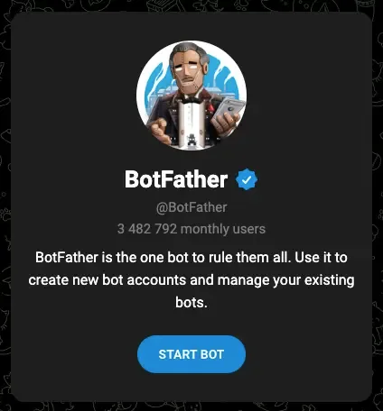
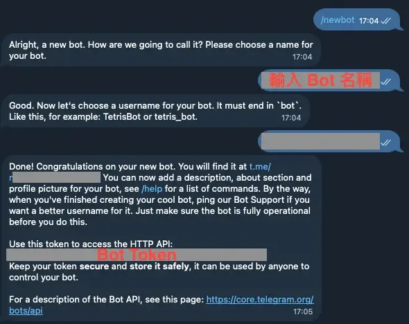
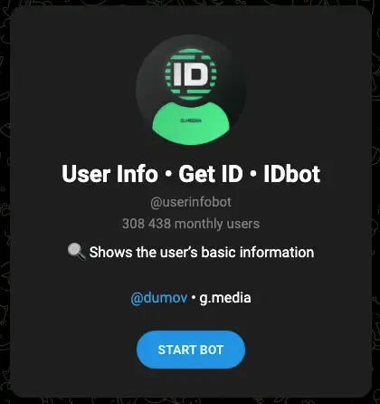
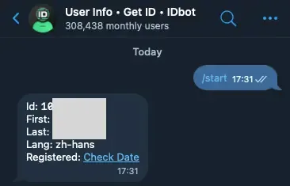
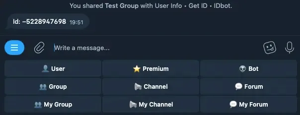
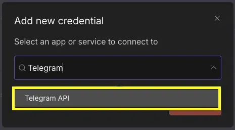
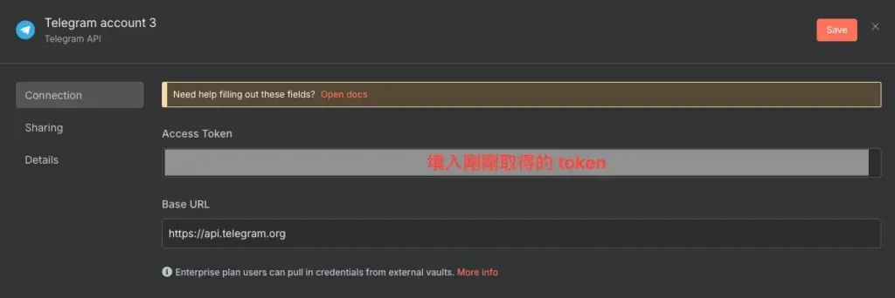
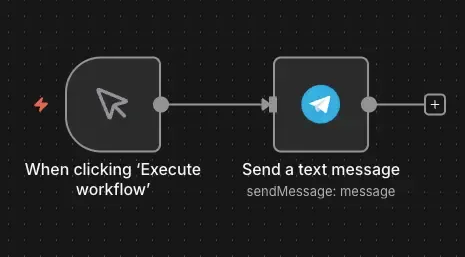
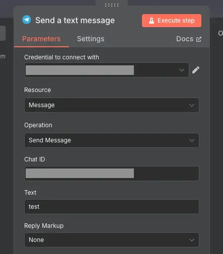
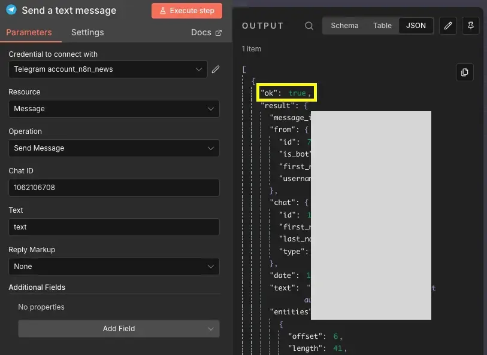

## 前言：Telegram Bot 是你的自動化最佳夥伴

n8n 工作流程跑完了，但你不會知道它成功還是失敗，除非自己去後台查看。這時候如果有個機器人能即時通知你執行結果，甚至每天定時推播待辦事項、讓你用指令觸發備份流程，工作效率會提升不少。

Telegram Bot 就是實現這些自動化通知的最佳選擇。相較於 LINE Bot 需要申請開發者帳號、Discord Bot 要設定 OAuth，Telegram Bot 的設定簡單到不可思議：只要跟 BotFather 聊天就能建立，完全免費、沒有訊息數量限制，而且訊息送達速度快，非常適合用來接收工作流程的即時通知。

這篇教學將帶你從零開始設定 n8n x Telegram Bot 整合，讓你的自動化系統能夠「開口說話」，即時通知你重要資訊。

## 認識 Telegram Bot 與 n8n 的整合方式

### 什麼是 Telegram Bot？

Telegram Bot 是 Telegram 提供的自動化帳號，可以接收訊息、發送訊息、執行指令等。與一般用戶不同，Bot 是專門設計來與其他程式互動的。

**Telegram Bot 的特點：**

-   **無需伺服器**：Bot 可以透過 Telegram 的 API 運作，不需要自己架設伺服器
-   **支援指令**：可以定義 `/start`、`/help`、`/status` 等指令
-   **支援按鈕和鍵盤**：可以建立互動式選單，提升用戶體驗
-   **支援群組**：Bot 可以加入群組，管理成員或自動回覆
-   **支援檔案傳輸**：可以發送和接收圖片、文件、影片等

### Telegram Bot 在 n8n 中的應用場景

透過 n8n 整合 Telegram Bot，你可以實現：

1.  **通知類應用：**
    -   工作流程執行成功或失敗的通知
    -   定時推播資訊（每日摘要、天氣預報、股價提醒）
    -   系統監控警報（伺服器負載、錯誤日誌）
2.  **互動類應用：**
    -   透過 Telegram 指令觸發 n8n 工作流程
    -   建立問答機器人（結合 AI 或資料庫）
    -   表單收集（透過對話收集資訊並寫入 Notion 或 Google Sheet）
3.  **資訊查詢類應用：**
    -   查詢資料庫資訊（例如：/status 查看專案進度）
    -   搜尋內容（從 Notion 或 WordPress 搜尋文章）

### Telegram Bot vs LINE Bot vs Discord Bot

| 特性 | Telegram Bot | LINE Bot | Discord Bot |
| --- | --- | --- | --- |
| 設定難度 | ⭐（超簡單） | ⭐⭐⭐（需要 LINE Developer 帳號） | ⭐⭐⭐⭐（需要 OAuth 設定） |
| 費用 | 完全免費 | 免費方案有限制 | 完全免費 |
| 訊息限制 | 無限制 | 有推播數量限制 | 無限制 |
| 適合場景 | 個人通知、小團隊 | 台灣用戶多的商業應用 | 社群管理、遊戲伺服器 |

對於 n8n 自動化通知來說，Telegram Bot 是最推薦的選擇！

## 第一步：透過 BotFather 建立 Telegram Bot

Telegram 設定 Bot 比 LINE 來得簡單很多，只需要跟 BotFather 對話就能完成。

### 1.1 加入 BotFather 為好友

1.  前往 [BotFather](https://telegram.me/BotFather) 官方網頁
2.  點擊「Start Bot」
3.  網頁會導向到 Telegram 應用程式
4.  將 BotFather 加入好友



### 1.2 建立新的 Bot

在與 BotFather 的對話視窗中，輸入以下指令：

```text
/newbot
```

BotFather 會開始引導你建立 Bot，並詢問兩個問題。



### 1.3 設定 Bot 的顯示名稱

BotFather 會先問你：「你的 Bot 要叫什麼名字？」

-   這個名稱是顯示給用戶看的，可以使用中文或英文
-   範例：`我的 n8n 通知機器人` 或 `My n8n Bot`
-   這個名稱可以隨時修改

輸入名稱後，按下「傳送」。

### 1.4 設定 Bot 的用戶名稱（Username）

接著 BotFather 會問：「你的 Bot 的用戶名稱是什麼？」

**重要規則：**

-   用戶名稱必須以 `bot` 結尾（例如：`my_n8n_bot`）
-   只能使用英文字母、數字和底線
-   必須是唯一的（如果已被使用，需要換一個）
-   這個用戶名稱之後無法修改

**範例：**

```text
my_n8n_bot
```

如果名稱符合格式且未被使用，BotFather 會回覆恭喜訊息，並提供重要資訊。

### 1.5 取得 Bot Token

建立成功後，BotFather 會提供一組 **Bot Token**，格式類似：

```text
1234567890:ABCdefGHIjklMNOpqrsTUVwxyz1234567890
```

**重要提醒：**

-   這組 Token 非常重要，請立即複製並妥善保存
-   Token 等同於你的 Bot 密碼，千萬不可公開或分享
-   如果不小心外洩，可以透過 BotFather 的 `/revoke` 指令重新產生
-   在 n8n 中設定憑證時會需要用到這組 Token

**範例回覆訊息：**

```text
Done! Congratulations on your new bot. You will find it at t.me/your_bot_name.You can now add a description, about section and profile picture for your bot, see /help for a list of commands. By the way, when you've finished creating your cool bot, ping our Bot Support if you want a better username for it. Just make sure the bot is fully operational before you do this.

Use this token to access the HTTP API:
1234567890:ABCdefGHIjklMNOpqrsTUVwxyz1234567890
Keep your token **secure** and **store it safely**, it can be used by anyone to control your bot.

For a description of the Bot API, see this page: https://core.telegram.org/bots/api
```

### 1.6 測試你的 Bot

建立完成後，你可以：

1.  點擊 BotFather 提供的連結（例如：`t.me/my_n8n_bot`）
2.  開啟與你的 Bot 的對話視窗

目前 Bot 還不會回應，因為我們還沒有設定它要做什麼。這就是 n8n 要做的事情！

## 第二步：取得你的 Telegram Chat ID

要讓 Bot 發送訊息給你，n8n 需要知道「你的 Chat ID」。Chat ID 是 Telegram 用來識別每個用戶或群組的唯一編號。

### 2.1 加入 User Info • Get ID • IDbot 為好友

Telegram 官方提供了一個方便的工具 Bot，可以快速取得你的 Chat ID。

**操作步驟：**

1.  前往 [User Info • Get ID • IDbot](https://telegram.me/userinfobot) 官方網頁
2.  2\. 點擊「Start Bot」
3.  網頁會導向到 Telegram 應用程式
4.  將 User Info • Get ID • IDbot 加入好友



### 2.2 取得個人帳號的 Chat ID

1.  輸入`/start`
2.  Bot 會回傳相關訊息



**範例回覆訊息：**

```text
Id: 123456789
First: Frank
Last: Chen
Language: zh-TW
```

其中，`Id: 123456789` 就是你的 Chat ID，請記下這組數字（稍後在 n8n 中會用到）。

### 2.3 取得群組的 Chat ID

如果你想讓 Bot 發送訊息到 Telegram 群組，需要取得群組的 Chat ID。群組 ID 與個人 ID 不同，是一組負數。

**操作步驟：**

1.  在 IDbot 的對話視窗中，點擊下方的「Group」按鈕
2.  從彈出的群組列表中選擇目標群組
3.  IDbot 會回覆該群組的 Chat ID

**範例回覆訊息：**

```text
Id: -5228947698
```

其中 `-5228947698` 就是群組的 Chat ID。請注意：

-   群組 ID 是負數（開頭有減號 `-`）
-   你的 Bot 必須留在群組中才能發送訊息



## 第三步：在 n8n 設定 Telegram 憑證

現在我們已經取得 Bot Token，接下來就是在 n8n 中建立憑證。

### 3.1 開啟 n8n 憑證設定

1.  登入你的 n8n 平台
2.  點擊右上角的「Create Credentials」
3.  在搜尋框中輸入「Telegram」，選擇「Telegram API」



### 3.2 填寫 Telegram 憑證

在憑證設定頁面中，你只需要填入`Access Token`：



**欄位說明：**

1.  **Access Token**
    -   貼上剛剛在 BotFather 取得的 Bot Token
    -   格式：`1234567890:ABCdefGHIjklMNOpqrsTUVwxyz1234567890`
    -   確保沒有多餘的空格或換行
2.  **Base URL**（通常不需要修改）
    -   預設值：`https://api.telegram.org`
    -   除非你使用自架的 Telegram Bot API 伺服器，否則保持預設即可

填寫完成後，點擊右上角的「Save」（儲存）按鈕。

## 第四步：測試 Telegram 憑證是否成功

設定完憑證後，讓我們測試一下是否能成功發送訊息。

### 4.1 建立測試工作流

1.  回到 n8n 主頁面
2.  建立一個新的 Workflow（工作流程）
3.  加入一個「Manual Trigger」節點（手動觸發）
4.  加入一個「Telegram」節點，選擇「Send a text message」



### 4.2 使用 Send a Message 測試

在 Telegram 節點中進行以下設定：

1.  **Credential**：選擇剛剛建立的 Telegram 憑證
2.  **Chat ID**：填入你的 Chat ID（例如：`123456789`）
3.  **Text**：輸入測試訊息，例如：`Hello from n8n!`

設定完成後，點擊「Execute step」按鈕。



### 4.3 驗證結果

如果設定正確，你應該會：

-   在你的 Telegram 收到來自 Bot 的訊息
-   n8n 節點顯示執行成功（綠色勾勾）
-   返回訊息的詳細資訊（message\_id、date、text 等）



**如果出現錯誤，請檢查：**

-   Bot Token 是否正確（注意冒號前後不要有空格）
-   Chat ID 是否正確（數字要完全正確）
-   你是否已經與 Bot 開啟對話（點擊過「開始」按鈕）
-   網路連線是否正常

設定完成！你的 Bot 現在可以發送訊息了。

## Telegram Bot API 基礎應用

了解 Telegram Bot 的基本功能，能幫助你打造更實用的自動化工作流。

### 常用的 Telegram 訊息類型

在 n8n 的 Telegram 節點中，你可以發送多種類型的訊息：

1.  **文字訊息（Text Message）**最常用的訊息類型
    -   支援 Markdown 和 HTML 格式化
    -   最多 4096 個字元
2.  **圖片訊息（Photo）**
    -   發送圖片檔案
    -   可以加上圖片說明文字
    -   支援從 URL 或本地檔案上傳
3.  **檔案訊息（Document）**
    -   發送 PDF、Word、Excel 等檔案
    -   可以加上檔案說明
4.  **影片訊息（Video）**
    -   發送影片檔案
    -   可以加上影片說明
5.  **位置訊息（Location）**
    -   分享地理位置座標

### 訊息格式化技巧

Telegram Bot API 支援三種格式化模式：Markdown（舊版）、MarkdownV2（新版）和 HTML。在 n8n 的 Telegram 節點中，可以透過「Additional Fields」→「Parse Mode」選擇格式化方式。

**HTML 格式（推薦初學者使用）：**

```html
<b>粗體文字</b>
<i>斜體文字</i>
<u>底線文字</u>
<s>刪除線</s>
<code>行內程式碼</code>
<a href="https://example.com">連結文字</a>
```

HTML 格式語法直觀，不需要處理特殊字元跳脫，適合大多數使用情境。

**MarkdownV2 格式：**

```markdown
*粗體文字*
_斜體文字_
__底線文字__
~刪除線~
`行內程式碼`
[連結文字](https://example.com)
```

使用 MarkdownV2 時要注意：訊息中的特殊字元（如 `.`、`!`、`-`、`(`、`)` 等）需要用反斜線 `\` 跳脫，否則會出現解析錯誤。例如 `Hello!` 要寫成 `Hello\!`。如果你的訊息包含動態內容，建議改用 HTML 格式會比較省事。

## 實戰應用案例

設定好 Telegram 憑證後，可以實現哪些自動化應用呢？以下分享兩個簡單的實用案例。

### 案例 1：n8n 工作流程執行通知

**應用場景：**  
你有一個定期執行的 n8n 工作流程（例如：每天備份資料），希望執行成功或失敗時都能收到 Telegram 通知。

**工作流程設計（簡化版）：**

1.  你的主要工作流程（例如：備份資料到 Google Drive）
2.  使用「IF」節點判斷執行結果（成功或失敗）
3.  成功路徑：發送 Telegram 訊息「✅ 備份成功！」
4.  失敗路徑：發送 Telegram 訊息「❌ 備份失敗，請檢查錯誤日誌」

**適用情境：**  
監控關鍵工作流程、錯誤警報、執行報告

### 案例 2：每日定時推播資訊

**應用場景：**  
每天早上 8 點，自動推播今日待辦事項或重要提醒到你的 Telegram。

**工作流程設計（簡化版）：**

1.  使用「Schedule Trigger」節點（每天早上 8:00 執行）
2.  使用「Notion」節點取得今日待辦事項
3.  使用「Code」節點整理成訊息格式
4.  使用「Telegram」節點發送訊息

**適用情境：**  
個人提醒、團隊日報、定時通知

### 其他應用方向

-   **系統監控**：伺服器 CPU 或記憶體超過閾值時發送警報
-   **資料同步通知**：Notion Database 更新時發送摘要
-   **社群內容通知**：WordPress 發布新文章時，自動分享連結到 Telegram 群組
-   **表單收集回饋**：Google Form 提交後，發送確認訊息給填寫者

## 常見問題 FAQ

**Q1: 為什麼我的 Bot 無法發送訊息給我？**

最常見的原因是你還沒有與 Bot 開啟對話。請先到 Telegram 找到你的 Bot，點擊「Start」按鈕建立對話，同時確認 Chat ID 和 Bot Token 輸入正確無誤。

**Q2: 如何在訊息中加入變數或動態內容？**

在 n8n 的 Telegram 節點中，可以使用 Expression 語法插入動態內容，例如 `{{ $json.status }}` 取得前一個節點的資料，或 `{{ $now }}` 插入當前時間。

**Q3: Telegram Bot 有訊息數量限制嗎？**

Telegram Bot API 有速率限制：個人對話每秒最多 30 則，群組每分鐘最多 20 則。一般自動化通知不太會超過限制，批次發送時建議加入延遲節點。

**Q4: 如何讓 Bot 加入群組並發送訊息？**

將 Bot 加入 Telegram 群組後，取得群組的 Chat ID（通常是負數），在 n8n 的 Telegram 節點填入該 Chat ID 即可發送訊息到群組。

**Q5: 可以讓用戶透過 Telegram 觸發 n8n 工作流程嗎？**

可以，需要使用 Webhook 功能。在 n8n 建立 Webhook 節點作為觸發器，並在 Telegram Bot 設定對應的 Webhook URL，用戶發送訊息時就會觸發工作流程。

**Q6: 發送訊息時出現「Bad Request: chat not found」錯誤怎麼辦？**

這個錯誤表示 Chat ID 不存在或格式錯誤。請確認 Chat ID 數字完全正確、群組 ID 為負數、你已與 Bot 開啟對話、Bot 已加入目標群組。

### 總結與下一步

恭喜你完成 n8n x Telegram Bot 的憑證設定！現在你已經可以：

-   ✅ 建立自己的 Telegram Bot
-   ✅ 透過 n8n 發送訊息到 Telegram
-   ✅ 發送文字、圖片、檔案等不同類型的訊息
-   ✅ 設定工作流程執行通知

### 建議的學習路徑

1.  **先從簡單開始**：試著用 n8n 發送測試訊息，熟悉 Telegram 節點的操作
2.  **實作通知流程**：為重要的工作流程加入 Telegram 通知
3.  **探索格式化**：嘗試使用 Markdown 或 HTML 美化訊息
4.  **挑戰進階功能**：學習按鈕、指令、雙向互動等功能

## 參考資料及延伸閱讀

### 參考資料

-   [Telegram Bot API - Formatting options](https://core.telegram.org/bots/api#formatting-options)
-   [BotFather](https://telegram.me/BotFather)
-   [User Info • Get ID • IDbot](https://telegram.me/userinfobot)

### 延伸閱讀

-   [n8n 通知機器人怎麼選？LINE、Discord、Telegram 完整比較與實戰建議](/n8n-line-discord-telegram-bot-comparison/)
-   [用 n8n 打造 Discord Bot：不用寫程式的完整設定教學](/n8n-discord-bot-setup-tutorial/)
-   [n8n 整合 Line 完整教學：Line Bot 設定、憑證設定、節點介紹](/n8n-line-api-integration-tutorial/)
-   [【n8n 模板分享】Line Bot × Canva 封面圖一鍵上傳 WordPress 系統](/n8n-template-line-bot-upload-system/)

如果這篇文章對你有幫助，歡迎分享給更多需要的人！
