> 這篇文章示範如何使用我製作的 **n8n Line bot Canva 模板**，讓你只需透過 LINE 傳送 Canva 連結就能完成 WordPress 上傳。

每次設計完封面圖，上傳 WordPress 前要先轉檔再上傳，一來一回不僅電腦檔案變多,手續也很複雜且重複。為了解決這個痛點，我製作了這個 n8n 自動化模板，讓你只要在 LINE 傳送 Canva 設計連結，系統就會自動匯出圖片、備份到 Google Drive，並上傳到 WordPress 媒體庫。

這個模板已經幫你處理好所有技術細節，你不需要從零開始建立工作流程，只要下載模板、設定憑證，就能立即使用。

## 這套系統適合誰？

這個模板特別適合以下情境：

-   經常需要將 Canva 設計的封面圖上傳到 WordPress 的內容創作者
-   想要簡化重複性工作流程，提升工作效率的使用者
-   已經有使用 n8n 的經驗，想要快速導入新功能的人
-   不想花時間研究 API 串接和節點設定，只想要一個可以直接使用的解決方案

你不需要有程式設計背景，只要會基本的 n8n 操作（匯入工作流、設定憑證），就能使用這個模板。

## 模板下載

下載後，你會得到一個 `.json` 檔案，這就是完整的 n8n 工作流模板。

## 模板匯入步驟

1.  打開你的 n8n 工作介面
2.  點擊右上角的選單，選擇「Import from file」
3.  選擇剛才下載的 `.json` 檔案
4.  點擊「Import」完成匯入

匯入後，你會看到整個工作流程已經建立完成，所有節點都已經配置好了。

## 事前準備：模板需要的憑證

這個模板運作時需要串接多個服務，因此你需要準備以下憑證：

-   n8n 伺服器 - Zeabur 託管或本地部署都可以，版本需為 v1.113.2 以上
-   LINE 憑證 - [n8n 整合 Line 完整教學：Line Bot 設定、憑證設定、節點介紹](https://www.frankchen.tw/n8n-line-api-integration-tutorial/)
-   WordPress 憑證 - [n8n x WordPress 整合指南：API 設定、媒體上傳、自動發文全攻略](https://www.frankchen.tw/n8n-wordpress-api-integration-guide/)
-   Canva 憑證 - [n8n 整合 Canva 完整教學：OAuth 2.0 憑證設定與測試指南](https://www.frankchen.tw/n8n-canva-oauth-setup/)
-   Google Drive 憑證 - [n8n 憑證設定指南：串接 Google Cloud 服務 新手也能輕鬆上手](https://www.frankchen.tw/n8n-google-credentials-setup-guide/)

上面每個連結都有完整的憑證設定教學，跟著步驟操作即可。模板匯入後，你只需要在對應的節點中選擇你已經建立好的憑證就可以了。

## 建立 Line Bot 使用的 Data Table

這個模板使用 n8n 的 Data Table 功能來管理工作流程的狀態。模板已經固定使用特定的欄位結構，你只需要照著步驟建立即可。

> Data Table 是用來記錄 LINE Bot 目前處於哪個操作階段，工作流會自動更新這些狀態，你不需要手動修改。

### 步驟一：建立 Data table

點擊左上角「Create data table」

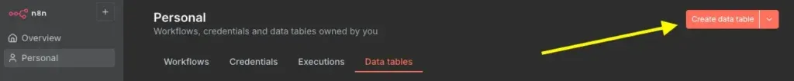

輸入 Data table 名稱（建議命名為 `line_bot_status` 或其他容易辨識的名稱），點擊「Create」

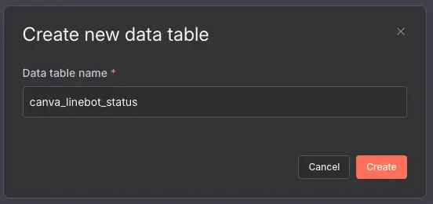

### 步驟二：新增 Column 欄位

點擊右上角的「Add Column」

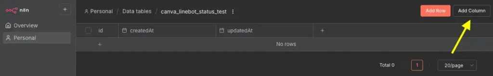

模板需要以下 6 個欄位，請依序建立：

Name

Type

說明

none

boolean

初始狀態（模板會自動管理）

check\_page

boolean

確認階段（模板會自動管理）

upload\_wp

boolean

上傳階段（模板會自動管理）

design\_id

string

儲存 Canva 設計 ID（模板會自動填入）

design\_title

string

儲存 Canva 設計標題（模板會自動填入）

image\_drive\_id

string

儲存 Google Drive 檔案 ID（模板會自動填入）

你只需要照著上表建立這些欄位即可，每個欄位的用途和數值都由模板自動處理。

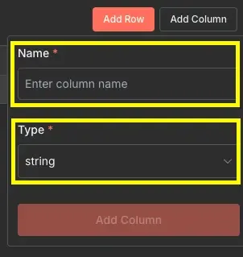

### 步驟三：新增 Row 資料

點擊右上角的「Add Row」

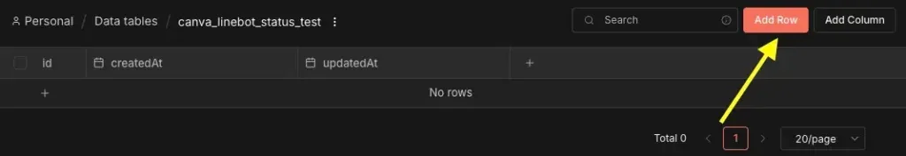

點一下之後，就會看到新增一行資料

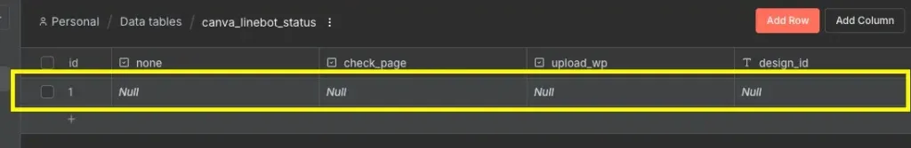

這時候我們要手動把「none」欄位的資料設為 `true`，雙擊「none」底下的儲存格打勾就好

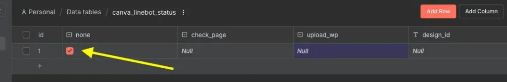

設定完成後，Data Table 就準備好了。之後模板運作時，會自動在這個表格中更新狀態，你不需要再做任何調整。

## 模板功能總覽

這個模板已經內建三大核心功能，全部都是自動化處理，你只需要在 LINE 上操作就好。

> 目前模板是針對上傳單一封面圖所設計的，只支援 Canva 設計檔中僅有一個頁面。如果設計檔有多個頁面，系統只會記錄到最後一頁。

### 功能一：上傳 Canva 連結

在 Canva 編輯完成後，複製畫面上方的網址（格式像是：`https://www.canva.com/design/<design-id>/<user-id>/edit`），然後直接貼到 LINE Bot 傳送。

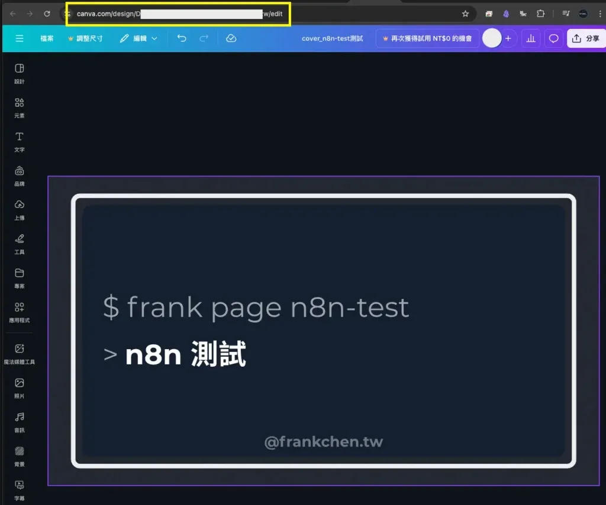

模板會自動解析出 Design ID，並向 Canva API 取得該設計檔的資訊。

取得設計檔後，LINE Bot 會回傳預覽圖讓你確認，確認沒問題就可以按下「確認」繼續下一步。

> 如果是複製已存在的設計再修改，預覽圖有可能會是舊的，這是 Canva 官方更新時間較慢造成的。確認你上傳的網址是對的就可以按下「確認」執行後續步驟。

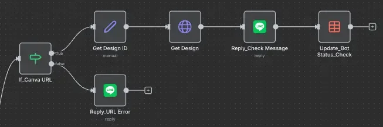

### 功能二：確認輸出 Canva 設計

當你確認設計檔後，模板會自動執行匯出動作。

模板預設的匯出格式是 `PNG`，這個設定已經在 `Set_Exports Parameter` 節點中配置好了。如果你需要其他格式（例如 JPG、PDF），可以修改該節點的參數。

> 輸出格式需依照 [Canva 官方文件](https://www.canva.dev/docs/connect/api-reference/exports/create-design-export-job/#format) 指定的格式設定，使用不支援的格式會出現錯誤。

匯出完成後，模板會自動將圖片上傳到 Google Drive 進行備份，然後透過 LINE 回傳匯出結果的預覽圖給你確認。

> LINE 傳輸圖片需要使用 LINE 可以訪問的連結，因此模板利用 Google Drive 的共用功能來實現圖片傳送。整個過程都是自動化處理，你不需要手動操作 Google Drive。

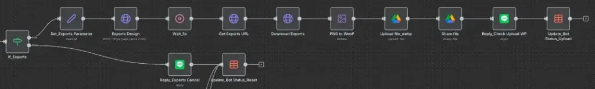

### 功能三：上傳 WordPress 媒體庫

確認輸出的圖片沒問題後，模板會自動將圖片上傳到你的 WordPress 媒體庫。

上傳完成後，你就可以直接在 WordPress 編輯器中使用這張圖片作為文章封面了。

> 這個模板也可以替換成其他支援圖檔上傳的平台或社群媒體，如果你有其他需求，可以修改 WordPress 節點為其他服務。

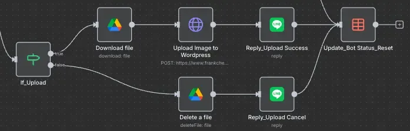

整個流程從上傳 Canva 連結到完成 WordPress 上傳，只需要在 LINE 上點擊幾次，所有的 API 串接、檔案轉換、備份、上傳都由模板自動處理。

## 常見問題 FAQ

**Q1：匯入模板後我需要修改哪些節點？**

匯入模板後，你主要需要做以下設定：  
1\. 在 LINE 相關節點中選擇你的 LINE 憑證  
2\. 在 WordPress 相關節點中選擇你的 WordPress 憑證  
3\. 在 Canva 相關節點中選擇你的 Canva 憑證  
4\. 在 Google Drive 相關節點中選擇你的 Google Drive 憑證  
5\. 在 Data Table 相關節點中選擇你剛才建立的 Data Table  
如果你已經設定好這些憑證，只需要在每個節點的憑證欄位選擇對應的憑證即可。

**Q2：我不會寫程式，可以使用這個模板嗎？**

可以！這個模板就是為了不想處理技術細節的使用者設計的。你不需要理解程式邏輯、API 串接、或節點配置，只要會基本的 n8n 操作（匯入工作流、選擇憑證），就能使用這個模板。  
所有的技術細節都已經處理好了，你只需要跟著本文的步驟設定好憑證和 Data Table，就可以開始使用。

**Q3：這個模板會影響我原本的 LINE Bot 嗎？**

不會。這個模板是一個獨立的工作流程，你可以在同一個 LINE Bot 中使用多個 n8n 工作流。只要確保每個工作流的 Webhook 觸發器都正確設定，它們就可以並存運作。  
如果你擔心衝突，也可以為這個模板建立一個專屬的 LINE Bot。

**Q4：我可以修改這個模板嗎？**

當然可以！這個模板是開放給你自由修改的。你可以根據自己的需求調整：  
\- 修改匯出格式（在 `Set_Exports Parameter` 節點）  
\- 更換上傳目的地（將 WordPress 節點替換為其他服務）  
\- 調整回覆訊息的內容（在 LINE 回覆節點中）  
\- 增加其他處理步驟（例如圖片壓縮、浮水印等）  
如果你修改出更好的版本，也歡迎分享給更多人使用！

**Q5：為什麼要使用 Data Table？**

Data Table 是用來記錄 LINE Bot 的操作狀態，確保每個步驟都能正確執行。  
舉例來說，當你傳送 Canva 連結後，系統需要記住這個設計的 ID，等你按下「確認」後才能繼續匯出。這些狀態資訊就儲存在 Data Table 中。  
模板會自動管理這些狀態，你不需要理解運作原理，只要照著步驟建立 Data Table 即可。

**Q6：模板支援多個頁面的 Canva 設計嗎？**

目前版本只支援單一頁面的設計檔，如果你的 Canva 設計有多個頁面，系統只會記錄最後一頁。  
如果你需要支援多頁面匯出，可以修改模板中的相關邏輯，或是在 Canva 中將每個頁面分別匯出。

## 延伸應用

這個模板除了用來上傳 WordPress 封面圖，還可以延伸應用到其他場景：

1.  社群媒體封面圖管理：將 WordPress 上傳節點替換為 Instagram、Facebook、或 Twitter 的 API，就能自動將 Canva 設計的圖片發布到社群媒體。
2.  團隊協作流程：在團隊中使用共同的 LINE Bot，讓設計師完成設計後直接透過 LINE 上傳，自動同步到團隊的媒體庫或雲端硬碟。
3.  多格式輸出：修改模板讓它同時輸出多種格式（PNG、JPG、PDF），並分別儲存到不同的資料夾，方便後續使用。
4.  批次處理：如果你有多個設計需要上傳，可以修改模板支援批次處理，一次性處理多個 Canva 連結。
5.  自動化內容發布：結合 WordPress API，不只上傳封面圖，還可以自動建立草稿文章，進一步簡化內容發布流程。

這些延伸應用都可以在原有模板的基礎上進行修改，發揮你的創意，打造專屬的自動化工作流程。

## 結尾

這個 n8n 模板能讓你用最少的設定，快速建立自己的 Canva → WordPress 自動化流程。

不需要從零打造工作流，不需要研究 API 文件，不需要理解複雜的節點邏輯。只要下載模板、設定憑證、建立 Data Table，就能立即開始使用。

從此以後，上傳封面圖只需要在 LINE 傳送連結，剩下的交給自動化處理。省下的時間，可以專注在更重要的創作和內容產出上。

如果你在使用過程中遇到任何問題，或是有更好的改進建議，歡迎留言分享！

## 參考資料與延伸閱讀

### 參考資料

-   [Cavna 官方 API 文件](https://www.canva.dev/docs/connect/)

### 延伸閱讀

-   【 n8n 模板分享 】[探店心願助手](https://www.frankchen.tw/n8n-template-store-wish-list/)
-   【 n8n 模板分享 】[Notion Page 轉 Wordpress Article](https://www.frankchen.tw/n8n-notion-wordpress-publish-automation/)
