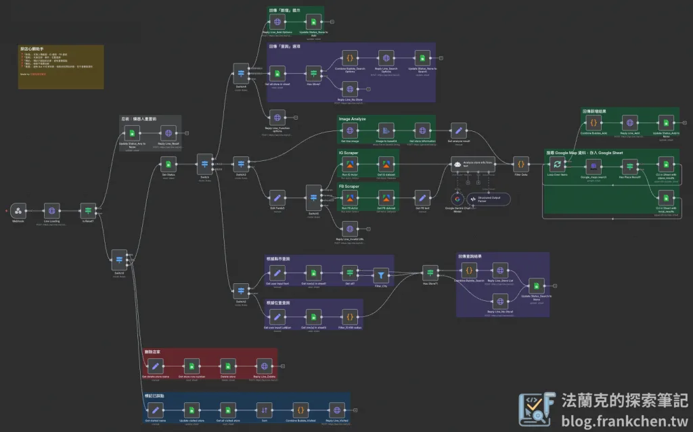
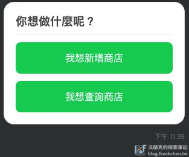
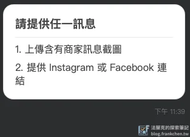
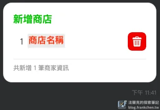
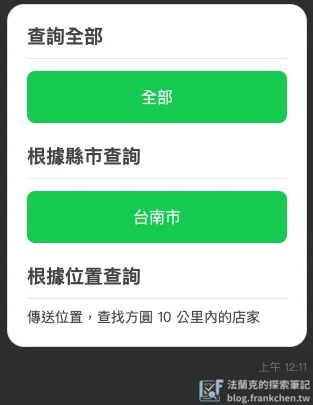
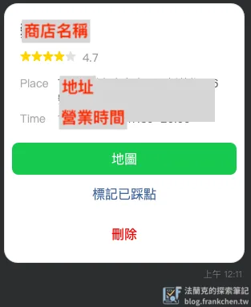
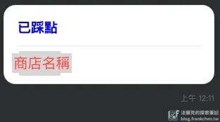
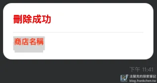

## 前言

Facebook、Instagram 等社交平台時常看到創作者分享的美食、遊樂等店家資訊，讓你感興趣的你會想要記錄下來，下次有機會去打卡踩點，但你是否曾經遇到以下問題：

-   收藏或是記錄下網址，之後要再次查看時該貼文已經下架

-   這些訊息收藏後讓你常常找不到

-   資訊太多太繁雜讓你懶得整理

那麼這個 n8n 模板應該適合你，你只需要上傳截圖、FB 連結、IG 連結，就會幫你整理出店家資訊，讓你下次想踩點時，可以更快找到店家資料。

## 工作流全覽

## 模板下載

下載壓縮檔後解壓縮，壓縮檔裡面提供兩個檔案：

-   工作流模板：n8n 工作流 JSON 檔
-   Excel 模板：會使用到的 Excel，下載後請上傳到 Google Drive

## 使用哪些第三方服務

-   **Line Bot**：設定方法可以參考 Darrell 大大的[教學文章](https://www.darrelltw.com/n8n-line-message-api/)
-   **Google Sheet**：Google 憑證設定請參考[這篇文章](https://www.frankchen.tw/n8n-google-credentials-setup-guide/)
-   **Gemini API**：前往 [Google AI Studio](https://aistudio.google.com) 取得 API Key
-   **[Apify](https://apify.com/)**：設定方法可參考[這部影片](https://www.youtube.com/watch?v=gZ_RLC25gCw)，使用到 `Facebook Posts Scraper`、`Instagram Scraper` 這兩個 Actor
-   **[SERP API](https://serpapi.com/dashboard)**：提供一個月 `250` 次呼叫次數
-   **任一 Chat Model**：ChatGPT、Gemini、Grok、DeepSeek 等等都可以

## 工作流功能介紹

-   任一輸入文字可以呼叫出選單，「我想新增商店」、「我想新增商店」。

-   「**新增**」：支援上傳截圖、IG 連結、FB 連結
    -   執行前需要先輸入「**我想新增商店**」
    -   提供的截圖或連結必須至少要包含`店家名稱`
    -   先透過 `Gemini` 分析圖片取得店家資訊
    -   再使用 `SERP` 透過 `Google Map` 取得店家的詳細資料
    -   取得後再寫入 `Google Sheet`

-   「**查詢**」：支援全部、縣市、位置查詢
    -   執行前需要先輸入「**我想查詢商店**」
    -   選擇你要`查詢的條件`

-   「**標記**」：標記已踩點的店家，避免重複踩點
    -   不需先輸入任何訊息，直接點擊「**標記已踩點**」即可

-   「刪除」：移除不需要店家
    -   不需先輸入任何訊息，直接點擊「**刪除**」即可

-   「重置」：避免 Bot 卡在某狀態，強制回到`原始狀態`，但不會刪除資料
    -   於任何狀態下直接輸入「**重置**」、「**Reset**」、「**reset**」即可

## 操作影片

操作影片請前往 [Threads 文章](https://www.threads.com/@frank.dev.notes/post/DNHtXbcSzXy?xmt=AQF0Oq_XcQDogXV61rKMp5912T4MgCmySVO0q4ALep3vrA) 觀看。

如果你執行上有問題，可以到 [Threads](https://www.threads.com/@frank.dev.notes) 或是 [IG](https://www.instagram.com/frank.dev.notes/) 直接私訊我～

## 延伸閱讀

-   【 n8n 模板分享 】[Notion Page 轉 Wordpress Article](https://www.frankchen.tw/n8n-notion-wordpress-publish-automation/)
-   【 n8n 模板分享 】[Line Bot × Canva 封面圖一鍵上傳 WordPress 系統](https://www.frankchen.tw/n8n-template-line-bot-upload-system/)
