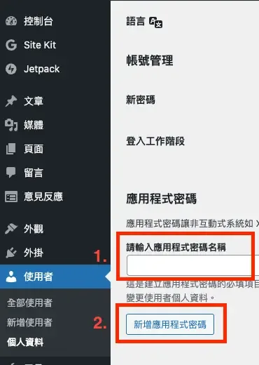
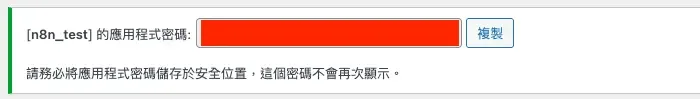
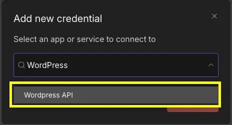
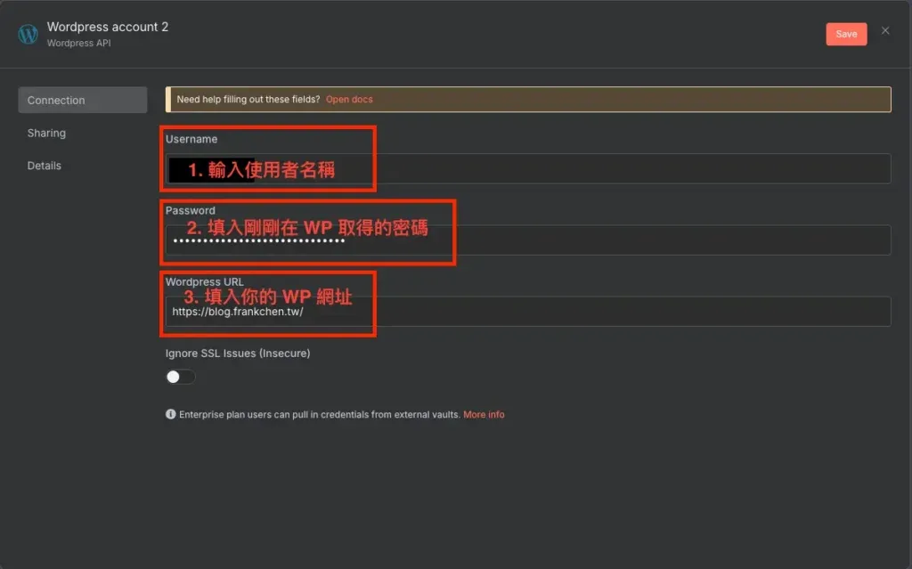
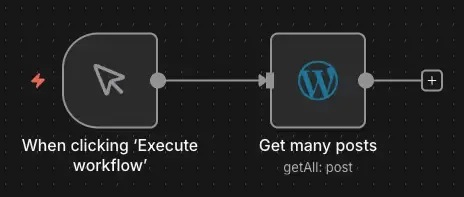
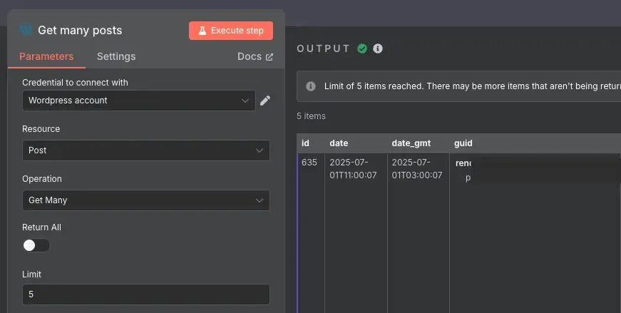
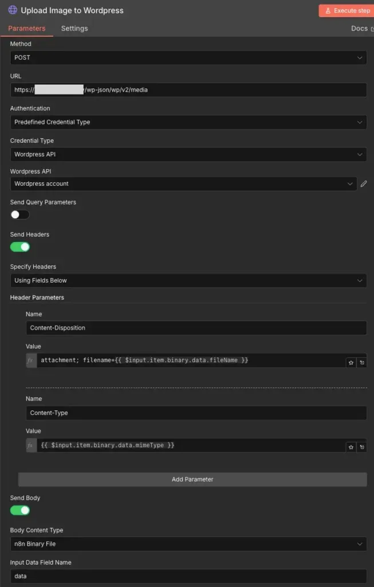

## 前言：讓你的 WordPress 自動運作起來

你是否曾經遇到以下情況：

-   每天要手動發布多篇文章到 WordPress，重複的操作讓你疲憊不堪
-   從 Notion 或其他平台搬運內容到 WordPress，圖片要「先下載，再上傳」超麻煩
-   想要批次更新文章內容或標籤，卻只能一篇一篇手動修改

好消息來了！透過 n8n 串接 WordPress API，你可以實現幾乎所有的自動化操作：自動發文、圖片上傳、內容更新、標籤管理等等。

這篇教學將帶你從零開始設定 n8n x WordPress 整合，並分享實用的自動化技巧。無論你是 WordPress.com 用戶還是自架站長，都能跟著這篇教學完成設定。

## 認識 WordPress 與 n8n 的整合方式

### WordPress.com vs 自架 WordPress 的差異

在開始設定之前，先了解 WordPress 類型有分兩種：

**WordPress.com（託管版）：**

-   由 WordPress 官方提供的雲端服務
-   網址格式：`你的名稱.wordpress.com`（免費版）或綁定自訂網域（付費版）
-   適合：不想自己管理伺服器的個人部落客

**自架 WordPress（Self-hosted）：**

-   部署在自己或是第三方雲端（Zeabur、Cloudways）的主機上
-   網址格式：自訂網域（如 `blog.example.com`）
-   適合：想要完全掌控網站的進階用戶

好消息是，無論哪種類型 n8n 的憑證設定方式都一樣，都是使用「應用程式密碼」進行認證！

### WordPress REST API 能做什麼？

WordPress REST API 是 WordPress 提供的一組標準化介面，讓外部應用程式（如 n8n）能夠與 WordPress 互動。透過 API，你可以：

-   **文章管理**：建立、讀取、更新、刪除文章
-   **媒體庫操作**：上傳圖片、影片、文件等檔案
-   **分類與標籤**：管理文章的分類和標籤
-   **用戶管理**：取得或更新用戶資訊（需相應權限）
-   **留言管理**：讀取或回覆文章留言

注意：這篇教學主要聚焦在憑證設定和基本操作。

## 第一步：申請 WordPress 應用程式密碼

WordPress 比較特別，需要先進到後台申請一組「應用程式密碼」，而不是直接使用你的登入密碼。這是為了安全性考量，即使密碼外洩，也不會影響到你的主帳號。

### 1.1 進入 WordPress 後台

首先，登入你的 WordPress 後台：

-   WordPress.com 用戶：前往 [wordpress.com](https://wordpress.com) 登入
-   自架 WordPress 用戶：前往你的網域加上 `/wp-admin`（例如：`https://blog.example.com/wp-admin`）

### 1.2 開啟用戶設定頁面

登入後，依照以下步驟操作：

1.  點擊左側邊欄的「使用者」
2.  選擇「個人資料」或「全部使用者」選擇你要開啟應用程式密碼的使用者
3.  捲動到頁面最下方

### 1.3 新增應用程式密碼

在設定頁面的最下方，你會看到「應用程式密碼」區塊。

**操作步驟：**

1.  在「應用程式密碼名稱」欄位中輸入一個你可以辨認的名稱，例如：`n8n`
2.  點擊「新增應用程式密碼」按鈕
3.  系統會立即產生一組密碼，如下圖所示

**重要提醒：**

-   這組密碼只會顯示一次，請立即複製並妥善保存
-   如果不小心關閉視窗，可以刪除後重新建立

### 1.4 安全性注意事項

-   **不要分享**：應用程式密碼等同於你的帳號密碼，千萬不可外流或分享給他人
-   **定期更新**：建議每隔 3-6 個月更換一次密碼，提升安全性
-   **分開管理**：如果有多個自動化工具，建議為每個工具建立獨立的應用程式密碼，方便管理和追蹤
-   **立即刪除**：如果某個密碼不再使用（例如停用某個自動化流程），請立即到 WordPress 後台刪除該密碼

## 第二步：在 n8n 設定 WordPress 憑證

現在我們已經取得 WordPress 的應用程式密碼，接下來就是要在 n8n 中建立憑證。

### 2.1 開啟 n8n 憑證設定

1.  登入你的 n8n 平台
2.  點擊右上角的「Credentials」（憑證）
3.  點擊「Add Credential」（新增憑證）
4.  在搜尋框中輸入「WordPress」，選擇「WordPress」

### 2.2 填寫憑證資訊

在憑證設定頁面中，你需要填入以下三個欄位：

**欄位說明：**

1.  **Username（用戶名稱）**
    -   填入你登入 WordPress 使用的用戶名稱
    -   範例：`example-account`
2.  **Password（密碼）**
    -   填入剛剛在 WordPress 後台申請的「應用程式密碼」
    -   注意：不是你的登入密碼，是**應用程式密碼**！
    -   密碼會長得像：`xxxx xxxx xxxx xxxx`
3.  **WordPress URL（WordPress 網址）**
    -   填入你的 WordPress 網站完整網址
    -   格式：`https://你的網域.com`
    -   WordPress.com 範例：`https://你的名稱.wordpress.com`
    -   自架站範例：`https://blog.example.com`

### 2.3 儲存憑證

填寫完成後，點擊右上角的「Save」按鈕。如果設定正確，憑證會成功儲存；如果有錯誤，n8n 會提示你檢查設定。

## 第三步：測試 WordPress 憑證是否成功

設定完憑證後，最重要的是測試一下是否能正常連線。

### 3.1 建立測試工作流

1.  回到 n8n 主頁面
2.  建立一個新的 Workflow
3.  加入一個「Trigger Manually」節點
4.  加入一個「WordPress」節點

### 3.2 使用 Get Many Posts 測試

在 WordPress 節點中進行以下設定：

1.  **Credential**（憑證）：選擇剛剛建立的 WordPress 憑證
2.  **Resource**（資源）：選擇「Post」
3.  **Operation**（操作）：選擇「Get Many」
4.  **Return All**（返回所有）：開啟或設定 Limit 為 5（取得 5 篇文章）

設定完成後，點擊「Execute Node」（執行節點）按鈕。

### 3.3 驗證結果

如果設定正確，你應該會看到：

-   節點執行成功（綠色勾勾）
-   返回你的 WordPress 文章列表
-   每篇文章包含標題、內容、發布日期等資訊

如果出現錯誤，請檢查：

-   用戶名稱是否正確
-   應用程式密碼是否正確（注意空格）
-   WordPress URL 格式是否正確（不要加 `/wp-admin` 等路徑）
-   網路連線是否正常

設定完成！你現在可以開始使用 n8n 操作 WordPress 了。

## WordPress REST API 端點說明

了解 WordPress REST API 的常用端點，能幫助你更靈活地運用 n8n 自動化。

### 常用的 API 端點

WordPress REST API 預設的端點格式為：`https://你的網域/wp-json/wp/v2/{資源類型}`

**主要端點：**

1.  **文章 (Posts)**
    -   端點：`/wp-json/wp/v2/posts`
    -   用途：建立、讀取、更新、刪除文章
    -   常見操作：發布文章、更新文章內容、設定標籤和分類
2.  **媒體庫 (Media)**
    -   端點：`/wp-json/wp/v2/media`
    -   用途：上傳圖片、影片、PDF 等檔案
    -   常見操作：圖片上傳、取得媒體 ID、設定精選圖片
3.  **分類 (Categories)**
    -   端點：`/wp-json/wp/v2/categories`
    -   用途：管理文章分類
    -   常見操作：建立分類、取得分類 ID
4.  **標籤 (Tags)**
    -   端點：`/wp-json/wp/v2/tags`
    -   用途：管理文章標籤
    -   常見操作：建立標籤、取得標籤 ID
5.  **頁面 (Pages)**
    -   端點：`/wp-json/wp/v2/pages`
    -   用途：管理靜態頁面
    -   常見操作：建立關於頁面、更新聯絡頁面

### n8n 中的 WordPress 節點操作

在 n8n 的 WordPress 節點中，你可以進行以下常見操作：

-   **Post（文章）操作：**
    -   Create：建立新文章
    -   Get：取得單篇文章
    -   Get Many：取得多筆文章
    -   Update：更新文章內容
-   Page（頁面）操作：
    -   Create：建立新頁面
    -   Get：取得單個頁面
    -   Get Many：取得多個頁面
    -   Update：更新頁面內容
-   **其他資源操作：**
    -   User：用戶資訊

注意：媒體上傳官方節點為內建，需要使用「HTTP Request」節點，稍後會詳細說明。

## 實戰技巧：圖片上傳到 WordPress 媒體庫

圖片處理是自動化發文中最常遇到的挑戰，這裡分享如何透過 n8n 將圖片上傳到 WordPress 媒體庫。

### 為什麼要上傳到媒體庫？

當你從 Notion、Google Drive 或其他來源取得圖片時，如果直接在文章中使用外部連結，可能會遇到以下問題：

-   外部連結失效，圖片無法顯示
-   載入速度較慢（尤其是跨國連結）
-   無法使用 WordPress 的圖片優化功能
-   SEO 效果較差

因此，最佳實踐是將圖片上傳到 WordPress 自己的媒體庫。

### 使用 HTTP Request 節點上傳圖片

由於 n8n 的 WordPress 節點目前不支援直接上傳媒體，我們需要使用「HTTP Request」節點搭配 WordPress 的媒體 API。

> 🚧 預告：我正在開發 n8n WordPress 增強節點，預計會支援原生媒體上傳（5 個操作）、Yoast SEO 整合、以及更完整的 Post 欄位（摘要、精選圖片等）。目前還在測試中，敬請期待！

在自訂節點正式推出之前，以下是目前的做法：

**節點設定步驟：**

1.  **新增 HTTP Request 節點**
    -   Method：選擇 `POST`
    -   URL：填入 `https://你的網域/wp-json/wp/v2/media`
    -   Authentication：選擇「Predefined Credential Type」
    -   Credential Type：選擇「WordPress API」
    -   WordPress API：選擇你建立的 WordPress 憑證
2.  **設定 Headers**
    -   Send Headers：開啟
    -   Specify Headers：選擇「Using Fields Below」
        -   新增第一個 Header：
            -   Name：`Content-Disposition`
            -   Value：`attachment; filename={{ $input.item.binary.data.fileName }}`
    -   新增第二個 Header：
        -   Name：`Content-Type`
        -   Value：`{{ $input.item.binary.data.mimeType }}`
3.  **設定 Body 參數**
    -   Send Body：開啟
    -   Body Content Type：選擇「n8n Binary File」
    -   Input Data Field Name：填入 `data`（或你的圖片資料欄位名稱）
4.  **執行上傳**
    -   執行節點後，WordPress 會返回圖片的 ID 和 URL
    -   記下這個 ID，可以用來設定為文章的精選圖片

### 從 Notion 自動上傳圖片的案例

在我之前分享的「Notion 轉 WordPress 自動化」工作流中，圖片處理流程是這樣的：

1.  **偵測 Notion 中的圖片 Block**：辨識出文章中的所有圖片
2.  **下載圖片**：使用 HTTP Request 從 Notion 下載圖片
3.  **重新命名**：根據文章標題 slug 重新命名檔案
4.  **上傳到 WordPress**：將圖片上傳到媒體庫，取得新的 URL
5.  **替換連結**：在文章 HTML 中將 Notion 圖片連結替換成 WordPress 連結

這樣可以確保文章發布後，所有圖片都能正常顯示，不會依賴 Notion 伺服器。

## 實戰應用案例

設定好 WordPress 憑證後，可以實現哪些自動化應用呢？以下分享兩個簡單的實用案例。

### 案例 1：定期備份文章到 Google Sheet

**應用場景：**  
你想要定期備份 WordPress 文章的標題、發布日期、網址等資訊到 Google Sheet，方便管理和追蹤。

**工作流程設計：**

1.  使用「Schedule Trigger」節點（每週自動執行一次）
2.  使用「WordPress」節點取得所有文章（Get Many Posts）
3.  使用「Code」節點整理資料（提取標題、日期、URL）
4.  使用「Google Sheets」節點寫入到試算表

**適用情境：**  
內容管理、SEO 追蹤、文章數量統計

### 案例 2：Notion 內容自動發布到 WordPress

**應用場景：**  
你習慣在 Notion 撰寫文章，寫完後希望自動發布到 WordPress，省去手動複製貼上的時間。

**工作流程設計：**

1.  在 Notion Database 中將文章狀態設定為「撰寫完成」
2.  n8n 定期檢查 Notion Database（每小時一次）
3.  讀取「撰寫完成」狀態的文章內容
4.  將 Notion Block 轉換成 WordPress HTML 格式
5.  處理圖片上傳（下載 Notion 圖片 → 上傳到 WordPress 媒體庫）
6.  使用 WordPress 節點發布文章（設定為草稿）
7.  發布成功後，將 Notion 文章狀態改為「已上傳 WP」

**適用情境：**  
內容創作自動化、多平台發布、團隊協作

詳細的工作流程設定，請參考 [Notion 轉 WordPress 自動化](https://www.frankchen.tw/n8n-notion-wordpress-publish-automation/)完整教學文章。

## 常見問題 FAQ

**Q1: WordPress.com 和自架 WordPress 的設定方式一樣嗎？**

是的！兩者都是使用「應用程式密碼」進行認證，設定步驟完全相同。唯一的差異在於 URL 格式：WordPress.com 用戶填入 `https://你的名稱.wordpress.com`，自架站用戶則填入 `https://你的網域.com`。

**Q2: 應用程式密碼和登入密碼有什麼不同？**

應用程式密碼是專門給第三方應用程式使用的獨立密碼，與你登入 WordPress 後台的密碼不同。這樣設計更安全，即使應用程式密碼外洩也不會影響主帳號。你可以為不同的工具建立不同的密碼，隨時刪除不用的密碼，而應用程式密碼的權限會與你的帳號權限相同。

**Q3: 為什麼測試連線時一直失敗？**

常見的失敗原因包括：用戶名稱填錯（應使用 WordPress 用戶名稱而非顯示名稱）、密碼填成登入密碼而非應用程式密碼、URL 格式錯誤（結尾不要加斜線，也不要包含 `/wp-admin` 等路徑）、帳號權限不足（至少需要編輯者角色），或是主機的安全外掛停用了 REST API。

**Q4: 如何批次更新多篇文章的標籤或分類？**

你可以先用「Get Many Posts」取得所有文章，再用「Filter」節點篩選出需要更新的文章，接著用「Code」節點為每篇文章加上新的標籤或分類 ID，最後用「Update Post」節點批次更新即可。

**Q5: 上傳圖片時出現權限錯誤怎麼辦？**

請確認你的 WordPress 帳號有上傳媒體的權限（至少是作者角色），並檢查圖片大小是否超過主機設定的上傳限制、圖片格式是否被 WordPress 支援（JPG、PNG、GIF、WebP 都可以），以及主機是否有足夠的儲存空間。

**Q6: 發布文章後如何自動分享到社群媒體？**

你可以在發布文章的工作流後面串接 Telegram、Discord、Twitter/X 或 Facebook 等節點，自動將文章連結分享到對應的平台。

### 總結與下一步

恭喜你完成 n8n x WordPress 的憑證設定！現在你已經可以：

-   ✅ 透過 n8n 讀取 WordPress 文章
-   ✅ 自動發布文章到 WordPress
-   ✅ 更新現有文章的內容和設定
-   ✅ 上傳圖片到 WordPress 媒體庫

### 建議的學習路徑

1.  **先從簡單開始**：試著用 n8n 取得文章列表，熟悉 WordPress 節點的操作
2.  **實作備份流程**：定期備份文章資訊到 Google Sheet
3.  **挑戰進階應用**：實作 Notion 或其他平台的內容自動發布
4.  **優化工作流程**：加入錯誤處理、通知機制、重試邏輯

## 參考資料與延伸閱讀

### 參考資料

-   [WordPress.com](https://wordpress.com/) - WordPress 官方提供的部落格平台
-   [WordPress Rest API](https://developer.wordpress.org/rest-api/) - WordPress 內建的 Rest API 文件
-   [Zeabur](https://zeabur.com/zh-TW/) - 自部署 WordPress 平台

### 延伸閱讀

想了解更多 n8n 自動化應用嗎？推薦你閱讀以下文章：

-   [不用再當搬運工！n8n 助你實現 Notion 無縫轉移 WordPress 的完美攻略](https://blog.frankchen.tw/n8n-notion-wordpress-publish-automation/)
-   [n8n x Notion 完整攻略：從憑證設定到 Database 操作實戰](https://www.frankchen.tw/n8n-notion-api-integration-tutorial/)
-   [【n8n 模板分享】Line Bot × Canva 封面圖一鍵上傳 WordPress 系統](https://www.frankchen.tw/n8n-template-line-bot-upload-system/)

如果這篇文章對你有幫助，歡迎分享給更多需要的人！
