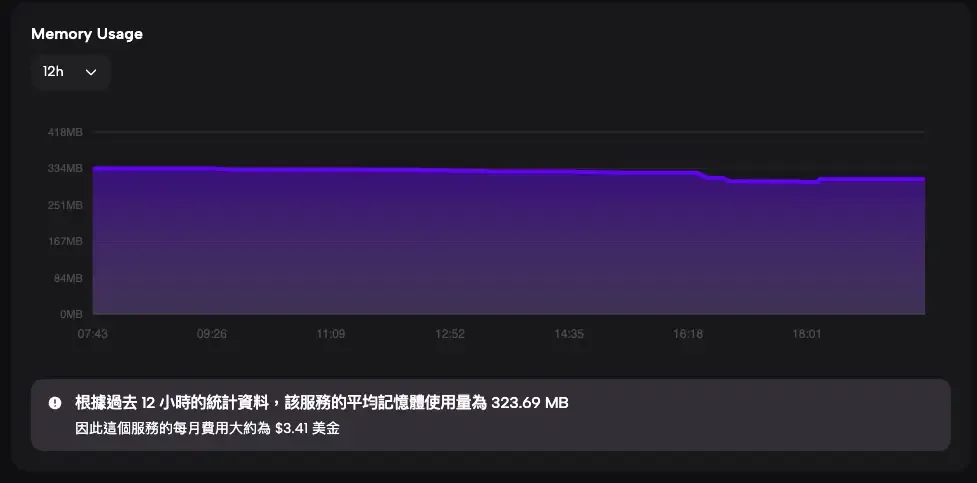
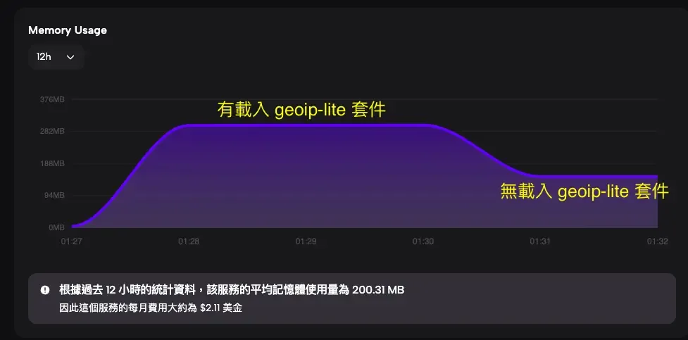

## 前言

在這次將 Next.js 專案部署到 Zeabur 的過程中，我發現了一個進行 Node.js 記憶體優化的絕佳機會。即使沒有任何短連結資料，應用程式的記憶體使用量竟然超過 300MB。在 Serverless 環境中，記憶體直接影響營運成本，這促使我深入調查問題根源。

經過分析，我找到了元兇：`geoip-lite` 套件。最終，我設計了一套多層降級策略來解決這個問題，成功減少約 100MB 的記憶體佔用。這個優化方案已經被合併到原始的開源專案中。

這篇文章將分享完整的問題分析過程、解決方案設計，以及實際的程式碼實作。

## 這篇文章適合你嗎？

如果你遇到以下情況，這篇文章能幫助你：

-   部署 Next.js 或 Node.js 應用到 Serverless 平台，發現記憶體超標
-   使用 geoip-lite 導致記憶體佔用過高，想找替代方案
-   想降低 Vercel、Zeabur、Cloudflare 等平台的營運成本
-   需要實作 IP 地理位置查詢，但不想犧牲效能
-   對 Node.js 記憶體優化實戰經驗有興趣

如果你只需要在傳統 VPS 上運行，且記憶體不是瓶頸，可以直接跳到「常見問題 FAQ」查看是否有你關心的問題。

## 記憶體監控：發現 Serverless 環境的 300MB 異常佔用

在部署 [short-link-tracker](https://github.com/SR0725/short-link-tracker) 這個開源短網址追蹤專案到 Zeabur 後，我注意到一個異常現象：

-   應用程式在沒有任何資料的情況下，記憶體使用量超過 300MB
-   這對於一個簡單的短網址服務來說明顯過高
-   在 Serverless 環境中，這會直接增加營運成本



## 記憶體元兇分析：geoip-lite 的 100MB 佔用從何而來？

透過分析專案的相依套件，我發現記憶體使用量最大的是 `geoip-lite` 這個套件。

`geoip-lite` 是一個用於 IP 地理位置查詢的 Node.js 套件，它的 memory footprint 相當可觀。這個套件會在啟動時將整個 MaxMind GeoIP 資料庫載入記憶體，以實現快速的本地查詢。這個設計在需要高頻查詢的場景很有效，但代價是 50-100MB 的記憶體佔用。

### 為什麼需要 GeoIP？

短網址追蹤服務需要記錄點擊者的地理位置，用於分析流量來源。原始實作使用 `geoip-lite` 來從訪客 IP 查詢國家和城市資訊。

### 是否有替代方案？

經過調查，我發現許多 CDN 和雲端平台會在 HTTP headers 中提供訪客的地理位置資訊（CDN geolocation headers）：

平台

Header 名稱

提供資訊

Zeabur

`x-zeabur-ip-country`

國家代碼

Cloudflare

`CF-IPCountry`

國家代碼

Vercel

`x-vercel-ip-country`

國家代碼

這些 header 是由 CDN 在邊緣節點解析的，不需要消耗應用程式的記憶體。

### Node.js 低記憶體 GeoIP 套件比較

除了 CDN headers 之外，社群也開發了針對 serverless 環境優化的 GeoIP 套件：

套件

記憶體佔用

啟動時間

查詢時間

適用場景

[geoip-lite](https://github.com/geoip-lite/node-geoip)

~100MB

~200ms

~0.02ms

高頻查詢的傳統伺服器

[fast-geo](https://github.com/onramper/fast-geoip)[ip](https://github.com/onramper/fast-geoip)

<1MB

極低

0.7-9ms

Lambda、Serverless 環境

[geoip-country](https://github.com/sapics/geoip-country)

~20MB

較快

快速

只需國家資訊的場景

`fast-geoip` 採用預建索引樹結構，直接在檔案上執行 O(log n) 查詢，不需將整個資料庫載入記憶體。這個套件最初就是為了解決 AWS Lambda 的 126MB 記憶體限制而開發的。

`geoip-country` 則是 geoip-lite 的精簡版，只保留國家資訊，將記憶體佔用從 100MB 降至約 20MB。

### 為什麼選擇多層降級策略？

既然有這些低記憶體替代方案，為什麼我最終選擇實作多層降級策略，而非直接替換套件？

1.  向後相容性：這是開源專案，直接替換套件會影響現有使用者
2.  零記憶體目標：CDN headers 完全不需要額外記憶體，比 fast-geoip 的 <1MB 更優
3.  平台整合：Zeabur、Vercel、Cloudflare 都已提供 geolocation headers，不需要額外套件
4.  彈性配置：透過環境變數讓使用者自行選擇最適合的策略

如果你的專案不在支援 CDN headers 的平台上，且需要城市層級的資訊，`fast-geoip` 是值得考慮的替代方案。

## 多層降級策略：Node.js 記憶體優化的核心設計

由於這是開源專案，不能直接移除 `geoip-lite` 功能，必須保持向後相容性。因此，我設計了一套多層降級策略來達成 Node.js 記憶體優化的目標：

### 策略架構

```
優先級 1: CDN Headers（零記憶體消耗）
    ↓ 如果沒有取得到
優先級 2: geoip-lite 本地查詢（可透過環境變數關閉）
    ↓ 如果未啟用或查詢失敗
優先級 3: 優雅降級，回傳 null
```

### 設計原則

1.  預設行為不變：未設定環境變數時，行為與原本相同
2.  可選擇性關閉：透過 `ENABLE_GEOIP_LOOKUP=false` 關閉本地查詢
3.  優雅降級：任何層級失敗都不會影響應用程式運作
4.  零程式碼修改：使用者只需設定環境變數即可

## TypeScript 完整實作：5 步驟優化 Node.js 記憶體

### 1\. 條件式載入 geoip-lite

關鍵在於根據環境變數決定是否載入 `geoip-lite` 模組：

```typescript
// 條件式載入 geoip-lite（根據環境變數控制）
let geoip: typeof import('geoip-lite') | null = null
const GEOIP_ENABLED = process.env.ENABLE_GEOIP_LOOKUP !== 'false'

if (GEOIP_ENABLED) {
  try {
    // 設定環境變數指向正確的資料目錄
    process.env.GEODATADIR = geoipDataPath

    geoip = require('geoip-lite')

    // 驗證 geoip 是否真的可用
    const testResult = geoip.lookup('8.8.8.8')
    if (!testResult) {
      console.warn('⚠️  GeoIP test lookup failed')
      geoip = null
    }
  } catch (error) {
    console.warn('⚠️  GeoIP module not available')
    geoip = null
  }
} else {
  console.log('ℹ️  GeoIP lookup disabled by environment variable')
}
```

當 `ENABLE_GEOIP_LOOKUP=false` 時，`geoip-lite` 完全不會被載入，記憶體自然不會被佔用。

### 2\. 從 CDN Headers 取得地理位置

```typescript
function getGeoFromHeaders(request: Request): {
  country: string | null
  city: string | null
} {
  // Zeabur headers
  const zeaburCountry = request.headers.get('x-zeabur-ip-country')

  if (zeaburCountry && zeaburCountry !== 'XX') {
    return {
      country: zeaburCountry,
      city: null  // Zeabur 目前不提供城市資訊
    }
  }

  return { country: null, city: null }
}
```

### 3\. 多層降級策略的主函式

```typescript
export function getLocationFromRequest(request: Request): {
  country: string | null
  city: string | null
} {
  // 優先級 1: 嘗試從 CDN headers 取得
  const headerGeo = getGeoFromHeaders(request)
  if (headerGeo.country) {
    return headerGeo
  }

  // 優先級 2: 如果啟用了 geoip-lite，從 IP 查詢
  if (GEOIP_ENABLED && geoipAvailable) {
    const forwarded = request.headers.get('x-forwarded-for')
    const realIp = request.headers.get('x-real-ip')
    const ip = forwarded?.split(',')[0] || realIp || '127.0.0.1'

    return getLocationFromIP(ip)
  }

  // 優先級 3: 優雅降級
  return { country: null, city: null }
}
```

### 4\. 快取機制避免重複檢查

```typescript
// 檢查 GeoIP 是否可用的快取變數
let geoipAvailable: boolean | null = null
let geoipWarningShown = false
```

透過快取變數，避免每次請求都重新檢查 `geoip-lite` 的可用性，也避免重複輸出警告訊息。

### 5\. 環境變數設定

在 `.env` 檔案中加入：

```
# 設為 false 可節省 50-100MB 記憶體
# 在 Zeabur 上建議設為 false，因為 CDN headers 已提供國家資訊
ENABLE_GEOIP_LOOKUP=false
```

## 實測結果：記憶體減少 100MB

關閉 `geoip-lite` 後，記憶體使用量從約 300MB 降至約 200MB，減少約 100MB。



### 為什麼我能提供這個經驗？

這不是紙上談兵的理論分析，而是我在實際專案中遇到的問題。我將解決方案整理成 Pull Request 提交到開源專案，經過原作者 review 後已被合併。這代表這個方案經過實際驗證，具有生產環境的可用性。

### 功能影響評估

功能

啟用 geoip-lite

關閉 geoip-lite（Zeabur）

國家資訊

✅ 可取得

✅ 可取得（透過 CDN header）

城市資訊

✅ 可取得

❌ 無法取得

記憶體佔用

高（+100MB）

低

對於大多數短網址追蹤的場景，國家層級的資訊已經足夠，城市資訊的實用性有限。

## 生產環境驗證：已合併的開源 Pull Request

這個優化方案已經透過 Pull Request 提交到原始專案，並且已被合併：

[PR #2: feat: 實作多層降級的地理位置查詢策略](https://github.com/SR0725/short-link-tracker/pull/2)

## Node.js 記憶體優化常見問題 FAQ

**Q1: 如何檢測 Node.js 應用的記憶體使用量？**

透過部署平台的監控面板查看，或本地使用 node --inspect 配合 Chrome DevTools 分析。

**Q2: 我是否需要關閉 geoip-lite？**

部署在 Zeabur、Cloudflare、Vercel 建議關閉，因為平台已提供 CDN headers。傳統 VPS 需要城市資訊則保持開啟。

**Q3: 在 Vercel / Cloudflare 上該怎麼設定？**

修改 getGeoFromHeaders 函式讀取對應 header 即可。Cloudflare 用 CF-IPCountry，Vercel 用 x-vercel-ip-country。

**Q4: fast-geoip 和多層降級策略該選哪個？**

有 CDN headers 的平台用多層降級策略，無 CDN 支援或需要城市資訊則用 fast-geoip。

### 記憶體優化總結與下一步行動

這次的 Node.js 記憶體優化經驗帶來幾個重要的學習：

1.  部署前先了解平台特性：Zeabur、Cloudflare 等平台提供的 CDN headers 可以省去很多本地運算
2.  設計可配置的架構：透過環境變數控制功能，讓使用者可以根據自己的需求調整
3.  多層降級策略：確保任何一層失敗都不會影響整體功能
4.  向後相容性：開源專案的修改必須考慮現有使用者

## 你的下一步

1.  檢查你的 Next.js 或 Node.js 專案是否有類似的記憶體問題
2.  查看部署平台是否提供 CDN geolocation headers
3.  如果你也在使用 short-link-tracker，可以直接設定 `ENABLE_GEOIP_LOOKUP=false`

專案連結：[short-link-tracker on GitHub](https://github.com/SR0725/short-link-tracker)

如果你有任何問題或想分享自己的記憶體優化經驗，歡迎在下方留言討論！

## 延伸閱讀

-   [Cloudflare Cache Rules 完整教學：WordPress 網站效能優化實戰指南](https://www.frankchen.tw/cloudflare-cache-rules-wordpress/)
-   [Zeabur Nginx 反向代理教學：從子網域到子目錄的完整實戰](https://www.frankchen.tw/zeabur-nginx-subdomain-to-subdirectory/)
