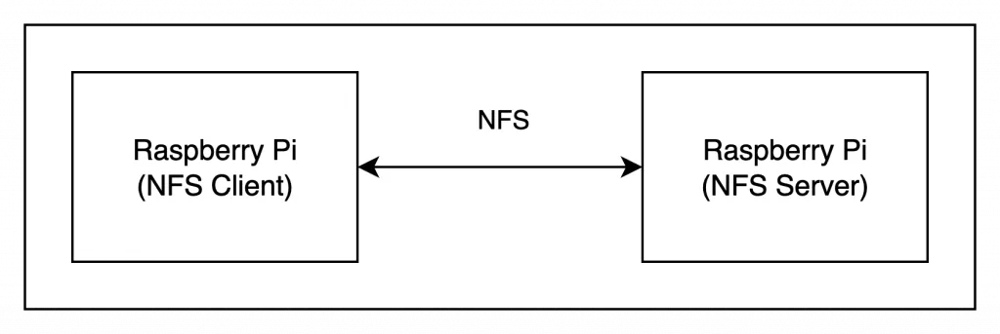

> NFS 檔案寫入導致應用程式當機？問題可能在協定選擇

## 前言

在嵌入式系統開發中，網路檔案系統 (NFS) 常被用於設備之間的檔案共享。通常都是安裝即用，較少考量到 NFS 協定版本，直到遇到實際問題才會重新檢查是否為版本問題。

本文紀錄在開發基於 Raspberry Pi 的設備時，應用程式剛啟動後遇到的 NFS 檔案儲存問題。透過 Log 分析與交叉測試，我們發現問題根源在於 NFS4 協定在特定使用情境下的行為特性。最終透過切換至 NFS3 協定徹底解決此問題。

## NFS 寫入導致應用程式當機

### 系統架構說明

兩台設備透過 NFS 共享檔案系統，Client 端負責寫入檔案到 Server 端。



### 開機後立即當機的典型症狀

在測試過程中發現：

-   系統開機後立即進行檔案操作，應用程式會當機
-   當機時無任何錯誤訊息，程式完全無回應
-   如果開機後等待一段時間 (約莫 1~2 分鐘)，再使用則運作正常
-   問題具有重現性，每次開機立即使用都會遇到當機  
    如果每次開發都遇到當機或是需要等待 1~2 分鐘才能操作，對於使用者體驗影響很大。

## 如何診斷 NFS 當機問題：3 個關鍵步驟

### 步驟一：透過 Log 定位問題點

首先檢查應用程式的 Log 紀錄，發現當機發生在檔案寫入操作：

```python
[2025-01-15 10:30:15] INFO: 使用者觸發寫入功能
[2025-01-15 10:30:15] DEBUG: 開始寫入檔案至 NFS
[2025-01-15 10:30:15] DEBUG: 寫入路徑: /mnt/nfs/data/file_001.jpg
# 之後沒有任何 Log，程式凍結
```

如果 NFS 檔案操作正確會是：

```python
[2025-01-15 10:30:15] INFO: 使用者觸發寫入功能
[2025-01-15 10:30:15] DEBUG: 開始寫入檔案至 NFS
[2025-01-15 10:30:15] DEBUG: 寫入路徑: /mnt/nfs/data/file_001.jpg
[2025-01-15 10:30:16] DEBUG: /mnt/nfs/data/file_001.jpg 完成寫入
# 會有寫入完成訊息
```

### 步驟二：檢查執行緒狀態

使用 `ps` 指令檢查應用程式的執行緒狀態：

```bash
ps aux | grep myapp
```

發現寫入相關的執行緒處於 `D` 狀態（不可中斷的睡眠狀態），這表示執行緒卡在 I/O 操作中，正在等待系統底層的回應。

這是關鍵線索，問題不在應用程式邏輯，而在於底層的檔案系統操作被阻塞。

### 步驟三：NFS3 vs NFS4 交叉測試

為了確認問題根源，我做了兩組對比測試：

#### 測試一：NFS4 vs NFS3 協定

```bash
# 測試 NFS4（原配置）
mount -t nfs -o vers=4 192.168.1.100:/export /mnt/nfs
# 開機後立即寫入 → 當機

# 測試 NFS3
mount -t nfs -o vers=3 192.168.1.100:/export /mnt/nfs
# 開機後立即寫入 → 正常運作
```

#### 測試二：時間因素

```bash
# 使用 NFS4，開機後等待 2 分鐘再寫入 → 正常運作
# 使用 NFS3，開機後立即寫入 → 正常運作
```

測試結論：

-   NFS4 在開機後短時間內 (約 1-2 分鐘) 使用時會有問題
-   NFS3 在任何時間點使用都正常
-   NFS4 度過初始階段後也能正常運作

## NFS4 初始化複雜度：為何開機後需要等待

> **核心問題**：NFS4 的有狀態設計在 Raspberry Pi 需要 30 秒至 2 分鐘的初始化時間，在此期間進行檔案操作會導致應用程式阻塞。

### NFS4 的狀態建立流程詳解

NFS4 採用**有狀態設計**，在開始使用前必須完成完整的初始化流程。

這與 NFS3 的無狀態設計形成鮮明對比。

#### 四個必要的初始化步驟

-   步驟一：建立傳輸層連線
    -   等待網路服務就緒
    -   建立到 NFS 服務器的 TCP 持久連線
-   步驟二：安全機制協商
    -   確定使用的認證方式 (AUTH\_UNIX、Kerberos V5 等)
    -   完成身份驗證流程
-   步驟三：建立客戶端識別
    -   SETCLIENTID：向服務器註冊客戶端
    -   SETCLIENTID\_CONFIRM：確認客戶端狀態
    -   **這是 NFS4 有狀態設計的核心**
-   步驟四：查詢服務器參數
    -   取得租約時間 (lease time,由服務器決定,常見為 90 秒)
    -   啟動租約維護機制 (定期更新以保持狀態)
    -   獲取根文件句柄 (root filehandle)

#### 初始化期間的實際影響

在 Raspberry Pi 環境中**通常需要 30 秒到 2 分鐘**，期間如果進行檔案操作會遇到：

問題

表現症狀

技術原因

1

連線未完成

超時錯誤

TCP 連線尚未建立

2

客戶端未註冊

拒絕存取

SETCLIENTID 未完成

3

網路未就緒

DNS 解析失敗

DHCP 尚未取得 IP

4

租約未啟動

無法鎖定檔案

lease 機制未初始化

#### 為什麼會阻塞寫入操作？

讓我們追蹤一次寫入操作的完整流程：

```bash
T0: 應用程式發起寫入
↓
T1: NFS Client 需要 OPEN 檔案
↓
T2: OPEN 需要有效的 clientid
↓
T3: 檢查發現 SETCLIENTID 尚未完成
↓
T4: 進入等待狀態 (D state - 不可中斷睡眠)
↓
... 等待 30-120 秒 ...
↓
T5: 初始化完成 OR 超時失敗
```

這就是為什麼我們在 Log 中看到寫入操作被阻塞，執行緒進入 D 狀態 (不可中斷的睡眠)。

#### NFS4 的可選性能優化機制

一旦初始化完成，NFS4 還提供以下優化機制 (非必要)：

**委派機制 (Delegation)**

-   服務器在 OPEN 時可選擇性授予
-   允許客戶端暫時本地處理 READ/WRITE
-   減少網路往返次數

**緩存機制**

-   客戶端持續緩存屬性和目錄資訊
-   提升重複操作的效能

這些只是**效能的優化**，不是本次問題的根源。真正的問題在於上述提到的初始化流程過長。

### NFS3 的無狀態優勢對比

相比之下 NFS3 採用**無狀態設計**。

**NFS3 掛載流程**：

1.  MOUNT 協議取得 filehandle (< 1 秒)
2.  開始讀寫 (立即) 完成！

**核心特性**：

-   無需客戶端識別註冊
-   無需租約維護
-   每個操作都是獨立的 RPC 呼叫
-   掛載完成即可立即使用

**實際優勢**：

-   **無複雜初始化** - 掛載成功就能立即讀寫
-   **無等待時間** - 開機後立即可用
-   **行為可預測** - 沒有隱藏的狀態建立過程

### 常見問題：為什麼等待 1-2 分鐘後 NFS4 就正常了？

這是因為所有初始化步驟都已完成：

1.  **初始化已完成** - SETCLIENTID 流程完成,clientid 已建立
2.  **租約機制已啟動** - 租約定期更新機制開始運作
3.  **TCP 連線已穩定** - 持久連線建立完成
4.  **所有狀態就緒** - 可以正常進行檔案操作

但對於需要**開機後立即使用**的嵌入式系統，這 1-2 分鐘的等待時間是無法接受的。

使用者期待開機後立即可用，而不是需要等待一個不確定的時間窗口。

### 技術總結：選擇 NFS3 還是 NFS4？

比較項目

NFS3

NFS4

初始化時間

< 5 秒

30-120 秒

開機即用

✅ 是

❌ 否

狀態管理

無狀態

有狀態

複雜度

低

高

適合場景

嵌入式系統

企業環境

會直接改用 NFS3 的另一個考量點是，我們的系統架構屬於封閉式架構，相較開放式環境來說安全性要求較低，所以審慎評估後選擇使用 NFS3 解決本次問題。

## 解決方案：切換到 NFS3 的完整步驟

此章節將提供完整的 NFS3 切換步驟，包括客戶端和服務器端的配置。按照順序操作即可徹底解決開機阻塞問題。

### 步驟一：檢查當前 NFS 版本

在修改之前，先確認當前使用的 NFS 版本：

```bash
# 查看當前掛載資訊
mount | grep nfs

# 輸出範例（NFS4）：
# 192.168.1.100:/export on /mnt/nfs type nfs4 (rw,relatime,vers=4.2,...)

# 查看更詳細的統計資訊
nfsstat -m
```

如果看到 `type nfs4` 或 `vers=4.x`，確認需要切換到 NFS3。

### 步驟二：卸載現有 NFS 掛載

執行此步驟前，請確保沒有程式正在使用 NFS 目錄。

```bash
# 檢查是否有程式正在使用
lsof /mnt/nfs
fuser -m /mnt/nfs

# 如果有程式在使用，先停止相關服務
sudo systemctl stop your-app.service

# 卸載 NFS
sudo umount /mnt/nfs

# 如果提示 "device is busy"，可以使用強制卸載（謹慎使用）
sudo umount -f /mnt/nfs
# 或使用 lazy unmount
sudo umount -l /mnt/nfs
```

### 步驟三：使用 NFS3 重新掛載 (臨時測試)

先用指令方式掛載，確認可以正常運作後再修改 fstab。

```bash
# 基本 NFS3 掛載
sudo mount -t nfs -o vers=3,tcp <server-ip>:<nfs-server-folder> /mnt/nfs

# 推薦的完整參數（適合 Raspberry Pi）
sudo mount -t nfs -o vers=3,nolock,tcp,rsize=8192,wsize=8192,timeo=14,intr \<server-ip>:<nfs-server-folder> /mnt/nfs
```

**掛載參數詳解**：

參數

說明

推薦值

原因

`vers=3`

強制 NFS 版本 3

必須

核心設定

`nolock`

停用檔案鎖定

單客戶端用

減少協定開銷

`tcp`

使用 TCP 傳輸

推薦

比 UDP 可靠

`rsize=8192`

讀取緩衝區

8192

適合 RPi 網路

`wsize=8192`

寫入緩衝區

8192

適合 RPi 網路

`timeo=14`

RPC 超時時間

14 (1.4秒)

快速失敗

`intr`

允許中斷操作

推薦

避免永久阻塞

### 步驟四：驗證掛載是否成功

```bash
# 1. 確認掛載資訊
mount | grep nfs
# 應該看到: type nfs (... vers=3 ...)

# 2. 測試讀取
ls -lh /mnt/nfs

# 3. 測試寫入（關鍵）
echo "test" | sudo tee /mnt/nfs/test.txt
cat /mnt/nfs/test.txt

# 4. 測試開機後立即寫入的場景
# 重啟系統後立即執行寫入操作
sudo reboot
# 開機後
echo "immediate write test" | sudo tee /mnt/nfs/boot_test.txt
```

預期結果：

-   寫入立即完成 (包含重啟系統)
-   任何執行緒無進入 D 狀態
-   無超時錯誤

### 步驟五：修改 fstab 永久生效

確認臨時掛載測試成功後，修改 `/etc/fstab` 使設定永久生效。

#### 5.1 備份原始設定

```bash
# 備份 fstab（重要！）
sudo cp /etc/fstab /etc/fstab.backup.$(date +%Y%m%d)
```

#### 5.2 開啟 fstab 檔案

```bash
sudo nano /etc/fstab
```

#### 5.3 添加 NFS3 掛載項

```bash
# /etc/fstab - NFS3 掛載設定
# 基本設定 (單客戶端場景)
<server-ip>:<nfs-server-folder> /mnt/nfs nfs vers=3,nolock,tcp,rsize=8192,wsize=8192 0 0
# 推薦設定 (含超時和中斷)
<server-ip>:<nfs-server-folder> /mnt/nfs nfs vers=3,nolock,tcp,rsize=8192,wsize=8192,timeo=14,intr 0 0
```

fstab 欄位說明：

```bash
[設備]                           [掛載點]   [類型]  [選項]           [dump] [fsck]
<server-ip>:<nfs-server-folder> /mnt/nfs   nfs    vers=3,tcp,...   0      0
```

-   `0 0` 最後兩個數字：
    -   第一個 0：不使用 dump 備份
    -   第二個 0：不在開機時進行 fsck 檢查（NFS 不需要）

#### 5.4 測試 fstab 設定

```bash
# 卸載現有掛載
sudo umount /mnt/nfs

# 測試 fstab 設定（不重啟）
sudo mount -a

# 確認掛載成功
mount | grep nfs
df -h | grep nfs
```

如果 mount -a 失敗：

```bash
# 查看詳細錯誤
sudo mount -av

# 檢查 fstab 語法
cat /etc/fstab | grep -v "^#" | grep nfs
```

重新執行步驟四，測試 fstab 是否設定成功。

## 總結

從遇到問題到找出根本原因，再到實施解決方案，這個過程充分展現了系統問題診斷的重要性。透過 Log 分析、執行緒狀態檢查、交叉測試，我們定位到 NFS4 初始化時間是造成開機阻塞的根本原因。

切換到 NFS3 後，系統在開機後能立即進行檔案操作，完全消除了 1-2 分鐘的等待時間。這個改變提升了使用者體驗，也讓系統行為更加可預測。

如果你也在使用 Raspberry Pi 或其他嵌入式 Linux 設備，遇到 NFS 相關的當機或阻塞問題，希望這篇文章的診斷流程和解決步驟能幫助到你。

你在開發嵌入式系統時遇到過哪些檔案系統的問題？歡迎在下方留言分享你的經驗，或是訂閱本站取得更多實戰技術文章。

參考資料：

-   [RFC 1813 - NFS Version 3 Protocol Specification](https://datatracker.ietf.org/doc/html/rfc1813)
-   [RFC 3530 - Network File System (NFS) version 4 Protocol](https://datatracker.ietf.org/doc/html/rfc3530)
