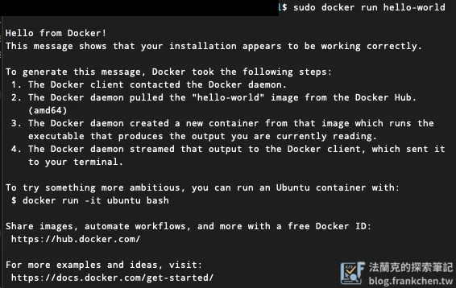

## 前言

Node.js 可以直接在本機執行，但若是要在其他系統上執行，那邊的環境就需要再重新安裝。容器化後的好處就是可以直接執行，只要該系統上有 [Docker](https://www.docker.com/)，就能輕鬆部署。

本篇將教你怎麼將 Node.js 容器化，以 Ubuntu 系統為例。

系統配置

-   Ubuntu: 22.04 LTS
-   Docker: 28.2.2

## 什麼是 Docker ？

Docker 是一個開源平台，用於自動化應用程式的部署、擴展和管理。它使用容器的概念，將應用程式及其所有依賴項（程式碼、運行時、系統工具、函式庫等）打包到一個標準化的單元中。這確保了應用程式在任何環境中都能以相同的方式運行，解決了「在我機器上可以跑」的問題。

## 使用 apt 安裝 Docker

### 設定 apt 儲存庫

若是首次安裝 Docker Engine 的系統，需要先設定 Docker apt 庫，設定好之後便可直接從倉庫安裝和更新 Docker。

```bash
sudo apt-get update
sudo apt-get install ca-certificates curl
sudo install -m 0755 -d /etc/apt/keyrings
sudo curl -fsSL https://download.docker.com/linux/ubuntu/gpg -o /etc/apt/keyrings/docker.asc
sudo chmod a+r /etc/apt/keyrings/docker.asc

# 將儲存庫新增至 Apt 來源:
echo \
  "deb [arch=$(dpkg --print-architecture) signed-by=/etc/apt/keyrings/docker.asc] https://download.docker.com/linux/ubuntu \
  $(. /etc/os-release && echo "${UBUNTU_CODENAME:-$VERSION_CODENAME}") stable" | \
  sudo tee /etc/apt/sources.list.d/docker.list > /dev/null
sudo apt-get update
```

### 安裝 Docker Engine

```bash
sudo apt-get install docker-ce docker-ce-cli containerd.io docker-buildx-plugin docker-compose-plugin
```

### 測試是否安裝成功

```bash
sudo docker run hello-world
```

若有安裝成功，系統會自行下載一個鏡像並運行。容器運行後會輸出類似如下訊息。



## 開始構建你的 Docker

構建前，要先撰寫 Dockerfile，Docker 會根據你的 Dockerfile 指令建置你的 Docker Image。

### Dockerfile 怎麼寫？

首先，先進入到 Node.js 專案資料夾

```bash
cd your/project/folder
```

接著創建 `Dockerfile` 檔案，注意，此檔案沒有附檔名。

```docker
# 使用一個輕量級的 Node.js 映像檔作為基礎
FROM node:20-alpine AS base

# 設定工作目錄
WORKDIR /app

# 複製 package.json 和 lock file (pnpm-lock.yaml)
# 這樣可以利用 Docker 的快取機制，如果依賴沒有改變，就不需要重新安裝
COPY package.json pnpm-lock.yaml ./

# 安裝 pnpm
RUN npm install -g pnpm

# 安裝依賴
# 使用 pnpm install --frozen-lockfile 以確保依賴版本一致
RUN pnpm install --frozen-lockfile

# 複製專案的其餘程式碼
COPY . .

# 建置 Next.js 應用程式
# 使用 output: "standalone" 可以建立一個獨立的伺服器，減少最終映像檔的大小
# 需要在 next.config.mjs 中設定 output: 'standalone'
# 參考: https://nextjs.org/docs/app/api-reference/next-config-js/output
RUN pnpm run build

# --- 運行階段映像檔 ---
# 使用一個更小的映像檔來運行應用程式，減少攻擊面
FROM node:20-alpine AS runner

WORKDIR /app

# 複製建置階段生成的 standalone 輸出
COPY --from=base /app/.next/standalone ./
COPY --from=base /app/public ./public
COPY --from=base /app/.next/static ./.next/static

# 暴露應用程式運行的埠號 (Next.js 預設是 3000)
EXPOSE 3000

# 定義容器啟動時執行的命令
# 運行 standalone 伺服器
CMD ["node", "server.js"]
```

**＊重要：為了使用 `output: "standalone"` 功能，需要在你的專案的 `next.config.mjs` 檔案中添加或修改配置：**

```bash
// next.config.mjs
/** @type {import('next').NextConfig} */
const nextConfig = {
  output: 'standalone', // 添加這一行
};

export default nextConfig;
```

### 建置 Docker 映像檔

在專案的跟目錄下打開終端機，執行以下命令來建置 Docker 映像檔：

```bash
docker build -t your-docker-name .
```

注意最後面的 `.` 很重要，一定要輸入。

## 怎麼運行 Docker 容器？

運行分為兩種，一種是直接透過指令運行，但是 Terminal 會就此卡住，如果你關閉了 Terminal，Docker 容器就會停止；另外一種就是透過指令讓他在後台執行，不會因為 Terminal 關閉而關閉。

### 直接運行

映像檔建置完成後，就可以執行以下指令來啟動 Docker 容器：

```bash
docker run -p 3000:3000 your-docker-name
```

現在，你可以到瀏覽器輸入 `localhost:3000` 來訪問你的 Web 應用程式。

### 後台運行

剛剛執行的容器無法在後台運行，你關掉終端機後就會自動停止，可使用以下指令讓容器在後台運行：

```bash
docker run -d -p 3000:3000 your-docker-name
```

## 讓 Docker 容器具有自動重啟能力

為確保容器在崩潰或伺服器重啟後自動重啟容器，可以使用 —restart 標誌：

```bash
docker run -d --restart unless-stopped -p 3000:3000 your-docker-name
```

## 小結

這就是使用 Docker 容器化 Node.js 專案並實現自動執行的基本做法。可以將建置和運行 Docker 映像檔的步驟整合到 CI/CD 流程中，實現完全自動化部署。

容器化完成後，你可能會需要以下進一步的部署設定：

- [如何使用 Certbot 建立免費的 SSL 網域憑證](/create-free-ssl-domain-certificates-using-certbot/)（在 Ubuntu 上為你的 Node.js 服務設定 HTTPS）
- [Node.js 記憶體優化實戰：用多層降級策略解決 geoip-lite 的 100MB 記憶體問題](/nextjs-geoip-memory-optimization/)（部署 Next.js 應用時的記憶體調校）
- [私密資料不上傳！將 v0.dev 生成的 Web 應用程式部署到你自己的 Ubuntu 伺服器](/vercel-v0-dev-ubuntu-deploy-web-app/)（自架 Ubuntu 伺服器部署 Node.js 完整流程）
