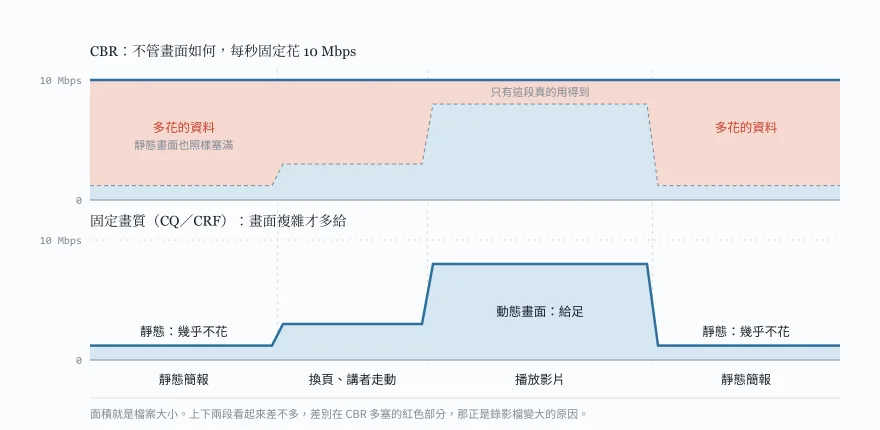
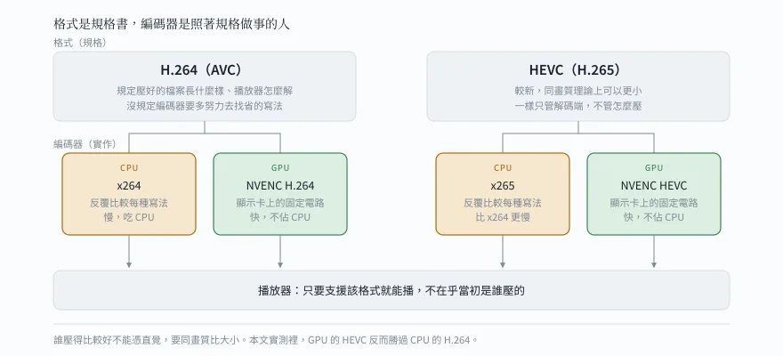
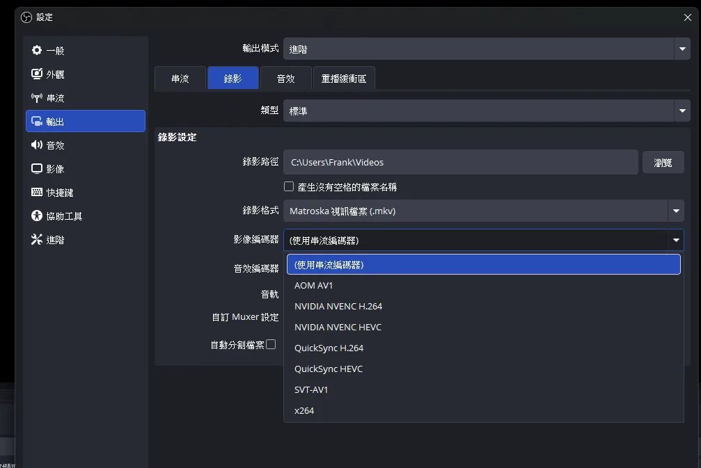
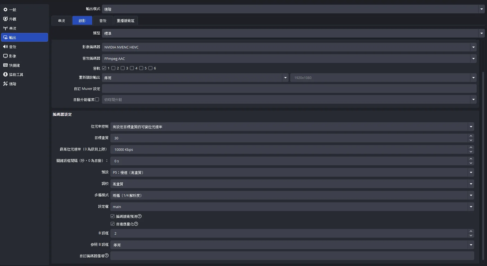

## 前言：兩個半小時的錄影，11.6 GB

前陣子用 OBS 錄了一場兩小時半的講座，講者放投影片、中間穿插影片，我用攝影機對著螢幕拍。錄完要上傳分享的時候才發現不對勁：檔案 11.6 GB，傳半天傳不完。

我的 OBS 是裝好之後就沒動過設定的那種。錄得出來、畫面也清楚，從來沒想過要去看「輸出」那一頁到底寫了什麼。

這篇是我把這支檔案拆開來看、一路實測各種設定的過程。中間我很有自信地下了一個結論，又被自己的數據推翻，這段我覺得比結論本身更值得寫。如果你也遇到 OBS 錄影檔太大，看完你會知道：

- 錄影檔為什麼會這麼大
- CBR、VBR、CQP、CRF 這些選項各是什麼、該用哪個
- GPU 和 CPU 編碼到底差在哪
- OBS 該怎麼設，已經錄好的大檔怎麼救

測試環境：Windows 11 筆電、RTX 3060 Laptop GPU、ffmpeg 7.x。

## 先看檔案到底怎麼了

影片檔的資訊用 `ffprobe` 一行就看得到，它跟 ffmpeg 裝在一起：

```bash
ffprobe -v error -show_entries format=duration,size,bit_rate:stream=codec_name,width,height,avg_frame_rate -of default=nw=1 "錄影.mkv"
```

結果整理一下：

| 項目 | 數值 |
|------|------|
| 長度 | 2 小時 32 分（9,144 秒） |
| 檔案大小 | 11.6 GB |
| 影片 | H.264，1920×1080，30fps |
| 影片位元率 | 10.0 Mbps |
| 音訊 | AAC 160 kbps |

我又隨便抽了一分鐘，算出來的位元率是 10.000 Mbps，一點都不差。這代表 OBS 用的是固定位元率（CBR），每一秒都塞滿 10 Mbps 的資料。

算一下就對上了：10 Mbps × 9,144 秒 ÷ 8 ≈ 11.4 GB，加上音訊剛好是 11.6 GB。

問題是，講座錄影大部分時間是靜態投影片，畫面幾乎不動，根本用不到 10 Mbps。這些多出來的資料全都是浪費。

## 位元率控制：CBR、VBR、CQP、CRF 是什麼

位元率控制決定編碼器「怎麼分配資料量」，差別在你要固定的是檔案大小還是畫質。



| 模式 | 固定的是什麼 | 適合用途 | OBS 介面上的名稱 |
|------|------|------|------|
| CBR | 每秒資料量 | 直播 | CBR |
| VBR | 平均或上限資料量 | 介於兩者之間 | VBR |
| CQP | 壓縮的狠度（量化參數） | 錄影存檔 | 固定QP |
| CQVBR | 目標畫質，另設上限 | 錄影存檔 | 有設定目標畫質的可變位元速率 |
| CRF | 目標畫質（x264／x265 專用） | 軟體壓縮存檔 | CRF |

各自的意思：

- CBR（Constant Bitrate）：不管畫面在做什麼，每秒都用一樣多的資料。好處是頻寬穩定，直播一定要用它，因為網路不能忽大忽小。拿來錄影就很浪費。
- VBR（Variable Bitrate）：設一個平均值或上限，畫面複雜時多給、簡單時少給。
- CQP（Constant QP）：不管位元率，固定壓縮的力道。畫面靜止時自然很省，畫面劇烈變動時多花一點。它不會依畫面內容微調，也沒辦法設上限。
- CQVBR：NVENC 的「固定畫質」模式。一樣是盯著畫質，但編碼器會再依畫面內容調整，還可以設一個最大位元率當保險。
- CRF（Constant Rate Factor）：x264、x265 的固定畫質模式，概念跟 CQVBR 一樣。

CQP、CQVBR、CRF 的數字都是越小畫質越好、檔案越大。但這裡有一個我後面才踩到的坑：不同編碼器的數字不能拿來互相比較。CRF 28 跟 CQ 28 代表的畫質並不相同，後面會用數據說明。

## 格式和編碼器是兩回事

另一個容易混在一起的觀念是「格式」和「編碼器」。



- 格式（codec）：例如 H.264、HEVC（H.265）、AV1。它是一份規格書，規定「壓好的檔案長什麼樣、播放器要怎麼解」。
- 編碼器（encoder）：實際把影片壓成那個格式的程式或硬體。同樣是 H.264，可以用 x264（跑在 CPU 上的軟體）壓，也可以用 NVENC（顯示卡上的專用電路）壓。

規格只規定解碼端怎麼讀，沒規定編碼端要多努力去找最省的寫法。所以同一個格式、不同的編碼器，壓出來的大小可以差很多。

影片壓縮的核心是「找重複」：這一格跟上一格大部分一樣，就只記哪一塊搬到哪裡，再加上一點差異。CPU 編碼器可以花大量運算去試各種寫法，GPU 上的 NVENC 則是把演算法做成固定電路，主打即時、不佔 CPU。

照這個原理，我很自然地認為：CPU 比較聰明，同畫質下應該壓得比較小。這個想法後面會被推翻。

## 實測過程

### 第一刀：重壓之後只省一成

既然元凶是 CBR，我第一個想法是用固定畫質模式重壓一次。先用最快的 NVENC H.264 試：

```bash
ffmpeg -i "錄影.mkv" -c:v h264_nvenc -rc vbr -cq 23 -b:v 0 -preset p5 -c:a copy "錄影_壓縮.mp4"
```

跑到 45 分鐘的時候我看了一下進度，位元率還有 8.5 Mbps。照這樣跑完大概 9.5 GB，只比原檔小一成。

我抽了幾格畫面出來看，才想起這支是攝影機對著電視拍的。攝影機的感光雜訊、加上牆面的紋理，讓每一格畫面都不一樣。


雜訊在人眼裡只是畫面有點髒，但在編碼器眼裡是一大堆「新細節」。品質值設得高（CQ 23），它就會認真把這些雜點全部保存下來，所以根本省不下來。

### 抽樣 60 秒，我以為 CPU 大勝

整支跑一次要好幾十分鐘，所以我改成抽同一段 60 秒，測不同設定：

```bash
ffmpeg -ss 2400 -t 60 -i "錄影.mkv" -an -c:v libx264 -crf 28 -preset medium test_x264.mp4
ffmpeg -ss 2400 -t 60 -i "錄影.mkv" -an -c:v hevc_nvenc -rc vbr -cq 28 -b:v 0 -preset p6 test_nvenc.mp4
```

| 設定 | 位元率 | 推估整支大小 |
|------|------|------|
| 原檔（CBR） | 10.0 Mbps | 11.6 GB |
| NVENC HEVC CQ 28 | 3.71 Mbps | 約 4.4 GB |
| NVENC HEVC CQ 28＋降噪 | 2.89 Mbps | 約 3.5 GB |
| x264 CRF 28 | 1.46 Mbps | 約 1.8 GB |

看到這張表，我心裡已經有結論了：CPU 果然比較聰明，同樣是 28，x264 只用了 NVENC 不到一半的位元率。用新格式 HEVC 的 GPU，居然輸給用舊格式 H.264 的 CPU。

我還開始規劃這篇文章要怎麼寫「錄影用 GPU、存檔用 CPU」。

### VMAF 打臉：同畫質下比，GPU 反而更小

上面那張表有一個沒驗證的前提：我假設「CRF 28 跟 CQ 28 畫質差不多」。這個前提要是錯的，整個比較就不成立。

要驗證畫質，得用客觀的評分工具。VMAF 是 Netflix 開源的畫質評分，0 到 100 分，越接近原片分數越高，ffmpeg 內建就能算：

```bash
ffmpeg -i test_x264.mp4 -i ref.mkv -lavfi "[0:v][1:v]libvmaf" -f null -
```

`ref.mkv` 是從原檔無損切出來的同一段 60 秒，當作比較基準。我讓兩種編碼器各掃了幾個品質值：

| 編碼器 | 設定 | 位元率 | VMAF |
|------|------|------|------|
| x264 | CRF 23 | 4.14 Mbps | 89.0 |
| x264 | CRF 26 | 2.25 Mbps | 86.5 |
| x264 | CRF 28 | 1.46 Mbps | 84.1 |
| NVENC H.264 | CQ 28 | 4.26 Mbps | 89.9 |
| NVENC HEVC | CQ 28 | 3.71 Mbps | 90.5 |
| NVENC HEVC | CQ 31 | 1.95 Mbps | 88.9 |
| NVENC HEVC | CQ 34 | 1.06 Mbps | 87.0 |

結果完全反過來：

- x264 CRF 28 只有 84.1 分，NVENC HEVC CQ 28 有 90.5 分。兩者根本不是同一個畫質等級，難怪大小差那麼多。
- 在同樣分數下比：NVENC HEVC 只要 1.06 Mbps 就拿到 87.0 分；x264 用了 2.25 Mbps，還只有 86.5 分。
- 同樣是 H.264，NVENC 的 CQ 28 和 x264 的 CRF 23 大小差不多，分數也差不多。

我前面那個「CPU 比較聰明」的結論，是拿不同畫質的檔案比大小得出來的，等於什麼都沒比到。

> CQ、CRF 的數字跨編碼器不能比較。要比較兩個編碼器，就在同樣的畫質分數下比大小。

### 整支實測：NVENC HEVC 又小、又好、又快

抽樣只有 60 秒，我還是不放心，就把整支 2.5 小時各跑一次。品質值選在 VMAF 相近的區間：x264 CRF 28 和 NVENC HEVC CQ 34。

| 項目 | x264 CRF 28（CPU） | NVENC HEVC CQ 34（GPU） |
|------|------|------|
| 檔案大小 | 1.38 GB | 1.04 GB |
| 耗時 | 約 50 分鐘 | 約 28 分鐘 |
| VMAF（第 10 分鐘，靜態簡報） | 86.8 | 89.1 |
| VMAF（第 40 分鐘，播放影片） | 84.1 | 87.0 |
| VMAF（第 90 分鐘） | 85.7 | 88.2 |

NVENC HEVC 三項全贏：小了 25%、分數每段都高 2～3 分、時間少了將近一半。

我也把同一格畫面放大並排看。x264 把投影片上的細紋理抹平了，NVENC 保留得比較接近原檔。不過正常觀看時兩支都看不出明顯的壓縮痕跡。

這個結果有它的條件，要講清楚：

- x264 只測了 `medium` 這個 preset，換成 `slow` 以上會再進步，差距可能縮小
- x264 的心理視覺調校本來就不討好 VMAF 這種指標
- 只測了一種素材、一張 RTX 3060 Laptop。RTX 20 系列以前的 NVENC 畫質比較差，結論不一定適用

所以比較準確的說法是：在這台機器、這種素材上，GPU 不但不輸 CPU，用 HEVC 還贏了。真正決定檔案大小的是位元率控制和格式，而不是 CPU 或 GPU。

### 反例：已經很小的檔案不要再壓

同一時期我手上還有另一支講座錄影：2 小時 3 分，只有 820 MB，影片位元率 0.69 Mbps。

這種檔案就不用再壓了。它當初已經用 x264 壓過一次，位元率很低。再套一次固定畫質模式，算出來的位元率可能比現在還高，結果檔案變大或差不多，畫質卻因為又壓了一次而變差。

判斷方式很簡單：先用 ffprobe 看影片位元率。1080p 低於 1.5 Mbps 左右，就代表已經壓得很省，不值得再動。

## OBS 該怎麼設

這組數據帶來的最大改變是：OBS 一開始就設對，錄完就不必再壓。

設定位置在「設定 → 輸出」，輸出模式選「進階」，然後切到「錄影」分頁。

我打開來看，才找到 10 Mbps CBR 的真正來源：錄影分頁的影像編碼器選的是「(使用串流編碼器)」。



選了它，錄影就整組沿用串流分頁的設定，而串流為了頻寬穩定用的是 CBR。我一直以為自己在用錄影設定，實際上錄的是直播規格。這個選項也會把錄影分頁的編碼器設定藏起來，所以畫面上看起來能調的東西很少。

改成「NVIDIA NVENC HEVC」之後，下方就會展開完整的編碼器設定。串流分頁維持 CBR 不要動，兩邊各管各的。



另外兩個點：

- 串流分頁的編碼器選單只會出現直播平台收得了的格式，例如設成 Twitch 時就沒有 HEVC。要找 HEVC 得在錄影分頁找。
- 選單裡的 AOM AV1 和 SVT-AV1 是跑在 CPU 上的 AV1 軟體編碼器，錄影時拿來即時壓很吃 CPU。RTX 30 系列的 NVENC 不支援 AV1 編碼，所以選單裡沒有 NVENC AV1。

| 項目 | 建議值 |
|------|------|
| 影像編碼器 | NVIDIA NVENC HEVC |
| 位元率控制 | 有設定目標畫質的可變位元速率 |
| 目標畫質 | 30；細節多的影像用 27 |
| 最高位元速率 | 10000 Kbps |
| 關鍵訊框間隔 | 0（自動） |
| 預設 | P5：慢速（高畫質）或 P6 |
| 調校 | 高畫質 |
| 多遍模式 | 兩遍（1/4 解析度） |
| 設定檔 | main |
| 錄影格式 | mkv |

幾個設定的理由：

- 用 HEVC：同畫質下比 H.264 小，近幾代 NVIDIA 顯示卡都支援。
- 最高位元速率：在固定畫質模式下，它只是保險，避免畫面劇烈變動時位元率衝太高。平常錄講座根本碰不到。
- 用 mkv：萬一 OBS 當掉或電腦斷電，已經錄下的部分還能用。mp4 沒寫完就整個打不開。

以這支講座來推估，目標畫質 30 大約是 2.5 Mbps，兩個半小時約 2.8 GB；目標畫質 27 大約 4 Mbps，約 4.5 GB。跟原本的 11.6 GB 比，畫質還更好。

第一次用這組設定，建議先錄 5 分鐘試試看。看一下檔案大小，再打開「檢視 → 統計」，確認「因編碼延遲而跳過的影格」是 0。筆電顯示卡如果跟不上，就把預設降一級。

## 已經錄好的檔案怎麼救

已經用 CBR 錄好的大檔，可以用 ffmpeg 重壓。有 NVIDIA 顯示卡的話：

```bash
ffmpeg -i "錄影.mkv" -c:v hevc_nvenc -rc vbr -cq 34 -b:v 0 -preset p6 -tag:v hvc1 -c:a copy -movflags +faststart "錄影_壓縮.mp4"
```

- `-cq 34`：本篇實測畫質和大小的平衡點。細節多的素材可以改 28～30。
- `-tag:v hvc1`：讓 Apple 裝置的 QuickTime 也能播 HEVC。
- `-c:a copy`：音訊直接複製不重壓。來源音訊如果不是 AAC 或 MP3，要改成 `-c:a aac -b:a 160k`。
- `-movflags +faststart`：讓 mp4 在網路上可以邊下載邊播。

沒有 NVIDIA 顯示卡，就用 CPU 的 x264：

```bash
ffmpeg -i "錄影.mkv" -c:v libx264 -crf 26 -preset medium -c:a copy -movflags +faststart "錄影_壓縮.mp4"
```

照前面的 VMAF 數據，x264 CRF 26 的畫質大約跟 NVENC HEVC CQ 34 相當，但檔案會大一倍左右，速度也比較慢。

如果只需要聲音，例如要拿去轉逐字稿，轉成 mp3 就好：

```bash
ffmpeg -i "錄影.mkv" -vn -ac 1 -c:a libmp3lame -b:a 64k "錄影.mp3"
```

單聲道 64k 對語音來說綽綽有餘。這場兩個半小時的講座轉出來只有 73 MB。

## 常見問題

### 目標畫質（CQ）要設多少？

講座、會議錄影設 30，手術影像或要截圖的細節素材設 27，再低檔案會大很多但肉眼難以分辨。

### HEVC 會不會有播放器放不了？

Windows 內建播放器、VLC、手機和近幾年的瀏覽器都能播，很舊的電腦或軟體才可能有問題，需要時改用 H.264 即可。

### Mac 沒有 NVENC 怎麼辦？

Mac 有 VideoToolbox 硬體編碼器可用，這篇沒有實測它的畫質，建議先抽一段跑 VMAF，再跟 x264 比較。

### VMAF 分數多少才夠？

VMAF 沒有官方及格線，本篇兩支成品落在 84 到 89 之間，正常觀看都看不出壓縮痕跡，可以當參考。

### 要不要加降噪？

降噪能再省約兩成位元率，但 VMAF 拿有雜訊的原片當基準，濾掉雜訊會被扣分，這個指標量不出它的好處。

## 結語

回頭看，這支 11.6 GB 的錄影從頭到尾只有一個問題：用直播的 CBR 設定去錄影。把位元率控制改成固定畫質，檔案就能小到原本的十分之一。

GPU 和 CPU 的差異，反而是這次最意外的地方。原理上 CPU 能做更多搜尋，我也一度用數據「證明」了它比較好，但那是拿不同畫質的檔案在比大小。用 VMAF 放到同一個畫質下比，在這台 RTX 3060 筆電上，NVENC HEVC 又小、又好、又快。

如果你的錄影檔也很大，先用 ffprobe 看一下位元率是不是一條直線。如果是，回 OBS 把錄影分頁的設定改掉，下一支錄影就會正常了。
