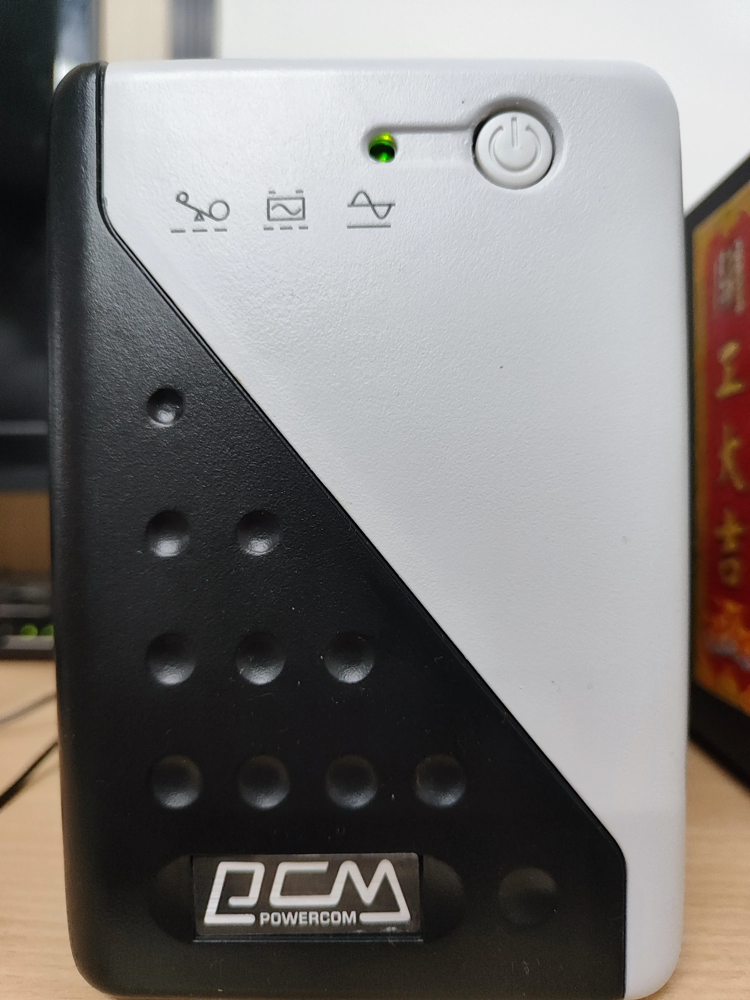
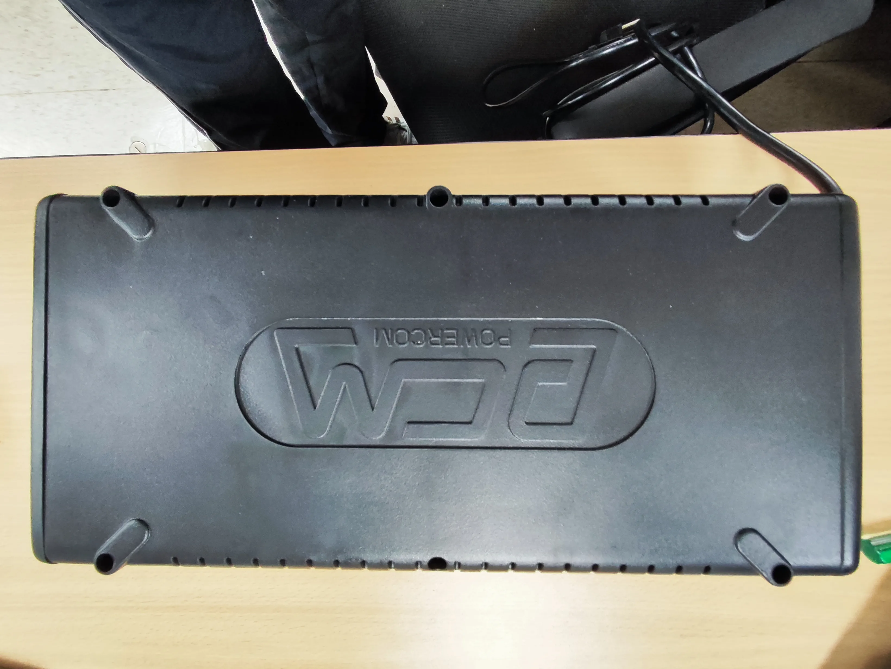
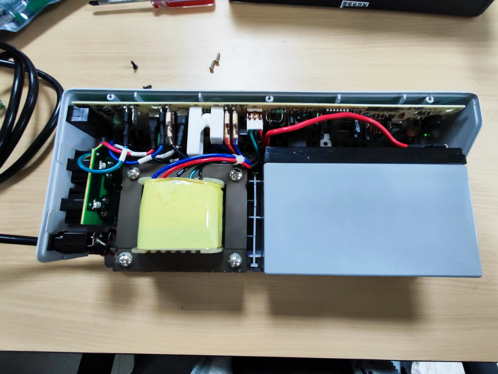
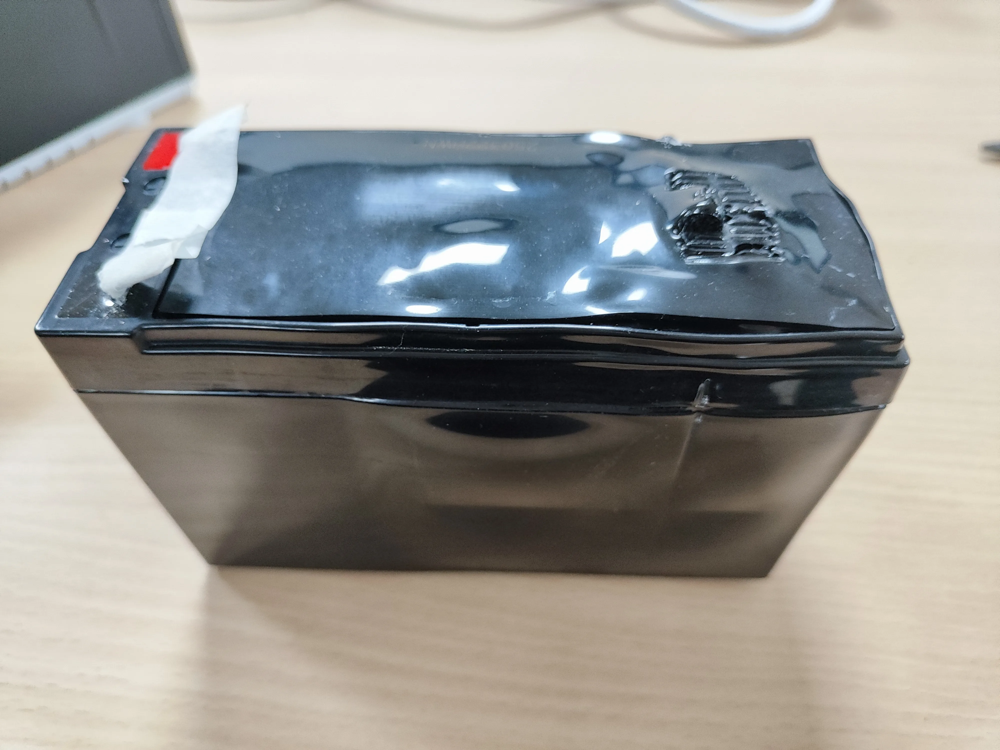
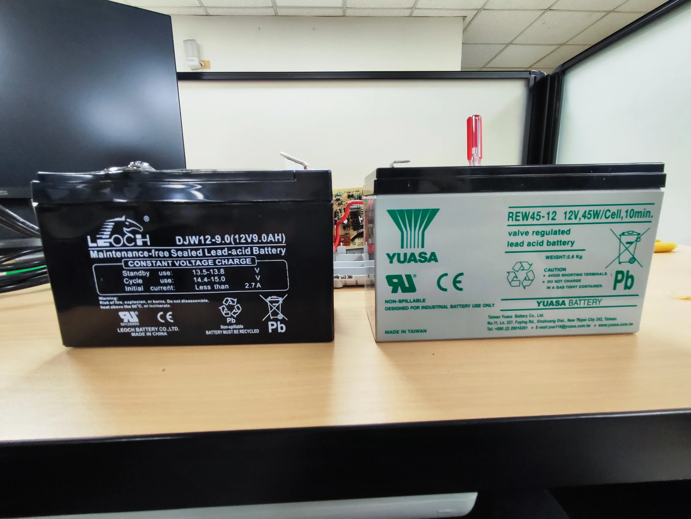

> 拆開 UPS 看到電池膨脹鼓包的瞬間，我只有一個念頭：還好今天有換。

三台 UPS 要換電池，這台科風 WAR-1000AP 是我留到最後才拆的。負責保護公司的 NAS，用了三年，最近斷電的時候幾乎撐不住。前面兩台都算順利，想說這台頂多就是麻煩一點，結果一拆開就看到電池已經膨脹了——本來以為只是電池老化沒電，沒想到是這種等級的。

這台的更換難度是三台裡面最高的，不像 APC 翻個面就好，也不像 CyberPower 拆個面板，科風要把整台外殼拆開來。

## 事前準備

| 項目 | 說明 |
|------|------|
| 替換電池 | YUASA REW45-12（12V, 45W/Cell） |
| 價格 | 蝦皮購入，約 500~600 元 |
| 工具 | 十字螺絲起子 |
| 原廠電池 | LEOCH DJW12-9.0（12V 9AH） |

## 科風 WAR-1000AP 電池更換步驟

### 確認 UPS 外觀

科風 WAR-1000AP 的品牌標示是 PCM POWERCOM，外觀是黑白配色的直立式設計。正面有電源指示燈和三個狀態圖示，底部壓印著 POWERCOM 的 logo。

### 翻面拆螺絲，這台比較多顆

把 UPS 翻到底部，找到固定外殼的螺絲，全部轉開。跟 CyberPower 只拆一兩顆不同，科風這台螺絲比較多，而且是要把整個上蓋取下來，不只是拆個面板而已。

### 整個上蓋拿起來

螺絲全部拆完，上蓋往上提就能取下。APC 翻個面、CyberPower 掀個面板，科風直接讓你看到整個 UPS 的內臟。

左邊那個黃色方塊是變壓器，右邊是電池，中間穿了一堆電線和電路板。老實說看到這個排線密度我有猶豫了一下，心想「這真的能自己換嗎？」不過定下來看，電池的接頭其實很好認，就是紅黑兩條線。

### 取出舊電池——膨脹了

拔掉電池接線，把舊電池拿出來，這時候我就傻了。

這顆 LEOCH DJW12-9.0 已經明顯膨脹鼓包，上面的塑膠封蓋都被撐得變形隆起。我知道鉛酸電池用久了可能會膨脹，但沒想到才三年就鼓成這樣。膨脹代表電池內部已經產生大量氣體，再繼續用下去有漏液的風險。

拿在手上的時候特別小心，怕一個不注意擠壓到會破裂。

### 新舊電池對比

左邊是膨脹的 LEOCH DJW12-9.0，右邊是新的 YUASA REW45-12。光看外型的差距就知道舊電池有多慘。

YUASA 是日系品牌，台灣湯淺製造。我在蝦皮搜「WAR-1000AP 電池」的時候，YUASA 和 CSB 是最常出現的兩個牌子，查了一下評價後選了 YUASA。

### 裝回去，小心別夾到線

新電池放回原本的位置，接上電源線接頭。紅接紅、黑接黑，接頭有防呆設計。

蓋回上蓋的時候是最需要耐心的步驟。科風內部的排線比 [CyberPower](/cyberpower-cp1000pfclcda-battery-replacement/) 和 [APC](/apc-back-ups-650-battery-replacement/) 都密得多，上蓋放下去之前我先把幾條排線往內側撥，確認沒有壓到或夾住，才慢慢蓋上。如果硬蓋的話，夾到排線輕則接觸不良，重則短路燒板子。

螺絲鎖回去，開機，電源指示燈亮綠燈。呼，終於搞定了。

## 科風 WAR-1000AP 換電池心得：電池膨脹的警示

科風 WAR-1000AP 是三台裡面換起來最麻煩的。要拆整個外殼，螺絲比較多，內部排線看起來也比較嚇人。跟 [APC 那種翻面開蓋](/apc-back-ups-650-battery-replacement/)的設計比起來，真的是不同世界。

替換電池 YUASA REW45-12 的規格是 12V、45W/Cell，換算容量等同原廠 LEOCH DJW12-9.0 的 12V 9AH，F2 寬端子，尺寸也相容，直接放進去就對了。

不過這台最讓我印象深刻的不是拆裝的麻煩，而是那顆膨脹的電池。三年前裝進去的時候好好的，現在拿出來已經鼓成一包。如果你的 UPS 也用了三年以上，不管還能不能用，真的建議拆開來看一下電池的狀態。別等到漏液了才處理，到時候整台 UPS 可能就報銷了。

> 這是 UPS 電池更換系列的第三篇，三台裡最麻煩的一台。前兩台輕鬆得多：[APC Back-UPS 650](/apc-back-ups-650-battery-replacement/) 翻個面就能換完，[CyberPower CP1000PFCLCDa](/cyberpower-cp1000pfclcda-battery-replacement/) 拆個面板抽出電池就好。
>
> 三台的電池規格和價格整理，我會再補一篇選購指南。
