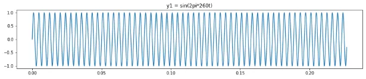
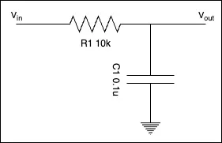

> 你是否遇過樹莓派 GPIO 訊號像被打興奮劑一樣，訊號自己亂跳？這就是高頻雜訊的傑作。

## 前言

樹莓派因其有著信用卡般的體積、手機般的耗電量及樂高的擴充性，除了被使用在教育、個人DIY，也被廣泛使用在正式產品及商業應用中。我也不例外，第一個接手的專案就是以樹莓派為核心。

在這個專案中，遇到最棘手的問題就是：產品使用環境中包含會產生高頻的機器，所以我的產品會受到高頻的影響，出現很多意想不到的狀況。

解高頻干擾算是我遇到的第一個大難題。身為軟體工程師的我，第一次的產品 Demo 就遇上電路問題，又剛好團隊中沒有電子工程師，只有略懂電路的我。

因此，我將我的解法記錄下來，希望能幫助到有相同困擾的人。

## 當 GPIO 遇上高頻雜訊

我的這個產品會部署在醫療環境中 (屬於練習用產品，非使用在醫療行為)，在這環境中存在很多會產生高頻的設備，例如：高頻電刀、氬氣電刀、射頻電刀等等。這些設備產生的高頻訊號非常惱人，就連常見的內視鏡也會有被干擾的可能。

> 以高頻電刀為例，會產生 350 kHz 左右的頻率。

當這些高頻訊號竄入 GPIO，就像給它打了興奮劑，原本應該是穩定 0 或 1 的訊號，開始在中間值瘋狂抖動，導致程式讀到錯誤的訊號，做出非預期的行為。

高頻訊號示意圖：會以一個很快的速度上下跳動，導致程式判讀訊號異常。

圖片來源：[https://simonfang1.github.io/blog/2019/04/25/music-theory-1/](https://simonfang1.github.io/blog/2019/04/25/music-theory-1/)

## 樹莓派 GPIO 設計原理

要解決問題，得先了解 GPIO 是怎麼運作的。  
簡單來說，你可以`把 GPIO 想像成一個由程式控制的開關`。

### 輸入模式

在輸入模式下，GPIO 就像一隻「耳朵」，用來偵測外部電路是高電位 (High) 還是低電位 (Low)。

但這裡有個陷阱：如果 GPIO 沒有連接任何東西（懸空狀態），它的電位會變得非常不穩定，像牆頭草一樣，一下偏向高電位，一下偏向低電位。這時候空氣中的任何電磁波，像是 Wi-Fi、手機訊號，甚至是前面提到的高頻設備，都有可能輕易地影響它，造成訊號誤判。

為了解決這個問題，我們需要「上拉電阻 (Pull-up)」或「下拉電阻 (Pull-down)」。

-   **上拉電阻**：將 GPIO 透過一個電阻接到 3.3V。當沒有`外部訊號`時，GPIO 會維持在高電位。
-   **下拉電阻**：將 GPIO 透過一個電阻接到 GND。當沒有`外部訊號`時，GPIO 會維持在低電位。

這樣就能確保 GPIO 在待機時有一個明確的預設狀態，不會亂飄。

### 輸出模式

在輸出模式下，GPIO 則變成一張「嘴巴」，由程式決定要輸出`高電位 (3.3V)` 還是`低電位 (0V)`，用來控制 LED 燈、繼電器等外部元件。

## 高頻干擾解決方案

了解原理後，對付高頻雜訊就有方向了。  
硬體解法就像是為你的電路套上防護罩，從根本上阻擋干擾。

### 方案一：低通濾波器電路

這是最有效也最常見的硬體解法。  
**低通濾波器** (Low-pass Filter)，原理很簡單：`只讓低頻訊號通過，阻擋高頻訊號`。

它由一個電阻 (R) 和一個電容 (C) 組成：

-   電阻 (R)：串聯在 GPIO 和訊號源之間，用來限制電流。
-   電容 (C)：並聯在 GPIO 和接地 (GND) 之間。

#### 運作原理：

電容的特性是「**通高頻，阻直流**」。當高頻雜訊進來時，會被電容直接導向接地，達到「過濾」的效果。而我們需要的穩定、低頻的開關訊號則會順利進入 GPIO。

你可以把電容想像成一個水壩的洩洪口，**高頻雜訊就像是突然來的洪水**，**會直接從洩洪口排掉**，而正常的水流（訊號）則不受影響。

#### 如何選擇 R 和 C 的數值？

這兩個值的搭配會決定「截止頻率 (Cutoff Frequency)」，也就是開始過濾掉訊號的頻率點。公式是：f = 1 / (2 \* π \* R \* C)。

-   **R (電阻)**：通常選用 1kΩ 到 10kΩ 之間。
-   **C (電容)**：通常選用 0.1µF (標示為 104) 的陶瓷電容，它對高頻雜訊的濾波效果非常好。

以 R = 10kΩ、C = 0.1µF 為例，截止頻率大約是 159 Hz。這意味著高於 159 Hz 的訊號都會被大幅衰減，對於我們動輒幾百 kHz 的雜訊來說，綽綽有餘！

### 方案二：善用遮蔽隔離 (物理防禦)

如果你的訊號線很長，那它就像一根天線，會接收各種雜訊。

-   使用**遮蔽線**：將你的訊號線換成帶有金屬編織網的遮蔽線，並將遮蔽網接到系統的接地 (GND)。這層金屬網能有效地將外部雜訊隔離。
-   **絞線對** (Twisted Pair)：把你的訊號線和一條地線 (GND) 互相纏繞在一起，形成絞線對。這樣可以利用`電磁感應`的原理，讓兩條線上感應到的雜訊互相抵消。

## 小結

處理雜訊問題，軟體（例如 Debounce）和硬體方法都很重要，但通常我會建議：

> 能用硬體解決的，就不要只靠軟體。

硬體濾波是從源頭阻斷問題，讓你的軟體能處理更乾淨、更穩定的訊號。

一個簡單的 RC 電路，成本不到 1 塊錢，卻能讓你的產品穩定性提升好幾個檔次，絕對是 CP 值最高的投資！

下次再遇到 GPIO 訊號亂跳或被干擾，別再懷疑人生了，先來一顆電容吧！

解彈跳的演算法對於軟體工程師來說不難，但要先理解為何會有彈跳，[下一篇](/raspberry-pi-gpio-software-debounce-guide/)帶你認識及實作。

相關文章：

-   [樹莓派 GPIO 雜訊筆記系列：軟體篇，實作 Debounce 演算法消除惱人抖動訊號](/raspberry-pi-gpio-software-debounce-guide/)

參考連結：

-   [樹莓派官網](https://www.raspberrypi.org/)
-   [The Raspberry Pi GPIO pinout guide](https://pinout.xyz/).
