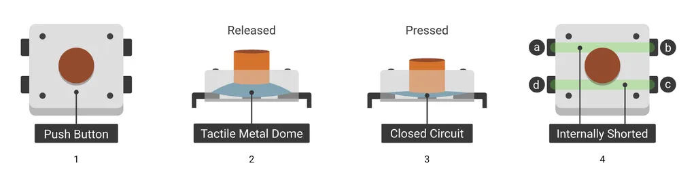
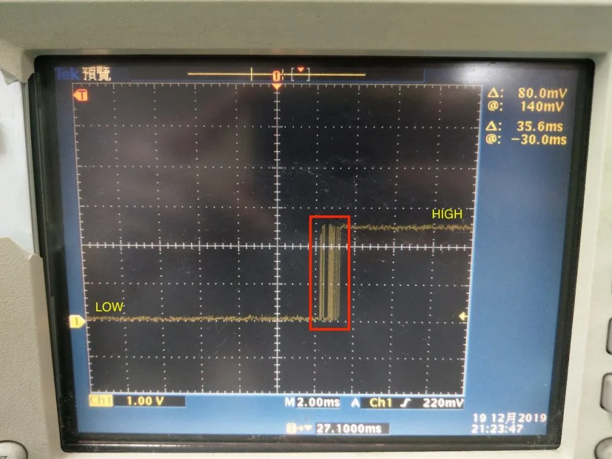

> 你是否遇過明明已經使用硬體方法解決干擾問題了，但軟體在判斷開關類的訊號時始終還是有誤判的狀況呢？

## 前言

[上一篇](/raspberry-pi-gpio-high-frequency-noise/)我們聊到，在 GPIO 腳位和 GND 之間並聯一顆 0.1µF 的陶瓷電容，這個成本不到 1 塊錢的「低通濾波器」，就能擋掉大部分高頻雜訊。

照理說這樣軟體面就能使用乾淨的雜訊，但其實還有來自元件本身的物理現象「`機械彈跳 (Mechanical Bouncing)`」，這物理性的抖動得靠軟體來解決。

這篇就來帶你認識什麼是「彈跳」，並用幾種不同的 Debounce 演算法，從入門到進階，消除惱人抖動訊號。

## 什麼是「彈跳 (Bouncing)」？

### 從物理結構看彈跳

身為一個軟體工程師，我們常面對的不是 true 就是 false，沒有第三種選項，一個指令一個動作。但硬體就不是這麼單純的 0 或 1，「按下去」這個動作，從物理角度來看是很動感的。

拿常見的按鈕開關來說，他的內部就是用兩片金屬彈片組成，當你按下去時，兩片金屬片會接觸導通。

舉個例子，你可以把按下去的過程想像成是「把一顆籃球砸向地板」，它會因為彈性而來回彈跳好幾次才停下來。

按鈕裡的金屬彈片也是一樣。在你按下的幾毫秒 (ms) 內，它們會以**極快的速度**互相碰撞、分開、再碰撞、再分開，直到最後才穩定地接觸在一起。

這個「彈跳」的過程，對人體來說根本無法察覺，但對樹莓派的 GPIO 來說，它的反應速度快到足以捕捉到每一次微小的碰撞。所以一次的按壓，在它眼裡就變成了好幾次的快速開關。



[圖片來源](https://www.instructables.com/%E5%A6%82%E6%AD%A4%E7%B0%A1%E5%96%AE-MicroPython-%E6%8C%89%E9%88%95%E9%96%8B%E9%97%9C-Vs-%E5%BD%88%E8%B7%B3%E7%8F%BE%E8%B1%A1/)

### 從電子訊號看彈跳

既然我們知道按鈕內部會像籃球一樣彈跳，那這些物理上的「彈跳」，在電路上會怎麼呈現，又會怎麼被樹莓派 GPIO 讀到呢？

如底下圖片紅框處，那就是彈跳的訊號，會在 `HIGH` 與 `LOW` 之間來回快速跳動，最後才會穩定在 HIGH 訊號。

如果你寫得程式是「`只要偵測到 HIGH 就執行一次動作`」，那恭喜你一次的按鈕按壓，你的動作可能就會被**執行無數次**。

這就像你只點擊了一下滑鼠，結果電腦卻幫你點了三四下，是不是很惱人？**這就是「彈跳」在電子訊號層面帶來的實際困擾**。



## 軟體解彈跳 (Debounce) 的三種方法

### 方法一：【入門】簡單延遲法

這是**最直覺**的做法，在收到 HIGH 訊號時，直接先等個 50 毫秒 (ms)，然後再確認狀態是不是真的改變了，如果兩次的狀態都一樣，那代表彈跳的狀態已過去。

但是這個方法最致命的**缺點**是在等待的這個期間 (50 ms)，**你的程式會被「凍結」**，什麼事情都做不了，只能等待時間過了才能繼續處理。

對於簡單的專案來說夠用，但是如果你的執行緒上有很多事情要處理，像是讀取感測器、更新顯示器、處理網路通訊等等，那這個方法會讓整個程式在有訊號進來時卡卡的。

**適用情境**：

-   只有單一按鈕，沒有其他複雜任務
-   學習 Debounce 概念的入門練習
-   對即時性要求不高的簡單專案

```python
// ========== 簡單延遲法 (Simple Delay) ==========

// ========== 變數宣告 ==========
buttonPin = 1
lastStableState = LOW            // 上一次穩定的狀態 (初始為放開)

// ========== 主程式迴圈 ==========
LOOP:
    // 1. 讀取當前按鈕狀態
    currentState = digitalRead(buttonPin)

    // 2. 檢查狀態是否改變
    IF currentState != lastStableState THEN
        // 3. 偵測到變化,直接阻塞等待
        delay(50)  // == 阻塞 50ms,期間無法做任何事 ==

        // 4. 重新讀取按鈕狀態 (二次確認)
        confirmedState = digitalRead(buttonPin)

        // 5. 確認狀態真的改變了 (不是抖動)
        IF confirmedState != lastStableState THEN
            // 6. 更新穩定狀態
            lastStableState = confirmedState

            // 7. 判斷是按下還是放開
            IF lastStableState == HIGH THEN
                PRINT "按鈕被按下！"
                // 在此執行按鈕按下的邏輯
            ELSE
                PRINT "按鈕被放開！"
                // 在此執行按鈕放開的邏輯
            END IF
        END IF
        // ELSE: 是抖動,忽略此次變化
    END IF

    // 8. 短暫延遲避免過度耗用 CPU (可選)
    delay(1)

    GOTO LOOP
END LOOP
```

### 方法二：【進階】狀態機計時法

這個方法的核心概念是「`非阻塞式 (Non-blocking)`」設計。不像方法一會傻傻地等 50ms，這個方法會在狀態改變時記錄「狀態改變的時間」，然後在每次迴圈中檢查：「從上次改變到現在，過了 50ms 了嗎？」

如果時間到了而且狀態真的穩定了，那就確認這是一次有效的按鈕動作。如果時間還沒到，或是狀態又變了（代表還在彈跳），那就繼續等待。重點就是在等待的過程中，你的程式**可以繼續做其他事情**不會被卡住。

這個方法在實務上很常用，因為它在**準確性和效能之間取得了很好的平衡**。而且程式碼也不會太複雜，容易維護和理解。

**適用情境**：

-   需要同時處理多個任務的專案
-   有多個按鈕需要監控
-   對即時性有一定要求的應用

```python
// ========== 變數宣告 ==========
buttonPin = 1
currentState = LOW               // 當前按鈕狀態
lastStableState = LOW            // 上一次穩定的狀態 (初始為放開)
lastDebounceTime = 0             // 上一次狀態改變的時間戳記
debounceDelay = 50               // 防彈跳延遲閾值 (毫秒)

// ========== 主程式迴圈 ==========
LOOP:
    // 1. 讀取當前按鈕的原始狀態
    reading = digitalRead(buttonPin)

    // 2. 檢查是否有狀態變化（可能是雜訊或真實按下/放開）
    IF reading != currentState THEN
        // 狀態改變了，重置計時器
        lastDebounceTime = getCurrentTime()
        currentState = reading
    END IF

    // 3. 檢查當前狀態是否已穩定超過閾值時間
    IF (getCurrentTime() - lastDebounceTime) > debounceDelay THEN
        // 4. 狀態已穩定，檢查是否與上次穩定狀態不同
        IF currentState != lastStableState THEN
            // 5. 確認為有效的狀態變化
            lastStableState = currentState

            // 6. 判斷是按下還是放開
            IF lastStableState == HIGH THEN
                PRINT "按鈕被按下！"
                // 在此執行按鈕按下的邏輯
            ELSE
                PRINT "按鈕被放開！"
                // 在此執行按鈕放開的邏輯
            END IF
        END IF
    END IF

    // 7. 執行其他非阻塞任務
    doOtherTasks()

    // 8. 短暫延遲（可選，避免過度耗用 CPU）
    delay(1)  // 例如 1ms

    GOTO LOOP
END LOOP

// ========== 輔助函數 ==========
FUNCTION getCurrentTime():
    RETURN 當前系統時間（毫秒）
END FUNCTION

FUNCTION doOtherTasks():
    // 在這裡執行其他需要持續運行的任務
    // 例如：更新顯示、處理通訊、檢查感測器等
END FUNCTION
```

### 方法三：【高階】善用中斷機制

**中斷** (Interrupt) 是一個強大的機制，它讓硬體在特定事件發生時（例如按鈕被按下），自動通知 CPU 暫停手邊的工作，先去執行對應的處理程式（**中斷服務常式，ISR**），處理完再回來繼續原本的工作。

但是，中斷程式它會在「**任何時候**」被觸發，這代表如果按鈕彈跳造成多次觸發，中斷程式就會被執行多次，所以我們還是要在中斷程式**內部做 Debounce** 檢查。

方法就是記錄「上一次觸發中斷的時間」，如果這次觸發距離上次不到 50ms，那就直接忽略（因為很可能是彈跳）。只有間隔夠長的觸發，才是真正的按鈕按壓。

這個方法的優點是效能最好，CPU 不用**一直輪詢**按鈕狀態，平時可以專心做其他事情或進入省電模式。但缺點是程式碼稍微複雜一點，而且要注意中斷程式的**執行時間不能太長**，否則會影響整個系統的運作。

**適用情境**：

-   對效能和省電有高度要求的專案
-   按鈕事件發生頻率較低
-   需要最快的反應速度（微秒等級）

**注意事項**：

-   中斷服務常式 (ISR) 內部不要執行太複雜或太耗時的操作
-   不要在 ISR 內使用會阻塞的函數（如 delay）
-   Debounce 延遲時間可以根據實際按鈕特性調整（通常 50~300ms）

```python
// ========== 變數宣告 ==========
buttonPin = 1                    // GPIO 腳位
last_trigger_time = 0            // 上一次觸發時間
DEBOUNCE_TIME = 50              // 防彈跳延遲閾值 (毫秒)


// ========== 初始化 ==========
設定 buttonPin 為輸入模式
啟用 buttonPin 的下拉電阻
註冊中斷：當 buttonPin 偵測到上升緣時，執行 button_pressed_ISR


// ========== 主程式迴圈 ==========
LOOP:
    PRINT "執行其他任務..."
    延遲 2 秒

    GOTO LOOP
END LOOP


// ========== 中斷服務常式 ==========
FUNCTION button_pressed_ISR():
    current_time = getCurrentTime()  // 取得目前時間（毫秒）

    // 防彈跳檢查
    IF (current_time - last_trigger_time) < DEBOUNCE_TIME THEN
        RETURN  // 忽略此次觸發
    END IF

    // 更新最後觸發時間
    last_trigger_time = current_time

    // 執行按鈕按下的動作
    PRINT "按鈕被按下！"
    // 在此執行其他邏輯
    // == 按鈕確定被按下時，會執行到這裡！ ==

END FUNCTION


// ========== 輔助函數 ==========
FUNCTION getCurrentTime():
    RETURN 當前系統時間（毫秒）
END FUNCTION
```

**方法**

**優點**

**缺點**

**適用情境**

簡單延遲法

容易理解、程式碼簡單

會阻塞程式執行，無法處理其他任務

簡單專案、學習用途

狀態機計時法

非阻塞、可同時處理多任務、準確度高

需要持續輪詢，CPU 使用率較高

多任務專案、多按鈕監控

中斷驅動法

效能最佳、省電、反應速度快

程式較複雜、需注意 ISR 執行時間

對效能要求高的專案

選擇哪種方法，取決於你的專案需求。如果只是做個簡單的開關燈專案，方法一就夠用了。但如果你在做智慧家居系統，需要同時監控多個感測器和按鈕，那方法二或方法三會是更好的選擇。

## 總結

在上一篇硬體篇中，我們學會了**用 0.1µF 的電容來擋掉高頻雜訊**，從電路層面解決了大部分的干擾問題。但就算硬體濾波做得再好，還是有個按鈕本身的物理現象「`機械彈跳`」躲不掉。

這篇文章帶你認識了彈跳的成因，以及三種軟體解彈跳的方法：簡單延遲法適合入門練習、狀態機計時法是實務上的平衡方案、中斷驅動法則是追求極致效能的選擇。

記住，沒有哪種方法是絕對最好的，重點是根據你的專案需求來選擇。如果只是簡單的按鈕控制 LED，方法一就夠用了；但如果要同時處理多個任務，那就考慮方法二或方法三吧。

現在，**結合[硬體篇的 RC 濾波電路](/raspberry-pi-gpio-high-frequency-noise/)和這篇的軟體 Debounce 演算法**，你的 GPIO 訊號品質應該已經相當乾淨穩定了。下次再遇到按鈕誤判或訊號亂跳的問題，就知道該從哪裡下手了。

相關文章：

-   [樹莓派 GPIO 雜訊筆記系列：硬體篇，用電路解決干擾問題](/raspberry-pi-gpio-high-frequency-noise/)

參考連結：

-   [樹莓派官網](https://www.raspberrypi.org/)
-   [如此簡單 MicroPython - 按鈕開關 Vs 彈跳現象](https://www.instructables.com/%E5%A6%82%E6%AD%A4%E7%B0%A1%E5%96%AE-MicroPython-%E6%8C%89%E9%88%95%E9%96%8B%E9%97%9C-Vs-%E5%BD%88%E8%B7%B3%E7%8F%BE%E8%B1%A1/)
