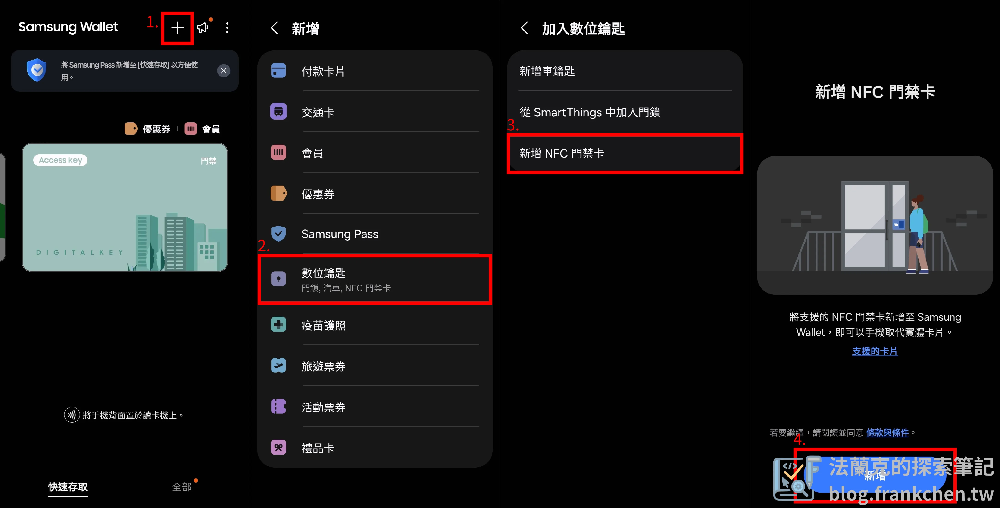
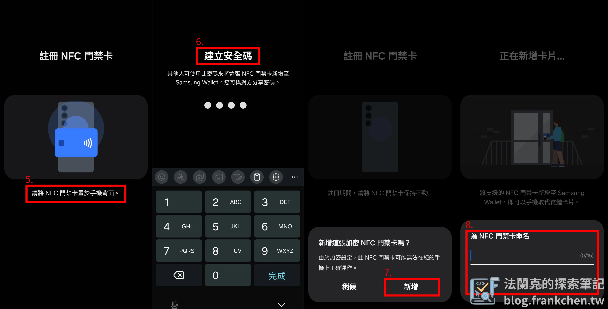

**Samsung Wallet 終於開放 NFC 門禁卡功能**！每天進公司或是回家，都要拿出對應的實體門禁卡才能進出辦公室或家裡。現在，可以把公司及家裡的實體門禁卡綁定到三星手機， 之後進出公司或家裡都能直接拿出手機來刷卡，就不用每次進出都要忙手忙腳。

接下來將帶你了解完整的資訊及綁定的方法，讓生活更便利！

## 哪些三星手機支援 NFC 門禁卡功能？

根據[三星官方公告](https://www.samsung.com/hk/support/mobile-devices/nfc-access-card/?srsltid=AfmBOoo1r2T8vcuz7EZ5VQJxzaYMxaliVeke84q5FRzDnnHI9ACHQ24n)，裝置的系統版本必須是 Android 15 以上，最保險的做法就是更新到含有「6月的安全性更新」版本，才能使用「NFC 門禁卡」功能，目前以下裝置支援：

-   Galaxy Z 系列：
    -   **Flip 系列**：Z Flip6、Z Flip5 5G、Z Flip4 5G、Z Flip3 5G
    -   **Fold 系列**：Z Fold6、Z Fold5 5G、Z Fold4 5G、Z Fold3 5G
-   Galaxy S 系列：
    -   **S25 全系列**：S25 Edge、S25 Ultra、S25+、S25
    -   **S24 全系列**：S24 FE、S24 Ultra、S24+、S24
    -   **S23 全系列**：S23 FE、S23 Ultra、S23+、S23
    -   **S22 系列**：S22 Ultra、S22+、S22 (**FE 版本尚未支援**)
    -   **S21 系列**：S21 Ultra、S21+、S21 (**FE 版本尚未支援**)
-   Galaxy A 系列：
    -   A36 (**唯一支援的A系列**)

可支援裝置會持續更新，如果未支援到的使用者，請隨時關注三星官方公告，如果我有發現更新，也會在這裡一併更新。

## 系統已是最新版但無法使用 NFC 門禁卡功能怎麼辦？

這裡搜集了幾個目前網友遇到的問題及解決方法。

1.  系統需要更新到哪一版本？
    -   系統需要更新到 Android 15 以上，也就是 One UI 7，保險的做法就是更新到含有「6月的安全性更新」版本。
2.  Samsung Wallet 需要更新嗎？
    -   需要，Samsung Wallet 需要更新到 `6.0.85` 版本。
3.  如果 Wallet 在商店沒有更新怎麼辦？
    -   可以下載 APK 手動更新，安裝後就可以使用了。
    -   👉 [APK 下載連結](https://www.apkmirror.com/apk/samsung-electronics-co-ltd/samsung-pay/samsung-wallet-samsung-pay-6-0-85-release/)
4.  系統及 Wallet 都更新了，但還是無法使用怎麼辦？
    -   重啟大法！把手機重新啟動試試看。
    -   或是前往應用程式設定，搜尋「**Samsung Wallet Digital Key**」，把應用程式強制停止後，重新開啟 Samsung Wallet。

## 如何將實體門禁卡綁定到 Samsung Wallet 「NFC 門禁卡」？

根據以下步驟，即可將實體門禁卡綁定到 Wallet ：

進入「**Samsung Wallet**」，點擊右上角「**+**」—> 「**數位名片**」—>「**新增 NFC 門禁卡**」—>「**新增**」

接著將你的實體卡靠在手機背面，之後根據手機提示照著步驟走，即可完成綁定。

## 要如何使用「NFC 門禁卡」功能？

1.  開啟「Samsung Wallet」，選擇門禁卡後，就可以直接手機靠近讀卡機使用。
2.  鎖定畫面底部也可以快速開啟「Samsung Wallet」，開啟後，選擇門禁卡，就可以直接手機靠近讀卡機使用。

## 「NFC 門禁卡」功能問題？

-   **支援哪些實體門禁卡**：支援 RFID 實體卡或感應磁扣，但並不支援加密過的實體卡。

-   「NFC 門禁卡」功能需要**開啟 NFC** 嗎：需要，因為是靠著 NFC 來模擬門禁卡。

-   **無網路**可以使用「NFC 門禁卡」功能嗎：可以，這功能不需要使用到網路。

-   **沒有電了**可以使用「NFC 門禁卡」功能嗎：不可以，沒電情況下只能使用「悠遊卡」。

-   如果換手機了，**需要重新綁定嗎**：不需要，可以使用三星原廠提供的 Smart Switch Mobile 轉移到新手機。

盼了許久，終於等到三星開放了，有了「NFC 門禁卡」功能，之後進出大樓就不需要在手忙腳亂地找出實體門禁卡，直接「掏出手機，開啟門禁卡，靠卡感應，進門！」一氣呵成。
