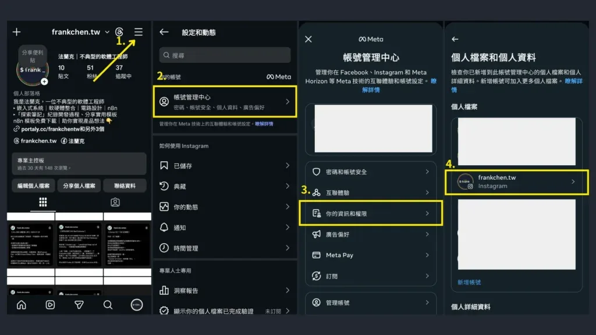
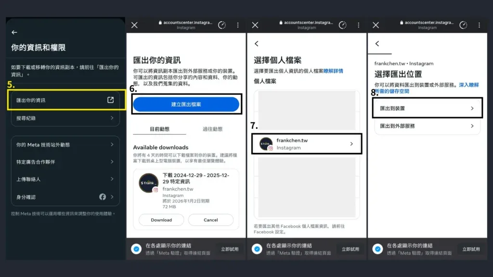
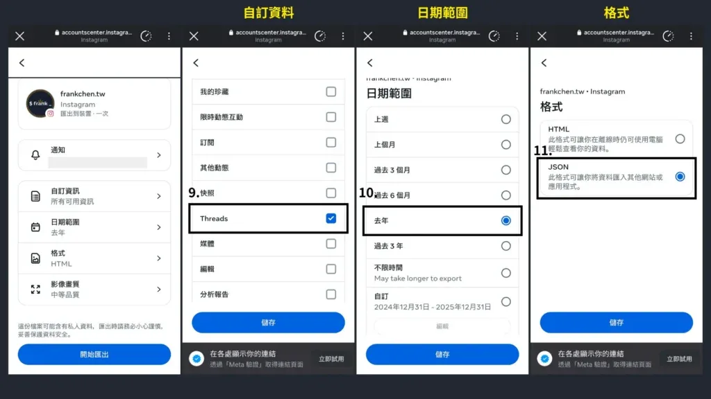
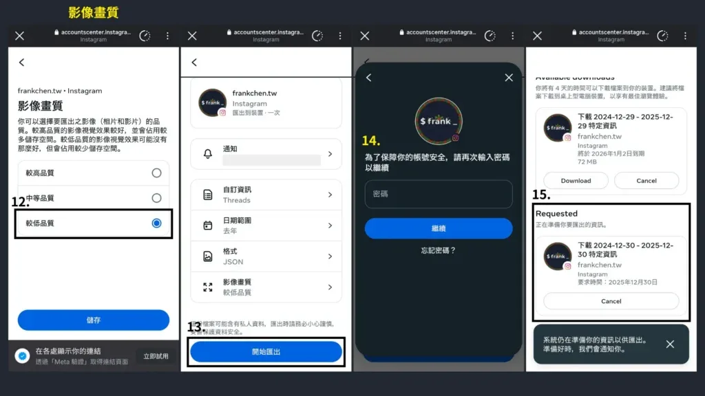
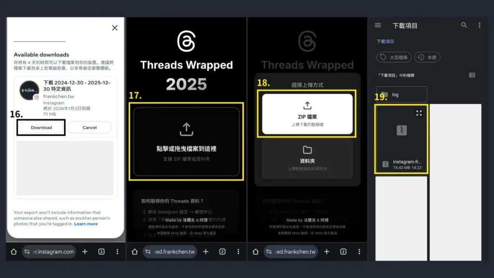
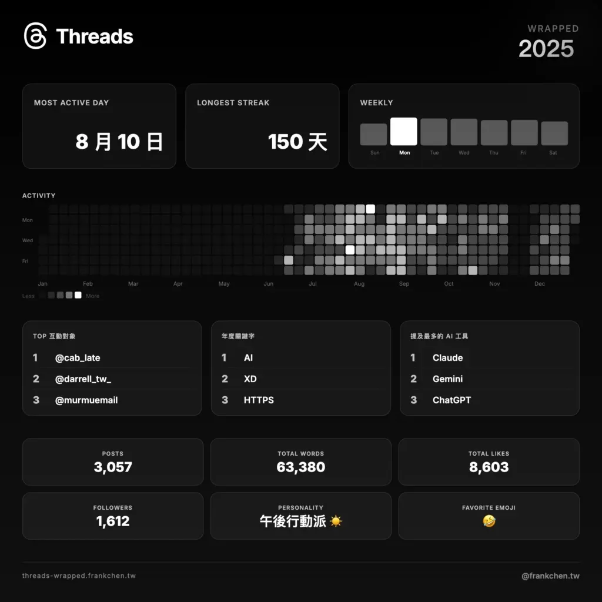

想要回顧你在 Threads 上的 2025 年嗎？在使用 [Threads Wrapped 年度回顧](https://threads-wrapped.frankchen.tw/) 之前，你需要先從 Instagram 匯出你的 Threads 資料。這篇教學將帶你一步步完成資料匯出，整個過程大約只需要 5 分鐘。

Threads Wrapped 最後有互動效果，為了獲得最佳的操作體驗，建議使用電腦進行操作。

## 第一步：前往帳號管理中心

1.  開啟 Instagram，並到你的個人頁面，點擊右上角「三」
2.  點擊「帳號管理中心」
3.  點擊「你的資訊和權限」
4.  選擇你要輸出的帳號

## 第二步：前往匯出資料頁面

5.  點擊「匯出你的資訊」
6.  點擊「建立匯出資訊」
7.  選擇要匯出的帳號
8.  選擇「匯出到裝置」

## 第三步：設定匯出資料的內容

9.  **自訂資料**：選擇「Threads」
10.  **日期範圍**：選擇「去年」或「自訂」設定 2025/1/1~2025/12/31
11.  **格式**：選擇「JSON」

## 第四步：匯出 Threads 資料

12.  **影像畫質**選擇「較低品質」（也可以使用預設的中等畫質）
13.  都設定好後就能按下「開始匯出」
14.  輸入 Instagram 密碼
15.  輸入完密碼後，畫面即會出現開始匯出的畫面，匯出完成後平台會寄信通知。（匯出的時間長度與你的資料量有關）

## 第五步：開始回顧你的 Threads

等到平台通知匯出完成後，即可前往剛剛的頁面下載匯出的壓縮檔

16.  點擊「Download」下載壓縮檔
17.  前往 [Threads Wrapped](https://threads-wrapped.frankchen.tw/)，點擊中間的上傳區塊
18.  點擊上傳 ZIP 檔案
19.  選擇你剛剛下載的壓縮檔，開始你的 Threads 回顧之旅吧！

別忘了最後可以下載統計圖，分享到你的 Threads 或 Instagram 限時動態！

## 常見問題

**Threads 資料匯出需要多久時間？**

匯出時間取決於你的資料量。一般來說，發文數量較少的帳號約需 5-10 分鐘，發文量大的帳號可能需要數小時。Meta 會在匯出完成後寄送通知信。

**匯出的資料會包含哪些內容？**

匯出的 JSON 檔案會包含你的 Threads 貼文內容、發布時間、互動數據等資訊。Threads Wrapped 會分析這些資料，產生你的年度回顧統計。

**為什麼要選擇 JSON 格式？**

Threads Wrapped 需要讀取結構化的資料格式，JSON 是程式可以直接解析的格式。如果選擇 HTML 格式，將無法正確分析你的資料。

**我的資料安全嗎？**

Threads Wrapped 完全在你的瀏覽器本地執行，你的資料不會上傳到任何伺服器。所有分析都在你的電腦上完成，確保隱私安全。此專案完全開源，你可以在 [GitHub](https://github.com/haunchen/threads-wrapped) 查看完整程式碼。

## 關於 Threads Wrapped

Threads Wrapped 是一個開源專案，讓你可以回顧自己在 Threads 上的一整年。如果你喜歡這個專案，歡迎到 [GitHub](https://github.com/haunchen/threads-wrapped) 給個 Star 支持一下！

