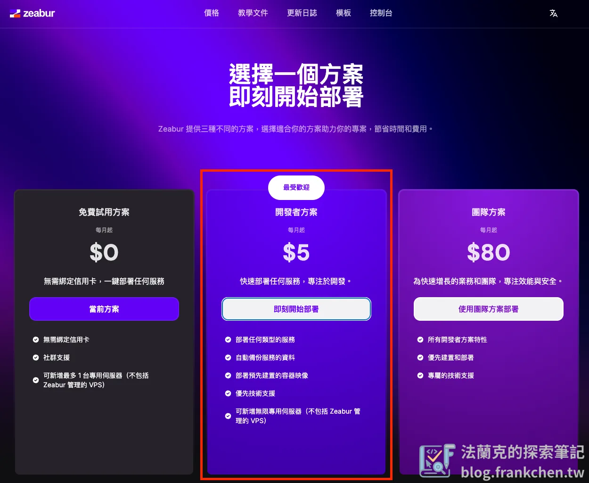
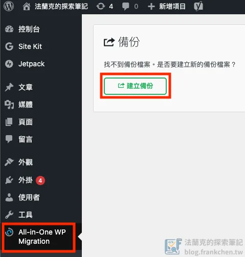
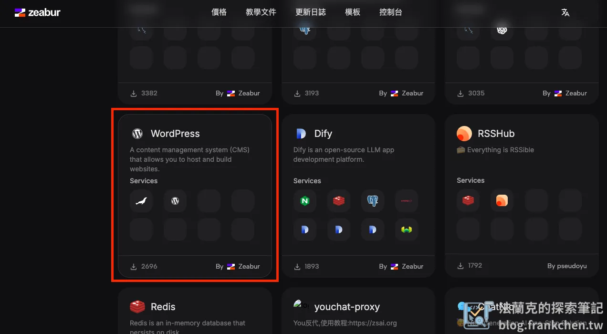
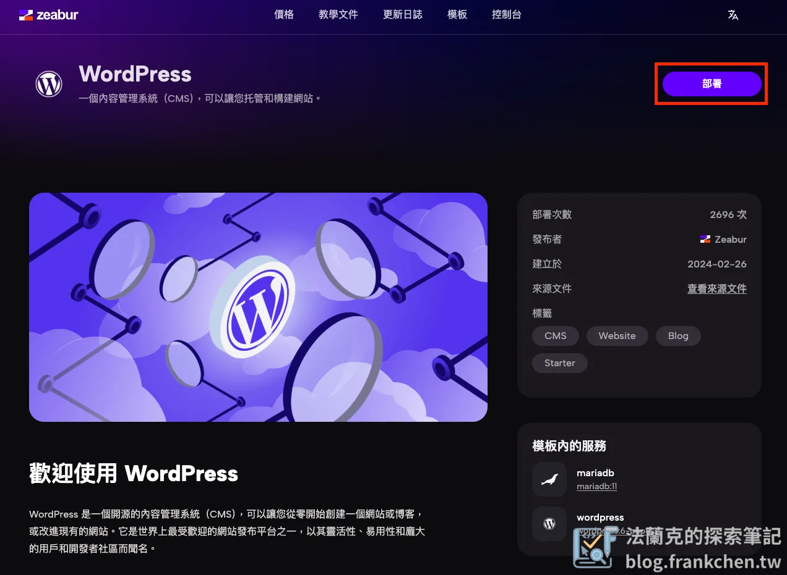
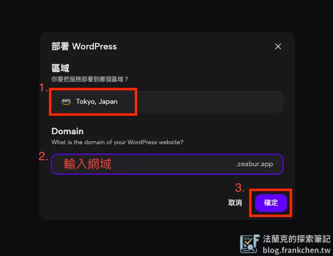
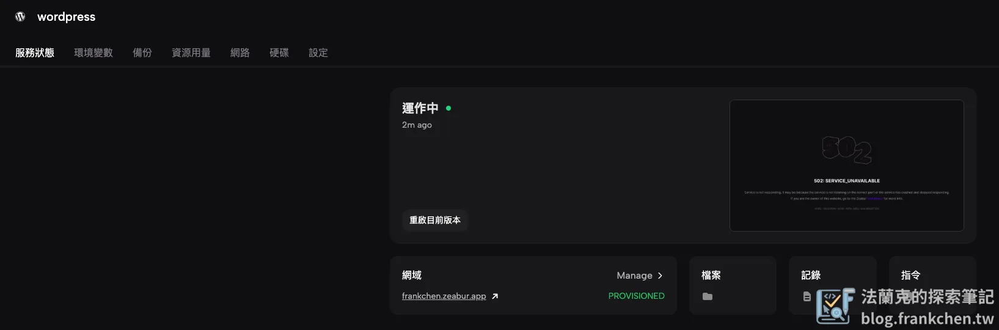
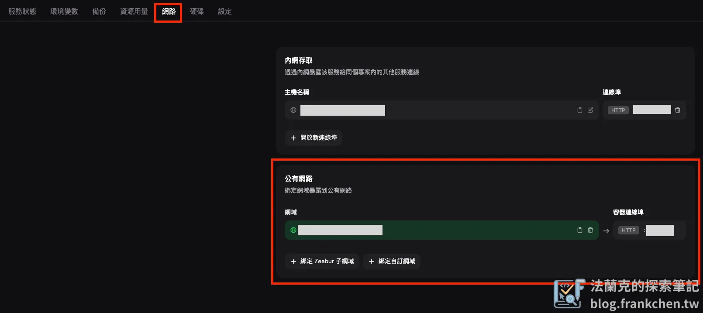
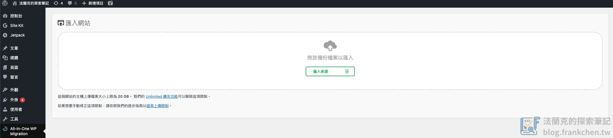

## 告別傳統部署困境，擁抱雲端捷徑

現今，許多網站管理者或部落客在建置與維護 WordPress 網站時，常面臨傳統主機部署的繁瑣與技術門檻。從伺服器設定、環境配置到日常維護，每一步都可能讓非技術背景的使用者望而卻步。然而，有了 **PaaS 平台**如 **Zeabur** 的出現，**WordPress 網站搬家**或**網站架設**變得前所未有的簡單。

本文將帶領你，即使是 **WordPress 初學者**或**網站小白**，也能輕鬆將你的 WordPress 網站**無痛 轉移** 到 Zeabur 這個高效的**雲端部署平台**。我們將詳細介紹 Zeabur 的優勢，以及如何利用簡單的工具完成**網站備份**與**資料匯入**，讓你告別複雜的**傳統部署**，快速擁有一個穩定且易於管理的 WordPress 網站。

## 什麼是 Zeabur ? 您的快速部署雲端夥伴

[Zeabur](https://zeabur.com/zh-TW) 是一個創新的 **PaaS 平台** (Platform as a service，平台即服務)，專為簡化各種應用程式的**部署流程**而設計。它最大的優勢在於能幫助您**部署任何服務**，不限制任何程式語言或開發框架，這意味著無論您的專案是基於 Python、Node.js、Go，還是像 WordPress 這樣的 PHP 應用，Zeabur 都能提供支援。

相較於傳統的 **IaaS 服務**（如 AWS、GCP、Azure），Zeabur 大幅減少了繁雜的伺服器配置、環境建置與系統維護步驟。您無需深入了解 Linux 指令或網路架構，只要幾個步驟，即可完成服務的**快速部署**，讓您將更多精力放在內容創作與業務發展上。

Zeabur 提供的核心功能包括：

-   **自訂子網域名稱與綁定自有網域**：提供彈性的網域管理，讓您的網站擁有專業的網址。
-   **自動化 SSL 憑證**：無需手動申請和配置，Zeabur 自動為您的網站啟用 HTTPS 加密，提升網站安全性與 SEO 排名。
-   **經濟實惠的定價模式**：每個月僅需 5 美金即可開始**雲端部署**您的服務。此方案包含基礎記憶體與對外流量費用，對於絕大多數中小型網站和個人部落格而言，已能滿足日常營運需求，通常無需擔心額外費用。這使得 Zeabur 成為一個**高性價比的 WordPress 部署解決方案**。

總結來說，Zeabur 提供了一個**簡易、快速、經濟且高效能**的**網站託管環境**，特別適合想要擺脫**網站部署複雜性**的開發者、部落客和企業。

## WordPress 網站搬遷前哨站：確保您的資料萬無一失

在進行任何**網站遷移**或**網站轉移**操作之前，最關鍵且不可或缺的步驟就是**網站資料備份**，確保您的文章、圖片、設定等所有寶貴資料再轉移過程不丟失，這份備份檔也是您在新環境匯入資料的來源。

為了簡化**WordPress 備份流程**，強力推薦使用 [All-in-One WP Migration and Backup](https://tw.wordpress.org/plugins/all-in-one-wp-migration/) 外掛。

備份步驟詳解：

1.  **安裝與啟用外掛**：登入您的舊 WordPress 網站後台，前往「外掛」>「安裝外掛」，搜尋 `All-in-One WP Migration and Backup` 並安裝，安裝完成後點擊「啟用」。
2.  **建立備份檔案**：啟用外掛後，點擊左側導航欄的「All-in-One WP Migration」，然後選擇「建立備份」。
3.  **等待備份完成**：系統將自動壓縮並打包您的 WordPress 網站所有內容（包括資料庫、主題、外掛、媒體檔案等）。這個過程所需時間取決於您網站的大小。
4.  **下載備份檔**：備份完成後，外掛會自動提示您下載 `.wpress` 格式的備份檔案。請務必將此檔案儲存到您的電腦硬碟中，這是您未來在新環境中**復原 WordPress 網站**的關鍵。

**備份注意事項：**

-   **備份檔儲存位置**：建議將備份檔保存在多個安全位置，如雲端硬碟或外接硬碟，以防萬一。
-   **大型網站備份**：對於大型 WordPress 網站，`.wpress` 檔案可能會比較大。請確保您的網路連線穩定，並有足夠的儲存空間。如果檔案過大導致上傳困難，可能需要考慮其他備份方式或手動匯入資料庫。
-   **定期備份習慣**：無論網站是否遷移，養成定期備份的好習慣都是非常重要的，以應對各種潛在風險。

## Zeabur 上部署 WordPress

這個章節將手把手帶領您完成在 Zeabur 平台上**部署 WordPress 網站**的詳細過程。

### 第一步：註冊 Zeabur 帳號並開通開發者方案

在開始部署之前，請務必先註冊一個 Zeabur 帳號。為了確保部署過程順暢無阻，建議您在部署前就開通「[開發者方案](https://zeabur.com/zh-TW/pricing)」。這樣可以避免在部署過程中被要求暫停並開通方案，大大提升操作效率。

⭐ **Zeabur 邀請碼小提示：** 若您尚未註冊 Zeabur，可以透過我的[邀請碼](https://zeabur.com/referral?referralCode=frankchentw)進行註冊，或許會有額外的小福利。

### 第二步：選擇 WordPress 模板

WordPress 需要包含一個資料庫的環境，而 Zeabur 貼心地提供了許多預設的應用程式模板，其中就包含專為 WordPress 優化的模板，這意味著您無需手動配置複雜的環境，大大簡化了**WordPress 安裝流程**。

-   登入 Zeabur 後台後，找到並點擊 `WordPress` 模板。

-   點開模板後，點擊「部署」(Deploy) 按鈕，準備開始建立您的新專案。

### 第三步：建立新的專案與設定基本資訊

-   **選擇部署區域 (Region)**：為了確保您的網站載入速度最快，並為您的目標受眾提供最佳體驗，請選擇離我們最近的「**Tokyo, Japan (東京, 日本)**」資料中心。這將有效降低網站的延遲時間。
-   **自訂網域 (Domain)**：在此欄位中直接輸入您希望用於 WordPress 網站的**自定義網域**。例如：`yourblog.zeabure.app`。這將是您網站未來的主要網址。若需綁定自己購買的網域，可於設定完成後，於後台修改。

-   點擊確認後，Zeabur 會自動開始為您部署 WordPress 服務，畫面會顯示服務正在運作中。這個過程通常只需要幾分鐘。

### 第四步：設定與綁定您的網域

若您無自有網域，可跳過此步驟，使用 Zeabure 內建的網域即可。

網站部署完成後，接下來是將您的**自有網域**正式綁定到 Zeabur 上的 WordPress 服務。

-   在 Zeabur 專案管理介面中，切換到「網路」(Networking) 分頁。
-   在這裡，您會找到綁定**自訂網域**的選項。您需要將您的網域解析設定（DNS 設定）指向 Zeabur 提供的 IP 地址或 CNAME 記錄。具體操作會因您的網域註冊商而異，通常涉及新增 A 紀錄或 CNAME 紀錄。
-   **重要提示**：在進入下一步**初始化 WordPress** 之前，請務必確認您的網域已成功綁定並生效。DNS 傳播可能需要一些時間（從幾分鐘到幾小時不等），您可以使用 DNS 查詢工具來檢查網域解析是否已更新。

### 第五步：初始化 Zeabur 上的 WordPress

網域綁定完成後，您需要對部署在 Zeabur 上的 WordPress 進行首次初始化設定。

-   透過您剛剛綁定的**自訂網域**訪問您的 WordPress 網站。
-   按照 WordPress 的安裝提示，**隨意註冊一個臨時的管理者帳號**。這個帳號在後續資料匯入後會被覆蓋掉，所以資訊無需完全精確，但請確保能順利登入。
-   完成 WordPress 的初始安裝後，登入新網站後台，並**安裝 [All-in-One WP Migration and Backup](https://tw.wordpress.org/plugins/all-in-one-wp-migration/) 外掛**。這是我們將之前備份檔案匯入的關鍵工具。

### 第六步：將 WordPress 資料無縫 轉移 至 Zeabur

這是**網站搬家**的核心步驟，將您舊網站的所有內容匯入到 Zeabur 上的新 WordPress。

-   登入 Zeabur 上已安裝 `All-in-One WP Migration and Backup` 外掛的 WordPress 後台。
-   前往「All-in-One WP Migration」>「匯入」(Import) 選項。
-   將您在步驟三備份好的 `.wpress` 備份檔直接拖曳到上傳區塊。
-   系統將會自動開始上傳並匯入所有資料。這個過程根據您的網站大小，大約需要 5 到 10 分鐘。請耐心等待，確保網路連線穩定。
-   **匯入完成後**：外掛會提示您匯入成功，並可能要求您重新登入。此時，您應該使用舊網站的管理者帳號和密碼進行登入，因為這些資訊已經被匯入覆蓋了。

### 第七步：網站設定檢查與最終確認

成功匯入資料後，進行最後的檢查以確保一切正常運作。

-   **重新儲存固定網址 (Permalinks)**：前往「設定」>「固定網址」，即使沒有更改任何內容，也請點擊「儲存變更」。這有助於確保所有文章和頁面的連結結構在新的伺服器上能正確運作。
-   登入您的 WordPress 後台，前往「設定」>「一般」。
-   **檢查「WordPress 位址 (URL)」和「網站位址 (URL)」**：務必確認這兩個位址已更新為您在 Zeabur 上設定的**自訂網域**（例如：`https://yourblog.zeabure.app`）。
-   **若位址不符**：如果位址仍顯示為舊網域或其他臨時網址，這表示網域設定可能存在問題，或者匯入過程中的配置有誤。您需要返回 Zeabur 後台，重新檢查網域綁定設定，並可能需要**重新執行資料匯入步驟**。
-   **檢查網站功能**：瀏覽您的網站，測試各個頁面、文章、圖片是否正常顯示，表單功能是否可用，並檢查連結是否正確。

## Zeabur WordPress 網站轉移的優勢與注意事項

**Zeabur 的部署優勢：**

-   **極簡化流程**：相較於在 GCP、AWS 或其他傳統虛擬主機上**部署 WordPress**，Zeabur 大幅減少了設定伺服器、資料庫和環境的複雜步驟，真正實現了**點擊式部署**。
-   **成本效益**：其每月 5 美金的定價方案對於大多數個人部落格或小型企業網站來說，非常具有吸引力，且通常已足夠應付日常流量。
-   **自動化管理**：提供自動 SSL、簡易網域綁定等功能，省去了許多手動維護的麻煩。
-   **高性能與穩定性**：作為一個 PaaS 平台，Zeabur 旨在提供穩定且高效的運行環境，確保您的 WordPress 網站能夠快速回應。

**轉移注意事項與潛在問題：**

-   **備份檔大小限制**：`All-in-One WP Migration` 免費版對匯入檔案大小有上限。如果您的網站非常大（通常超過幾百 MB），可能需要購買外掛的付費版本，或考慮其他手動**WordPress 搬家方法**（如透過 FTP 和 phpMyAdmin 匯入資料庫）。
-   **DNS 傳播時間**：網域綁定後，DNS 記錄的更新需要時間在全球生效。在此期間，您的網站可能會暫時無法訪問或顯示舊網站內容。
-   **SSL 憑證生效**：雖然 Zeabur 自動提供 SSL，但首次綁定網域後，憑證生效也需要一點時間。
-   **外掛相容性**：在極少數情況下，特定外掛可能在新環境中出現相容性問題。建議在轉移後仔細測試所有外掛功能。

## 延伸閱讀

完成 WordPress 遷移到 Zeabur 後，可以進一步優化網站效能與架構：

- [Zeabur Nginx 反向代理教學：從子網域到子目錄的完整實戰](/zeabur-nginx-subdomain-to-subdirectory/)
- [Cloudflare Cache Rules 完整教學：WordPress 網站效能優化實戰指南](/cloudflare-cache-rules-wordpress/)
- [Nginx Cache 設定教學：為 WordPress 網站打造第二道快取防線](/nginx-cache-wordpress/)

## 小結

透過本文的詳細教學，您可以看到將 WordPress 網站**遷移到 Zeabur** 的整個過程是多麼的簡單直觀。從**網站備份**到**雲端部署**，再到**資料匯入**，整個流程幾乎只需透過滑鼠點擊即可完成。這使得即使是**非技術背景的使用者**也能輕鬆地讓自己的 WordPress 網站**上線**並運行在一個**高效能的雲端環境**中。

Zeabur 確實為**網站架設**和**網站維護**帶來了革命性的簡化。如果您正在尋找一個**快速、簡單且經濟實惠**的**WordPress 託管解決方案**，Zeabur 絕對值得一試。現在就開始您的**WordPress 雲端旅程**，將精力集中於創造有價值的內容，讓您的網站蓬勃發展吧！
