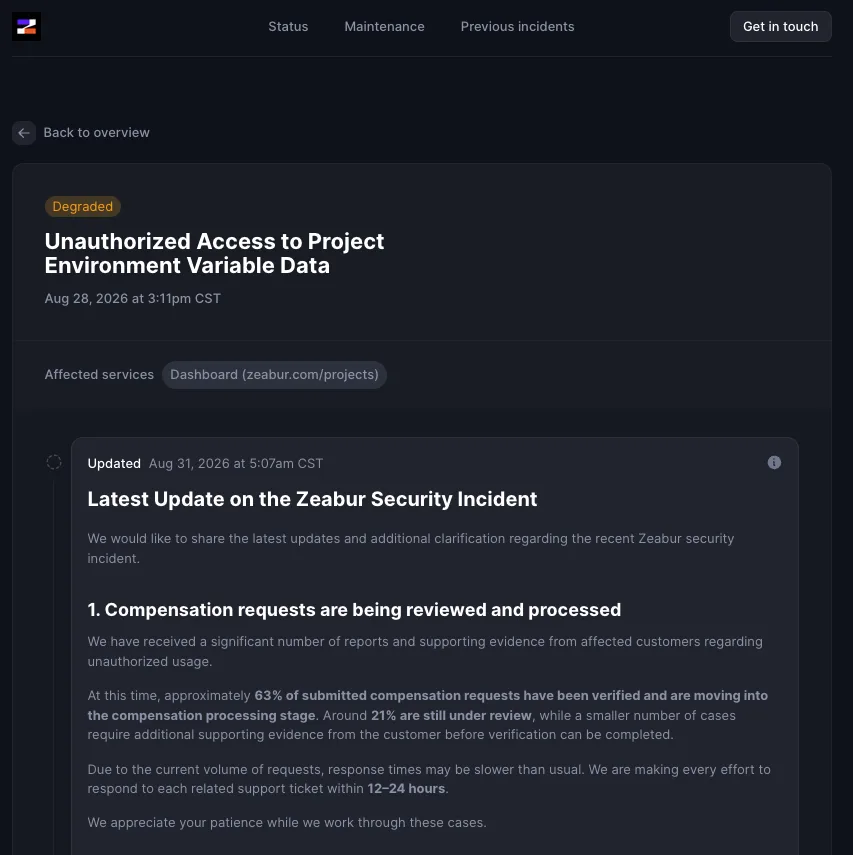
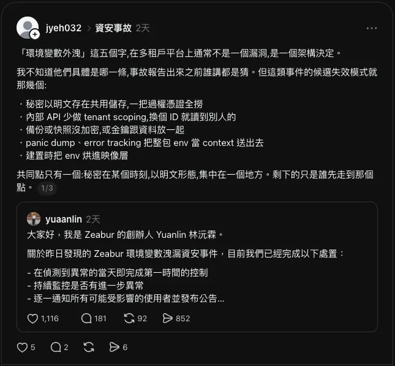

## 前言：Zeabur 資安事件爆發時，我差一個月

先講一件我自己都覺得有點好笑的事。

2025 年 7 月，我在這個部落格寫過一篇〈[WordPress 無痛轉移 Zeabur 完整教學](/wordpress-migrate-to-zeabur/)〉，教大家怎麼把網站搬上去。同年 10 月又寫了一篇〈[我是如何利用 Zeabur 和 Nginx，將分散的子網域整合成單一主網站](/zeabur-nginx-subdomain-to-subdirectory/)〉，把我當時整個網站架構攤開來講。那兩篇到現在都還在站上，還有流量。

然後今年 6 月 27 日，我開始把所有東西從 Zeabur 搬去 Cloudflare。7 月 22 日晚上做 cutover，8 個服務在兩天內全部刪掉、退訂，8 月 1 日訂閱降到 Free。

8 月 27 日，Zeabur 發生了環境變數外洩事件。

差一個月。

但我要先說清楚一件事，因為這篇文章接下來的可信度都建立在這句話上：**我不是預見了什麼才搬走的。** 我搬家的理由純粹是架構整併——原本的 WordPress 已經被我自己寫的 Astro 部落格取代，剩下那幾個 landing page 各自獨立成子網域比較乾淨。整個遷移計畫從頭到尾沒有一行字提到資安。

我只是運氣好。

還有一件事讓我沒辦法把這篇寫成「還好我早搬走了」。我去回想當時 Zeabur 上到底放了什麼，答案是：**WordPress 的資料庫連線字串。**

這件事有點微妙。這次事件裡，全網都在討論怎麼撤銷 OpenAI、Anthropic 的 API Key，因為那是唯一會直接變成金錢損失的東西。但社群上有人講了一句話，我看到的當下有點涼：

> AI Key 被盜，你損失的是帳單。DB 憑證被盜，你損失的是資料。

我那時候放的，剛好是後者。

市面上的事件報導已經很多了，所以這篇想寫另一件事：**這次事件真正的形狀，不是「金鑰漏了」，而是「一把金鑰能走多遠」。** 而這個問題，不管你用不用 PaaS，都得回答。

## 事件到底發生了什麼：重點不是外洩清單

先講事實。以下都以官方 status page 與創辦人林沅霖的公開聲明為準，時間換算成台灣時間。

> 截至 2026 年 8 月 31 日，Zeabur 的完整事故報告尚未發布。以下所有內容都可能被後續報告修正。

| 時間 | 發生什麼 |
|------|---------|
| 8 月 26 日 | LiteLLM 公開一個高風險漏洞（GHSA-3cv6-jpf6-8222，CVSS 6.5），已登入的使用者可以透過特製請求讓它洩漏上游 API Key |
| 8 月 27 日 | Zeabur 確認一組內部服務憑證遭未授權使用，攻擊者用它查詢了存放專案環境變數的資料庫。當天完成封鎖與憑證輪替 |
| 8 月 28 日 15:11 | status page 公開事件，分兩批通知受影響用戶 |
| 8 月 29 日 01:42 | 發現 AI Hub 使用的 LiteLLM 有可疑活動，預防性暫停該服務 |
| 8 月 29 日 | 創辦人公開道歉聲明 |
| 8 月 30 日 | 公布約 63% 賠償申請已核實、21% 審查中 |

LiteLLM 那條要特別註明：**官方沒有確認它跟這次事件有因果關係**，只是時間上非常接近。這是目前所有討論裡最容易被寫成因果的一段，但它現在還只是時序巧合。



截圖出處：[Zeabur Status — Unauthorized Access to Project Environment Variable Data](https://status.zeabur.com/incident/1037896)（擷取於 2026-08-31，後續更新以該頁為準）

### 那條走廊

大部分報導的重點都放在「外洩了哪些東西」，但我覺得真正該看的是創辦人講的這段話：

> 攻擊者是取得了我們內部洩漏的一把 AWS 管理金鑰，進入我們位於日本東京的 AWS 共享叢集後，從叢集內部獲取到了系統控制面的 VPN 訪問權限，得以進入主資料庫。

把它畫出來大概是這樣：


四個節點，三段路。我看到這張圖的第一個反應不是「他們的金鑰怎麼會漏」，而是：**這三段路，原本應該是三扇獨立的門。**

一把管理金鑰能進叢集，這是第一扇門沒鎖。進了叢集能拿到控制面的 VPN 存取權，這是第二扇。有了控制面就能連主資料庫，這是第三扇。任何一扇門如果需要另一組獨立的憑證、或者根本不該從那個位置抵達，這次事件就會停在半路。

金鑰外洩是起火點，**權限半徑才是燒起來的原因。**

還有兩個細節值得記下來。第一，起點是一把「內部洩漏」的金鑰，不是 push 到公開 GitHub 上那種。第二，落點是一個「正在逐步停用」的叢集——**要退役但還沒退乾淨的東西，往往是最好的入口**，因為它已經沒人在看了。

### 外洩範圍裡最狠的一句

外洩的清單很長：OpenAI、Anthropic、OpenRouter、Gemini 的 API Key，AWS、Cloudflare 的 token，GitHub token，Stripe 的 secret key，資料庫連線字串，JWT Secret。

但真正該引用的是這句（來自 [INSIDE 的報導](https://www.inside.com.tw/article/42241-zeabur-environment-variable-leak-api-keys-stolen)）：

> 即使使用者自行修改環境變數名稱，只要其中存放的值符合 AWS、GitHub、Anthropic、OpenRouter、OpenAI 或 Stripe 可辨識的憑證格式，Zeabur 也確認相關憑證曾暴露。

換句話說，攻擊者不是照著變數名稱抓的，是**對值做格式比對**。你把變數改名叫 `MY_SECRET_THING`，一點用都沒有。

這也順便打死了一個很多人有的錯覺：以為「不要用標準命名」算是一種防護。那不是防護，那是心理安慰。

> **如果你是受影響的用戶，正在找「現在該做什麼」**
>
> 1. 先去 AI 服務商後台設支出硬上限。要選「超過就停用」，不是「超過就通知」。五分鐘就設完，這是憑證已經流出去的情況下唯一還能把損失壓住的動作
> 2. 再到原服務商後台**撤銷**舊 Key。在 Zeabur 刪掉環境變數不會讓舊 Key 失效，兩件事是分開的
> 3. 撤銷完還要去看一次有沒有你沒建過的帳號、金鑰、排程任務——輪替不等於結案
>
> 為什麼是這個順序、為什麼它跟官方指引相反，寫在後面的〈但順序不能反〉那一節。

## 為什麼「換一家 PaaS」不是解法

事件之後，社群上最常見的反應有兩種：一種是「以後不敢用 PaaS 了」，一種是「換去某某平台」。

我覺得兩種都沒抓到重點。有一段話講得比我清楚，來自 [Threads 上一位工程師的分析](https://www.threads.com/@jyeh032/post/DcnJIZ6k6Mq)：

> 「環境變數外洩」這五個字，在多租戶平台上通常不是一個漏洞，是一個架構決定。

他列了這類事件的候選失效模式：

- 秘密以明文存在共用儲存，一把過權憑證全撈
- 內部 API 少做租戶隔離，換個 ID 就讀到別人的
- 備份或快照沒加密，或金鑰跟資料放在一起
- panic dump、error tracking 把整包環境變數當 context 送出去
- 建置時把環境變數烘進映像層

然後是關鍵那句：

> 共同點只有一個：秘密在某個時刻，以明文形態，集中在一個地方。剩下的只是誰先走到那個點。



這是三則裡的第一則，後面兩則講自救順序與「輪替不等於結案」，[完整串文在這裡](https://www.threads.com/@jyeh032/post/DcnJIZ6k6Mq)。

這解釋了為什麼換平台沒用。**任何 PaaS 都必須在某個時刻把明文的環境變數注入到你的 runtime**，不然你的程式讀不到。那個時刻、那個地方，就是所有平台共有的那個點。差別只在誰的門比較多、誰的門比較牢。

### 順帶回答一個問題：AWS 金鑰真的那麼容易漏嗎

我把這段寫進來，是因為我自己一開始也覺得「AWS 管理金鑰」聽起來應該是被層層保護的東西。

但實際上不是，先把「金鑰」這個詞的誤導拿掉：AWS 的長期 access key（`AKIA` 開頭那種）不是什麼會被破解的東西，它就是**一段永不過期的字串**。沒有裝置綁定、沒有 IP 綁定、預設沒有到期日，誰拿到誰能用。破解它從來不是問題所在，真正的問題是它會被複製到太多地方。

規模有多大？[GitGuardian 今年 3 月發布的年度報告](https://blog.gitguardian.com/the-state-of-secrets-sprawl-2026/)統計了 2025 全年：光是公開的 GitHub，一年就新增 **2865 萬**個硬編在程式碼裡的秘密，年增 34%，是有紀錄以來單年最大的增幅。而且自 2021 年以來，洩漏的秘密成長了 152%，同期 GitHub 的公開開發者只成長 98%——秘密長得比寫程式的人還快。

AWS 自己非常清楚這件事，所以有一套自動補救機制：GitHub 的 secret scanning 偵測到 AWS 憑證，會用程式通知 AWS，AWS 大約在**兩分鐘內**自動對那個 IAM 使用者套上隔離政策（`AWSCompromisedKeyQuarantine` 系列），擋掉一批高風險的 API 操作。

聽起來很不錯。但這條救生索有兩個洞：

1. **攻擊者的掃描也是自動的**。實測有憑證公開後幾分鐘內就被撈走使用的案例。所以那兩分鐘與其說是保護傘，比較像在跟人賽跑。
2. **它只管公開 repo。**

第二點才是重點。Zeabur 講的是「內部洩漏」，不是 push 到公開 GitHub。而內部的洩漏途徑一個都沒有人在替你掃：

- CI/CD 的 build log 把環境變數印出來
- Docker image 的中間層（`COPY .env` 之後就算後面 `rm` 掉，那一層還在）
- error tracking 或 APM 把整包 env 當 context 上報
- Terraform state 檔、Ansible vault 的明文備份
- 內部 Slack、Notion、工單系統的複製貼上
- 開發者的筆電被惡意程式翻走 `~/.aws/credentials`
- 離職或外包人員手上沒被撤掉的舊副本

所以這一段的結論是：

> 公開外洩至少還有 AWS 在兩分鐘內幫你上枷鎖，內部外洩什麼都沒有。大家在防的是前者，出事的常常是後者。

## 那我自己呢：五個問題

講別人講得很輕鬆，接下來是這篇文章比較痛的部分。

有一篇[架構分析文](https://containarium.dev/zh-tw/blog/secret-store-blast-radius)（作者是 Containarium 團隊的 Hsin，這裡要標明那是廠商自己的內容，不過它把架構層面講得比任何一篇媒體報導都清楚）給了五個問題，原本是要拿去問你的 PaaS 的。但我發現自架的人拿來問自己，一樣成立。

我的系統長這樣：家裡一台 Linux，跑一顆共用的 PostgreSQL，上面有四個租戶（記帳服務、n8n、指標資料、自架的密碼庫），前面一層 nginx 經 Cloudflare Tunnel 對外。沒有 port forwarding，資料庫只綁 `127.0.0.1`。

以下是我照著五題誠實作答的結果：

| 問題 | 我的答案（2026-08-31） |
|------|----------------------|
| 我的秘密有沒有自己的金鑰，還是共用一把？ | 共用一把。密碼庫的一組主密碼解開全部 258 筆 |
| 誰、用什麼身分，有能力解開？ | 只有我本人。這題答得還行 |
| 解密發生在哪裡——控制平面，還是我的工作負載旁邊？ | 密碼庫是 client 端解密，資料庫裡躺的是密文。這題做對了 |
| 備份被偷走，偷到的是明文還是密文？ | 密碼庫那份是密文。**但其他三顆租戶資料庫的 `pg_dump` 是明文** |
| 管理 token 讀得到秘密嗎？ | `.env` 裡的 PostgreSQL superuser 密碼，讀得到全部租戶的資料庫 |

最後一題我答得很難看。

而那篇文章有一句話正好對著這個結果：

> 答得最不順的那一題，就是你真正的邊界所在。

### 一個我差點自我感覺良好的地方

我今年 8 月才剛把家裡的密碼管理從瀏覽器內建搬到自架的 Vaultwarden，248 筆匯入、A 類憑證 258 筆收攏、還跑過一次完整的還原演練（驗收方式是拿正式環境跟還原後的資料庫做 md5 逐位元組比對，不是登入看一眼就算數）。做完那陣子我確實覺得「秘密管理這塊我算做得不錯了」。

然後我讀到這句：

> 把 Key 從環境變數搬進 Vault，卻在服務啟動時又整包展開成環境變數，等於白做——秘密還是以明文形態躺在每一個 process 的記憶體和 `/proc` 裡，你只是多養了一套 Vault。加密邊界的重點是解密的位置和身分，不是儲存的品牌。

我的服務啟動時，`.env` 照樣是明文檔案。

所以講清楚：**密碼庫解的是「人記不住幾百組密碼」跟「災難復原」，不是 runtime 的秘密保護。** 這兩件事完全不同，而我差點把前者的完成當成後者的完成。如果你也剛裝好 1Password 或 Vaultwarden 覺得安心了，這條界線要先分清楚。

## 我做對的那部分：不循環的解密鏈

也不是全部都是壞消息。有一個設計我覺得是對的，而且它剛好就是「權限半徑」思維的具體樣子。

我把憑證分成兩類：

- **A 類**：重建那台機器所需要的東西——資料庫 superuser 密碼、各租戶的角色密碼、n8n 的加密金鑰、Cloudflare Tunnel token 那些
- **B 類**：一般帳號密碼

B 類全部進密碼庫就好。A 類除了進密碼庫，還要另外做一份用 age 加密的異地檔案。理由很簡單，而且是我在規劃時才想通的：

> 跑在那台機器上的密碼庫，救不了那台機器本身。

如果那台 Linux 整台掛掉，我需要 A 類憑證才能重建它——但 A 類憑證存在那台機器上的密碼庫裡。這是個死結。

然後往下推一層，會遇到另一個死結：密碼庫本身要用 TOTP 二階段驗證，那**密碼庫自己的 TOTP 種子**要存在哪？存進密碼庫裡就是第二層循環——你要登入才能拿到登入需要的東西。

所以最後的設計是：紙本只留四項（主密碼、recovery code、密碼庫自己的 TOTP 種子、age 私鑰），手抄兩份放在兩個實體位置。解密鏈是：

```
紙本 age 私鑰 → 異地加密檔 → A 類憑證 → 重建機器
```

這條鏈不循環。而密碼庫自己的 TOTP 種子刻意留在另一個系統，是**故意的例外**——我在 cutover 的清單裡特地標了一行「清理舊來源時不可以把這筆一起刪掉」，因為那個步驟差一點就會順手刪掉它。

這件事跟這次 Zeabur 事件的關聯是：權限半徑要問的不只是「誰能解開我的秘密」，還有一層更容易漏掉的——**解開它的那把鑰匙，自己被鎖在哪裡？**

## 但順序不能反

如果你讀到這裡的結論是「所以我該去做權限分層」，我要先攔一下。

方向對，順序不對。

我原本也覺得分層是最該處理的事，因為它是根因。但仔細想過之後，這三件事防的是完全不同的東西，不能互相取代：

| 做什麼 | 防什麼 | 大概要多久 |
|--------|--------|-----------|
| 支出硬上限 | 損失擴大 | 五分鐘 |
| 清冊：哪把 key 在哪裡用 | 你不知道自己漏了什麼 | 一兩小時 |
| 權限分層 | 入侵範圍擴大 | 以月計 |

這次事件實際造成金錢損失的是 API Key 被盜刷，那個用支出硬上限就擋住了，權限分層一點都救不到。而如果你把分層排第一，最典型的結果是：三個月後還在規劃，而硬上限一直沒設。

有意思的是，這個順序有很強的共識。我看到的三個獨立來源——那位列失效模式的工程師、Containarium 那篇架構分析、還有[香港 TechRitual 整理的自保清單](https://www.techritual.com/2026/08/30/577611/)——**都把「設支出硬上限」排在「輪替金鑰」前面**，而這跟官方指引的順序是相反的（官方第一步就叫你去撤銷）。

理由也很直白：撤銷要跑完一輪部署才會生效，硬上限五分鐘就設完。已經在流血的時候，先止血再說。

> 而且注意是「超過就停用」，不是「超過就通知」。通知只是讓你更早知道自己在賠錢。

### 那個沒人講的第二件事

還有一條我覺得幾乎所有討論都漏掉的：

> 輪替不等於結案。如果對方拿著你的雲端憑證進去過，他可能已經建好新的 IAM 使用者、新的 access key、新的排程任務。你把舊的換掉，他的還在。

全網都在教怎麼 revoke，沒人講持久化後門。而這條剛好對得上 Zeabur 官方那句保留：「攻擊者是存在可能性、可行性進入客戶所部署的服務中存取資料。」

所以換完 key 之後還要去看一次：有沒有你沒建過的帳號、金鑰、排程。

### 順序不能反，還有另一種形式

如果你的解法是「架一個 AI Gateway，讓真的 Key 只存在單一受控點，服務只拿短期憑證」——這個方向很好，但那篇架構分析給了一個誠實的警告：

> Gateway 集中了所有租戶的真 Key，它本身就是全平台最高價值的目標。沒先做好加密邊界，Gateway 只是把風險換個位置，而且更集中——你等於親手蓋了一個更值得打的秘密儲存。

我本來也擔心過這個問題：多加一層代理，不就是多一個可以被打的地方嗎？而 LiteLLM 這次剛好示範了那個地方確實會被打。

答案是會，所以順序是：先讓「儲存被整包偷走」只偷得到密文，再把真 Key 收進單一受控邊界。反過來做是自找的。

### 那我自己的第一步是什麼

講一件有點難看但誠實的事。

這次事件裡唯一會造成金錢損失的攻擊面，AI 服務的 API Key 被盜刷，目前對我不成立，因為我手上根本沒有付費的 AI API Key。所以「設支出硬上限」這件事我現在做不了。

但我要把它寫下來，因為**這是現況不是設計**。哪天我真的去開通任何一個付費 API，正確的順序是：先去後台設好日／月硬上限，再去產生那把 Key。不是拿到 Key 開始用，等到某天出事再回來補。

那我真正該做的第一步是清冊。

而清冊這件事，我到現在還沒做。我有一份完整的基礎設施清冊文件，但那份文件開頭就寫著「密碼與金鑰不記於此」——它記的是架構，不是憑證的分布。密碼庫收的是「值」，不是「這把 key 用在哪、還有沒有在用」。

換句話說，如果現在有人問我：你的系統裡總共有幾把有效的憑證、分別給誰用、哪些是三年前設定完就再也沒動過的？

我答不出來。

而那位工程師的清單裡有一句話，正好戳在這裡：

> 列清冊。你八成不記得自己在那個平台放過幾把 key。列不出來就等於沒輪替。

這大概就是我讀完整起事件之後，最不舒服的一個發現：我以為自己的問題是「分層不夠」，但其實在那之前，我連自己有什麼都還沒列清楚。

## 結語

這次事件裡我沒有損失，而我很清楚原因：我一個月前剛好把東西搬走了，跟我做對了什麼沒有關係。

如果要我把整篇留下一個可以帶走的東西，我會選那篇架構分析裡的自測題。它不需要你懂任何工具，只需要你誠實：

> 如果你的秘密儲存今晚被整包拷走，明天是公關災難，還是一則 status page 公告？

差別不在你用哪家平台、裝了哪套密碼管理器，而在於被偷走的東西能不能走到下一扇門。這也是為什麼我前面花了那麼多篇幅講那條走廊，而不是講外洩清單。

## 常見問題

**我沒有用 Zeabur，需要做什麼嗎？**

如果你把 API Key 放在任何 PaaS 的環境變數裡，這次事件的失效模式對你都成立，只是還沒輪到你。最低限度是去 AI 服務商後台設支出硬上限，五分鐘的事。

**建立新的 API Key，舊的會自動失效嗎？**

不會。這是這次事件裡官方特別提醒的一點，大多數 API 服務的後台，「建立新 Key」跟「撤銷舊 Key」是兩個獨立動作。你必須主動去撤銷。

**輪替完金鑰就結束了嗎？**

不一定。如果對方拿著你的雲端憑證進去過，他可能已經建立了新的帳號、金鑰或排程任務——你換掉舊的，他的還在。換完之後要去檢查有沒有你沒建過的東西。

**自架就比較安全嗎？**

不是。自架只是把同一個風險換成自己扛，而且多半扛得更差——這篇文章後半段列的缺口，全部都在我自己的機器上。真正的差別不在誰來管，而在撤銷點在誰手上、以及被打穿之後對方能走多遠。

## 參考資料

事件本身（截至 2026 年 8 月 31 日）：

- [Zeabur 官方 Status Page — Incident 1037896](https://status.zeabur.com/incident/1037896)：第一手公告，四則更新的時間戳都在這裡。完整事故報告官方說會另外發布
- [INSIDE — Zeabur 環境變數外洩！Anthropic、OpenAI、OpenRouter API 憑證遭盜用](https://www.inside.com.tw/article/42241-zeabur-environment-variable-leak-api-keys-stolen)：外洩清單最完整的中文報導，「改變數名稱也沒用」那段出自這裡
- [TechRitual — Zeabur 8/27 資安事件懶人包](https://www.techritual.com/2026/08/30/577611/)：創辦人五題 Q&A 的完整節錄、用戶自救步驟、LiteLLM 時序整理。粵語書寫
- [鏈新聞 — Zeabur 資安事件更新：63% 賠償申請已核實](https://abmedia.io/taiwan-zeabur-yuanlin-startup)：賠償進度與範圍澄清
- [TechNews — 雲端部署平台 Zeabur 遭駭](https://infosecu.technews.tw/2026/08/31/zeabur-security-incident)

延伸閱讀：

- [Threads @jyeh032 的資安事故串](https://www.threads.com/@jyeh032/post/DcnJIZ6k6Mq)：失效模式清單、自救順序，以及「輪替不等於結案」那條
- [Containarium — 秘密儲存被整包撈走的那一天：加密邊界，不是防火牆](https://containarium.dev/zh-tw/blog/secret-store-blast-radius)：本文那五個問題與七條規則的出處。**這是該公司自己的產品內容，文末有利益揭露**，但架構層面寫得比多數媒體清楚
- [GitGuardian — The State of Secrets Sprawl 2026](https://blog.gitguardian.com/the-state-of-secrets-sprawl-2026/)：2865 萬與 34% 那組數字的出處
- [LiteLLM 安全公告 GHSA-3cv6-jpf6-8222](https://github.com/BerriAI/litellm/security/advisories/GHSA-3cv6-jpf6-8222)：影響 1.94.0 以下，修補版本 1.96.2

我自己的相關文章：

- [我是如何利用 Zeabur 和 Nginx，將分散的子網域整合成單一主網站](/zeabur-nginx-subdomain-to-subdirectory/)
- [WordPress 無痛轉移 Zeabur 完整教學](/wordpress-migrate-to-zeabur/)
