## 前言：為什麼要用 Zeabur + Nginx 重構網站？

最近花了點時間，用 **Zeabur 的 Nginx 反向代理**把我之前亂開的子網域全部重新整合了一下。

隨著專案越開越多，我發現我的個人網站架構也跟著亂七八糟，一下是 `blog.frankchen.tw`，一下又是 `personal.frankchen.tw`。

雖然都能跑，但有兩個很煩的問題：

1.  **SEO 權重分散**：Google 會把不同子網域當成獨立的網站，等於我的網站權重被分散到各地，超虧的。
2.  **管理有夠亂**：每個服務都要獨立設定 DNS、SSL 憑證，專案一多就開始頭痛。

所以，我決定來一次大掃除，目標就是把所有服務全部集中到 `www.frankchen.tw` 這個主網域底下，用子目錄 (`/personal`) 來區分服務，讓權重集中，管理也更單純。

## 子網域 vs 子目錄：架構差異與 Zeabur 實作對比

我們直接看圖吧！

### 舊架構：分散式子網域部署

之前在 Zeabur 上採用的是**分散式子網域架構**，每個專案獨立使用一個子網域（如 `blog.frankchen.tw`、`personal.frankchen.tw`），雖然部署很直覺，但就是上面說的，SEO 權重分散、管理麻煩！

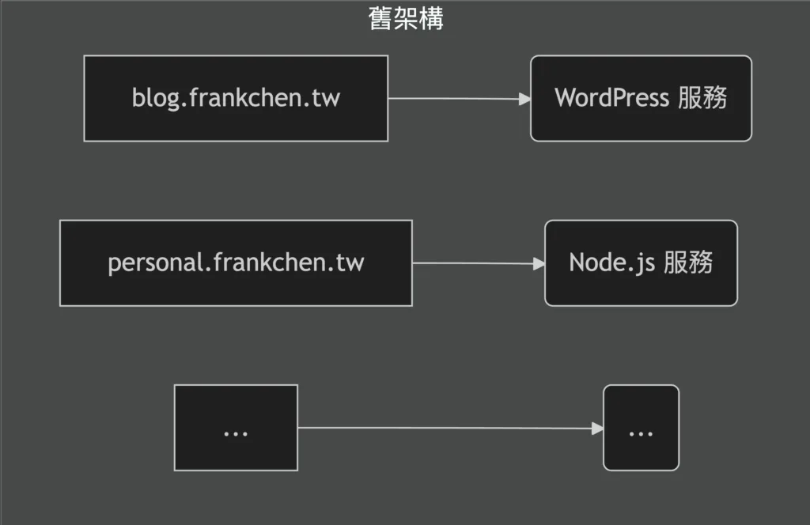

### 新架構：Nginx 反向代理 + 子目錄整合

現在所有流量都先進到一個 **Nginx 反向代理服務**，再由它根據 URL 路徑（如 `/blog`、`/personal`）透過子目錄路由機制轉發到後端對應的服務，實現子目錄架構。

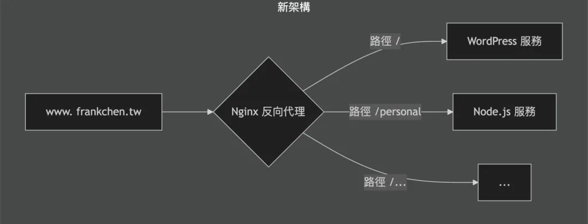

### 架構對比一覽表

**比較項目**

子網域架構

子目錄架構

網址範例

`blog.frankchen.tw`

`www.frankchen.tw/blog`

SEO 權重

❌ 分散（各自獨立計算）

✅ 集中（統一累積）

SSL 憑證

❌ 每個子網域需要獨立管理

✅ 只需管理一個主網域

DNS 設定

❌ 每個服務需要獨立設定

✅ 只需設定一次

部署難度

✅ 簡單直覺

⚠️ 需要設定反向代理

管理複雜度

❌ 專案多了很混亂

✅ 集中管理更輕鬆

## 為什麼選擇 Zeabur + Nginx 反向代理？

這次用 **Zeabur + Nginx 反向代理**重構能這麼順利，真的要大推 [Zeabur](https://zeabur.com)，根本就是新手跟懶人救星。

-   **Zeabur**：提供各種服務的一鍵部署模板，我要用的 Nginx、WordPress、Node.js 全都有。它會自動處理 SSL、負載平衡這些煩人的事，我只要專心在設定檔就好。
-   **Nginx**：地表最強伺服器軟體之一，在這裡我用它的「反向代理 (Reverse Proxy)」功能。簡單說，它就像一個總機，所有外部來的電話（請求）都先打給它，它再根據分機號碼（URL 路徑）把電話轉到對應的部門（後端服務）。

## Zeabur 網路架構：Internal URL 與 External URL 運作機制

在 **Zeabur 專案架構**中，每個服務都會自動分配一組 **Internal URL（內部連結）**，讓同專案內的服務可以透過這個內部連結互相溝通，而不需要經過公有網路。

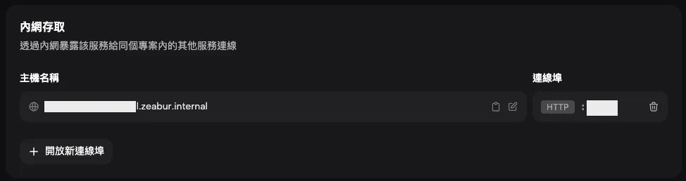

如果要從外面使用服務的話，就必須設定一組 **External URL (外部連結)**，也就是公有網路。讓公有網路映射到你指定的服務。

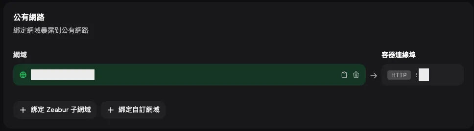

Zeabur 有提供內建的免費網域 (`xxxxx.zeabur.app`)，你也可以綁定自訂網域，只要設定好 DNS 記錄，就能將你的網域映射到 Zeabur 服務上。

## Zeabur + Nginx 實戰教學：反向代理設定完整指南

### 步驟一：建立一個 Zeabur 專案

在控制台中，點擊右上角「建立專案」。

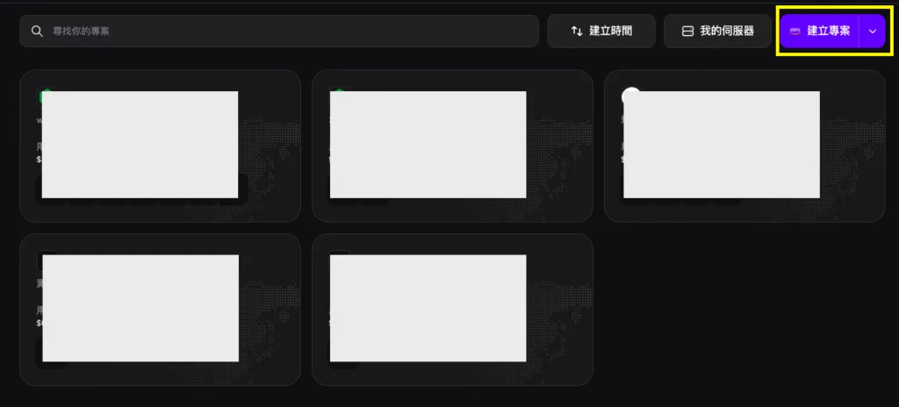

### 步驟二：在專案中部署 Nginx 反向代理服務

接著，在新增服務中搜尋「`nginx`」，然後從模板市集找到 Nginx，點擊「Deploy」。

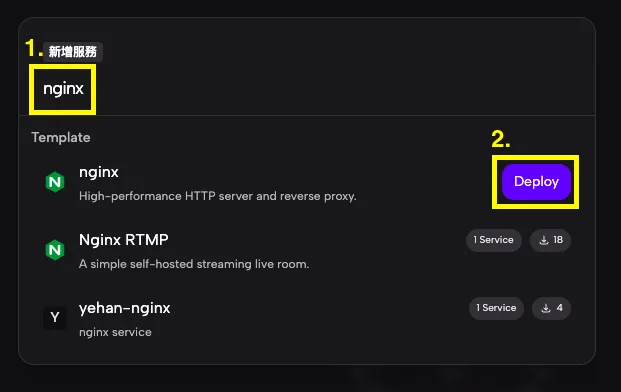

會需要你先輸入 Domain，設定完後，後續就是從這組設定好的網址進入。  
如果你是有自己的 Domian，放心，之後可以再進行設定。

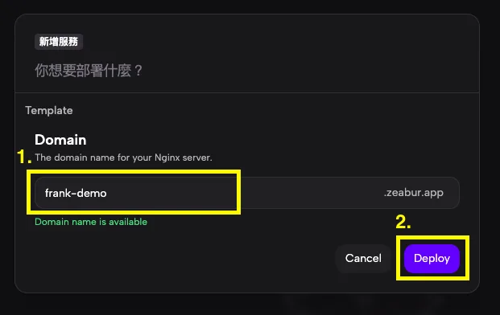

輸入好網址後，就按「Deploy」，就會看到 Nginx 服務已經啟動。

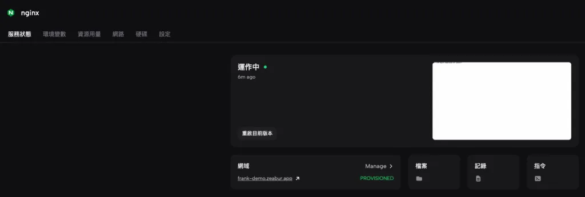

訪問你設定的網址，會看到一串文字：`Hello from Nginx deployed on Zeabur!`，那就代表 Nginx 部署成功了！

如果你有自有的網域，可以在「網路」標籤中，點擊「綁定自訂網域」進行設定，記得也要到你的 DNS 服務商那邊設定好 `CNAME`。

### 步驟三：部署後端服務（WordPress、Node.js）

在 Zeabur 專案中，新增服務按鈕在畫面的左側，點擊下去後就可以開始部署你需要的服務 (WordPress、Node.js .etc)。

全部服務部署完後，去每個服務的「網路」分頁，就可以看到內網存取的內容，那組網址就是下一步會使用到的，以及後面的連接埠也需要記錄下來，不同的服務會用到的連接埠會不相同。

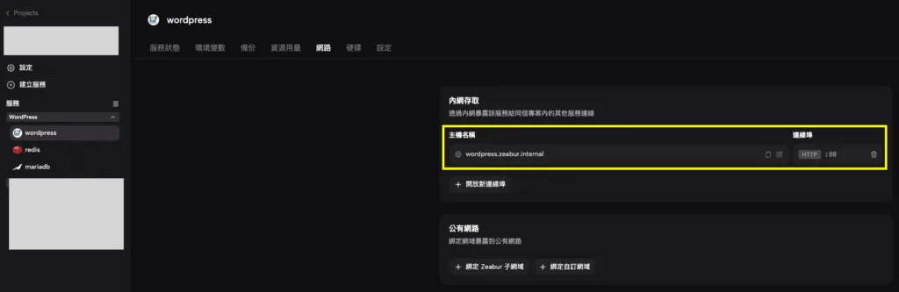

以 WordPress 為例，內部網址是 `wordpress.zeabur.internal`，連接埠是 `80`。

> ⚠️ **重要提醒**：這裡取得的內部網址只適用於同一個專案內互相使用，無法跨專案調用內部網址。

如果你的 WordPress 需要搬家到 Zeabur 上，可以參考[這篇文章](https://www.frankchen.tw/wordpress-migrate-to-zeabur/)。

### 步驟四：設定 nginx.conf 反向代理規則

Nginx 及其他服務部署好之後，最重要的就是告訴它流量要怎麼轉。這就要修改 `nginx.conf` 這個設定檔了。

> 💡 **提示**：nginx.conf 是 Nginx 的核心設定檔，所有的路由規則、轉發邏輯都在這裡定義。修改後記得重啟 Nginx 服務才會生效！

選擇 Nginx 服務，點擊「設定」標籤，底下會有「Open Config Editor」，點擊下去，就可以看到 `nginx.conf`的檔案內容。

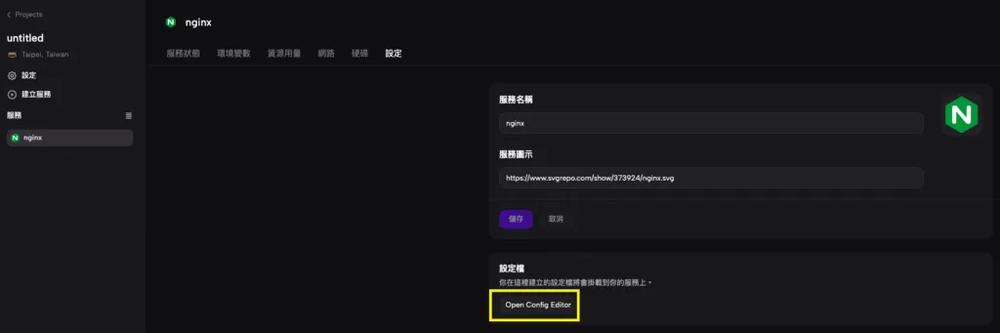

這是我設定的核心程式碼，我把它簡化了一下：

```nginx
# /nginx.conf

server {
    listen 80 default_server;
    server_name _;

    # 根目錄，直接對應到我的 Blog 服務
    location / {
        proxy_pass http://wordpress.zeabur.internal:80;
        
      	# --- 必備 Header ---
      	# 將原始請求的 Host 傳遞給後端服務
      	proxy_set_header Host $host;
      	# 傳遞訪客的真實 IP
      	proxy_set_header X-Real-IP $remote_addr;
      	# 傳遞完整的代理鏈路 IP
      	proxy_set_header X-Forwarded-For $proxy_add_x_forwarded_for;
      	# 讓後端服務知道目前是用 HTTPS (Zeabur 自動處理 SSL)
      	proxy_set_header X-Forwarded-Proto https;
    }

    # /personal 路徑，對應到我的 Personal 服務
    location /personal {
        proxy_pass http://personal.zeabur.internal:80;
        proxy_set_header Host $host;
        proxy_set_header X-Real-IP $remote_addr;
        proxy_set_header X-Forwarded-For $proxy_add_x_forwarded_for;
        proxy_set_header X-Forwarded-Proto https;
    }

    # 如果有更多服務需要轉發，那就複製底下的這段，把 <other-service>、<service-url>、<service-port> 替換成該服務的路由、名稱及連接埠
    location /<other-service> {
        proxy_pass http://<service-url>.zeabur.internal:<service-port>;
        proxy_set_header Host $host;
        proxy_set_header X-Real-IP $remote_addr;
        proxy_set_header X-Forwarded-For $proxy_add_x_forwarded_for;
        proxy_set_header X-Forwarded-Proto https;
    }
}
```

`proxy_pass` 後面接的就是在上一部取得的內部網址的名稱和 Port，這樣 Nginx 才知道要把請求丟給誰。

此外，`proxy_set_header` 這些指令是用來設定 **HTTP Header**，確保後端服務能正確接收到原始請求的資訊（如真實 IP、協定等），這對於正確記錄訪客資訊和處理 HTTPS 非常重要。

設定好後，記得回到「服務狀態」標籤，重啟 Nginx 服務，讓 Nginx 重新載入剛剛寫好的設定檔。

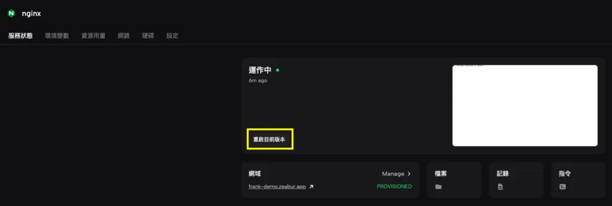

### 步驟五：設定自訂網域與 SEO 301 轉址

設定檔搞定後，就剩下 DNS 以及舊網址的 301 轉址了。

1.  **DNS 調整**：如果你有設定自己的 Domain，記得到你的 DNS 服務商那邊，把 `your-new-domain` 的 CNAME 指向 Zeabur 提供給 Nginx 服務的網址。
2.  **301 轉址**：這是 **SEO 的關鍵**！為了讓 Google 知道你的舊網站搬家了，要把舊的子網域 (`your-old-domain`) 全部用 301 永久轉址指向 `your-new-domain`。這樣過去累積的 SEO 分數才不會不見。

> 💡 **SEO 關鍵**：301 永久轉址會告訴搜尋引擎「這個頁面永久搬家了」，過去累積的 SEO 權重會轉移到新網址，不會流失！

## 常見問題排解：Nginx 反向代理設定注意事項

在實際部署過程中，有幾個需要特別留意的地方：

### 1\. 路徑衝突問題

如果你的後端服務本身也有使用 `/personal` 這類路徑，可能會造成路由衝突。例如：

-   前端訪問：`www.frankchen.tw/personal/about`
-   後端期望收到：`/about` 而非 `/personal/about`

解決方法是在 `proxy_pass` 後面加上斜線，並調整路徑重寫：

```nginx
location /personal/ {
    proxy_pass http://personal.zeabur.internal:80/;
    # 其他 header 設定...
}
```

### 2\. 靜態資源載入問題

某些服務（如 WordPress）的靜態資源（CSS、JS、圖片）可能會使用絕對路徑，導致在子目錄下無法正確載入。建議：

-   確認後端服務支援子目錄部署
-   必要時調整服務的 `base_url` 設定
-   使用相對路徑而非絕對路徑

### 3\. 效能考量

反向代理會增加一層轉發，理論上會有些微延遲（通常 < 10ms），但對於一般個人網站來說影響不大。如果你的網站流量很大，可以考慮：

-   啟用 Nginx 快取機制
-   使用 CDN 服務
-   監控 Nginx 的資源使用狀況

### 4\. SSL/HTTPS 設定

Zeabur 會自動處理 SSL 憑證，但要確保：

-   `proxy_set_header X-Forwarded-Proto https;` 有正確設定
-   後端服務知道它是在 HTTPS 環境下運行
-   避免混合內容警告（HTTP 內容在 HTTPS 頁面上）

## Zeabur + Nginx 重構實測：管理效率與部署體驗改善

經過這次架構調整，我實際觀察到了以下成果：

### 技術管理效率

1.  SSL 憑證管理
    -   從原本需要管理 4-5 個子網域的憑證
    -   簡化到只需要管理 1 個主網域（Zeabur 自動續期）
2.  部署與維護
    -   所有服務在同一個 Zeabur 專案內，監控更方便
    -   修改 Nginx 設定就能調整路由，不需要動到 DNS
    -   新增服務只需要在 nginx.conf 加幾行設定
3.  成本節省
    -   流量費用更好估算（統一計費）

### 使用者體驗

1.  載入速度
    -   反向代理雖然多一層轉發，但實測延遲 < 10ms
    -   對使用者來說幾乎無感
2.  網址一致性
    -   使用者不會在不同子網域間跳來跳去
    -   更容易記住網站結構（`www.frankchen.tw`、`www.frankchen.tw/personal`）

### 實際投入時間

-   研究 Nginx 設定：約 2 小時
-   部署與調整：約 2 小時
-   測試與驗證：約 1 小時
-   總計約 5 小時，但換來長期的管理便利

> **實測心得**：雖然初期需要花時間研究 Nginx 設定，但一旦設定完成，後續新增服務只需要在 nginx.conf 加幾行設定就搞定，投資報酬率非常高！

## 總結：Zeabur + Nginx 反向代理是個人網站整合的最佳方案

這次透過 **Zeabur + Nginx 反向代理**進行網站架構調整，雖然花了約 5 小時研究設定，但換來的是更集中的網站權重架構和更輕鬆的管理模式，完全值得。

這篇文章完整示範了 **Zeabur Nginx 反向代理**的架構轉換流程，從子網域整合到子目錄部署，希望能幫助你優化網站權重與管理效率。

如果你也有多個服務需要整合，建議你：

-   立即試試 [Zeabur](https://zeabur.com) 的免費方案
-   參考本文步驟進行設定
-   遇到問題隨時在底下留言討論

你也遇過類似的架構混亂問題嗎？或是你都怎麼管理你的個人服務？歡迎底下留言分享！

## 常見問答

**Q1：Zeabur 的免費方案支援自訂網域嗎？**

支援！只要在 Zeabur 的「網路」設定中點擊「綁定自訂網域」，並到你的 DNS 服務商設定好 CNAME 記錄即可。Zeabur 會自動處理 SSL 憑證，非常方便。

**Q2：nginx.conf 修改後需要重啟服務嗎？**

是的，每次修改 `nginx.conf` 後都需要重啟 Nginx 服務，讓新設定生效。可以在 Zeabur 控制台的「服務狀態」標籤中點擊重啟按鈕。

**Q3：反向代理會影響網站速度嗎？**

影響很小。根據實測，Nginx 反向代理增加的延遲通常 < 10ms，對使用者來說幾乎無感。而且透過 Nginx 的快取機制，還能進一步提升效能。

**Q4：如果後端服務本身也有相同路徑，會衝突嗎？**

會！例如你設定 `/personal` 轉發到後端，但後端服務本身也有 `/personal/about` 路徑，就會造成路由衝突。解決方法是在 `proxy_pass` 後面加上斜線來進行 URL 重寫，詳見「常見問題排解」章節。

**Q5：舊網址的 301 轉址一定要做嗎？**

非常重要！301 永久轉址會告訴搜尋引擎「這個頁面永久搬家了」，讓過去累積的 SEO 權重轉移到新網址，不會流失。如果不做 301 轉址，Google 會把新舊網址當成兩個不同的網站，SEO 權重就無法延續。

**Q6：可以在同一個 Zeabur 專案部署多少個服務？**

理論上沒有限制，但建議根據你的方案和資源使用情況來決定。免費方案適合 2-3  
個小型服務，如果服務較多或流量較大，建議升級到付費方案。

## 參考資料與延伸閱讀

### 官方文件

-   [Zeabur 官方網站](https://zeabur.com) - Zeabur 平台官方網站
-   [Zeabur 內部反向代理建議文件](https://zeabur.com/docs/zh-TW/networking/high-availability#選項-1內部反向代理最建議) -Zeabur 官方推薦的反向代理架構說明
-   [Nginx 反向代理官方文件](https://docs.nginx.com/nginx/admin-guide/web-server/reverse-proxy/) - Nginx 官方的反向代理完整指南

### SEO 相關資源

-   [子網域 vs 子目錄的 SEO 影響](https://moz.com/blog/subdomains-vs-subfolders-rel-canonical-vs-301-how-to-structure-links-optimally-for-seo-whiteboard-friday) - Moz 針對子網域與子目錄的 SEO 分析

### 技術參考

-   [Nginx 設定檔語法說明](https://nginx.org/en/docs/beginners_guide.html) - Nginx 官方新手指南
-   [反向代理的運作原理](https://www.cloudflare.com/zh-tw/learning/cdn/glossary/reverse-proxy/) - Cloudflare 對反向代理的技術說明

### 延伸閱讀

-   [網站搬家超簡單：WordPress 無痛 轉移 Zeabur 完整教學](https://www.frankchen.tw/wordpress-migrate-to-zeabur/) - 手把手教你如何將現有的 WordPress 網站搬到 Zeabur 平台
